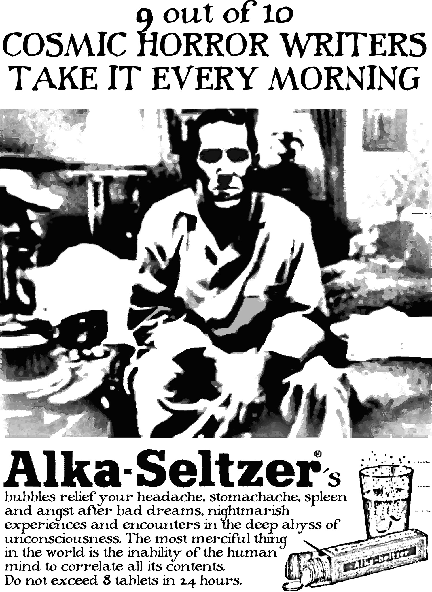

% Lovecraft y cía
% Carles Bellver Torlà
% 2008

---
title:    Lovecraft y cía
subtitle: 
author:   Carles Bellver Torlà
date:     2008
rights:   CC-BY-NC
lang:     es
description: |
  H. P. Lovecraft y su círculo están presentes en la mitad de las páginas de este libro. En la otra mitad nos encontramos a Robert W. Chambers (*El rey de amarillo*), a J. R. R. Tolkien y a su amigo C. S. Lewis, a un pintor y místico ruso llamado Nikolai Roerich, al Jacques Bergier de *El retorno de los brujos* y a Julius Schwartz, que fue agente literario de Lovecraft y Ray Bradbury y luego editor de tebeos en DC.
  Fantasía, terror y ciencia ficción en distintas variedades y proporciones. Una miscelánea de artículos de Carles Bellver Torlà, en su mayoría publicados originalmente en *Lovecraft Magazine* entre los años 2000 y 2004.

...

# Créditos {.untitled}

Edición del autor  
Primera edición: 2008  
Revisión 4/20190417

Copyright 2017 Carles Bellver Torlà (de los textos de la primera parte y de las traducciones de la segunda parte)

Esta obra está sujeta a la licencia Reconocimiento-NoComercial 4.0 Internacional de Creative Commons. Para ver una copia de esta licencia, visite [creativecommons.org](http://creativecommons.org/licenses/by-nc/4.0/).

[carlesbellver.net](http://carlesbellver.net)

# Resumen {.untitled}

> H. P. Lovecraft y su círculo están presentes en la mitad de las páginas de este libro. En la otra mitad nos encontramos a Robert W. Chambers (*El rey de amarillo*), a J. R. R. Tolkien y a su amigo C. S. Lewis, a un pintor y místico ruso llamado Nikolai Roerich, al Jacques Bergier de *El retorno de los brujos* y a Julius Schwartz, que fue agente literario de Lovecraft y Ray Bradbury y luego editor de tebeos en DC.
> 
> Fantasía, terror y ciencia ficción en distintas variedades y proporciones. Una miscelánea de artículos de Carles Bellver Torlà, en su mayoría publicados originalmente en *Lovecraft Magazine* entre los años 2000 y 2004.

# Dedicatoria {.untitled}

A Amadeu, a Emili  
y al resto de compañeros y amigos  
de *Lovecraft Magazine*.

# Procedencia de los textos

La "Guía de lectura" de H. P. Lovecraft que abre este libro fue redactada originalmente en catalán por encargo de la Fundación "la Caixa”. Se incluyó en una colección de folletos divulgativos en la que ocupaba el número 71 (exactamente entre el grupo de Bloomsbury y Joan Perucho) y fue distribuida a partir de julio de 2005.

Las cartas de Lovecraft a Wright y a Farnese, los "Apuntes" (fragmentos del *Commonplace Book*), y la hoja de "Tarifas" han sido traducidos expresamente para este libro.

El resto de artículos fueron escritos para *Lovecraft Magazine*. A continuación se detallan los números de la revista y las fechas en que aparecieron.

- "Las pinturas asiáticas de Nikolai Roerich": número 2, septiembre de 2000.
- "Robert W. Chambers y el Rey de Amarillo": número 4, primavera de 2001.
- "Acerca de Jacques Bergier y el realismo fantástico": número 6, otoño de 2001.
- "¿Lovecraft en París? Con Poe, en sueños": inédito.
- "H. P. Lovecraft, C. M. Eddy y sus amados muertos": número 7, invierno de 2002.
- "Los viajes en el espacio y en el tiempo de C. S. Lewis y J. R. R. Tolkien": número 9, primavera de 2003.
- "La alegre nochevieja del 33": número 10 bis, diciembre de 2003.
- "Los mundos paralelos de Julius Schwartz": número 11, octubre de 2004.
- "A propósito de Innsmouth: el racismo ilustrado de H. P. Lovecraft": destinado al número 12, que no llegó a ver la luz.

# H. P. Lovecraft. Guía de lectura

> Ahora, todos mis relatos se basan en la premisa fundamental de que las leyes humanas corrientes, y nuestros intereses y nuestras emociones, no tienen ninguna validez o significado en la vasta infinitud del cosmos.
> 
> *—De una carta a Farnsworth Wright, editor de *Weird Tales*, en 1927.*

#### Introducción

Los relatos de Howard Phillips Lovecraft (1890-1937), mezcla singular de terror y ciencia-ficción, son hoy reconocidos como un hito de la literatura fantástica del siglo XX. En vida de su autor, sin embargo, sólo se publicaron en revistas de distribución limitada y efímera y fueron apreciados por un número reducido de lectores. Sería un amigo y admirador suyo, August Derleth, quien tras la muerte de Lovecraft se esforzase por ver publicada toda su obra en formato de libro y la rescatase así del olvido. Puesto que no encontraba ninguna editorial que se interesase, decidió fundar una él mismo, Arkham House. Las primeras antologías salieron de imprenta en 1939 y 1943. Sin campañas de publicidad o marketing alguno, su difusión fue lenta pero constante. Poco a poco, habiendo conocido los horrores de la bomba atómica y las perspectivas de los viajes espaciales, el público empezó a conectar con las historias de angustia cósmica de Lovecraft. La primera traducción aparecería en Francia, avalada por Jean Cocteau, en 1953. "El libro se titulaba *La couleur tombée du ciel* (*El color que cayó del cielo*), y me produjo una impresión enorme", confesaría el autor catalán Joan Perucho en sus memorias. Acto seguido, Perucho escribió un cuento titulado "Amb la tècnica de Lovecraft" ("Con la técnica de Lovecraft"), que se publicó en catalán en los *Quaderns d'Atzavara* y en castellano en *Los papeles de Son Armadans* de Camilo José Cela. Se estaba descubriendo a Lovecraft en todo el mundo. A largo plazo, su influjo ha sido notable en muchos campos de la cultura popular, no sólo en la literatura. Mencionemos, por ejemplo, a Stephen King, los juegos de rol de "La llamada de Cthulhu", las películas de John Carpenter, el *Alien* de Ridley Scott y sus secuelas, los tebeos de Hellboy de Mike Mignola, también adaptados al cine, etc. Lovecraft marcó nuevos rumbos, ha sido imitado y parodiado. La brevedad de su obra hace todavía más extraordinario tal eco póstumo. Escribió alrededor de sesenta narraciones, pero las más logradas, las de su madurez, en las que se basa su fama, no pasan de una docena.

Por otra parte, la crítica no siempre ha aceptado a Lovecraft de buen grado. Su adscripción a un género popular y su extraordinaria propagación, por tardía que haya sido, explicarían en parte ciertos posicionamientos. Además, está el hecho de que se situara, de una manera consciente y deliberada, lejos de las modas de su época. Se le ha reprochado a menudo, por ejemplo, una adjetivación excesiva, ya que su estilo denso, retórico, contrasta con la prosa desnuda a la manera de Hemingway, entonces tan prestigiada. Al fin y al cabo, era un autor solitario que construyó un mundo literario propio a la medida de sus gustos, a veces anticuados o incluso anacrónicos. Habría que tener también en cuenta la idiosincrasia del antes mencionado August Derleth, que se apropió la obra de Lovecraft, copyrights incluidos, y la manipuló a su conveniencia. Las ediciones de Arkham House fueron hinchadas con toda clase de "inéditos": relatos tempranos de calidad dudosa, o incluso borradores o simples apuntes, completados por el propio Derleth y presentados como si fuesen colaboraciones entre ambos autores. Lovecraft sin duda tiene puntos débiles, pero en la cumbre de su carrera llegó a ser un narrador hábil, original y persuasivo. Destaca sobre todo por su riqueza imaginativa y la consistencia de sus concepciones, por las descripciones vívidas de escenarios reales o fantásticos y la construcción de atmósferas inquietantes. Sus lectores se complacen en recordar los bosques remotos de Vermont, escenario de la invasión secreta de los hongos de Yuggoth, la urbe prehistórica descubierta más allá de las montañas congeladas de la Antártida, o la decadencia de las calles y de los extraños habitantes de Innsmouth. Por encima o por debajo de todo ello, la cosmovisión materialista de H. P. Lovecraft, su mensaje nihilista de soledad y desolación, sigue cautivando: no hay Dios ni dioses, nuestra vida no vale nada y el universo está lleno de fuerzas que no podemos entender.

#### El amor por lo fantástico

Howard Phillips Lovecraft nació en Providence, capital del estado norteamericano de Rhode Island, el 20 de agosto de 1890. A causa de los problemas de salud de su padre, que fue internado en un sanatorio y murió cuando él aún era un niño, Howard se crió con su madre y con la familia materna, perteneciente a la vieja oligarquía protestante de la Costa Este.

Crisis nerviosas sucesivas, no diagnosticadas, impidieron que asistiera regularmente a la escuela primaria y secundaria. Pero, en la torre de marfil proveída por la buena posición del abuelo, adquirió por su cuenta conocimientos enciclopédicos. Lovecraft fue un niño intelectualmente precoz y muy soñador. A los cuatro años ya leía los cuentos de los hermanos Grimm, a los cinco los de las *Mil y una noches* y a los seis los mitos grecorromanos. Levantaba altares a Apolo y Minerva y jugaba a ser un árabe llamado Abdul Alhazred. "Los intereses que me han conducido a la literatura fantástica", anotaba en un texto autobiográfico de 1933, "aparecieron muy pronto, ya que, hasta dónde puedo recordar claramente, me encantaban las ideas e historias extrañas y los escenarios y objetos antiguos". Tanto como los cuentos, excitaban su imaginación los edificios antiguos de Providence y los paisajes de Nueva Inglaterra, o los libros de geografía y de astronomía.

La falta de una educación formal no le permitió acceder a la Brown University, como habría querido. Más adelante lamentaría no haber aprendido al menos algún oficio, que le sirviese para ganarse la vida cuando la herencia del abuelo se consumió. Durante aquel espléndido aislamiento, Lovecraft adoptó ideas y actitudes elitistas, ultraconservadoras. Con el tiempo las iría abandonando, a medida que cambiaron sus circunstancias personales, o como mínimo las atemperó. Así, en la década de 1930 se declaró partidario de un socialismo moderado y del New Deal de Franklin D. Roosevelt. Pero en otros aspectos se mantuvo firme: notoriamente, creyó siempre en la superioridad de los blancos anglosajones, los "auténticos" americanos, sobre negros y otros grupos "extranjeros".

Lovecraft escapó paulatinamente de la reclusión familiar a partir de 1914, cuando se implicó en el movimiento del periodismo amateur. Los amigos que hizo allí, escritores aficionados como él mismo, lo alentaron a redoblar sus esfuerzos en la narrativa, aun cuando hasta entonces se había visto a sí mismo sobre todo como poeta y ensayista. De esta fase son algunos de sus primeros cuentos, escritos a imitación de Edgar Allan Poe y de Lord Dunsany. Posteriormente glosó, en un ensayo titulado *Supernatural Horror in Literature* (*El horror sobrenatural en la literatura*, 1926), la tradición de relatos de miedo de la que se sentía continuador. Pero, no obstante, también se observaba desde sus comienzos —véase por ejemplo "Dagón" (1917)— el intento de buscar unos temas y un estilo propios. En 1921 murió su posesiva madre, con la que había tenido una relación difícil. Al cabo de un mes, en una convención de la National Amateur Press Association celebrada en Boston, Lovecraft conoció a Sonia Haft Greene, inmigrante ucraniana siete años mayor que él, judía, que trabajaba en una tienda de moda en Nueva York. Se casaron el 3 de marzo de 1924 y se instalaron en Brooklyn, en el apartamento de soltera de ella. Muy pronto, sin embargo, se hizo patente que el matrimonio no funcionaba. Los problemas económicos de la pareja precipitaron la ruptura. En marzo de 1926, Howard decidió volver a Providence para vivir con su tía Lillian. Poco después se iniciaron los trámites de divorcio.

#### Cthulhu y compañía

El regreso a Providence, que sería definitivo, coincidió con la plenitud creativa de Lovecraft. Había asimilado nuevas influencias, sobre todo las de Arthur Machen y Algernon Blackwood, pero integrándolas ya dentro de un marco personal, caracterizado por el realismo, el materialismo científico y un sentido de la insignificancia de los asuntos humanos en la vastedad del espacio-tiempo, que él denominaba *cosmicismo*. El primero de sus relatos maduros es "The Call of Cthulhu" ("La llamada de Cthulhu", 1926), narrado en primera persona, en el cual el protagonista recoge informaciones procedentes de fuentes diversas: unos papeles de su tío, recientemente fallecido, recortes de prensa, comunicaciones personales… Todo ello, al final, dibuja un panorama aterrador acerca de una civilización desaparecida, sumergida en el Océano Pacífico, y un supuesto ser extraterrestre, una gran masa tentacular, que yace en el fondo del mar en estado letárgico esperando el momento de resurgir.

Durante los años siguientes, Lovecraft escribió una serie de historias en la misma línea: "The Colour Out of Space" ("El color que cayó del cielo", 1927), la novela *At the Mountains of Madness* (*En las montañas de la locura*, 1931) y otras. Dominaba en ellas un fondo filosófico de raíces nietzscheanas, que ha hecho que se hable de "terror materialista" y de "giro copernicano". Desde Lovecraft, se nos dice, el terror ya no puede derivarse de fantasmas o demonios, sino de seres materiales, hechos de átomos, si bien radicalmente diferentes de nosotros: monstruosidades aladas del espacio exterior, o un glóbulo gaseoso emanado de un meteorito, por ejemplo. Estamos en el siglo XX, Dios ha muerto y el antropocentrismo también. Los extraterrestres de Lovecraft no pueden ser hombrecillos verdes, ni viajar en cohetes como los diseñados por Verne o por Von Braun. Su naturaleza, sus medios y sus motivaciones nos resultan impenetrables. Además, sus capacidades superan en mucho las nuestras y les resultamos tan indiferentes como lo puedan ser para nosotros los insectos que pisoteamos o el ganado que criamos para enviar al matadero. Ante tamañas revelaciones, los personajes lovecraftianos, pusilánimes antihéroes, se desmayan, enloquecen, o prefieren creer que han sufrido alucinaciones, antes que hacer frente a la verdad.

Con todo, la característica más célebre de la ficción de H. P. Lovecraft es la imaginería que emplea como trasfondo en la mayoría de sus relatos. En primer lugar, una retahíla de seres extraños, más sugeridos que descritos, que responden a nombres sonoros y misteriosos: Cthulhu, Yog-Sothoth, Nyarlathotep, etc. En segundo lugar, los libros arcanos, incluido el *Necronomicón*, supuestamente escrito por el mismo Alhazred de sus juegos infantiles, o los "inconcebiblemente antiguos" *Manuscritos Pnakóticos*. Finalmente, una geografía mágica superpuesta a la Nueva Inglaterra real: la ciudad de Arkham, sede de la Universidad del Miskatonic, Innsmouth con su puerto, Dunwich, etc. La imbricación de elementos reales e imaginarios es ejecutada con destreza. Una buena muestra de ello es el resumen "History of the Necronomicon" ("Historia del Necronomicón", 1927), que ha confundido a bastantes lectores con respecto a la posible existencia de aquel tratado apócrifo de magia negra.

Lovecraft publicó muchas de sus historias en la revista *Weird Tales* y en otras *pulp magazines*, revistas baratas dedicadas a la literatura de consumo. Dentro de este ámbito restringido se hizo un cierto renombre. No se trataba, sin embargo, de un trabajo bien remunerado, y sus finanzas no prosperaron nunca. Probó a redactar y corregir trabajos para otros autores, igualmente con escaso provecho. Cuando murió, de un cáncer intestinal, el 15 de marzo de 1937, era casi pobre de solemnidad. Se había visto obligado a escatimar incluso la comida y la tinta para escribir. Por otro lado, el escaso entusiasmo que despertaron sus últimos relatos, sin duda los mejores que escribió, lo había convencido del fracaso absoluto de su ambición artística.

# Las pinturas asiáticas de Nikolai Roerich

Cuando los dos barcos fletados por la Universidad del Miskatonic alcanzan las regiones polares, el narrador anónimo de *En las Montañas de la Locura* —otro de esos antihéroes tan caros a Lovecraft— señala que las cumbres eternamente heladas de la Antártida y el siseante viento le recuerdan "las extrañas y perturbadoras pinturas asiáticas de Nicholas Roerich, y las aún más extrañas y perturbadoras descripciones de la meseta de Leng, de perversa fama, que tienen lugar en el espantoso *Necronomicón* del árabe loco Abdul Alhazred". A lo largo de la novela, Lovecraft obligará al pobre tipo a acordarse de Roerich unas cuantas veces más, ante las vastas masas de hielo, y luego también, por ejemplo, al observar los misteriosos cubos, perfectamente regulares, adheridos a las cumbres. ¿Quién debe de ser ese tal Roerich, se pregunta necesariamente el lector, cuyas pinturas son casi comparables a las páginas alucinadas de Alhazred? Pues, al contrario que el dichoso árabe, resulta ser un personaje real, aunque las enciclopedias le dediquen muy pocas páginas y absolutamente ninguna los manuales de historia del arte. Ya lo advierte S. T. Joshi en su biografía de Lovecraft: los cuadros de Roerich guardan más relación con el arte popular ruso que con ninguna vanguardia artística de la época. Claro que no sólo fue pintor. En su momento también destacó como escenógrafo y visionario, por ejemplo.

Nikolai Roerich nació en 1874 en San Petersburgo. Era hijo del abogado y notario Konstantin Roerich. Desde niño demostró intereses aparentemente heterogéneos: el coleccionismo de objetos prehistóricos, minerales y monedas, el estudio de árboles y plantas, o el dibujo, entre otros. La que sería su esposa, Helena —a la que conoció tras estudiar Bellas Artes, por vocación, y Derecho, por imposición paterna— era casi tan brillante como él: tocaba el piano, escribió un libro sobre el budismo y tradujo al ruso la *Doctrina secreta* de Madame Blavatsky. Juntos, Nikolai y Helena fundaron la agrupación mística Agni Yoga. Poco después, Nikolai obtuvo el cargo de director de una sociedad artística. Desde este puesto impulsó la enseñanza conjunta de todas las artes y oficios: pintura, música, canto, danza, teatro, dibujo artístico y técnico, cerámica… Este enfoque holístico caracteriza su concepción del mundo. Para él, la filosofía, la ciencia y el arte, el conocimiento occidental y la sabiduría oriental, eran sólo partes de un todo, dentro del cual adquirían pleno sentido. En esta misma época, empezó a trabajar como escenógrafo en representaciones de obras de Stravinsky, Rimsky-Korsakov y otros.

La familia Roerich abandonó Rusia fortuitamente. En 1915, Nikolai enfermó de neumonía y su médico le recomendó viajar a Sortavala, en Finlandia. Una vez allí, estalló la revolución bolchevique y ya no se atrevieron a volver. Aunque planearon trasladarse a la India, pasaron antes por Suecia, Inglaterra y Estados Unidos, lugares en los que Nikolai realizó varias exposiciones y volvió a trabajar como escenógrafo. En 1921, fundaron en Nueva York el Master Institute of United Arts. El ansiado viaje a la India lo emprendieron finalmente en 1923. Los Roerich organizaron entrevistas con destacados científicos, artistas e intelectuales y expediciones por los rincones más remotos del país. En 1928 se instalaron en el valle de Kullu, un paraje impresionante a los pies del Himalaya, a dos mil metros sobre el nivel del mar. Allí establecieron la sede del autodenominado Instituto Urusvati de Investigación del Himalaya, dedicado al estudio de las plantas medicinales, las lenguas y los yacimientos arqueológicos locales. Todo ello bajo la dirección de la segunda generación Roerich, los jóvenes George y Svetoslav.

Al año siguiente, los Roerich volvieron temporalmente a Nueva York para la inauguración del Nicholas Roerich Museum, en Riverside Drive (actualmente su dirección es 319 West 107th Street). Fue en este museo donde conoció Lovecraft, en compañía de su amigo Frank Belknap Long, los paisajes hindúes y tibetanos de vívidos colores y atisbos cósmicos pintados por Nikolai Roerich, que tanto lo impresionaron. En una carta de mayo de 1930 dirigida a Lillian Clark, Howard hizo constar con su típica elocuencia lo fascinado que se sentía:

> Posiblemente te he mencionado en varias ocasiones mi admiración por la obra de Nicholas Roerich —el artista místico ruso que ha dedicado su vida al estudio y representación de las desconocidas mesetas de Asia Central, con sus vagas sugerencias de maravilla y terror cósmicos […] Ni Belknap ni yo habíamos estado allí antes; y cuando vimos la naturaleza extravagante y esotérica de sus contenidos, recorrimos frenéticamente las imaginativas vistas expuestas. Seguramente Roerich es una de esas raras almas fantasiosas que han vislumbrado los secretos grotescos, terribles, de más allá del espacio y el tiempo, y han retenido alguna habilidad para insinuar los prodigios que han visto.

Menos de un año después, en febrero de 1931, nuestro amigo de Providence empezó a escribir *En las Montañas de la Locura*. La influencia de Roerich parece evidente, y no sólo en las descripciones del gélido escenario de la novela. O puede que sea una coincidencia. Al fin y al cabo, ¿hay algo más lovecraftiano que una base en las montañas, en un lugar exótico, desde la que se organizan excavaciones arqueológicas? Instituto Urusvati y Universidad del Miskatonic: no sabría decir si es más sorprendente la realidad o la ficción. Claro que con eso no tenemos más que el punto de partida, el arranque de la historia. Faltan los seres monstruosos, las colosales arquitecturas, las angustias y abismos psíquicos, y esos ingredientes los tenía que poner Lovecraft.

# Robert W. Chambers y el Rey de Amarillo

Lovecraft tuvo en alta estima algunos de los libros de Robert W. Chambers (1865-1933), muy particularmente *El Rey de Amarillo*. Dejó constancia de ello en la correspondencia con su círculo de colaboradores, así como en su célebre ensayo *El horror sobrenatural en la literatura* (1927), donde Chambers comparte el capítulo 8 —sobre "La tradición sobrenatural en América”— con Hawthorne, Bierce o Clark Ashton Smith, entre otros. Los dos párrafos que le dedica, cobran especial importancia si tenemos en cuenta que los añadió deprisa y corriendo sobre las pruebas de imprenta para que se incluyesen en la versión final, pues acababa de leer a Chambers por primera vez en abril de 1926.

Parece lógico pensar que a Lovecraft lo impresionaron ciertas coincidencias. Veamos cómo describe en su ensayo a *El Rey de Amarillo*: "…una serie de cuentos vagamente conectados que tienen como trasfondo un libro monstruoso y prohibido cuya lectura trae miedo, locura y tragedia espectral." Cualquiera diría que está hablando de su propio *Necronomicón*, ideado independientemente algunos años antes. De hecho, Lovecraft extendió más adelante su reconocimiento en el guiño con el que concluye la "Historia del *Necronomicón*": "Se dice que de rumores sobre este libro […] derivó Chambers la idea de su temprana novela *El Rey de Amarillo*". En cualquier caso, la sintonía entre ambos autores va mucho más lejos, hasta hacer de Chambers, a juicio de algunos críticos, casi un Lovecraft antes de Lovecraft. En efecto, además del *leit-motiv* del libro prohibido, son también característicos de Chambers:

  - La invención de una mitología personal, hecha de nombres misteriosos y alusiones elípticas que lo dejan casi todo a la imaginación del lector.
  - El giro cósmico: las referencias a estrellas lejanas, otros mundos y otras dimensiones.
  - El papel fundamental de la angustia y la locura.

#### Vida y obra

Robert William Chambers nació en Brooklyn el 26 de mayo de 1865. Era hijo de un abogado, nieto de un médico y descendiente directo del fundador de Rhode Island. Su hermano Walter fue un famoso arquitecto. Robert estudió en el Instituto Politécnico de Brooklyn, pero le interesaban más los deportes, el dibujo y la entomología. En 1886 se trasladó a París para estudiar Bellas Artes. Sus trabajos fueron expuestos en el Salón de 1889. En 1893 volvió a Nueva York y vendió sus ilustraciones a las principales revistas de actualidad: *Life*, *Truth* y *Vogue*. Se convirtió así en uno de los dibujantes más conocidos del momento.

En 1894 publicó su primer libro, *In the Quarter*, un muestrario de escenas de la vida bohemia a la manera de Murger o Du Maurier, basado en las notas que tomó en París. Se supone que nadie esperaba que se dedicase a escribir, ni siquiera él mismo, aunque según sus amigos tenía una facilidad natural para contar historias. Sea como fuere, en 1895 publicó su segunda obra, *The King in Yellow* (*El Rey de Amarillo*), en el que combinaba nuevos retratos parisienses con originales historias de fantasía y terror que tuvieron un enorme éxito. Ahí empezó su carrera literaria y su continua y pasmosa variación de temas y estilos. En *The Maker of Moons* (1896) y *The Mystery of Choice* (1897) siguió aún la estela de *El Rey de Amarillo*, pero en *The Search of the Unknown* (1904) se decantó más bien por la ficción científica. Después, escribiría un sinfín de novelas históricas, relatos de detectives y romances rosa ambientados en la alta sociedad de Nueva York. Todos sus libros se vendieron bien y un par de ellos incluso alcanzó la condición oficial de *best-seller*. No necesitaba ese dinero para vivir y lo invirtió en sus muchas y onerosas aficiones: coleccionar mariposas, muebles, porcelana japonesa, alfombras y arte chino, y plantar árboles en la hacienda de ochocientos acres de su familia. Dicen que llegó a plantar, con sus propias manos, más de veinte mil. Todo eso parecía importarle mucho más que la reputación literaria. Que la crítica lo despreciase e ignorase, ni mucho menos le quitaba el sueño. Como dijo en cierta ocasión: "¡Literatura! ¡Esa palabra me pone enfermo!" Lovecraft debió de considerar lamentable que aquél que había apuntado a lo más alto del terror cósmico con sus primeros cuentos, se rebajase después a escribir folletines para las masas. En una carta a Clark Ashton Smith se refirió a Chambers como "un titán caído".

Robert W. Chambers murió el 16 de diciembre de 1933, a los sesenta y ocho años, tras ser operado de una dolencia intestinal. Había entregado a la imprenta más de ochenta libros, entre novelas y recopilaciones de cuentos, aunque no es fácil determinar exactamente cuántos: acostumbraba a reciclar el material para volver a venderlo y no siempre quedaba claro si se trataba de una obra completamente nueva o una mera reedición o revisión.

#### Los cuentos y la mitología del Rey de Amarillo

Lo que sigue es un somero examen de algunos de los cuentos más logrados de *El Rey de Amarillo* (1895), más un extra procedente de *The Maker of Moons* (1896).

##### El signo amarillo

El preferido de Lovecraft y el más conocido por los aficionados al género, al haberse incluido en numerosas antologías. Mr. Scott, un pintor de mediana edad, se siente acechado por el repulsivo vigilante de un cementerio cercano a su estudio, cuyo fofo y abultado cuerpo le recuerda "a un gusano de ataúd". Dicho sujeto se le aparece en sueños preguntándole repetidamente por el "signo amarillo". La joven modelo Tessie ha tenido también sueños ominosos. Entre Scott y Tessie está naciendo un amor imposible, que se verá trágicamente truncado por el hallazgo de un broche de ónice con un extraño símbolo incrustado y por la lectura accidental de un libro espeluznante, *El Rey de Amarillo*: "¡Oh el pecado de escribir tales palabras…" Comprenden que el broche es sin duda el mismísimo signo amarillo. Mientras esperan que el siniestro vigilante venga a buscarlo, hablan en susurros del Rey y la Máscara Pálida, de Hastur y Cassilda y las costas de Hali. Han comprendido el misterio de las Híades y ante ellos se alza el Fantasma de la Verdad. Más tarde, tras oírse un grito desgarrador, alguien los descubre agonizando. Junto a ellos está el cadáver descompuesto del vigilante, que parece llevar meses muerto.

Poco aclara Chambers sobre el contenido del libro. Pero el curioso efecto de la ambigüedad y la reticencia, de las vagas alusiones, es que seducidos por el misterio podemos llegar a entender más de lo que se nos dice. O que creamos entender. En su resumen de *El horror sobrenatural*, Lovecraft nos explica que Scott y Tessie aprenden "entre otras cosas horribles que ningún mortal cuerdo debería saber, que este talismán es de hecho el innombrable signo amarillo procedente del maldito culto de Hastur, desde la primordial Carcosa, de donde trata el volumen." En realidad, la única mención a Hastur se encuentra en esta frase puesta en boca de Scott: "Hablamos de Hastur y Cassilda…" Nada más. Claro que Lovecraft había leído acerca de Hastur como pacífico dios de los pastores en un cuento de Bierce. Que su culto merezca la calificación de maldito es sin duda una aportación del genio de Providence. En cuanto a Carcosa, otro nombre inventado por Bierce, ni siquiera es mencionada en "El signo amarillo", aunque sí aparece en otro cuento, que reseñamos a continuación.

##### El reparador de reputaciones

Para algunos, el mejor de los cuentos de miedo de Chambers, e incluso uno de los mejores jamás escritos por cualquier autor. La narración se sitúa en la década de 1920, en un futuro perturbadoramente real. Después de salir triunfantes de una guerra con Alemania, unos Estados Unidos fuertemente militarizados se han convertido en una superpotencia. En el interior, la paz y la prosperidad se han conseguido por medio de la centralización del poder, la legalización y promoción de la eutanasia y la limpieza étnica. Los judíos nacidos en el extranjero fueron expulsados, los negros han sido reagrupados en un único estado, al que se ha concedido la independencia, y se han endurecido las leyes de inmigración y naturalización. Mientras tanto, las naciones europeas —Alemania, Italia, España…— se hunden en la anarquía, y Rusia, "vigilante desde el Cáucaso, se inclinaba para atraparlas una por una." ¿Alguien se acuerda de *1984*? No estamos, sin embargo, ante una historia de anticipación. De hecho, tras las primeras páginas, el marco geopolítico apenas vuelve a mencionarse. Su función era crear el clima adecuado para el desarrollo de una historia más bien demencial.

"El reparador de reputaciones" es una obra maestra de la ambigüedad. Que sus protagonistas nos parezcan unos simples locos, o bien depositarios de oscuros secretos, depende mayormente del estado de ánimo con que nos acerquemos al texto. Es a la vez uno de los cuentos más cómicos y más inquietantes de Chambers. El *motto*, en francés en el original, ya nos avisa de lo que nos espera: *"Ne raillons pas les fous; leur folie dure plus longtemps que la nôtre… Voilà toute la différence."* O sea: "No nos burlemos de los locos; su locura dura más tiempo que la nuestra… He aquí toda la diferencia." El narrador, Hildred Castaigne, es un caballero ocioso que estuvo sometido a tratamiento psiquiátrico en el manicomio del Dr. Archer, tras caer de su caballo y golpearse en la cabeza. Para él, su reclusión fue un error, una grave equivocación de los médicos y de las autoridades. Admite que la caída le causó dolores en la cabeza y en la nuca, y que cambió su carácter, pero para bien: lo hizo más activo y enérgico, y sobre todo más ambicioso. Su amigo Mr. Wilde es un enano deforme y mutilado que disfruta atormentando a su gata y luce en el rostro las cicatrices de sus arañazos. Tanto Hildred como Wilde son personas solitarias, almas gemelas que celebran haberse encontrado.

Durante su convalecencia, Hildred compró y leyó *El Rey de Amarillo*. Es aquí donde vamos a encontrar mayor cantidad de información sobre el enigmático libro. Parece ser una obra de teatro, un drama en dos actos. En realidad no averiguamos gran cosa acerca de su contenido: "Lo leí y lo releí, y lloré y reí y temblé presa de un horror que aún me asalta a veces. Esto es lo que me perturba, porque no puedo olvidarme de Carcosa, donde negras estrellas cuelgan de los cielos, donde las sombras de los pensamientos de los hombres se alargan en la tarde, cuando los soles gemelos se hunden en el Lago de Hali, y mi mente llevará para siempre el recuerdo de la Máscara Pálida”. Pero sí sobre las circunstancias de su publicación. El gobierno francés incautó la primera traducción que se publicaba en París, lo cuál generó aún más expectación en Londres, y sucesivamente en otras capitales europeas. El libro se difundió por todo el mundo como una enfermedad contagiosa, "prohibido aquí, confiscado allá, denunciado por la prensa y el púlpito, censurado incluso por los más avanzados entre los anarquistas literarios". No violaba ninguna ley, ningún principio definido, pero cualquiera podía sentir que la naturaleza humana era incapaz de soportar el veneno que destilaba esta "hermosa, estupenda creación, terrible en su simplicidad, irresistible en su verdad". En cuanto a su autor, se dice que se pegó un tiro después de traer al mundo tal monstruosidad, pero no murió: "…las balas no podrían matar a semejante demonio", comenta Hildred en cierta ocasión.

Dos puntos de vista se alternan constantemente, e incluso se entrecruzan, en las páginas de "El reparador de reputaciones". Hildred tiene un primo, Louis, capitán de caballería, enamorado de Constance, hija del armero Hawberk. Estos tres son los cuerdos de la historia. Cuando Louis descubre la corona de oro y diamantes que Hildred guarda en secreto en una sofisticada caja fuerte, con mecanismo de apertura retardada incluido, él sólo ve un aro de latón metido en una caja de galletas. A Mr. Wilde, vecino de Hawberk, lo consideran un tipo excéntrico, bastante raro pero inofensivo. La placa que ha colocado en la calle anunciándose como "Reparador de reputaciones" apenas les llama la atención, aunque por un momento Hawberk se pregunta qué debe de significar eso. Wilde, por su parte, le muestra a Hildred la contabilidad de su lucrativo negocio: "P. Greene Dusenberry, ministro de los Evangelios, Fairbeach, New Jersey. Reputación dañada en el Bowery. A reparar tan pronto como sea posible. Anticipo, $100 … Sra. C. Hamilton Chester, de Chester Park, New York City, llamó el 7 de abril. Reputación dañada en Dieppe, Francia. A reparar el 1 de octubre. Anticipo, $500." Sólo una vez Hawberk parece sospechar que Wilde esconde algo tras su fachada de lunático: cuando le proporciona información sobre el paradero de cierto juego de armadura extraordinariamente valioso. Los lectores contamos con algún otro indicio. En cierta ocasión, Hildred revela que Wilde se refiere sistemáticamente a Hawberk como Marqués de Avonshire y entonces Constance se asusta visiblemente.

La ascendencia de Constance no es un tema baladí. Veamos por qué. Mr. Wilde atesora otro enigmático libro, titulado La dinastía imperial de América, que empieza así: "Cuando desde Carcosa, las Híades, Hastur y Aldebarán", y termina con "Castaigne, Louis de Calvados, nacido el 19 de diciembre de 1887." Pero Hildred prefiere detenerse siempre en otro punto: "Hildred de Calvados, único hijo de Hildred Castaigne y Edythe Landes Castaigne, primero en sucesión." De hecho, él planea arrebatarle el puesto a su primo. El problema con Louis es doble. En primer lugar, no está a la altura de las circunstancias. En segundo lugar, su intención de casarse con la hija de un aristócrata inglés exiliado podría "internacionalizar el conflicto" e interferir en los planes de dominación de Hildred y Wilde. Ellos están en contacto permanente con diez mil hombres, todos los cuales han recibido ya el signo amarillo. En veinticuatro horas pueden contar con cien mil y levantar a América en masa. Sólo California y el Noroeste, desafectos por alguna extraña razón, quedarían fuera del alzamiento. Pero esos dos estados lo pagarán caro: "Más les valdría no haber sido nunca habitados." Leemos que la ambición de César y Napoleón palidece ante la del Rey de Amarillo. La trama conspiratoria —conspiranoica— adquiere dimensiones históricas. "Es un rey al que han servido emperadores", sentencia Wilde.

Al final, sin embargo, justo cuando van a poner en marcha su plan, las cosas se tuercen y acaban de un modo harto calamitoso para nuestra loca pareja de *freaks*.

##### En la Corte del Dragón

Más breve que los anteriores, su interés principal reside en su atmósfera religiosa. Después de leer *El Rey de Amarillo* durante tres angustiosas noches, el narrador acude a su iglesia preferida en busca de paz espiritual. Esta vez, sin embargo, la música del órgano le resulta inexplicablemente aterradora. Huye, perseguido por el organista, y cuando éste está a punto de darle alcance, se despierta en la iglesia: se había quedado dormido durante el servicio. Pero entonces vuelve a presentarse el organista y en medio de un relámpago y una luz cegadora se lo lleva hasta las orillas de Hali y las cercanías de Carcosa. El Rey de Amarillo en persona le susurra al oído: "¡Es terrible caer en las garras del Dios vivo!" (cita literal de Hebreos 10:31) y es el fin.

##### El hacedor de lunas

*The Maker of Moons* es, como dijimos antes, el segundo libro de Chambers. Parece que, apenas un año después, la mitología del Rey de Amarillo le aburría y prefirió inventar otra nueva. Aunque en conjunto puede que resulte una obra menos brillante, contiene también ideas y momentos memorables. En el cuento que da título al volumen, el narrador siente asco y odio al ver cierto bichito repugnante en casa de un amigo. Nos lo describe como "el eslabón perdido entre el erizo de mar, la araña y el diablo." Lo han encontrado en los mismos bosques en los que se oculta cierta banda de chinos capaces de fabricar oro sintético. Más adelante se verá envuelto en una operación del servicio secreto del Gobierno contra los defraudadores. "Sabéis el peligro que esto constituye para todas las naciones civilizadas", remarca el general Drummond. En el transcurso de la historia, tendremos noticia de Yian, una ciudad escondida en "esa sombra gigantesca llamada China", de la diabólica secta Kuen-Yin de hechiceros asesinos y de su jefe Yue-Laou, "el hacedor de lunas", del que se dice que vivió en la Luna y ha transformado los benévolos espíritus Xin en un ser monstruoso del cual son apéndices aquellas odiosas arañas. Hay acción y misterio, e incluso romance, en una atmósfera de amenaza oriental al estilo de Sax Rohmer y el doctor Fu Manchú. Y menos ambigüedad que en los cuentos anteriores… hasta que llegamos al último párrafo.

(En 1920, Chambers publicó una novela titulada *The Slayer of Souls* que es una secuela de "El hacedor de lunas".)

#### ¿Lovecraft antes de Lovecraft?

Podríamos terminar diciendo que Chambers prefigura a Lovecraft en casi todo, hasta en el ramalazo racista y fascista, si se quiere con idénticas salvedades en ambos casos: eran otros tiempos, esas ideas no resultaban tan raras entonces en ciertos estratos sociales, y quizá no siempre es justo atribuírselas a ellos por el mero hecho de usarlas en sus cuentos. Pero no nos quedemos en lo anecdótico. De hecho, mi opinión personal es que las coincidencias no son tan importantes y tienen su origen en los autores que influyeron a ambos. La invención de una mitología elíptica, las referencias a otros mundos, la centralidad de la angustia y la locura, se remontan, por separado y a veces combinadas, a Poe y a Bierce, por ejemplo. Y en cualquier caso, todo ello es apenas accesorio respecto a la principal aportación y la originalidad de Lovecraft, lo que Jacques Bergier llamó terror materialista por oposición al terror sobrenatural tradicional, basado en demonios, espíritus condenados y otros seres inmateriales. Es un hecho que, hasta bien entrada la saga de Cthulhu, lo sobrenatural no deja de ser fundamentalmente sobrenatural: irracional y no susceptible de explicación científica alguna, por esotérica, no euclidiana y relativista que sea. El arcano enlace entre Carcosa y Nueva York tiene muy poco o nada que ver con el realismo de las trayectos espaciales de los hongos de Yuggoth o los viajes psíquicos en el tiempo de la Gran Raza de Yith.

Por otra parte, Chambers no se agota en aquellas coincidencias. Cualquiera que haya leído los cuentos de *El Rey de Amarillo* es consciente de la peculiaridad de su estilo en el contexto de la literatura fantástica anglosajona. Un estilo personal, insinuante y turbador. El secreto de Chambers estriba en sumar a las influencias reseñadas otra más exótica y menos familiar para sus compatriotas, Lovecraft incluido: la del simbolismo y el decadentismo franceses, en boga durante sus años parisienses. La locura, lo bello-corrupto, la posibilidad de una obra de arte de mortal intensidad y perfección, la morbosa fascinación por la liturgia católica… son temas presentes en Baudelaire, Huysmans y compañía. En su momento, algún crítico moralista llegó a acusar a Chambers de escribir bajo el influjo de la absenta, el legendario licor opalescente de efectos alucinógenos, asociado en el imaginario popular a los más abyectos poetas de Francia. También para declarar ruin el color amarillo pudo inspirarse Chambers en esas tendencias. *The Yellow Book*, el libro amarillo, se titulaba precisamente la exquisita y escandalosa revista de los decadentes ingleses: Aubrey Beardsley, Arthur Symons, Oscar Wilde… Wilde: como el excéntrico y degenerado reparador de reputaciones.

El destino literario de Chambers no deja de resultar paradójico. Fabricó alegremente *best-sellers* y figuró en las listas de éxitos durante varias décadas. Habiendo sido desdeñado por la crítica, tras su muerte se olvidó de él casi todo el mundo, hasta el punto de que ni siquiera merece una línea en la Enciclopedia Británica. Sólo los halagos de Lovecraft, él mismo rescatado póstumamente, le ganaron la admiración de un reducido círculo de iniciados y, gracias a ello, por lo menos su nombre suena familiar a los aficionados al género. En cualquier caso, creo que merece mayor difusión y un reconocimiento más amplio. Chambers fue un autor más bien disperso e irregular, pero en sus mejores momentos resulta fascinante y sublime.

#### Glosario

##### Aldebarán y las Híades

Aldebarán es una estrella del tipo gigante roja, situada a unos cincuenta años luz de la Tierra, en la constelación de Tauro. Es una de las luces más brillantes del firmamento. En tiempos de Chambers se creía que formaba parte de las Híades, un grupo de estrellas en realidad mucho más lejanas. Se supone que Carcosa (véase más abajo) debe de estar por allí.

##### Camilla y Cassilda

Protagonistas de los escasos y muy fragmentarios fragmentos de *El Rey de Amarillo* que nos es concedido leer. El más sugestivo y revelador encabeza "La máscara", uno de los cuentos de Chambers no reseñados en este artículo: "Camilla: Vos, señor, deberíais quitaros la máscara. Forastero: ¿En verdad? Cassilda: En verdad, ya es hora. Todos nos hemos despojado de los disfraces excepto vos. Forastero: No llevo máscara. Camilla: (Aterrada, a Cassilda.) ¿No lleva máscara? ¡No lleva máscara!" Más o menos como en "La máscara de la muerte roja”, de Edgar Allan Poe.

##### Carcosa

Ciudad inventada por Ambrose Bierce como escenario para su cuento "Un habitante de Carcosa". Chambers la sitúa en el espacio exterior, en la constelación de Tauro (véase "Aldebarán y las Híades"). Curiosamente, la dinastía imperial de América tiene su origen allí (véase el resumen de "El reparador de reputaciones").

##### Hali

Bierce cita al místico Hali en varios cuentos. Se trata pues de una persona. En la mitología de Chambers es el nombre de un lago de aguas oscuras y profundas cercano a Carcosa.

##### Hastur

En el cuento de Bierce "Haita the Shepherd" Hastur es un benévolo dios adorado por los pastores. En los cuentos de Chambers parece más bien un lugar, conectado de algún modo con Carcosa.

##### El Rey de amarillo

Un tipo muy poco amistoso. Encontrarse con él equivale a muerte, locura o destrucción. Parece actuar desde Carcosa, en la no suficientemente lejana constelación de las Híades, y ha inspirado el terrible libro que lleva su nombre, casi tan peligroso como él mismo (véase el resumen de "El reparador de reputaciones"). ¿Por qué lo vistió Chambers precisamente de amarillo? Se ha especulado con decenas de posible motivos y significados ocultos. En el artículo mencionamos una de las conexiones menos improbables: el *Yellow Book* de Aubrey Beardsley y Oscar Wilde. He aquí otra: durante la dinastía Ch'ing, una túnica amarilla identificaba al emperador de China.

##### El signo amarillo

El emblema del Rey de amarillo y símbolo de su poder. En "El Reparador de reputaciones" se supone que los conjurados lo reciben, y Hildred Castaigne lo lleva bordado en una túnica de seda. En "El signo amarillo" aparece grabado en un amuleto de ónice.

# Acerca de Jacques Bergier y el realismo fantástico

El primer libro de Jacques Bergier, *El retorno de los brujos* (*Le Matin des Magiciens*), subtitulado "Una introducción al realismo fantástico", se publicó en 1960. Lo escribió en colaboración con Louis Pauwels y trataba asuntos entonces bastante *raros* y novedosos: fenómenos parapsicológicos, civilizaciones desaparecidas, la conexión esotérica del nazismo… Pretendía dar comienzo a una nueva y fundamental revolución cultural, al estilo del surrealismo de André Breton y compañía en los años veinte, y levantó una gran expectación. Fue objeto de críticas tanto elogiosas como demoledoras y se vendió más que bien. En 1965 se contaban ya medio millón de ejemplares en francés y otros idiomas (la primera traducción española es de 1962). Antes de eso, en 1961, el éxito de *El retorno* había llevado a Bergier y sus colaboradores a editar una revista mensual sobre los mismos temas, *Planète*, de cuyo primer número se tiraron, tras sucesivas reimpresiones, ochenta mil copias. Bergier fue un personaje público y notorio en su momento, una presencia habitual en los medios de comunicación. Incluso llegó a ser caricaturizado por Hergé en el álbum de Tintín *Vuelo 714 para Sydney*, en la persona de Ezdanitoff, estrambótico director de la revista *Comète* y contactado e intermediario de los extraterrestres. Poco antes de morir en 1978, Bergier tituló su autobiografía *Yo no soy una leyenda* (*Je ne suis pas une légende*). Y sin embargo, hoy casi nadie se acuerda de él, hasta el punto de que no siempre es fácil encontrar muchos de sus libros, incluso en Francia.

#### La leyenda de Jacques Bergier

Al leer sobre la vida de Jacques Bergier llaman enseguida la atención su precocidad, sus facultades intelectuales y la diversidad de sus actividades e intereses. Nació en 1912 en Odessa, Ucrania, en el seno de una familia judía. En 1920, la guerra civil que siguió a la Revolución de Octubre les obligó a emigrar hasta Krzemieniec, en Polonia. Aunque no fue a la escuela, aprendió francés, inglés y alemán y física y matemáticas por su cuenta en la biblioteca local. Desarrolló una capacidad lectora y una memoria prodigiosas: se dice que podía absorber y retener el contenido de un libro en pocos minutos. Además de la ciencia, le atraían los relatos de ciencia ficción rusos y americanos y los misterios de la cábala que le enseñaba el rabino. En 1925, la familia Bergier se estableció definitivamente en París. Allí, el joven Jacques se matriculó en la escuela primaria y en el liceo a fin de obtener certificados oficiales y luego en la Sorbona, donde se graduó como ingeniero químico. En 1936 entró a formar parte del equipo de André Helbronner, pionero de la investigación nuclear. Las posibilidades del átomo lo fascinaron y soñó con edificar un imperio industrial basado en este nuevo tipo de energía, aún no inventada. Por otra parte, fue también Helbronner quien le habló por primera vez de la alquimia y le hizo ver que los laboratorios y la química física no tenían por qué constituir toda la verdad y la única verdad.

Bergier seguía leyendo ciencia ficción, sobre todo en revistas americanas. En esta época se publicaron dos cartas suyas en *Weird Tales*, ambas a propósito de H. P. Lovecraft: "De un lector francés" ("From a French Reader”), en marzo de 1936, y "De un entusiasta francés" ("From a French Enthusiast"), un sentido homenaje al escritor de Providence tras su muerte, en septiembre de 1937. Más tarde aseguró que había mantenido relación epistolar con Lovecraft durante varios años, pero desgraciadamente no queda de ello constancia documental.

En 1940, la ocupación alemana convirtió a Bergier en un hombre de acción. La persecución de los judíos lo había concienciado y aproximado a las organizaciones comunistas y anarquistas. Se unió a la resistencia y en virtud de sus conocimientos técnicos se encargó de la fabricación de bombas, emisoras de radio, dispositivos de escucha telefónica y otros aparatos. En 1942 plasmó su experiencia en un *Manual del perfecto saboteador*, que se editó en treinta y ocho idiomas y se distribuyó desde Londres. Fue su grupo el que descubrió el emplazamiento de la base secreta de pruebas de los tristemente célebres cohetes V2, en Peenemünde, en el Mar Báltico. En noviembre de 1943, Bergier fue detenido por la Gestapo. Lo encerraron y torturaron en el campo de Neue Bremme en primer lugar y después en Mauthausen, pero sobrevivió. Durante su confinamiento, creyó descubrir curiosos poderes parapsicológicos: sabía siempre cuándo le seguían y adivinaba *de qué* tenían hambre sus compañeros. Tras la liberación, participó en la caza de criminales de guerra y prestó asesoramiento a los servicios de espionaje y contraespionaje franceses. Todos los países aliados reconocieron su labor y lo condecoraron. En Rusia, incluso se le dedicó una película documental.

#### *El retorno de los brujos* y el realismo fantástico

En 1953, un amigo común puso en contacto a Jacques Bergier con Louis Pauwels, un periodista y escritor de convicciones humanistas y tendencias místicas. Aunque aparentemente no tenían mucho en común, pronto surgió la amistad y de ahí el proyecto de un libro en colaboración. La idea original de Pauwels era escribir sobre la historia y la actualidad de las sociedades secretas, pero Bergier lo convenció de ampliar contenidos. Trabajaron juntos durante varios años. Bergier proporcionaba el material (libros, datos, casos) y la redacción final correspondía a Pauwels. El resultado fue *El retorno de los brujos* y lo publicó Gallimard en 1960. Estos son algunos de los temas que abordaba:

  1. **La alquimia**. Enlazando con una crítica del positivismo y el reduccionismo cientifista heredados del siglo XIX, los autores exponen el procedimiento alquímico como muestra de un saber técnico alternativo, pero no forzosamente opuesto a la ciencia moderna.
  2. **Las civilizaciones desaparecidas**. Inspirándose en las recopilaciones de hechos extraños de Charles Hoy Fort (al que califican de "Rabelais cósmico”), Bergier y Pauwels consideran la posibilidad de que otras civilizaciones hayan florecido sobre la Tierra y se hayan extinguido antes de nacer la nuestra. Enumeran indicios que con el tiempo se han convertido en tópicos: las pirámides egipcias, las esculturas de la isla de Pascua, las "pistas" de Nazca, el mapa del navegante turco Piri Reis, diversos textos hindúes, etc.
  3. **Nazismo y esoterismo**. La tesis de los autores sobre la Alemania nazi es que sólo una transformación radical de la base cultural y moral permite explicar lo inexplicable, el crimen y el desastre absolutos. "En el país de Einstein y de Planck," escriben, "se empieza a profesar una *física aria*. En el país de Humboldt y de Haeckel, se empieza a hablar de razas. Nosotros pensamos que tales fenómenos no se explican por la inflación económica." Bergier y Pauwels detallan la vinculación de la cúpula nacionalsocialista a cultos esotéricos, así como la creencia en mitologías y cosmogonías aberrantes que en determinado momento se convierten en la ciencia oficial. Las primeras páginas de "El pueblo blanco" de Arthur Machen, donde éste distingue el mal absoluto de las pequeñas, banales maldades castigadas por el código penal, les sirve para ilustrar su posición. Machen, por cierto, estaba afiliado a la Golden Dawn, una sociedad iniciática inspirada en la Rosacruz.
  4. **La parapsicología**. Quizá uno de los pasajes más célebres del libro es el que relata un experimento telepático, supuestamente organizado por la Marina de los EEUU en 1958. A lo largo de varias sesiones, un sujeto a bordo del submarino atómico Nautilus habría intentado adivinar qué cartas sacaba al azar un aparato mecánico situado en una base en tierra firme, a miles de kilómetros de distancia. El porcentaje de logros habría superado con creces lo estadísticamente normal.

¿Qué pretendían demostrar Bergier y Pauwels con todo esto? Que la realidad puede ser mucho más compleja de lo que suponemos o imaginamos en nuestras vidas diarias. Nuestra percepción de los hechos, y nuestro juicio acerca de lo verdadero y de lo falso, están necesariamente sesgados por todos los estándares, concepciones y teorías establecidos, implícitos en el llamado sentido común. Lo que nos parece falso, anormal o fantástico es simplemente lo que no cabe en la manera común de ver las cosas. Mejor apartarlo, olvidarlo: condenarlo, como diría Charles Fort, maestro literario de H. P. Lovecraft. Lo que proponen Bergier y Pauwels es que nos liberemos de prejuicios, de teorías y concepciones caducas y volvamos a mirar directa y valerosamente a los hechos cara a cara, uno a uno, por fantásticos que resulten, antes de decidir con cuáles nos quedamos. "No nos lo creemos todo," escribieron, "pero creemos que todo debe ser examinado."

Lo fantástico sería entonces lo que queda tras el velo de las apariencias del sentido común y el saber oficial. El realismo fantástico era para sus promotores una suerte de realismo superior o superrealismo, una síntesis integradora de poesía y ciencia capaz de desvelarnos verdades nuevas e importantes que hasta ahora se ocultaban en las sombras de lo desconocido. En las páginas de *El retorno de los brujos* se dan cita personajes tan diversos como el biólogo J. B. S. Haldane, el jesuita Teilhard de Chardin, Arthur Clarke, Lovecraft, Borges o Meyrinck. Desde este punto de vista se entiende mejor uno de los rasgos más polémicos del estilo de Bergier: su falta de apego a las pruebas e incluso a la literalidad de los hechos. No hay referencias que avalen el experimento del Nautilus, ni que Lovecraft le contara como afirmó alguna vez que estuvo en París, con Poe, en sueños. ¿Significa eso que Bergier mentía en ambos casos? No tiene por qué ser así. En cualquier caso, serían anécdotas perfectas, redondas, quizá reveladoras de cuestiones o aspectos importantes. Casi podríamos decir que si no son ciertas merecerían serlo. ¿Cabe una respuesta más propiamente lovecraftiana que aquella: *"With Poe, in a dream"*? Desde luego, no es fácil explicar que Bergier conociese tan bien a Lovecraft en fecha tan temprana como 1955 si no se habían escrito, cosa por otra parte perfectamente posible. Negarlo tajantemente como hacen algunos, sólo porque no se conocen las cartas, nos parece algo mezquino.

# Lovecraft en París: "Con Poe, en sueños"

Este episodio figura en casi todas las biografías de Lovecraft. Tras resumir el argumento de "La música de Erich Zann", Sprague de Camp añade: "Cuando alguien le preguntó a Lovecraft, que nunca había salido al extranjero, cómo pudo describir tan bien la atmósfera de París, él contestó que sí había estado allí: en un sueño, en compañía de Poe."

El misterioso interlocutor que interrogaba a Lovecraft no es otro que Jacques Bergier, y la fuente de la anécdota era precisamente el prefacio que este autor francés, experto en ciencia-ficción, escribió para una de las primeras antologías de relatos de Lovecraft que se publicaban en Francia (*Démons et merveilles*, 1955). El texto en cuestión se titulaba "H. P. Lovecraft, ese gran genio venido de otra parte" y se reeditó posteriormente, ampliado, en el primer número de la revista *Planète* (1961).

Leamos lo que decía Bergier literalmente:

> Cuando le escribí [a Lovecraft] para felicitarlo por haber descrito un barrio poco conocido de París en "La música de Erich Zann" (un cuento que, desgraciadamente, aún no ha sido traducido al francés), al preguntarle si había visitado alguna vez París, él me respondió: "Con Poe, en sueños" (*With Poe, in a dream*).

En realidad, Lovecraft no hace nunca explícita la localización geográfica del susodicho relato, sino que habla en él en todo momento de "la ciudad", en abstracto. Solamente alguna alusión al idioma, y el nombre de la calle donde se desarrolla la trama, la "Rue d’Auseil", apuntan a una urbe francófona. Pero difícilmente aquel río tenebroso de "hedores malignos" le trae a uno a la mente el Sena. Algunos lectores han creído ver más bien en la descripción de las callejuelas angostas y empinadas, surcadas por raíles, una referencia a Ginebra. La información proporcionada por Bergier sería, pues, el origen único de la conexión de "Erich Zann" con París.

El caso es que el otro biógrafo canónico de Lovecraft, S. T. Joshi, encuentra muy poco creíble todo este asunto, básicamente porque la supuesta correspondencia entre Bergier y Lovecraft no se conserva. Admite, claro está, que las cartas pudiesen desaparecer, pero le parece harto sospechoso que Lovecraft no mencionase nunca a ninguno de sus amigos la insólita circunstancia —que sin duda habría sido grata para él— de contar con un joven corresponsal en Francia. Al menos no consta que lo hiciese. Y, por otra parte, es cierto que Bergier fue célebre por su carácter fabulador y por una tendencia irresistible a adornar y *mejorar* sus historias. No obstante, sí es un hecho comprobable que *Weird Tales* publicó sendas cartas de Bergier dedicadas a Lovecraft, la primera en marzo de 1936 ("De un lector francés") y la segunda en septiembre de 1937 ("De un entusiasta francés"). En esta última, lloraba la muerte del escritor de Providence, acaecida tan solo unos meses antes. Es decir, al menos se puede dar por cierto que lo seguía y apreciaba su obra ya en aquellos años, aún en vida de Lovecraft.

Resulta, en cambio, menos conocido que Bergier da en su autobiografía (*Je ne suis pas une légende*, Retz, 1977) algunos detalles adicionales acerca de cómo entró en contacto con Lovecraft. Así, nos cuenta que a partir de 1928 había acumulado una buena cantidad de revistas de *pulp* norteamericanas —*Argosy*, *All Story*—, que se vendían de saldo en cierta librería del bulevar Saint-Michel, procedentes de los paquetes que la American Legion distribuyese años atrás entre los combatientes y excombatientes de la Primera Guerra Mundial. Gracias a esta literatura barata e imaginativa encontró, nos dice, "una razón para vivir" en medio de sus tristes circunstancias materiales. Más adelante, escudriñó la biblioteca del liceo en el que estudiaba en busca de libros semejantes. No encontró nada de Abraham Merrit ni de Edgar Rice Burroughs, a los que leería más tarde, pero efectuó otro descubrimiento ya igualmente feliz: una famosa antología de cuentos de miedo compilada por Dashiell Hammett.

> Descubrí sin embargo la antología de Dashiell Hammett, *Creeps By Night*, con un relato de Lovecraft, "La música de Erich Zann". Escribí inmediatamente a Lovecraft por medio de Dashiell Hammett.

En un capítulo posterior, Bergier indica el año en que habría sucedido esto: 1932. Y, más interesante aún, nos aclara a qué barrio de París se refería exactamente: la Halle aux Cuirs, en la margen izquierda (y el río no sería entonces el Sena, sino su afluente el Bièvre).

> Este barrio extraño tenía en la época un olor muy característico: a residuos de cuero. Se veían, también, calles en las que la luz no penetraba jamás, ya que las casas que se encontraban a uno y otro lado de aquellas callejuelas casi se tocaban. Me sorprendió mucho constatar que Lovecraft había descrito este barrio hacia 1925 y le escribí, en 1932, para preguntarle si había visitado París. Recibí esta respuesta desconcertante: "Con Poe, en sueños." No he podido dar ninguna explicación racional: jamás se ha descrito, que yo sepa, una clarividencia extendida hasta los olores percibidos al otro lado del Atlántico.

Juzguen ustedes si estos datos hacen más verosímil, o no, la cuestión del intercambio epistolar entre Lovecraft y Bergier.

# H. P. Lovecraft, C. M. Eddy y sus amados muertos

Los Eddy, Clifford Martin y Muriel, fueron buenos amigos de Howard Phillips Lovecraft: estaban entre los pocos que acudieron a su entierro el 18 de marzo de 1937 (aunque llegaron tarde, cuando la ceremonia ya había concluido). Durante muchos años fueron los únicos amigos que tenía en Providence. Se habían conocido en agosto de 1923. Después de un tiempo de relación epistolar, Lovecraft aceptó su invitación y recorrió tres millas a pie hasta el domicilio de la pareja, en la zona este de la ciudad, a orillas del río Seekonk. Según recordó Muriel en una semblanza escrita en 1961, el primer amago de contacto habría tenido lugar bastante antes, hacia 1918, a raíz del encuentro de su suegra y la madre de Lovecraft en un mitin sufragista. Parece ser que las dos mujeres estuvieron charlando y descubrieron que sus respectivos hijos eran ambos aficionados a la literatura fantástica. Mrs. Grace Eddy intentó ponerles en contacto telefónico, pero Susie Lovecraft tuvo que disuadirla debido al antimaquinismo de Howard. Escribirse parecía una mejor opción. En realidad, a parte de este testimonio tardío, no hay constancia de que Lovecraft y los Eddy mantuvieran correspondencia hasta 1923, ni se le conocían tales veleidades políticas a la señora Lovecraft. Además, estos supuestos hechos ni siquiera son mencionados en otro articulo anterior de Muriel publicado en 1945. Pero qué más da. Las biografías de Lovecraft están repletas de muchas otras anécdotas interesantes sin más base real que ésta.

En cualquier caso, Lovecraft y el matrimonio Eddy trabaron una auténtica y documentada amistad a partir de 1923. Clifford había publicado ya varios cuentos de miedo en *Mystery Magazine* y otras revistas *pulp* y parece ser que contribuyó decisivamente a la publicación de las historias de Lovecraft por primera vez en un medio profesional. En aquel momento estaba en contacto con Edwin F. Baird, contratado por el editor Jacob Clark Henneberger para dirigir la nueva revista *Weird Tales*. Muriel cuenta que ella y su marido, junto con otros amigos, presionaron a Lovecraft hasta que éste envió a Baird cinco originales: "Dagón", "Arthur Jermyn", "Los gatos de Ulthar", "El sabueso" y "La declaración de Randolph Carter". Todos ellos mecanografiados a un espacio para ahorrar papel, y acompañados de una carta de presentación más bien disuasoria. Leamos algunas frases especialmente afortunadas (o más bien desafortunadas):

> Muy señor mío:
> 
> Teniendo el hábito de escribir relatos sobrenaturales, macabros y fantásticos para mi propia distracción, me he visto recientemente acosado por casi una docena de amigos bien intencionados, insistiéndome para que me decida a someter unos cuantos horrores góticos a su recién fundada revista […]
> 
> De éstos, los dos primeros son probablemente los mejores. Si no los encuentra satisfactorios, no hace falta que lea los demás […]
> 
> Si algún milagro le impulsara a usted a publicar mis cuentos, sólo tengo una condición que presentar […] Si el cuento no puede imprimirse tal como está escrito, hasta en su última coma, le ruego que acepte mi negativa […] Pero probablemente no habrá necesidad, ya que mis manuscritos no conseguirán la consideración de usted. "Dagón" ha sido rechazado por *Black Mask*, a la cual lo he enviado a instancias de otros, del mismo modo que ahora se lo adjunto a usted.

La reacción de Baird fue totalmente inesperada. Le contestó que estaba dispuesto a pagar por esos cuentos y otros más, si se los remitía correctamente mecanografiados a doble espacio. Publicó la carta de Lovecraft con una nota adicional: "Pese a lo que antecede, o precisamente por ello, utilizaremos algunas de las historias del señor Lovecraft. Encontrarán "Dagón" en el próximo número de Weird Tales." Lovecraft estuvo así presente con sus relatos y algún poema en nueve de los doce números que salieron entre octubre de 1923 y febrero de 1925.

Además, a lo largo de aquellos meses, los dos amigos colaboraron en algunas piezas, alguna de las cuales alcanzó cierta celebridad. Un par de historias escritas por Eddy, "Ashes" ("Cenizas") y "The Ghost Eater" ("El devorador de fantasmas"), habían sido rechazadas por *Weird Tales*, pero, tras revisarlas Lovecraft, fueron publicadas respectivamente en los números de marzo y abril de 1924. Más adelante se publicaron "The Loved Dead" ("Los amados muertos"), en el número de mayo-junio-julio, y "Deaf, Dumb and Blind" ("Sordo, mudo y ciego") en abril de 1925. "Los amados muertos" puede considerarse el verdadero *hit* del tándem Lovecraft-Eddy. Se trata de una historia más macabra que fantástica, acerca de un individuo necrófilo que empieza trabajando en funerarias como medio para saciar su ansia de cadáveres, luego se convierte en asesino en serie y finalmente se suicida al ser descubierto por la policía. El punto de partida fue un borrador de Eddy, pero parece que Lovecraft le dio su redacción definitiva, como atestigua esa característica profusión de adjetivos. El estilo es claramente paródico o autoparódico, un poco como la serie de Herbert West *el reanimador*. Pero no todos los lectores se tomaron el asunto a broma. Quizá ciertas descripciones eran demasiado explícitas para las almas sensibles: "Una mañana, el señor Gresham llegó mucho más temprano de lo normal; llegó para encontrarme tendido sobre una fría plancha en profundo sueño vampírico, abrazado al rígido, tieso, desnudo cuerpo ¡de un fétido cadáver! Me sacó de mis salaces ensoñaciones, sus ojos llenos de aborrecimiento mezclado con compasión". El caso es que hubo denuncias en varios estados y, donde prosperaron, aquel número de *Weird Tales* tuvo que retirarse de las estanterías. Lovecraft comentó en una ocasión que incluso se vio obligado a visitar alguna comisaría.

Dice la leyenda que la censura tuvo como paradójica consecuencia un aumento desmesurado de las ventas, que acabó con los problemas económicos de la revista y evitó su cierre. Es cierto que por aquel entonces el editor Henneberger acumulaba deudas por más de cincuenta mil dólares y el número en el que se publicó el cuento había estado a punto de no salir. Después, tras el éxito de "Los amados muertos", parece ser que Henneberger propuso a Lovecraft encargarse de la dirección de *Weird Tales*. Sin embargo, la oferta no llegaría a concretarse. Entre otros motivos porque tuvo que ceder sus acciones a uno de sus acreedores, que tenía su propio candidato para llevar adelante la revista. Fue este nuevo director, Farnsworth Wright, quien rechazó la publicación del posteriormente célebre cuento "In the Vault" ("En la cripta"), porqué no quería más problemas legales con historias de muertos. Diríase que el desdichado Lovecraft ni siquiera cuando alcanzaba el éxito tenía realmente suerte.

#### Una excursión

La relación Lovecraft-Eddy no se limitó al ámbito literario. Cuando Lovecraft se divorció, Clifford le ayudó con los trámites. También se sabe que les gustaba salir de excursión juntos. En noviembre de 1925 fueron a la zona de Chepachet, un pequeño pueblo al noroestre de Rhode Island. Lovecraft ya había estado antes por allí con otro amigo, James F. Morton, pero esta vez buscaban un lugar llamado Dark Swamp (Ciénaga Oscura) acerca del cual Eddy había oído "siniestros cuchicheos entre los aldeanos". Les costó bastante averiguar de qué se trataba o dónde se hallaba ese sitio. El secretario del ayuntamiento había oído rumores sobre gente desaparecida, pero ni él ni nadie parecía conocer la localización exacta. Cada lugareño con el que hablaban les remitía a otro que supuestamente sí podría conducirlos hasta la misteriosa ciénaga. Finalmente, se enteraron de que estaba dentro de la propiedad de cierto granjero, pero ya se había hecho demasiado tarde y tenían que tomar el trolebús para volver a casa. Lovecraft contaba que las circunstancias de este viaje inspiraron a Eddy una historia titulada "Black Noon" ("Mediodía negro"). Desgraciadamente, permaneció inacabada y el borrador sólo pudo publicarse de forma póstuma.

#### Los otros cuentos

"Cenizas" es, según el erudito S. T. Joshi, el peor cuento de los "revisados" por Lovecraft. De hecho, no da la impresión de ser una historia nada lovecraftiana. En ella, un científico loco descubre un compuesto químico capaz de reducir cualquier sustancia a cenizas blancas.

"El devorador de fantasmas" es sólo un poco mejor, pero tampoco resulta nada original ni deja ver la mano de Lovecraft. Un viajero, una tormenta, una casa en medio del bosque y el viejo tema del hombre-lobo.

"Sordo, mudo y ciego" resulta mucho más curioso. Un hombre con los sentidos tan severamente disminuidos como indica el título, percibe extrañas presencias alrededor de su solitaria casa de campo y va anotando sus angustiosas impresiones por medio de una máquina de escribir.

Recordemos finalmente una colaboración frustrada. No se trataba de un cuento, sino del ensayo *The Cancer of Superstition*, que Lovecraft y Eddy habían aceptado escribir como negros de Harry Houdini. Pero la repentina muerte del famoso escapista, en octubre de 1926, puso fin prematuramente al proyecto.

# Los viajes en el espacio y en el tiempo de C. S. Lewis y J. R. R. Tolkien

Años después, tanto Lewis como Tolkien evocarían aquella ocasión, hacia 1936, en la que, tras constatar lo poco satisfactorio del panorama literario del momento, decidieron escribir ellos mismos las historias que les habría gustado leer. "Supongamos", propuso Lewis a su colega, "que tú escribes un relato de viajes en el tiempo… y yo uno de viajes en el espacio". Lewis cumplió en seguida su parte del reto con la novela *Lejos del planeta silencioso* (1938), inaugurando así la saga de Elwin Ransom, que luego continuaría en *Perelandra* (1943) y *Esa horrible fortaleza* (1945). Tolkien, sin embargo, aunque llevó a cabo dos intentos, *El camino perdido* en 1937 y *Los papeles del Notion Club* en 1945, dejó ambos inconclusos.

#### Oxford, años treinta

Clive Staples Lewis nació en Belfast en 1898. Huérfano de padre y madre desde los diez años, estudió interno en varios colegios de Irlanda del Norte e Inglaterra, y en 1917 ingresó en Oxford. Ese mismo año, con la Primera Guerra Mundial aún estancada, se alistó en el ejército británico y le tocó entrar en combate en el valle del Somme. En abril de 1918 lo hirieron en la batalla de Arrás y fue repatriado. En 1919 volvió a Oxford para retomar sus estudios de literatura clásica, historia antigua, filosofía e inglés. En 1925 obtuvo el puesto de tutor de lengua y literatura inglesa en el Magdalen College. Fue allí donde conoció a Tolkien, con quien pronto simpatizaría. En diciembre de 1929, Lewis escribió a un amigo: "Estuve levantado hasta las 2:30 el lunes, hablando con el profesor de anglosajón Tolkien, quien regresó conmigo al College para conversar sobre los dioses y los gigantes de Ásgard durante tres horas y luego partió con el viento y la lluvia. Quién hubiera podido echarlo, con lo brillante que estaba el fuego y lo agradable que era la conversación." Pero la influencia de Tolkien iba a manifestarse ante todo en un terreno mucho más personal. Tolkien era católico romano, mientras que Lewis, educado en el seno de la iglesia anglicana, había abandonado la fe muy joven y se consideraba a sí mismo agnóstico. Sus puntos de vista radicalmente opuestos chocaron enseguida, pero diríase que, en el fondo, Lewis deseaba volver al redil, pues a Tolkien le bastó con otra de aquellas charlas que se prolongaban hasta la madrugada para convencerlo definitivamente de la verdad literal del mito cristiano. Lewis siempre le estuvo agradecido por ello y su amistad iba a ser muy sólida durante muchos años.

A partir de 1930, se formaría alrededor de Tolkien y Lewis un pequeño club privado de profesores, los Inklings, todos ellos literatos aficionados de sensibilidad más bien conservadora o incluso reaccionaria. La nómina de miembros del club no era fija. Solía incluir entre otros a Warren Lewis (hermano de Clive), Charles Williams y Hugo Dyson. Se reunían los martes, para almorzar, en el pub Eagle and Child, y los jueves por la tarde en los aposentos de Lewis en el College. En aquellos cónclaves, leían en voz alta sus propios borradores de ensayos, relatos o poemas y se hacían críticas y sugerencias mutuas. Tolkien presentó a sus colegas, en 1932, la primera versión de *El hobbit*. Más o menos por entonces, Lewis llevó al grupo su primer proyecto de libro, *The Pilgrim’s Regress* (*El regreso del peregrino*), subtitulado "Una apología alegórica del cristianismo, la razón y el romanticismo". Fue también en este contexto en el que tuvo lugar la conversación reseñada al inicio del artículo.

#### El planeta silencioso

Los primeros párrafos de *Lejos del planeta silencioso* (*Out of the Silent Planet*) nos presentan al profesor Elwin Ransom durante una caminata solitaria por el campo. Ha oscurecido antes de que pueda encontrar albergue y busca refugio en un casa apartada. Lo último que espera es que sus anfitriones lo droguen y lo rapten. El *emprendedor* Devine y el notable físico Weston —que "unta las tostadas con Einstein y bebe medio litro de sangre de Schrödinger en el desayuno”— no parecían al principio unas personas totalmente limpias, pero es que realmente resultan ser dos tipos sin escrúpulos. Ransom se despierta en un cuarto oscuro, dentro de algún tipo de aeronave. Le llevará un rato entender que el enorme disco luminoso que contempla a través de un tragaluz no es la Luna, sino la Tierra, y que vuelan hacia un planeta desconocido llamado Malacandra. Durante el viaje se entera, además, de que sus captores planean entregarlo a unos extraterrestres llamados *sorn* para ser sacrificado.

Nada más aterrizar, al cabo de un mes, consigue escapar a la carrera atravesando una charca y metiéndose luego en un bosque. A partir de ahí descubre —y descubrimos con él los lectores— la alucinante geografía de Malacandra, así como la anatomía y la psicología de las distintas razas que lo habitan: los *hrossa*, los *sorn*, los *pfifltriggi*. Más allá de las singularidades de cada especie, todos son seres esencialmente racionales (*hnau*) y bondadosos; nada más lejos de su intención que hacerle ningún daño. Ransom consigue poco a poco entenderse con ellos, aprender su idioma. Filólogo de profesión —se dice que Lewis modeló el personaje a imagen y semejanza de Tolkien—, incluso fantasea con un eventual estudio de su gramática y sus posibles títulos: "*Introducción al idioma malacándrico*, *El verbo lunar*, *Diccionario conciso marciano-inglés*".

En ese momento, aún no sabe a ciencia cierta en dónde se encuentra, sólo que está muy lejos de casa y con pocas o nulas posibilidades de regresar algún día. Estudiando una representación del sistema solar, tallada en un monolito, concluye que Malacandra es el cuarto planeta a partir del sol: es decir, Marte. Averigua también que en Malacandra abunda el oro: de ahí el interés de Weston y Devine. Cuando éstos vuelven a acosarlo, resuelve aceptar la invitación de los *eldila*, una especie de ángeles casi invisibles, que le expresan el deseo de Oyarsa de entrevistarse con él en el bosque de Meldilorn. Oyarsa es el arcángel tutelar de Malacandra. A lo largo del diálogo con este poderoso ente, se revelan el porqué del secuestro de Ransom y otros asuntos de la mayor importancia. Oyarsa y los *eldila* detectaron la primera llegada del cohete terrestre, y por medio de los *sorn* comunicaron a los astronautas que deseaban recibir a uno de su raza. En otros tiempos, también la Tierra tenía su Oyarsa, como todos los demás planetas, pero el nuestro se rebeló, fue vencido, y Maleldil, el creador del Universo, lo condenó a permanecer aislado para siempre. Desde entonces no hay comunicación con la Tierra, que recibe el nombre de Thulcandra, el planeta silencioso. Por eso el Oyarsa de Malacandra quería hablar con un humano: para tener noticias de lo que ocurre en nuestro mundo. Pero Weston y Devine interpretaron el requerimiento a su retorcida manera y antes del siguiente viaje secuestraron a Ransom para ofrecerlo a un sacrificio imaginario. Con el jefe o hechicero marciano saciado, pensaban, esos lerdos nativos les permitirían proseguir tranquilamente sus labores de expolio.

Mientras Ransom conversa con Oyarsa y le cuenta lo mal que andan las cosas en la muda y sorda Thulcandra, les traen presos a Weston y Devine. Éstos, antes de rendirse, han matado a tiros a varios *hrossa*. Tal atrocidad resulta inaudita en la pacífica Malacandra. Oyarsa los interroga, intenta entender sus egocéntricas y antropocéntricas razones: la conquista del espacio, la supervivencia de la humanidad, etc. Para no tener que aniquilar a tan peligrosas alimañas, resuelve devolverlas a Thulcandra en su nave, pero no sin que antes la modifiquen los *eldila* de modo que se autodestruya al término del viaje. A Ransom le da libertad para irse o quedarse. Él decide que su sitio está en la Tierra, pero Oyarsa pronostica que volverán a verse: "Me parece que éste es el comienzo de muchas idas y venidas entre los cielos y los mundos y entre un mundo y otro."

*Lejos del planeta silencioso* es un libro raro, escrito a contracorriente. Como señala en la introducción Elvio E. Gandolfo, autor de la primera traducción al español, algunos críticos han hablado incluso de "anti ciencia-ficción". Efectivamente, Lewis se planteó sus novela como una respuesta a la confianza en el progreso científico que destilaban las obras de Verne o Wells. Veamos lo que decía en la nota preliminar:

> Algunas referencias despectivas a narraciones anteriores de este tipo que se encontrarán en las páginas siguientes, fueron incluidas por motivos puramente dramáticos. El autor lamentaría que algún lector lo supusiera demasiado estúpido para haber disfrutado de las fantasías del señor H. G. Wells o demasiado ingrato para reconocer su deuda hacia ellas.

Su inspiración, reconoció más tarde, estaba en la "desgarradora, intolerable e irresistible" novela gnóstica de David Lindsay *Un viaje a Arturo* (1920). "Aprendí de Lindsay," escribió, "para qué son realmente buenos los otros planetas en la ficción: para las aventuras espirituales". A Lewis le aterraba que el público se estuviese tomando en serio el sueño de los viajes interplanetarios y la colonización de otros mundos. El anhelo de perpetuación a toda costa del género humano, más allá de nuestros confines naturales y de los designios divinos, le parecía algo profundamente inmoral y anticristiano. Los *malos* de su novela encarnan ese espíritu en sus dos vertientes: Weston pone a la ciencia y al hombre por encima de todo, mientras que a Devine solamente le interesa el provecho económico que pueda obtener. Oyarsa les advierte que al primero intentaría curarlo, pues aún cabe la posibilidad de conseguirlo, pero al segundo tendría que destruirlo, pues en él el *hnau* (la racionalidad) ha muerto.

En cualquier caso, Lewis apreciaba la ciencia ficción como fantasía o, así le gustaba expresarlo a él, como mitología. Lo que pretendió fue reconquistar para el cristianismo esa mitología del espacio: crear narraciones populares de viajes espaciales que tuviesen un digno fondo moral. Del mismo modo que Tolkien quiso proporcionar a su querida Inglaterra una rica mitología de base cristiana, Lewis esbozó una mitología bíblica del sistema solar, con su jerarquía de *hnau* y *eldila*, su Dios supremo o Maleldil, su *eldil* caído o Satán de Thulcandra, etc. Afortunadamente, en ambos casos es posible prescindir de la ideología subyacente, con la que el lector puede estar de acuerdo o no, y quedarse con unas narraciones fascinantes. En una reseña publicada en la revista *El Hogar* en 1939, al poco de aparecer la primera edición en inglés de *Lejos del planeta silencioso*, Jorge Luis Borges destacaba la coherencia y la minuciosidad del mundo fantástico de Malacandra, la sensación de verdad que transmite, así como el "espontáneo ambiente poético" que envuelve los trayectos entre la Tierra y Marte. Este mismo sentimiento de maravilla ante el espacio cósmico fue destacado por Fritz Leiber, según el cual casi se diría que Lewis escribió ateniéndose a lo estipulado por Lovecraft en el breve ensayo "Some Notes on Interplanetary Fiction". Aunque es difícil imaginar dos personalidades más antitéticas que las del creyente Lewis y el ateo materialista Lovecraft.

Ya hemos apuntado que las aventuras de Ransom llegaron a configurar una trilogía. Es una lástima que en los otros dos volúmenes pese más la carga ideológica y que resulten menos logrados como meros relatos. En *Perelandra* (1941) asistimos a la reedición de la tentación de Eva en el planeta Venus. Satanás ha enviado desde la Tierra a Weston para ejercer de Serpiente, pero Ransom también volará hasta allí, por encargo de Oyarsa, dentro de un ataúd impulsado por energías metafísicas (sic). En *Esa horrible fortaleza* (1945), la lucha de Ransom será en nuestra Tierra, contra un nefasto Instituto Nacional de Experimentos Coordinados, dirigido, claro está, por Weston, que pretende el control total del hombre sobre la naturaleza. Ransom contará con la ayuda del mismísimo mago Merlín, que resucita en las primeras páginas. Otras obras de Lewis, como las *Cartas de un diablo a su sobrino* (1941), son aún más directamente propagandísticas. La emotiva narración autobiográfica *Una pena en observación* (1960), en la que nos cuenta su matrimonio tardío con la periodista americana —divorciada— Joy Davidman, y la muerte de ella a causa de un cáncer, es quizá más recomendable. Hay una versión cinematográfica de 1993, *Tierras de penumbra*, dirigida por Richard Attenborough y protagonizada por Anthony Hopkins y Debra Winger. La serie de cuentos infantiles de *Las crónicas de Narnia* gozó también de gran aceptación en el mundo anglófono.

#### El club de la sospecha

En 1936 Tolkien ya tenía prácticamente terminado su primer libro, *El hobbit*. Las aventuras de Bilbo Bolsón fueron un éxito rotundo, y el mismo año de su publicación, 1937, su editor Stanley Unwin le pidió que escribiese una secuela. Tolkien le remitió varias propuestas. Una de ellas era *El camino perdido* (*The Lost Road*), el intento de viaje en el tiempo pactado con Lewis. El planteamiento era el siguiente: el profesor Alboin Errol y su hijo Audoin remontarían en sueños y visiones la historia de su estirpe, atravesando la Edad Media, el Diluvio y la Edad de Hielo, hasta llegar al pasado remoto de Númenor para asistir precisamente al hundimiento de la isla. Pero Tolkien se limitó a esbozar el árbol genealógico de los Errol, en el que se repetían periódicamente esos dos personajes, padre e hijo, y redactó sólo el comienzo de la historia en el presente y una conversación, cercana al final, entre Elendil y su hijo Herendil. Unwin rechazó el borrador (junto con las *Cartas de Navidad* y *El Silmarillion*), y el mismo Tolkien admitió que se había hecho un lío: "…era un rodeo demasiado largo para lo que yo quería hacer realmente: una nueva versión de la leyenda de la Atlántida".

Tras este pequeño fiasco, Tolkien se concentró en la redacción de la auténtica secuela de *El Hobbit*, el *Nuevo Hobbit* que se convertiría en *El Señor de los Anillos*. Hacia la Navidad de 1945 tenía escritos los cinco primeros libros y encontró un hueco para volver al tema "largamente encarpetado" del viaje en el tiempo. El nuevo intento se tituló *Los papeles del Notion Club* (*The Notion Club Papers*). Esos "papeles" serían las actas, halladas en 2012, de un club privado de profesores de Oxford semejante a los Inklings, el cual habría celebrado sus reuniones en 1986 y 1987. Nótese que *inklings* quiere decir "indicio, sospecha, vislumbre", y *notion* tiene alguna acepción parecida: "idea, noción, noticia". Tolkien incluye una lista de los miembros del club, con detalles biográficos y otros relativos a sus intereses profesionales. Sin embargo, a juicio de los expertos no parece que puedan establecerse equivalencias claras con las personas reales del entorno del autor.

Los *Papeles*, algo caóticos, se estructuran en dos partes. La primera empieza con una polémica acerca de la credibilidad de la ciencia ficción, ilustrada con referencias a las obras de Wells y a *Lejos del planeta silencioso*. El arqueólogo y secretario del club Nicholas Guildford manifiesta su antipatía hacia los típicos inventos y artefactos, como la cavorita de Wells o las naves espaciales, más inverosímiles a su parecer que los cuentos de hadas. ¿Cómo mandar entonces a los protagonistas a otros planetas? Michael Ramer, filólogo y novelista, propone los sueños y otros vehículos psíquicos como alternativa. Él mismo ha realizado experimentos como el de captar "la memoria […] que reside en todas las cosas, incluidas las que llamamos materia inanimada”. El objeto de una de sus pruebas ha sido un gran meteorito expuesto en un parque. Ese pedrusco le ha comunicado impresiones simples de peso, velocidad y fuego. Pero también, en sus sueños, ha podido captar visiones más concretas de otros sistemas solares y otros mundos.

Por momentos, parece que estemos leyendo más bien los escritos de un teósofo que los del devoto papista que era Tolkien. La segunda parte de los *Papeles* es casi igual de gnóstica, pero algo menos densa. El asunto central es ahora el de los "fantasmas lingüísticos" del profesor de inglés Alwin Arundel Lowdham y las correspondientes visiones del profesor de literatura, y estudioso de la fantasía y la ciencia ficción, Wilfrid Trewin Jeremy. Desde su infancia, a Lowdham se le ocurren de improviso palabras y frases ininteligibles. Además, parece cosa de familia, pues su padre, que era marino y desapareció en el curso de una travesía, le legó un diario escrito en un raro alfabeto. A lo largo de los años, Lowdham ha transcrito y recopilado esas inopinadas peroratas y ha comprobado que exhiben la coherencia morfológica de un verdadero idioma, o más bien de varios idiomas combinados. En la universidad identificó uno de ellos como una lengua real, aunque ya desaparecida: el anglosajón de los antiguos ingleses. Pero quedan al menos otros dos, que se sugiere que deben corresponder respectivamente a los antiguos numenoreano y élfico.

En una de las reuniones del club, Lowdham habla como poseído delante de sus colegas, y Jeremy empieza a experimentar visiones concordantes, relacionadas con el hundimiento de Númenor. "Narika ‘nBari ‘nAdun yanakhim", les grita Lowdham en numenoreano. O sea: "Se acercan las águilas de los Señores de Occidente." Y Jeremy responde: "Lo veo todo. Las naves han zarpado por fin. ¡Ay de esta época! ¡Mirad! ¡La montaña echa humo y la tierra tiembla!" Luego, en medio de su apoteosis alucinatoria, Lowdham y Jeremy salen a navegar en busca de no se sabe bien qué y se pierden durante la "Gran Tormenta": un desastre natural, que asolaría efectivamente Inglaterra en 1987 y que habría sido augurado de este modo por Tolkien cuarenta años antes. Cuando vuelven a Oxford, al cabo de varios meses, explican que los dos compartieron sueños y visiones en los desolados paisajes de Irlanda. En este punto, Tolkien retoma el hilo argumental de *El camino perdido*. Una noche, Lowdham y Jeremy se encontraron a sí mismos en la piel de sus antepasados del siglo X, Ælfwine y Tréowine, en vísperas de una batalla contra los daneses… El relato se interrumpe bruscamente, justo cuando empezábamos a preguntarnos si a este paso íbamos a alcanzar alguna vez el final. Por las anotaciones que introdujo en el texto, parece que Tolkien se daba cuenta de que otra vez su proyecto se le estaba yendo de las manos y se decidió a acometer directamente el episodio que tanto le atraía: el hundimiento de Númenor. El resultado final sería la historia titulada *Akallabêth* o "La caída de Númenor", que forma parte de *El Silmarillion*.

Probablemente ahí radicaba la solución al problema del vehículo: no había más que situarse directamente en el punto final del viaje, espacial o temporal, sin preocuparse por el cómo. Al menos eso es lo que hizo el mismo Tolkien, con evidente éxito, en *El hobbit*, *El Señor de los Anillos* y demás hitos de la mitología de la Tierra Media.

# La alegre nochevieja del treinta y tres

—Yo nunca he tomado alcohol.

Lovecraft insistía en ello una y otra vez.

—El mero olor de una bebida alcohólica tiene efectos laxantes en mi organismo.

Hacía estas afirmaciones casi con vehemencia, manifestando una total seguridad. Creía estar diciendo la verdad, su verdad, y se sentía orgulloso de una abstinencia militante que duraba ya varias décadas. Pero también es posible, sólo posible, que en lo más hondo de su mente, allá donde acechaba el caos primordial, sospechase lo que ocurrió realmente en la nochevieja de 1933. Sam Loveman, un viejo amigo de Lovecraft, lo había invitado a pasar la velada en su apartamento de Nueva York. Sam y Howard se conocían desde la época en que ambos habían estado implicados en el movimiento del periodismo amateur. Lovecraft apreciaba los poemas que escribía Loveman y lo apreciaba sinceramente a él. Aunque fuese judío. Dicen que Loveman representaba para Lovecraft lo que todos los judíos y otros no anglosajones deberían ser: unos americanos absolutamente integrados y desarraigados. Y como tanto lo quería, le concedió el honor de acabar mal, muy mal, en uno de sus cuentos más célebres, puesto que Loveman es precisamente el Harley Warren que desciende a los infiernos en "La declaración de Randolph Carter". En el sueño que dio origen al relato, el grito de ultratumba que se oye al final decía así: "¡Loco, *Loveman* ya está muerto!" En la vida real salieron juntos de excursión muchas veces, como Randolph Carter y Harley Warren —sobre todo mientras Lovecraft estuvo casado con Sonia Greene y residió en Nueva York, entre 1924 y 1926—, pero no consta que sufriesen nunca un incidente de tal envergadura.

Volvamos a 1933. Aquella nochevieja estaban invitadas más de veinte personas: amigos de Loveman y de su compañero de piso, Pat McGrath. Gente tan notable como Grace Crane, madre de Hart Crane, el famoso poeta que se había suicidado un año antes (se arrojó por la borda del Orizaba en el golfo de México). En cualquier caso, Lovecraft acaparó toda la atención de los concurrentes. McGrath le echó algo de licor en el vaso sin que él lo advirtiese y Howard estuvo tan alegre que incluso cantó. Dejemos ahora que nos lo cuente el propio Loveman:

> Mrs. Grace Crane […] se quedó justamente aterrada ante la conducta poco convencional de nuestros invitados. Se sirvieron las bebidas y, para Lovecraft, que no había probado nunca una bebida fuerte ni por asomo, cerveza de jengibre. Pat me hizo una seña para que fuese a la cocina. "¿Has notado lo hablador que se ha vuelto Howard de repente?" No lo había notado, pero al asomarme a la habitación donde estaban reunidos los invitados vi a Lovecraft, auténtica alma de la reunión, charlando, gesticulando, repartiendo sonrisas y risas, desplegando su gimnasia verbal con salero y hasta permitiéndose cantar un aria briosa del *Mikado* de Gilbert y Sullivan: alarde de regocijante pirotecnia que jamás le había visto ni oído antes. Pat me susurró alegremente al oído: "¡He cargado su bebida!"

Si es cierto que Lovecraft jamás había tomado hasta entonces una gota de alcohol, en la madrugada del uno de enero de 1934 debió de sufrir sus pesadillas más atroces, aquellas que ni siquiera se atrevía a apuntar en sus cuadernos, ni mencionaba en sus cartas. Podríamos, por ejemplo, imaginar al sobrio y solitario escritor de cuentos de miedo en una reunión de extraños individuos, sentados en sillas formando un círculo dentro de una habitación cerrada, sin ventanas. Hombres, todos ellos, acabados y desesperados. Le tocaba hablar y Howard declaraba:

—Me llamo Howard Phillips Lovecraft y soy alcohólico.

Uno de sus compañeros, que ahora parecía detentar una posición de mando en el seno del grupo, le replicaba:

—Me llamo Robert Smith. Soy médico. Dentro de un par de años, mi compadre Bill Wilson y yo fundaremos una asociación llamada Alcohólicos Anónimos que podría curarle. Venga a vernos entonces.

El tipo vestía una túnica arremangada y sobre la cabeza se había puesto una tiara de la Orden de Dagón. Se agarró a una botella de Jack Daniel’s y echó un trago. Se le veían los calzoncillos.

William Wilson, pensaría Lovecraft al despertar, vaya nombrecito: el del protagonista del cuento de Poe sobre el *doppelgänger*, el doble o sosias que lo persigue a uno hasta el fin. Le dolía la cabeza. Si no se hubiese divorciado de Sonia, ella, que era una mujer de mundo, sin duda le habría proporcionado una de esas milagrosas tabletas efervescentes de Alka-Seltzer. Aquel invento reciente de Tom Keene y Hub Beardsley, compuesto de bicarbonato y ácido acetilsalicílico, que era sin duda el mejor remedio contra la resaca de los escritores enfermos de acidez, cefalea y terror cósmico.

# Los mundos paralelos de Julius Schwartz

"Un hombre de dos mundos": así tituló sus memorias Julius Schwartz (1915-2004), Julie para sus amigos. Esos dos mundos en los que habitó fueron la ciencia ficción y los cómics. En 1932, Schwartz creó junto con Mort Weisinger y Forrest J. Ackerman uno de los primeros *fanzines* o revistas de aficionados, dedicado a la ciencia ficción. Un par de años después se metió a agente literario. Entre sus logros más memorables de aquella época destaca el haber vendido una o dos historias de H. P. Lovecraft y las primeras de un joven entusiasta llamado Ray Bradbury. Luego, en 1944, entró a trabajar en DC. A finales de los cincuenta fue el responsable de la actualización y revitalización de las series de superhéroes de esta compañía: Flash, Linterna Verde, Atom, la Liga de la Justicia… Precisamente, una de sus ideas más afortunadas en este terreno fue la introducción del *multiverso* o mundos paralelos. La muerte de Schwartz el pasado 8 de febrero tuvo cierto eco en la prensa y en las páginas de cómics de Internet.

#### Mundo uno: el *pulp*

Julius Schwartz nació en 1915 en el barrio neoyorquino del Bronx, por entonces un barrio residencial que alojaba a cientos de miles de trabajadores de origen extranjero: italianos, armenios, eslavos y sobre todo judíos (se calcula que en 1930 éstos eran casi el 50%). El pequeño Julie era un lector voraz, un usuario asiduo de la biblioteca municipal al que atraían mayormente las historias de extraterrestres y de cohetes espaciales. En el número de junio de 1926 de la revista *Amazing Stories* descubrió algo que iba a cambiar su vida: en el mismo Bronx operaba un club de fans de la ciencia ficción autodenominado *Scienceers*, vocablo inventado que significaría algo así como "los ciencieros". Estamos hablando de un grupo de chicos de alrededor de los once años de edad. Uno de ellos era Mort Weisinger, con el que Schwartz trabó enseguida una amistad que sería duradera. En 1932, Schwartz, Weisinger y otro de sus compañeros, Forrest J. Ackerman, se animaron a poner en marcha lo que sería uno de los primeros *fanzines*: *The Time Traveller* (*El viajero del tiempo*). Este tipo de revistas de aficionados —que publicaban reseñas, noticias y, a veces, relatos originales— iba a proliferar muy pronto. *The Time Traveller* se fusionó en 1934 con el *Science Fiction Digest* y el nuevo proyecto conjunto fue bautizado como *Fantasy Magazine*. Ese mismo año, Weisinger pensó que podían aprovechar los conocimientos y contactos que estaban adquiriendo en el ámbito de las revistas amateurs y profesionales de ciencia ficción para ganarse unos dólares. Fue así como él y Schwartz, al mismo tiempo que seguían publicando *Fantasy Magazine*, crearon la agencia literaria Solar Sales Service (Servicio de Ventas Solares). Entre sus primeros clientes estuvieron Edmond Hamilton y Stanley Weinbaum. Aunque estos autores ya habían visto aparecer algunos de sus relatos en *Weird Tales* y en otras revistas *pulp* por el estilo, o bien en antologías populares, se suponía que un agente podía controlar mejor la situación del mercado en cada momento y les ahorraba la siempre ardua tarea de encontrar un editor receptivo a sus creaciones.

La relación de Schwartz con Lovecraft tiene su origen en 1935. Para entonces Lovecraft ya había publicado "La llamada de Cthulhu", "El horror de Dunwich" y otros relatos notables y se había hecho un nombre en el mundo del *pulp*. Schwartz se puso en contacto con él para pedirle una colaboración destinada al número especial del tercer aniversario de *Fantasy Magazine*. Se trataba de un relato colectivo, a la manera del "cadáver exquisito" de los surrealistas, en el que cada autor continuaba la historia donde la había dejado el anterior. Finalmente participaron, además de Lovecraft, C. L. Moore, Abraham Merrit, Robert E. Howard y Frank Belknap Long. El resultado, "The Challenge from Beyond" ("El desafío del espacio exterior" en la traducción de Edaf), se publicó en septiembre de 1935. Ese mismo mes, Lovecraft y Schwartz se encontraron en Nueva York en casa de Donald Wandrei. Schwartz le explicó que F. Orlin Tremaine, editor de *Astounding Stories*, estaba buscando relatos de tipo fantástico o fantacientífico y le preguntó si tenía algo inédito que pudiese cuadrar. Lovecraft le habló de *En las montañas de la locura*, que no había intentado publicar después de que lo rechazara *Weird Tales*. Schwartz se quedó una copia mecanografiada y en octubre la llevó a la oficina de Tremaine. He aquí lo que recordaba de esa entrevista muchos años después:

> Le dije aproximadamente: "Tengo en mis manos un relato de 35.000 palabras de H. P. Lovecraft." Él sonrió y me dijo, también aproximadamente: "Tendrás el cheque el viernes." O: "¡Está vendido!" Ahora estoy bastante seguro de que Tremaine nunca leyó el relato. O que, si lo intentó, lo dejó estar. (*Crypt of Cthulhu*, núm. 76)

En realidad, Schwartz tampoco lo había leído. En otro lugar (*Alter Ego*, vol. 3, núm. 7) confiesa que jamás consiguió terminar las historias largas de Lovecraft como ésta, sólo las más breves como "El modelo de Pickman". Todo un paradigma del negocio editorial: los que deciden qué se publica, ni siquiera se molestan en leerlo. Sea como fuere, Tremaine pagó 350 dólares por el relato de Lovecraft, de los cuáles éste recibió 315 tras descontar Schwartz su 10% de honorarios. Poco después, Wandrei envió a Tremaine otro extenso relato de Lovecraft: "En la noche de los tiempos". Tremaine también lo aceptó y pagó por él 280 dólares. Estos dos cheques constituyen el único dinero que ingresó Lovecraft por su producción literaria en 1935. Fueron, en sus propias palabras, un "salvavidas", tanto por su indudable valor económico en una época de penurias y apreturas, como por la pequeña inyección de moral que supusieron. Lovecraft tendía a hundirse con cada negativa que encajaba, y seguramente ya arrastraba demasiadas. Su biógrafo S. T. Joshi comenta que este doble éxito le animó a perseverar. En noviembre escribió de un tirón "El morador de las tinieblas". Luego, cuando finalmente se publicó *En las montañas de la locura*, con numerosos recortes y modificaciones, en tres entregas sucesivas —febrero, marzo y abril de 1936—, Lovecraft se puso hecho una fiera. Pero esa ya es otra historia.

Schwartz dejó de ocuparse de *Fantasy Magazine* en 1937 y a partir de entonces se dedicó en exclusiva a sus tareas de agente literario. Su nómina de clientes aumentó en los años posteriores. Incluyó, entre otros autores que llegarían a ser celebridades, a Alfred Bester, Robert A. Heinlein y Robert Bloch. En 1939 colaboró en la organización de la primera World Science Fiction Convention, en Nueva York, donde conoció a Ray Bradbury, un joven de diecinueve años que ansiaba convertirse en escritor de relatos fantásticos. Dos años después, en 1941, Schwartz consiguió vender un cuento de Bradbury a *Super Science Stories* por 15 dólares. Bradbury, que gusta de presentarse como el escritor americano y hombre hecho a sí mismo por antonomasia, explica que Schwartz fue hasta la esquina donde él vendía periódicos para llevarle un ejemplar de la revista que incluía su cuento. Entre 1941 y 1947, Schwartz colocó setenta historias suyas en distintos pulp. Muchas de esas historias se recopilarían luego en el primer libro de Bradbury, *La feria de las tinieblas* (1947), y en las celebérrimas *Crónicas marcianas* (1950).

#### Mundo dos: el cómic

¿Qué motivó que Julius Schwartz se pasara a los tebeos en 1944? Desde luego no fue por amor al arte. Según su propia versión, la primera vez que leyó un comic-book fue en el tren durante el trayecto hacia la entrevista de trabajo en All American Comics, compañía que muy pronto iba a integrarse en DC. Su amigo Mort Weisinger ya estaba trabajando allí. A partir de 1938, con el lanzamiento de Superman —el primer *comic-book* que publicaba material original, en vez de reediciones de tiras de prensa como era costumbre— los tebeos habían desplazado a los *pulps* en las preferencias de los lectores: presentaban el mismo tipo de historias desaforadas, la misma acción trepidante y emociones sin freno, pero corregidas y aumentadas sin apenas límites, gracias a las virtualidades de un medio básicamente gráfico. Y, por eso mismo, porque llevaban menos letra, resultaban mucho más accesibles para el gran público. ¿Qué más se podía pedir? En lo que posteriormente se ha conocido como la Edad Dorada del cómic, todo el mundo quería leer tebeos y los editores se lanzaron a crear títulos de aventuras, de crímenes, de misterio… y de superhéroes: Batman, Flash y Wonder Woman, entre otros, empezaron sus correrías por aquel entonces. Como es lógico, los que antes se ganaban la vida en el *pulp* tuvieron que buscarse un empleo en este nuevo sector en auge. A Schwartz, al igual que antes a su amigo Weisinger, le ofrecieron un puesto de editor, lo que en el argot significa que debía supervisar las líneas argumentales de varias series. Transmitía las indicaciones pertinentes a los guionistas, luego revisaba los *scripts* que éstos le entregaban y a continuación los trasladaba a los dibujantes correspondientes. Dado el sistema de trabajo en cadena de la industria norteamericana —también de la industria de los cómics— ni siquiera llegaba a ver como quedaban las historietas antes de que se imprimiesen.

Durante sus primeros años en All American-DC, Schwartz fue un editor más. Pero tras la crisis de los cincuenta tuvo un papel determinante en el reflote del negocio. Fue alrededor de 1947 cuando el doctor Fredric Wertham (1895-1981), un psiquiatra de origen alemán, dio comienzo a su cruzada personal contra los tebeos. Wertham ejercía como asesor en los tribunales de Nueva York. Su experiencia con delincuentes juveniles le había convencido de que todos ellos leían comic-books y de que esta coincidencia entrañaba una relación causal. A lo largo de siete años, dio un sinfín de conferencias y escribió un artículo tras otro en los que denunciaba los tebeos "de crímenes" —que para él eran todos los tebeos— como responsables de la corrupción de la juventud. Esta locura culminó en 1954 con la publicación de su libro *Seduction of the Innocent*, un extenso compendio de "casos reales", de lo más sensacionalista, ilustrado con viñetas selectas. La ciencia psiquiátrica, a su parecer, demostraba que las historietas no sólo incitaban al robo y al asesinato, sino también a las perversiones sexuales. Nadie quedaba a salvo: Batman y Robin, al fin y al cabo un adulto y un adolescente que viven juntos, eran presentados por Wertham como una fantasía homosexual. Los medios de comunicación, qué raro, dieron pábulo a los desvaríos del reputado doctor; el *Reader's Digest* y otras revistas de gran difusión publicaron extractos del libro. Cuando un comité del Congreso llamó a declarar a Wertham y a los representantes de las editoriales, éstas entendieron que tenían que hacer algo. Su respuesta a las amenazas de censura, como no podía ser de otro modo, consistió en autocensurarse. El llamado Comics Code, un estricto código interno que prohibía cualquier tipo de imágenes y situaciones relacionadas con el sexo, las drogas, la violencia, y en general todo comportamiento considerado anormal, empezó a aplicarse en septiembre de 1954. Los tebeos que no llevasen el sello del Code no podían distribuirse, con lo cual en seguida tuvieron que cerrar los más "extremos": por ejemplo, todos los títulos de EC, dedicados específicamente a los crímenes y al terror. Y los demás se suavizaron e infantilizaron al máximo. Así, Batman se desembarazó de su ambiente *noir* y adecuó su modelo familiar a estándares más aceptables. ¡Pobres chicos! Batman tuvo que lidiar cada mes con los envites matrimoniales de Bat-Woman. Y a Robin le buscaron una Bat-Girl minifaldera que lo ruborizaba con sus tiernos arrumacos.

DC, pues, tuvo que ensayar posibilidades para adaptarse a los nuevos tiempos y seguir vendiendo tebeos. Schwartz se encargó de recuperar superhéroes de los años 40, un género en principio menos problemático. Fue su éxito en esta empresa lo que le valió el agradecimiento eterno de sus superiores y el reconocimiento de los aficionados. En septiembre de 1956, inventó un nuevo Flash y en los años siguientes verían la luz nuevas versiones de Linterna Verde, la Liga (ex-Sociedad) de la Justicia, Hawkman y Atom. Así empezaba la Edad de Plata de los cómics norteamericanos. Se trataba de nuevos personajes con nuevas identidades, más o menos inspirados en sus avatares anteriores. El nuevo Flash, llamado Barry Allen, había leído de pequeño los cómics de su predecesor, Jay Garrick. Los lectores apreciaban estos pequeños detalles, guiños que daban coherencia al mundo fantástico de sus héroes. En 1961, a Schwartz se le ocurrió rizar el rizo. En el número 123 de Flash, Barry Allen se excedía en su supervelocidad y era transportado accidentalmente a un mundo paralelo en el que se encontraba con Garrick. La explicación de este suceso extraordinario era propia de un relato de ciencia ficción al estilo del *pulp*: "Tal como lo veo," les dice Allen a Garrick y a la esposa de éste, "vibré tan rápido que abrí una grieta en los escudos vibratorios que separan nuestros mundos. Como sabéis, dos objetos pueden ocupar el mismo espacio-tiempo si vibran a diferentes velocidades." El hecho de que en uno de los mundos hubiese tebeos protagonizados por el otro Flash, también tenía su porqué: "Cuando era pequeño, ¡tú eras mi héroe favorito! Un autor llamado Gardner Fox contaba tus aventuras y sostenía que le llegaban en sueños. Obviamente, mientras Fox dormía *sintonizaba* con tu tierra vibratoria. Eso explica como *soñó* a Flash." Clarísimo. Física del TBO y parapsicología recreativa.

Ese mundo paralelo, en el que existían de verdad los superhéroes antiguos de la Edad Dorada, fue bautizado como Tierra Dos. El recurso del cruce entre ambos mundos se empleó con frecuencia. Desgraciadamente, la industria de los cómics tiende a exprimir las buenas ideas hasta dejarlas secas. A lo largo de los años, los mundos paralelos se multiplicaron. Primero fue la Tierra Tres, una realidad especular en la que Cristóbal Colón descubrió Europa. Luego vendrían la Tierra-A, la Tierra-S, la Tierra-X… Hasta que pasó como con el espacio radioeléctrico, en el que ya no caben más emisoras, y hubo que cortar por lo sano. En 1985, DC decretó la Crisis en las Tierras Infinitas y fusionó todos los mundos en uno. De esto, en cualquier caso, no tenía Schwartz ninguna culpa. Él sólo puso en marcha una maquinaria que reportó mucho dinero a su empresa y cumplió siempre sus encargos con gran profesionalidad. En los sesenta aún renovó a Batman y en los setenta a Superman. Cogió a Clark Kent y lo puso a trabajar en la tele. Y mandó a paseo la kriptonita verde. En los ochenta, quizá como un premio, se le permitió editar una colección de adaptaciones al cómic de relatos clásicos de ciencia ficción. Y en 1987 pudo por fin retirarse este trabajador honesto y competente, fallecido el 8 de febrero de 2004 a los ochenta y ocho años de edad.

# A propósito de Innsmouth: el racismo ilustrado de H. P. Lovecraft

El aspecto más incómodo de Lovecraft para cualquier lector decente es, sin duda, su declarado racismo. La búsqueda incesante de papeles firmados por el solitario de Providence ha permitido rescatar joyas tales como este poema juvenil —escrito en 1912, cuando contaba veintipocos años de edad— que trata sobre la creación del hombre… y de los negros:

> Cuando, tiempo ha, los dioses crearon la Tierra,  
> el hombre a imagen de Júpiter fue modelado al nacer.  
> Los animales inferiores fueron diseñados a continuación;  
> pero demasiado lejos de la humanidad se hallaban.  
> Para llenar el hueco, y unir el resto al hombre,  
> la hueste olímpica concibió un inteligente plan.  
> Una bestia forjaron, de figura semihumana,  
> la llenaron de vicio, y a esa cosa la llamaron ***NEGRO***.

Un poco más adelante, en una carta fechada en 1916, Howard se pone nostálgico y evoca para su amigo Rheinhart Kleiner aquellos maravillosos años de secundaria, con sus rituales de afirmación machista y racista (en realidad unos pocos meses durante los cuales estuvo matriculado en el Instituto de la calle Hope).

> Pero Hope Street está lo bastante cerca del North End como para tener una considerable presencia judía. Fue allí donde formé mi no erradicable aversión a la raza semítica. Los judíos eran brillantes en sus clases —brillantes tramando y calculando— pero sus ideales eran sórdidos y sus modales groseros. Me hice bastante conocido como antisemita antes de que hubiesen pasado muchos días.

Negros y judíos fueron el objeto predilecto de sus invectivas, junto con los amarillos: "Es difícil ser paciente con los idiotas políticos que abogan porque los Estados Unidos abandonen el archipiélago [filipino] ahora o en el futuro. Los nativos mestizos, en cuya sangre predomina el linaje malayo, no son ni serán nunca racialmente capaces de mantener por sí mismos una condición civilizada." En cuanto a los blancos, tampoco vayamos a creer que todos son iguales. Por si alguien lo dudaba, aclaremos en seguida que los mejores son los anglosajones, arios o teutones, supuesta etnia que comprendería entre otros, además de ingleses y norteamericanos, a los alemanes, belgas y escandinavos. "El teutón es la cumbre de la evolución", escribe Lovecraft en su artículo de 1915 "El crimen del siglo". El escándalo del que trataba el texto era el enfrentamiento bélico entre ingleses y alemanes, en lo que a su juicio constituía una especie de guerra civil a escala racial: "El mayor de los crímenes, una ofensa no sólo contra la moralidad convencional sino contra la Naturaleza misma: la violación de la raza."

Podríamos extender las citas y los exabruptos a lo largo de innumerables páginas, lo mismo que las excusas, las justificaciones y los atenuantes discurridos por los exégetas. Que son, invariablemente, verdades a medias. Se ha argüido, por ejemplo, que Lovecraft cambió de opinión con el tiempo y que atemperó sus puntos de vista, pero lo cierto es que defendió, hasta el fin de sus días, una estricta separación de razas y que creyó siempre en la inferioridad biológica de los negros, en contra de toda evidencia factual y científica. Sí llegó a admitir, en cambio, la igualdad biológica de todos los blancos o caucasianos, aunque siguió refugiándose en las para él insalvables diferencias culturales. "No despreciamos lo francés en Francia o en el Quebec, pero no queremos que nos arrebaten nuestro territorio", lloriqueaba aún en los años treinta, como si temiese una ridícula invasión gala. Se ha insistido también en que ideas racistas como las suyas no eran infrecuentes en aquella época, incluso entre personas educadas, obviando el hecho de que en cada momento histórico uno puede definirse como progresista, conservador o reaccionario, y no hay por qué hurtarle a Lovecraft su meridiano posicionamiento, si queremos entender mejor de qué iba y a lo que iba.

Por otra parte, es verdad que Lovecraft manifestó generalmente sus odios en abstracto y, según múltiples testimonios, fue siempre correcto en el trato personal con todo el mundo, incluso encantador. Aunque algunos lo consideraron más bien hipócrita. Su mujer, Sonia, era judía, y uno de sus mejores amigos, Samuel Loveman, también. Pero eran el tipo de judío que Lovecraft podía aprobar: totalmente asimilados a la cultura norteamericana y sin ningún tipo de querencia por el judaísmo. A Loveman le ocultó siempre sus ideas antisemitas. Cuando éste las descubrió, en 1947, destruyó toda la correspondencia de su estimado colega y renegó de él en un enfurecido artículo titulado "Del oro y del serrín".

Finalmente, se supone que la cuestión que estamos debatiendo pertenece más bien al ámbito de lo privado (cartas, textos de circulación restringida, o inéditos como aquel poema "Sobre la creación de los negros", etc.) y no habría tenido más traslación a la narrativa de Lovecraft que algún cliché racial aislado y algún cuento menor, particularmente desafortunado y poco memorable como "El horror de Red Hook". Veamos si es así.

#### Liberales y plumillas, pasmados por igual

La realidad es que, de los relatos canónicos de Lovecraft, al menos uno entra de lleno en sus obsesiones sobre la mezcla de razas o, en inglés *miscegenation*. En *La sombra sobre Innsmouth*, de 1931, tenemos una población completa de seres híbridos, producto del apareamiento de unos avariciosos marineros con unas sucias sirenas de los Mares del Sur. El horror en estado puro deriva aquí de la toma de conciencia del narrador, el desdichado Robert Olmstead, quien al final de la narración descubre que él mismo está emparentado con esos abortos que hieden a pescado y cuyos ojos saltones nunca parpadean. Reacciona primero con espanto, para luego aceptar gozosamente su destino en un descenso a los infiernos acuáticos. "Las tensiones extremas del horror están disminuyendo, y me siento extrañamente atraído hacía las desconocidas profundidades del mar en vez de temerlas."

Pero a mí, personalmente, me impresionan mucho más los primeros párrafos del relato, esa introducción que presenta lo ocurrido a modo de *flashback*, partiendo de la operación llevada a cabo por los federales: las casas dinamitadas, los arrestos masivos, las deportaciones a campos de concentración, sin juicio previo y sin cargos. Nos enteramos entonces de que las quejas de las "organizaciones liberales" se resuelven en un plis-plas llevando de visita a los campos a unos delegados: "Como resultado, estas asociaciones se volvieron sorprendentemente pasivas y reticentes." Amén. Convencer a los periodistas cuesta un poco más, pero al final también cooperan. Y todo, al parecer, porque contemplan con sus propios ojos el asqueroso aspecto de esos bichos ("the Innsmouth look"). ¿De verdad es así cómo Lovecraft veía las cosas? Cuando estaba escribiendo esas páginas faltaban apenas diez años para que, en su país, la War Relocation Authority (Autoridad Militar de Reubicación) internase preventivamente a más de cien mil ciudadanos *híbridos* (norteamericanos de ascendencia japonesa) en una docena de campos situados en zonas desérticas de Arizona, Nuevo México y otros estados. Uno se acuerda de ellos, o de otras cualesquiera víctimas de la represión, y se echa a temblar, pero lo que nos asusta no son precisamente unas curiosidades criptozoológicas. Siguiendo la lógica de Lovecraft, puede que Peter Benenson (el fundador de Amnistía Internacional, recientemente fallecido) muriese de la impresión tras acceder a alguna de esas cárceles en Guantánamo o en otros lugares menos conocidos y comprobase lo feos que eran los presos y lo mal que olían. ¡Vaya susto!

#### Antes del hombre rana: el hombre mono

Lovecraft manejó un número limitado de esquemas argumentales. Escribió pocas historias originales, pero algunas las escribió dos veces: las reescribió y las perfeccionó. Durante su etapa de madurez, a partir de 1926, retomó algunos relatos primerizos y los reconstruyó según los nuevos parámetros del realismo y del materialismo científico. Antes de "La llamada de Cthulhu" (1926) fue "Dagón" (1917). Antes de *En las montañas de la locura* (1931), las reliquias de otra estirpe primordial fueron desenterradas en Arabia en "La ciudad sin nombre" (1921). Y antes de "La sombra sobre Innsmouth" supimos de otras adulteraciones genéticas por medio de "Arthur Jermyn" (1920), la versión lovecraftiana de Tarzán, el gran mono blanco de Edgar Rice Burroughs. Jermyn, de rasgos algo simiescos, es descendiente de uno de los primeros exploradores de la región del Congo. Un mal día decide hurgar metafóricamente en las leyendas familiares, así como literalmente en cierta tumba, y lo que averigua no le gusta nada: la misteriosa hija de un comerciante portugués, con la que se desposó su abuelito, aunque de rostro más bien pálido y vestida de seda, no era ni más ni menos que… ¡una mona!

El paroxismo del horror, sin duda. Y lo que es peor, el relato contiene elementos que sugieren que toda la raza humana blanca podría descender de aquella extraña variedad de antropoides congoleños. Nos encontramos pues ante el eslabón perdido. El terrible descubrimiento de Arthur Jermyn, en el fondo, no es pues otro que el de Darwin: a saber, que también nosotros los blancos, no solamente los negros bestiales y subhumanos, somos tataranietos de los simios. Jermyn se lo toma bastante mal, más o menos como un seminarista decimonónico o como una vieja dama victoriana. Pero al menos su reacción es más romántica, más literaria: se suicida a lo bonzo (comparar con el placentero abandono e inmersión de Olmstead en los arrecifes de Innsmouth).

#### Nadie es perfecto

El biógrafo de Lovecraft y erudito lovecraftiano S. T. Joshi (hindú de nacimiento, por cierto) se pregunta cómo es posible que una persona de contrastado espíritu científico pudiese mantener opiniones tan irracionales y desatinadas, en lo que respecta a este tema. "En cualquier otro aspecto de su pensamiento —metafísica, ética, estética, política— Lovecraft estuvo asimilando nueva información constantemente (aunque fuese a través de reportajes periodísticos, artículos de revistas y otras fuentes informales) y reajustando sus criterios en consecuencia. Sólo en el asunto de la raza su pensamiento permaneció relativamente estático. Nunca se dio cuenta de que sus creencias habían sido en gran parte modeladas por la influencia social y familiar, lecturas juveniles y una ciencia muy anticuada de fines del siglo diecinueve."

No deja de ser chocante, desde luego, aunque ocurra con frecuencia. Podemos disponer de todos los datos, de todos los conocimientos pertinentes, y seguir pensando como unos brutos. Cedemos muy fácilmente a los prejuicios, a miedos básicos, a emociones negativas, y a menudo somos los últimos en enterarnos. Es lo malo del subconsciente. Digámoslo con Hanna Arendt: ninguna clase de educación garantiza una mayor capacidad para pensar correctamente. O, una vez más, con Lichtenberg: la mucha lectura también puede conducirnos a una barbarie ilustrada. Al fin y al cabo, nadie es perfecto. Pero tampoco deberíamos dejar que eso nos estropee todo Lovecraft. Mejor tomarnos a risa las ranas y los monos. Desde luego yo prefiero el Lovecraft empático de *En las montañas de la locura*, cuando habla por boca de Dyer para enaltecer los logros científicos y artísticos de los Antiguos, esos horrendos extraterrestres alados con forma de barril, e incluso los declara enfáticamente *humanos*. Si ellos lo eran…

# Carta a Wright

#### Carta de Lovecraft a Farnsworth Wright, editor de *Weird Tales*, de 5 de julio de 1927

De acuerdo con su sugerencia, le vuelvo a enviar "La llamada de Cthulhu", aunque posiblemente usted todavía lo considere un poco demasiado extraño para una clientela que demanda lo fantástico sólo en el nombre y a la que le gusta mantener los dos pies muy sólidamente en el suelo de lo conocido y lo familiar…

Ahora todas mis historias se basan en la premisa fundamental de que las leyes humanas, así como nuestros intereses y emociones comunes, no tienen ninguna validez o importancia en el vasto cosmos en su conjunto. Para mí no hay sino puerilidad en un relato en el que la forma humana —y las pasiones y las condiciones y los estándares humanos locales— se representen como nativos de otros mundos u otros universos. Para alcanzar la verdadera esencia de una auténtica exterioridad, ya sea en el tiempo o en el espacio u otra dimensión, uno debe olvidar que cosas tales como la vida orgánica, el bien y el mal, el amor y el odio y todos esos atributos locales de una raza insignificante y temporal llamada humanidad, tienen ninguna existencia en absoluto. Únicamente deben tener cualidades humanas los escenarios y los personajes humanos. *Estos* deben manejarse con despiadado *realismo* (no con un *romanticismo* de baratillo), pero cuando cruzamos la línea de lo desconocido, ilimitado y horrible —el tenebroso mundo exterior— debemos acordarnos de dejar en el umbral nuestra humanidad y nuestra terraqueidad.

Hasta aquí la teoría. En la práctica, supongo que para muy pocos lectores normales tendría ningún uso una historia escrita conforme a estos principios psicológicos. Quieren que sus valores y motivos convencionales de *best-seller* mantengan su supremacía a través de los abismos de visiones apocalípticas y caos extra-einsteiniano, y no considerarían para nada interesante un relato "interplanetario" si su heroína marciana (o joviana, o venusiana, o saturniana) no se enamorase del joven viajero de la Tierra e incurriese en consecuencia en los celos del inevitable Príncipe Kongros (o Zeelar, o Hoshgosh, o Norkog), el cual sin pérdida de tiempo procede a usurpar el trono, etc; o si su nomenclatura marciana (o etc.) no siguiese de cerca un patrón terrestre, con un nombre indo-germánico terminado en "-a" para la princesa, y algo desagradable y semítico para el villano. Ahora no podría reproducir mecánicamente ese tipo de basura ni aunque mi vida dependiese de ello. Si me pusiera a escribir un relato "interplanetario", trataría de seres organizados de un modo muy diferente al de nuestros mamíferos mundanos, que obedecerían a motivos totalmente ajenos a todo lo que conocemos sobre la Tierra; dependiendo del grado exacto de alteridad, por supuesto, del escenario del cuento: según si este se ubicara en nuestro sistema solar, en el universo galáctico visible fuera del sistema solar, o en simas aún más lejanas *totalmente insondables*, en vórtices de rareza jamás soñada, donde la forma y la simetría, la luz y el calor, incluso la materia y la energía, pueden metamorfosearse de una manera impensable o incluso no estar presentes en absoluto. Meramente me he acercado al borde de esto en "Cthulhu", donde me he cuidado de evitar la terraqueidad en los pocos especímenes lingüísticos y terminológicos del Exterior que presento. Todo eso está muy bien, pero, ¿lo apoyarán los lectores? Esto es todo lo que es probable que obtengan de mí en el futuro —excepto cuando me ocupe de escenas definitivamente terrestres— y sería el último en instar a que se acepte un material de dudoso valor para los fines de la revista en particular. Es más, incluso cuando me ocupe de lo mundanalmente extraño, no será probable que acentúe los valores y las emociones populares y artificiales de la ficción barata.

# Carta a Farnese

#### Carta de Lovecraft a Harold S. Farnese de 22 de septiembre de 1932

En mi opinión, el *sentimiento de lo desconocido* es una parte auténtica y virtualmente permanente —aunque rara vez dominante— de la personalidad humana; un elemento demasiado básico para que lo destruya el conocimiento del mundo moderno de que lo sobrenatural no existe. Es cierto que ya no creemos en la existencia de una inteligencia desencarnada y de fuerzas suprafísicas a nuestro alrededor, y que, por consiguiente, el "relato gótico" tradicional de espectros y vampiros ha perdido una gran parte de su fuerza para mover nuestras emociones. Pero a pesar de esta desilusión, sigue habiendo dos factores en gran medida no afectados —y en un caso en realidad *aumentado*— por el cambio: en primer lugar, un sentimiento de impaciente rebelión contra la rígida e ineluctable tiranía del tiempo, el espacio y la ley natural —un sentimiento que impulsa a nuestra imaginación a idear todo tipo de derrotas hipotéticas y plausibles de aquella tiranía—, y en segundo lugar, una ardiente curiosidad en relación con los vastos confines del espacio cósmico inexplorado e insondable, que comprime de un modo atormentador por todas partes nuestra lastimosamente pequeña esfera de lo conocido. Entre estos dos factores supervivientes, creo que el ámbito de lo extraño necesariamente debe seguir teniendo una razón para existir, y que la naturaleza del hombre aún debe necesariamente buscar expresión ocasional (aunque sea en un grado limitado) en símbolos y fantasías que impliquen la hipotética frustración de la ley física, la extrusión imaginativa del conocimiento y la aventura más allá de los límites impuestos por la realidad. Huelga decir que esto debe hacerse más sutilmente que en el pasado; pero insisto en que todavía hay que hacerlo de vez en cuando. La necesidad emocional de evasión de las certezas terrestres sigue siendo, para una minoría definida y permanente, real y en ocasiones aguda.

En mis propios esfuerzos por cristalizar este intento de alcance del espacio exterior, trato de utilizar el mayor número posible de aquellos elementos que, en virtud de condiciones mentales y emocionales anteriores, han dado al hombre un sentido simbólico de lo irreal, lo etéreo y lo místico; y elijo los menos dañados por las condiciones realistas —mentales y emocionales— del presente. La oscuridad, el crepúsculo, los sueños, la niebla, la fiebre, la locura, las tumbas, las colinas, el mar, el cielo, el viento: todas estas cosas, y muchas otras, me parece que han retenido un cierto potencial imaginativo, pese a nuestros análisis científicos actuales de cada una de ellas. De acuerdo con esto, he tratado de urdirlo todo en una especie de fantasmagoría tenebrosa que puede tener el mismo tipo de vaga coherencia que un ciclo mítico o legendario tradicional, con trasfondos nebulosos de Fuerzas Antiguas y entidades transgalácticas que acechan este planeta infinitesimal (y otros también, por supuesto) y establecen en él, por lo tanto, cabezas de puente, y ocasionalmente barren a un lado a otras formas de vida accidentales (como los seres humanos) con el fin de tomar plena posesión del habitáculo. Ésta es en esencia la clase de noción prevaleciente en la mayoría de las mitologías raciales, sólo que una mitología artificial puede llegar a ser más plausible y sutil que una natural, porque puede identificar la información y la disposición de ánimo del presente y adaptarse a ella. La mejor mitología artificial, desde luego, es el panteón de los dioses de Pegana de Lord Dunsany, elaborado y desarrollado de un modo consistente. Después de haber formado un panteón cósmico, le queda al fantasista enlazar este elemento "exterior" con la Tierra de una manera convenientemente dramática y convincente. Esto, he pensado, es mejor hacerlo por medio de alusiones oblicuas a cultos e ídolos y documentos antiguos, inmemoriales, que den fe del reconocimiento de aquellas fuerzas "exteriores" por los hombres o por entidades terrestres que precedieron al hombre. El clímax real de los relatos basados en estos elementos, naturalmente, tiene que ver con las intrusiones repentinas de fuerzas antiguas y olvidadas en tiempos recientes, en la superficie apacible de lo conocido: ya sean intrusiones activas o revelaciones causadas por indagaciones febriles y atrevidas de los hombres en lo desconocido. A menudo, una mera insinuación de la existencia de esas fuerzas antiguas y olvidadas es el tipo de clímax más eficaz. De hecho, aunque no estoy seguro de ello, puede que éste sea el único tipo de clímax posible en una fantasía verdaderamente madura. He recibido muchas críticas severas por la naturaleza concreta y tangible de algunos de mis "horrores cósmicos". Algunas variantes de este tema general son las derrotas de las leyes visibles del tiempo, las extrañas yuxtaposiciones de épocas ampliamente separadas y el rebasamiento de las líneas fronterizas del espacio euclidiano; esto, y el recurso siempre fructífero de un viaje humano a las prohibidas profundidades celestes. En cada una de estas extravagantes concepciones, aparentemente hay un cierto grado de satisfacción imaginativa para una necesidad emocional muy genuina de la humanidad: siempre que el tema se maneje con la debida sutileza y capacidad de convicción.

# Apuntes

Traducción de fragmentos del *Commonplace Book* ("cuaderno de apuntes") en el que Lovecraft anotaba ideas, citas, sueños, etc., que más adelante pudiesen servirle para desarrollar un argumento.

#### 1919

§25. Un hombre visita un museo de antigüedades. Solicita que se acepte un bajorrelieve que acaba de confeccionar. El conservador —un hombre mayor, un erudito— se ríe y le dice que no pueden aceptar algo tan moderno. El hombre le replica que los sueños son más antiguos que el pensativo Egipto o la contemplativa Esfinge, o la Babilonia rodeada de jardines, y que él ha dado forma a su escultura en sueños. El conservador le pide que le muestre su producto y, cuando lo hace, reacciona con horror y le pregunta quién es él. Le da su nombre moderno. "No, antes de eso", le dice el director. El hombre no recuerda excepto en sueños. Entonces el conservador le ofrece un precio elevado, pero el hombre teme que pretenda destruir la escultura. Pide un precio fabuloso. El conservador consultará con la dirección. [Cfr. "La llamada de Cthulhu”, 1926.]

#### 1923

§110. Ruinas ciclópeas, antediluvianas, en una isla solitaria del Pacífico. El centro de un culto de brujas subterráneo que abarca todo el planeta.

#### 1925

§133. Un hombre tiene un hermano siamés diminuto e informe. Lo exhibe en un circo. El gemelo es separado quirúrgicamente. Desaparece. Hace cosas horribles con su maligna vida propia.

§136. Un idioma secreto hablado solamente por unos pocos ancianos en un país lejano, conduce a maravillas y terrores ocultos que aún perduran.

§137. Un hombre extraño es visto en un lugar solitario en las montañas, hablando con un ser alado enorme que se aleja volando cuando alguien se aproxima.

#### 1926

§144. Un libro espantoso es entrevisto en una vieja librería. Nunca se lo vuelve a ver.

§148. Un perro vampiro.

#### 1928

§167. Un muchacho criado en una atmósfera de considerable misterio. Cree que su padre está muerto. De repente le dicen que su padre volverá. Extraños preparativos. Consecuencias.

#### 1930

§181. Un habitante de otro mundo. Rostro quizá cubierto de piel humana o bien operado para darle aspecto humano, pero cuerpo extraterrestre bajo la ropa. Al llegar a la Tierra intenta mezclarse con los humanos. Horrible revelación.

§182. En una antigua ciudad enterrada, un hombre encuentra un deteriorado documento prehistórico en inglés, escrito de su propio puño y letra, que cuenta una historia increíble. Implicación de un viaje del presente al pasado. [Cfr. "En la noche de los tiempos", 1934.]

§184. Una expedición perdida en la Antártida u otro lugar fantástico. Esqueletos y efectos hallados años después. Películas filmadas pero sin revelar. Las revelan y descubren un raro horror.

#### 1934

§202. Un superviviente de un naufragio descubre y aborda una monstruosa nave abandonada.

§218. Un espejismo en el tiempo: la imagen de una ciudad prehumana desvanecida hace mucho.

§222. Citado como lema por John Buchan: "El efecto de la noche, del agua que fluye, de las ciudades iluminadas, del amanecer, de los barcos, del océano abierto, invoca en la mente una multitud de deseos y placeres anónimos. Algo, sentimos, va a ocurrir; no sabemos qué, pero procedemos en su búsqueda." - R. L. Stevenson.

# Tarifas

Hoja de precios demandados por Lovecraft hacia 1932 por sus trabajos de revisión para terceros. Precios en dólares. Traduzco *ghost-writing*, como es costumbre, por "hacer de negro" (una ironía, tratándose de Lovecraft). Parecen unas tarifas misérrimas, pero aún así Lovecraft apenas recibía encargos (y no siempre conseguía cobrarlos).

#### Sólo lectura (observaciones generales a grandes rasgos)

1.000 palabras o menos … 0,50

1.000 - 2.000 … 0,65

2.000 - 4.000 … 1,00

4.000 - 5.000 … 1,25

20 c. por cada 1.000 palabras a partir de 5.000.

#### Sólo crítica (estimación analítica detallada, sin revisión)

1.000 palabras o menos … 1,50

1.000 - 2.000 … 2,00

2.000 - 4.000 … 3,00

4.000 - 5.000 … 3,75

60 c. por cada 1.000 palabras a partir de 5.000

#### Revisión y copia (por página de 330 palabras)

(a) Copia mecanografiada a doble espacio, más una copia adicional en papel carbón. Sin revisar, excepto ortografía, puntuación y gramática … 0,25

(b) Revisión ligera, sin mecanografiar (mejora ocasional de la prosa, sin aportar nuevas ideas) … 0,25

(c) Revisión ligera, mecanografiada a doble espacio, más una copia adicional en papel carbón … 0,50

(d) Revisión general, sin mecanografiar (mejora de principio a fin, incluyendo cambios de estructura, transposición, adición o supresión; posible introducción de nuevas ideas o elementos en la trama. Requiere nuevo texto o manuscrito separado). Borrador a mano … 0,75

(e) Revisión general como la anterior, mecanografiada a doble espacio, más una copia adicional en papel carbón … 1,00

(f) Reescritura a partir de un manuscrito previo, sinopsis, esbozo de trama, germen de idea o mera sugerencia: es decir, hacer de negro. Texto completo del revisor: tanto la redacción como el desarrollo. Borrador, a mano … 2,25

(g) Reescritura, como la anterior, mecanografiada a doble espacio, más una copia adicional en papel carbón … 2,5

# Colofón {.untitled .colophon}

La primera edición de este libro electrónico se terminó de componer en Castelló de la Plana el 28 de diciembre de 2017, día de los Santos Inocentes.