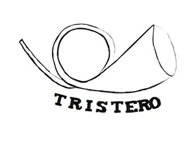
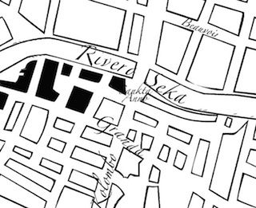
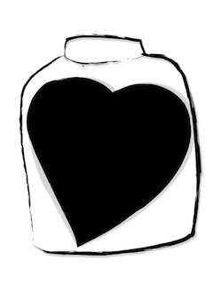
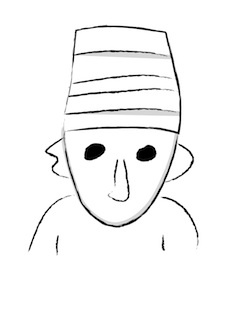
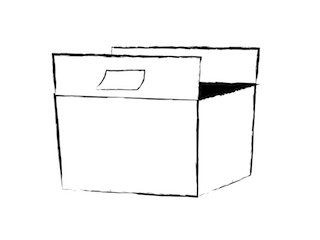
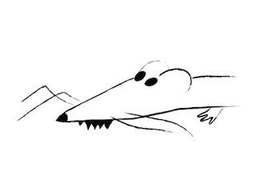
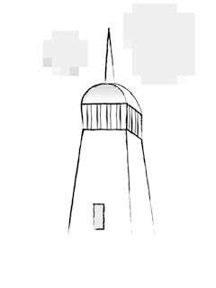
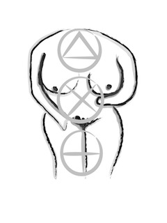
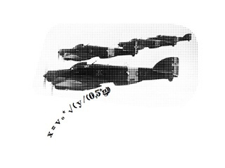
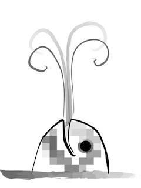

% Parèntesi
% Carles Bellver Torlà
% 2011

---
title:    Parèntesi
subtitle: L’home del calendari
author:   Carles Bellver Torlà
date:     2011
rights:   CC-BY-NC
lang:     ca
description: |
  El 4 de novembre de 2007, Charles Beauvoir escriu a Carles Bellver per encomanar-li la publicació dels seus diaris. Tot i que l’escriptor no se sent obligat, ni de bon tros, a executar l’excèntrica voluntat de Beauvoir, hi farà un cop d’ull, en llegirà les primeres frases i, en un tres i no res, la curiositat el vençerà. Les anotacions s’iniciem el setembre de 2001, quan Beauvoir va marxar de París a Szohôd, capital de la república imaginària de Bordúria, per exercir com a professor visitant en una denominada "Escola d’Alts Estudis". I acaben el maig de l’any següent, quan va fugir del país a corre-cuita, esglaiat per la situació d’amenaça bèl·lica que s’hi vivia. *Parèntesi* és també el nou llibre de relats de Carles Bellver Torlà, en el qual la potència narrativa del castellonenc —que evoca els noms de Pere Calders, Joan Perucho, H. P. Lovecraft o Boris Vian— arriba a la seva cota més alta. En els contes de Bellver, s’entrellacen elements de realitat i de ficció i es juga constantment amb el caràcter fantàstic dels personatges i de les històries (aquesta vegada unides de manera que el llibre sembli una novel·la, gairebé una *Bildungsroman*). Et convidem a la descoberta d’una de les veus més singulars de la nostra narrativa actual.

...

# Crèdits {.untitled}

Contes, 3

Edició de l’autor  
Primera edició: Tria, 2011 (amb el títol *L’home del calendari*)  
Revisió 1/20171228

Copyright 2017 Carles Bellver Torlà

Aquesta obra està subjecta a la llicència Reconeixement-NoComercial 4.0 Internacional de Creative Commons. Per veure una còpia de la llicència, visiteu [creativecommons.org](http://creativecommons.org/licenses/by-nc/4.0/).

[carlesbellver.net](http://carlesbellver.net)

# Resum {.untitled}

> El 4 de novembre de 2007, Charles Beauvoir escriu a Carles Bellver per encomanar-li la publicació dels seus diaris. Tot i que l’escriptor no se sent obligat, ni de bon tros, a executar l’excèntrica voluntat de Beauvoir, hi farà un cop d’ull, en llegirà les primeres frases i, en un tres i no res, la curiositat el vençerà. Les anotacions s'iniciem el setembre de 2001, quan Beauvoir va marxar de París a Szohôd, capital de la república imaginària de Bordúria, per exercir com a professor visitant en una denominada "Escola d'Alts Estudis". I acaben el maig de l'any següent, quan va fugir del país a corre-cuita, esglaiat per la situació d'amenaça bèl·lica que s'hi vivia. *Parèntesi* és també el nou llibre de relats de Carles Bellver Torlà, en el qual la potència narrativa del castellonenc —que evoca els noms de Pere Calders, Joan Perucho, H. P. Lovecraft o Boris Vian— arriba a la seva cota més alta. En els contes de Bellver, s’entrellacen elements de realitat i de ficció i es juga constantment amb el caràcter fantàstic dels personatges i de les històries (aquesta vegada unides de manera que el llibre sembli una novel·la, gairebé una *Bildungsroman*). Et convidem a la descoberta d’una de les veus més singulars de la nostra narrativa actual.
> 
> *—Editorial Tria*

# Citacions {.untitled}

> Aquesta illa no havia estat descrita fins ara, perquè el relat dels costums absurds dels seus habitants semblava als editors d'arreu del món una sàtira dels seus propis països. Acceptem que hi hagi parts del cos sobre les quals la gent s'estima més no escriure. Però, qui hauria pensat que existeixen països semblants?
> 
> *—Georg Christoph von Lichtenberg*

> Abans de res deixeu-me dir-vos,
> amb veu ben baixa i el rictus un pèl somrient,
> com és que encara tinc els ulls fixats contra l'espill,
> com es que hi ha algú que,
> escèptic, ebri i maldestre,
> encara cerca la taverna dels déus pels carrers de Quimera.
> 
> *—Manel Garcia Grau*

> El secret d'avorrir és dir-ho tot.
> 
> *—Voltaire*

# Pròleg

L'any 2007 va ser, per fi, el de la meva consagració com a escriptor. Una consagració certament mòdica, discreta, en la mesura estricta de les meves possibilitats. L'editorial on havia publicat els darrers llibres va saber treure, sens dubte, el màxim profit al metre quadrat d'estand de què va disposar a la Fira de Frankfurt, on la "cultura catalana" —aquesta n'era la denominació oficial— feia el paper —el paperot— de convidada d'honor. L'any anterior havia estat el torn de l'Índia i al cap d'uns mesos passàvem el testimoni a Malàisia. D'oca a oca i tiro perquè em toca, com si diguéssim. Per descomptat que l'atenció dels grans grups i dels mitjans de comunicació es va concentrar exclusivament en uns pocs noms ja coneguts de tothom. Però els altres, els que hi anàvem potser només per fer una mica d'embalum, també vam tenir la nostra ració del festí: ni que fossin les engrunes. No cal dir que vaig inflar el pit quan em van mencionar en un article del Frankfuter Allgemeine, al bell mig d'una generosa enumeració d'autors catalans contemporanis —de tota mena i condició, des d'un "poeta de l'experiència" fins a un signant de *best sellers*, o si més no *good sellers*—, per més obvi que fos que la llista havia estat amanida per algú d'ací. Algú més aviat amic meu, o almenys no gaire enemic.

Ja s'ha explicat també en un altre lloc com em volgueren entrevistar per a una revista dedicada a l'entranyable món dels gats i els gossos… Però això no és més que l'anècdota: el periodista s'havia pres massa al peu de la lletra el títol del meu recull *La vida canina*[^1], que en realitat feia referència al cinisme en el sentit grec clàssic —de *kyon*, gos— i no era més que una metàfora dels "bojos", aquelles persones que viuen i pensen fora dels límits socialment compartits. El que compta de debò —per a mi— és que durant la Fira es va arribar a parlar de tres possibles traduccions dels meus relats. Una, al portuguès, encara no s'ha materialitzat. Una altra, a les formes verbals valencianes, adreçada al mercat educatiu del sud del Sénia —o del Millars—, la vaig vetar jo per qüestió de principis. I la tercera, a l'hongarès, que sí que va donar fruit molt aviat. En aquest punt, no em puc estar de recordar —l'artista tendeix sempre a ser vanitós— que la meva editorial magiar m'enlairava des del text de la solapa fins a una òrbita solcada per un bon grapat de glòries de la literatura universal, astres de la ficció breu, més alguna altra figura de considerable prestigi local: verbigràcia l'Istvan Örkény de les *One Minute Stories*. Pur màrqueting, és clar, però tingueu si us plau en compte que no estic gens avesat a gaudir d'hipèrboles publicitàries com aquesta.

Va ser just llavors, quan acabava d'aparèixer la traducció a l'hongarès de *La vida canina*[^2], que vaig rebre una carta del senyor Beauvoir. No puc assegurar que una cosa tingués res a veure amb l'altra, tot i que ell signava la missiva a "Budapest, 4 de novembre de 2007". Invitava a malfiar-se d'aquesta rúbrica el fet que l'únic simulacre de mata-segells estampat al sobre fos una versió a bolígraf de la clàssica corneta de carter, el típic símbol de tots els correus del món, amb una designació de reminiscències pynchonianes a sota. A més a més, l'enviament anava adreçat al meu nom, però sense detallar el carrer, el codi postal ni cap altra coordenada que facilités de localitzar-me. M'inclino a pensar, doncs, que havia estat introduït a la bústia de casa meva per alguna mà anònima, absolutament aliena a cap servei postal oficial. I no crec que puguem esbrinar mai si havia estat tramesa en origen des de la capital d'Hongria o bé des d'algun amagatall molt més proper, fins i tot des de la mateixa capital de la Plana.

Malgrat la funció acomplerta —involuntàriament— per Beauvoir en la gestació de *La vida canina*, aquesta era la primera vegada que ens posàvem directament en contacte. "Distingit senyor Bellver", m'ensabonava per començar. Però de les paraules ambigües que hi seguien, no en vaig saber deduir amb certesa si em felicitava per l'èxit de l'obra o em blasmava per haver tret rendiment als esborranys dels seus pacients, que jo havia treballat i reelaborat com a contes curts. A continuació, fent un gir sorprenent, m'encomanava la publicació dels seus propis escrits: "Atès que trobeu gust a remenar els papers d'altri, això ja ho heu ben demostrat, em complau nomenar-vos irrevocablement representant literari meu." D'una manera xocant, i ara sé que típica del seu estil, es referia a mi com a mèdium: "etimològicament intermediari", m'instruïa. Precisava després l'encàrrec centrant-lo en l'edició d'uns pocs quaderns seus. "De moment", advertia, "ací teniu aquests: els que vaig emplenar mentre era a Bordúria. Us n'enviaré d'altres més endavant." Tot plegat pareixia una broma —de gust dubtós—, però els quaderns hi eren, un parell de blocs quadriculats mida A5, curulls d'una lletra prima i atapeïda. Aclariré d'antuvi que no creia haver contret cap deute amb Beauvoir i que no em sentia, ni de bon tros, obligat a executar la seva excèntrica voluntat. Però vaig donar-hi una ullada, vaig llegir les primeres frases i en un tres i no res em va vèncer la curiositat.

Les seves anotacions s'iniciaven en setembre de 2001, quan Beauvoir marxà de París a Szohôd, capital de Bordúria, per exercir com a professor visitant en una denominada "Escola d'Alts Estudis". I acabaven en maig de l'any següent, quan va fugir del país a corre-cuita, esglaiat per la situació d'amenaça bèl·lica que s'hi vivia. Es tracta, doncs, del període immediatament anterior al retorn de Beauvoir a Castelló. Els avanço a vostès des d'ara, benvolgudes lectores i benvolguts lectors, que aquests escrits projecten una nova llum sobre un succés que va arribar a ser d'interès públic entre nosaltres: l'obertura del cèlebre i fraudulent gabinet psiquiàtric, que al capdavall va donar origen al meu recull com ja és sabut. Tanmateix, l'abast autobiogràfic dels textos és molt limitat. Tenen forma de diari, però les parts més interessants palesen certament un caire literari, gairebé poètic. D'altra banda, tampoc no poden considerar-se enterament ficció sense més matisos. *L'arrencacors*, una mena de conte gòtic que pareix un malson i remet explícitament a Boris Vian, seria un bon exemple d'això. En la majoria dels casos, s'hi barregen de manera sistemàtica fets quotidians, records o reflexions personals, amb elements imaginatius evidents o dissimulats, fins a fer gairebé impossible destriar la realitat de la fantasia. Vegeu, si no, l'epifania d'*El Gran Serafí*, levitació inclosa, cap al final del llibre. O l'improbable telèfon de fusta de *L'orella escapçada*, fabricat per indígenes de l'Amazònia i descobert per Beauvoir i un cosí seu en un pis de València[^3]. Per no parlar de la geografia mateixa d'aquell país minúscul des d'on se suposa que ens escriu —a les portes d'Europa Oriental— verificable únicament als atles de can Casterman, si no vaig errat[^4].

Una altra característica de l'estil de Beauvoir, que estic segur que no agradarà a tothom, és la tendència a la fragmentarietat, a la dispersió. Els relats s'estiren, es bifurquen, tot sovint intercalant-hi digressions sobre temes que hi tenen una relació com a molt tangencial, o no cap. De vegades no se'ns explica com acaba una història. Confesso que a mi això ja m'està bé, atès que des de xiquet o adolescent, que és quan entenen els experts que es configuren els nostres cànons estètics, he gaudit tant de la narrativa lineal, redona i tancada de *L'illa del tresor*, com de les fantasmagories inconcloses i inconcloents de Franz Kafka. O dels esbossos romàntics i erudits de Joan Perucho. De fet, en llegir per primera vegada aquest "Dietari de Bordúria", tenia sovint la sensació d'haver ensopegat el tipus de llibre heterodox que podria haver estat *La vida canina* si jo tingués una miqueta més de geni creatiu. Sigui com vulgui, l'editor, que és lògicament qui té l'última paraula en aquesta mena de negocis, m'ha donat la satisfacció d'avenir-se a publicar-lo. Li'l vaig lliurar més aviat per distreure'l, per desviar la seva atenció de l'incompliment reiterat dels meus compromisos. Feia un parell d'anys que li devia un llibre nou i em sentia avergonyit de no ser capaç d'enllestir cap material presentable. Comptat i debatut, crec que ell ha eixit guanyant amb el canvi: Beauvoir per Bellver. Penso que m'ho agrairà. I vostès també.

Abans de posar el punt final a aquest pròleg —ja excessiu— i deixar pas, com escau, a la lectura d'una obreta singular, permeteu-me que afegeixi tan sols unes rapidíssimes observacions sobre la meva tasca com a curador de l'edició. Haig de dir que en general m'he limitat a transcriure els manuscrits de Beauvoir. Tan sols he esporgat aquelles notes estrictament logístiques —llistes de la compra, comptabilitat personal, horaris de transport, etc.[^5]— i he reordenat i compost la resta quan calia, per tal que formessin narracions suficientment intel·ligibles. La divisió en capítols i els epígrafs o encapçalaments han estat aportacions meves: consideràvem, l'editor i jo, que farien més païdor el text. Les il·lustracions són del mateix Beauvoir. Eren als quaderns, gargotejades als marges de les pàgines, i es veu que van fer gràcia al dissenyador, que ha determinat incloure-les.

# Octubre

## Converses al cafè (amb els estudiants)

—Tu vivies a París?

Ja ho sap tothom que sí. El que m'està preguntant evidentment no és això i espero que es decideixi a verbalitzar la qüestió de fons, cosa que, al capdavall, fa.

—I per què diantre vas venir a viure ací al cul del món?

Llavors em prenc uns segons addicionals per contestar, mentre medito el què. A l'esquerra, a l'extrem de la taula, alguns es cansen d'observar el meu silenci i aprofiten l'ocasió per canviar de conversa. Cap a on escamparem quan ens acabem aquestes cerveses, etc.

—No suportava la pressió —li dic fent veu de confessar-me—. Suposo que vaig ser només una de tantes víctimes de les estretors i les tibantors de l'economia. Una vesprada d'hivern, ja s'havia fet fosc, tornava a casa a peu i em vaig aturar igual que altres vegades davant de l'aparador d'una immobiliària. No renunciava a trobar un pis més habitable, més assequible. "La Defense, seminou…", "Place d'Italie, per reformar…", "Rue de Dieu 13, 3r, ocasió…" Em vaig quedar glaçat: aquesta última adreça, número i planta, era la meva. I la fotografia de la façana enquadrava per més senyes la finestra del meu estudi. I jo què?, em vaig demanar retòricament. Vaig continuar llegint per a atènyer tot seguit una resposta inopinada, espaterrant: "Pis moblat. *Criat malgaix* inclòs pel mateix preu."

"Vaig voler pensar que es tractava d'una errada, és clar, però dins de mi sabia ben bé que no ho era. Que em prenguessin per nadiu de Madagascar, això rai. No m'ofenia l'equívoc, ni m'estranyava: a l'amo tant se li'n dóna africà com caribeny. O català. Em penedia, sobretot, de no haver secundat les tímides protestes sindicals per la reforma de la llei de treball i de la llei d'arrendaments. També d'haver passat per damunt de la lletra menuda del meu contracte de lloguer, en especial certa clàusula lleonina sobre responsabilitats per impagament que vaig simular no entendre. I encara més em recava d'haver llençat a la paperera una carta certificada d'algun ministeri —el de Consum, el de l'Habitatge?— sense ni tan sols treure-la del sobre. Però, com havia de pensar que les coses acabessin així tot d'un plegat, que un deute insignificant, dues o tres mensualitats, com a molt quatre, em fes anar a raure al Registre Nacional d'Esclaus de la Place Beauvau[^6]?

"M'enfonsava —angoixat— en aquestes reflexions tètriques, quan vaig veure que un empleat de l'oficina despenjava, davant de mi, el full dels meus espants. Vaig presenciar com hi traçava uns gargots amb un retolador i després tornava a col·locar-lo al mateix lloc. "Venut", clamava ara a crits el pergamí en tinta vermella. Recordo ben bé que aquell home —d'una cinquantena d'anys, ullerós, malfardat— em va mirar tristament un instant i després es va retirar capbaix a la seva taula per despatxar qualsevol altra iniquitat. Jo, llavors, vaig arrencar a córrer com un boig i, alhora que corria, em representava que ja s'haguessin personat al portal els nous —flamants— propietaris, acompanyats per efectius de la gendarmeria amb les seves porres amanides, sempre amatents a fer complir la llei de grat o per força. Per ells, si pot ser per força millor, més xalaran. La temptació de cedir, de lliurar-m'hi, era intensa. Hauria estat el més fàcil: menjar i sostre assegurats, a canvi d'un treball potser injust, humiliant i degradant però segur. Des que se'm va acabar la darrera feina remunerada, tot el reguitzell de beques i substitucions, consumia els dies als cafès, repassant les ofertes laborals dels periòdics i els anuncis de pisos o d'habitacions, en cerca d'alternatives viables. O visitant examics i coneguts per suplicar-los infructuosament que em donessin un colp de mà. Però em feia tanta por que el remei fos molt pitjor que la malaltia. Davallar en un pou del qual no pogués eixir mai més. Em resistia a deixar-m'hi caure.

"De sobte em vaig adonar que la Gare de l'Est era molt prop. Aquesta circumstància casual em va salvar la vida i va decidir per mi el rumb de la meva fugida. L'estació —la idea en si del ferrocarril— em va xuclar com un vòrtex i, tot emulant Blaise Cendrars l'any mil nou cents poc, vaig comprar un bitllet per al primer tren. Tant s'hi val on vagi, vaig dir al taquiller. Sense pensar-hi dues vegades, doncs, vaig partir cap als afores de la civilització, fins ací on l'Europa imperial perd el seu nom honorable. Com més aviat i més lluny millor, em deia, abans que no s'afanyin a emetre una ordre de captura. No fos cas que el nostre govern republicà hagués desenterrat també el codi negre de Lluís XVI i en enxampar-me em tallessin una orella: càstig infligit en temps —antics?— als pròfugs. Tant que m'estimo les dues, encara que les tingui grans i poc afavoridores."

En concloure aquesta peroració, algun dels joves ha proposat marxar i han corregut tots a pagar les seves begudes. Jo els he dit que restava. Avui estic una mica cansat. Enllestiré aquests apunts i me n'aniré a casa d'hora.

## Nissagues

Quatre, vuit. Set, rei. Cinc, cinc: *bataille*. Jo, que em sabia Wittgenstein de punta a punta, que havia donat lliçons d'epistemologia a doctorands. Què hi fotia, jo, que odio els jocs de taula? Millor jugar a cartes que mirar-nos les cares? O enredar-nos una altra vegada en les polèmiques de sempre, en els nostres grans temes gastats per l'ús fins a arrodonir-ne els cantells, no ens hi féssim mal. La metafísica i el llenguatge. Els mots i les coses, la veu i el fenomen. La filosofia i la literatura, la política, el cinema. El compromís, *Le mépris*. Els contes de primavera i del llarg hivern. Els embolics amorosos: les dones que ja no eren —que no van ser mai— les nostres dones. Ja no venien mai. Ells tampoc, els que ens dèiem amics. A poc a poc tothom s'anava rendint als vicis consuetudinaris: el treball, la parella, la societat.

Menys jo. Millor jugar a cartes, doncs, mentre esperàvem endebades que ens rescatés un miracle. Els miracles però no existeixen. N'hi havia per a fer-se'n un tip de riure, si no fos tan patètic. I, per què venia encara l'Henri? Si ell era d'allà, tenia feina i família. Per què no es rendia ell també? Crec que es va quedar l'últim per pura distracció i ara no sabia com desempallegar-se de mi. Li sabia greu deixar-me tot sol, enfangat. Un sentiment de responsabilitat que l'impel·lia igualment a buscar-me una sortida, una solució que, de retruc, l'alliberés a ell de la càrrega. Tinc un conegut a l'Agència, em va dir aquell vespre. Ja me n'havia parlat altres vegades. No aconsegueixen mai cobrir certes places. El lectorat de Bordúria continua vacant un any rere l'altre. Bordúria?, li vaig preguntar. A mi aquest nom em sonava vagament a tebeos de Tintín o de Spirou, d'aquells que llegia quan era petit, a la biblioteca municipal del carrer Major. Una antiga província, em va assabentar l'Henri, de l’Imperi Austrohongarès, en l'àrea d'influència soviètica durant la guerra freda. Es va incorporar a l'Organisation Internationale de la Francophonie fa deu o dotze anys, arran de la caiguda del Mur de Berlín. Només per plantar cara als americans, que volien ficar-hi cullerada. En realitat no s'hi parla el francès.

I què coi se suposa que hi hauria de fer?, vaig inquirir fredament, mantenint les distàncies. Donar classes de cultura francesa a universitaris, o a gent gran. Però jo no tinc pas cap títol, res que m'acrediti per a ensenyar l'idioma. No tinc ni tan sols passaport francès. Tu prepara un currículum una mica adornat i ja veurem que es pot fer. Jo demà et portaré la instància. L'adreces a Quai André Citroën, 75015… O li dic al meu amic que l'empleni ell mateix. Segur que ningú no et demana res més. Encara els fas un favor.

Una escena digna d'una pel·lícula d'espies expressionista i absurda, un xic *ridicule*. El nom del bar on tenia lloc: Fort-de-France. Un mapa de les Antilles presidia el local gairebé a les fosques. Si algú volia saber-ho, en Charles Beauvoir seria nascut a la Martinica. La seva àvia materna era mulata, filla d'una esclava. El seu pare un mariner, bretó. Aquesta barreja explicaria la meva pronunciació exòtica. I a més a més no vaig posar els peus a la França metropolitana fins als divuit anys, quan vaig anar a estudiar Filosofia a París IV-Sorbonne, amb una beca del Ministeri d'Educació per a nois pobres d'*outre-mer*. Si és que hi ha allà —ací, a Bordúria— algú que sàpiga prou francès per copsar res estrany en les meves vocals neutres.

Pel que fa al pseudònim, aquesta paròdia d'identitat falsa, ja l'havia fet servir abans, mai molt seriosament: només per signar algun epigrama, algun article satíric, alguna novel·leta picant que vaig destruir. Pecats de joventut.

---- 

Avui he passat la vesprada a la biblioteca de l'Escola. Cercava l'assaig d'Houellebecq que em diuen que ha popularitzat els contes de Lovecraft entre els estudiants. No és irònic, que un ianqui racista i reaccionari triomfi enmig de l'antiamericanisme d'aquest Arkham —o Dunwich— centreeuropeu? Però no perdis el fil una altra vegada. L'Heléna m'ha suggerit que donés una ullada també als enviaments de l'Agència. No cal que t'aixequis, li he dit, ja agafo jo el paquet. Res de cavallerositat: és que m'incomoda la seva alçada. Cadascú té les seves manies i a mi em fan posar nerviós les dones més altes que jo (i les que se t'arramben exageradament).

Es tractava, he pogut comprovar, d'excedents editorials de la *grandeur*: ens encolomen una part d'allò que els sobra. De dins d'una caixa han eixit trenta o quaranta exemplars de *Les Guillotinés. Avez-vous eu un ancêtre decapité pendant la Révolution?* Sic. Una mena d'inventari del terror republicà. (Totes les revolucions s'emporten gent per davant, això és una veritat com una casa. Molta gent, de vegades. Però no s'ha vist mai un balanç de víctimes de la revolució industrial.)

Doncs bé, a la pàgina 94:

> Beauvoir F. Auguste Renard, edat 45 anys, nat a Constantinoble, excomte i tinent de la legió de Luxemburg, domiciliat a París, departament del Sena, condemnat a mort com a conspirador el 3 de maig de 1793 pel tribunal revolucionari de París.
> 
> Beauvoir Charles Louis Ange, exnoble, exsotstinent de regiment d'infanteria, condemnat a mort el 5 de termidor de l'any 2, pel tribunal revolucionari de París en qualitat de còmplice d'una conspiració a la presó del Carmel on estava detingut.

Sens dubte, tan il·lustre patuleia de degollats devien ser avantpassats d'aquest altre jo meu, que ja és a hores d'ara, ací, el meu jo primari.

(I de la cèlebre na Simona, ara que hi penso, diguem que devia pertànyer a una branca bastarda de la família. L'*ouaille noire*. O és que érem nosaltres els negres, els bastards. Això depèn del punt de vista. I de qui hagi guanyat la partida, la guerra: la revolució.)

---- 

El sou no és res de l'altre món, però fa un parell de mesos no tenia ni cinc i no podia pagar el lloguer. Ara tinc casa gratis i temps de sobra per a escriure. Les classes no m'ocupen més de tres hores cada dia. He dit a tothom que sóc escriptor. Els meus alumnes m'han demanat una col·laboració per a una revista que fan. Hi penso un moment i els dono a triar una remembrança de King-Kong o una ficció sobre Lovecraft, que se salvava miraculosament del càncer a l'hospital de Providence i vivia una segona vida secreta com a granger al Midwest. Són coses que tinc mig embastades. L'Hélena (no sé mai on va l'accent) ha assistit a la conversa i ha amollat una rialleta, com si m'hagués pescat, com si digués: ja n'he conegut d'altres com tu. Sóc massa suspicaç, ella ni em coneix. Em pregunto si es pot ser escriptor als quaranta i tants anys sense haver acabat d'escriure res més que un sol llibre (a banda de la tesi). No enllesteixo mai un full, ho deixo tot a mitges. Però és el que he pretès ser sempre i és així com em veig, què hi farem.

# Novembre

## L'arrencacors

Fa uns dies que l'Agència ens va remetre aquesta circular, referent a una magna exposició dedicada a Sartre que en aquests moments és oberta a París, a la Biblioteca Nacional. Ofereixen la possibilitat d'instal·lar-la en altres ciutats, fora de França inclús. Segons vaig entendre, podríem allotjar-la gairebé de franc, sempre que el govern o alguna institució garantissin unes condicions bastant específiques: espai en metres quadrats, vigilància les vint-i-quatre hores, pòlisses d'assegurança, difusió als liceus locals, etc. En tot cas em sembla que això seria una qüestió a mitjà o llarg termini: ja deuen tenir una llista ben llarga d'aspirants amb molt més pedigrí que Szohôd, *terra incognita* enllà. Calculo que no ens tocaria el torn abans de dos o tres anys com a molt aviat. No crec que jo estigui encara ací per a veure-ho.

La secretaria de l'Escola em va proporcionar la informació i avui n'he fet esment a classe. Mentre els meus estudiants fullejaven en rogle el catàleg de paper setinat, se m'ha acudit una petita broma: els he dit que era sens dubte un parament d'allò més complet, però que trobava a faltar que s'hi exhibís també, en una vitrina central, l'arrencacors amb què va ser occit Jean-Paul Sartre. Algun dels més desperts —i saberut— m'ha replicat que Sartre es va morir de vell, al llit. De manera que m'ha donat peu com desitjava a explicar-los aquell episodi de *L'Écume des jours* de Boris Vian, quan la pobra noia es cansa que el seu promès sigui un lector tan fanàtic, un consumidor voraç, obsessiu, de les obres completes de "Jean-*S*ol *P*artre". Desesperada perquè la compra compulsiva de cada nova edició, reedició, antologia o opuscle d'aquest prolífic autor els estigui eixugant les finances i els comprometi el futur conjugal, decideix tallar el problema d'arrel: matar el filòsof, usant un instrument esbalaïdor denominat —molt gràficament— "arrencacors".

Vian es complaïa a inventar tota mena d'artefactes estranys, en els seus llibres i en la vida real. He remarcat, però, que la novel·la titulada *L'arrache-cœur* justament no en conté cap, d'arrencacors. A mi ja m'estaria bé que en llegissin qualsevol de les dues, la que vulguin. Això els he dit. *L'arrencacors* és un conte cruel, una obra mestra de l'humor negre en el sentit, precís o imprecís, però profund, d'André Breton. La trama de *L'escuma dels dies*, en canvi, és sentimental, d'amors romàntics i tràgics.

Tot plegat, al cap d'una estona aquesta discussió m'ha suggerit una història.

---- 

Això era un diumenge de novembre. Tres dies seguits de pluja gairebé ininterrompuda, acompanyada d'un fort vent tramuntanal, havien posat fi abruptament a l'estiu més llarg de molts anys. No parava de ploure i ningú no eixia al carrer si no era per necessitat, només si no hi havia un altre remei. Després d'hores de contemplar ara el rebost buit, ara —a través del vidre entelat— el carrer que semblava una riera, em vaig adonar que amainava una mica el temporal. Vaig decidir, doncs, aventurar-me fins a una botiga propera, un d'aquests comerços del raval de la Trinitat, regentats per magribins o pakistanesos, que no tanquen ni en caps de setmana ni en festes de precepte. Compraria llet, galetes, fruita fresca si n'hi havia. Tot el que em calia per sobreviure uns dies més. Abans que pogués arribar-hi, però, la pluja va refermar una altra vegada i em vaig haver de refugiar a l'únic lloc que vaig veure obert: la cafeteria del Casino Antic. Els costums, per sort, últimament s'han relaxat. En un altre temps no hauria gosat entrar-hi, ni el porter —ja no n'hi ha— m'hauria permès fer-ho.

Va ser per tant allí on ens vam trobar. Tot i que de primer no el vaig reconèixer. Jo havia demanat un cafè amb llet i un conyac a la barra i en passar pel seu costat —estava assegut en una de les taules a la vora dels finestrals— el vaig prendre per un jubilat dels que solen constituir la clientela d'aquest tipus d'establiments. No s'hi veia ningú més. El saló —ampli i ben fornit de mobiliari rococó, catifes perses, aranyes i canelobres polsosos— feia l'efecte d'estar més aviat desaprofitat.

—Carles? —se m'adreçà, aixecant-se per sorpresa—. Sóc el Simó Badal.

Em va fer una abraçada massa enèrgica i sense soltar-me del tot —em tenia agafat el canell— em va obligar a seure al seu costat.

—T'he conegut de seguida —em va dir—. No has canviat gens.

—Tu tampoc —vaig mentir jo en correspondència.

—No exageris —em contestà amb mig somriure—. Ara envellim més de pressa. És per la poca qualitat de l'aire. Però almenys ja veus que no sóc mort. Es van dir tantes coses. T'aclareixo que utilitzar l'arrencacors no va ser idea del meu germà. Ens havíem barallat, a tu no t'haig de contar que no vam congeniar mai. De fet, es podria dir ben bé que ens odiàvem. Però allò li ho vaig demanar jo.

El seu germà, crec que també el coneixia vagament. Més gran que ell i membre, deien, de la policia secreta de l'antic règim. O, potser, només un vulgar confident, no ho sé de cert. Feia molts anys, en tot cas, que havia perdut el contacte amb tots dos. Des que vaig acabar els estudis, no n'havia tornat a tenir cap referència, ni ganes tampoc. D'aquest i altres malentesos posteriors, en vaig deduir que em contava la seva història perquè suposava que jo ja n'estava més o menys al corrent. Era obvi que la memòria li flaquejava. Malgrat que vam ser companys de classe un parell de cursos a l'institut, i després a la universitat, pertanyíem a mons totalment separats, si més no a estrats socials molt distants. Els seus cotxes nous cada any, el descapotable per l'estiu, les vacances pagades pels papàs a les estacions d'esquí o a les Illes Verges, el Moët et Chandon i el tracte —carnal també— amb noies elegants, de bona família… eren per a mi poc menys que luxes asiàtics, delicadeses que ni tan sols aspirava a tastar.

Va venir el cambrer uniformat, amb la meva comanda a la safata, i el Simó li va demanar que li omplís també a ell la copa. Va continuar parlant atropelladament. S'embarbussava, cada dues o tres frases quequejava perceptiblement. Em vaig preguntar si l'alcohol era la causa del seu estat o, al contrari, era aquesta excitació nerviosa que el portava a beure.

—Vam heretar l'arrencacors del meu oncle —m'explicava—. Bé, la veritat és que el vam trobar a les golfes de casa seva, la vella casa pairal del carrer d'Alloza, quan ell es va morir, i ens el vam quedar sense revelar-ne res a ningú. Ens vam assabentar, per una nota en un paperet esgrogueït, que l'havia comprat a Tànger, a un antiquari, durant la Quarta Guerra Mundial. El vam desar en un racó del garatge on s'amuntegaven les nostres joguines i tota mena d'andròmines velles de quan érem menuts, entaforat dins d'una caixa de fusta i embolcallat amb draps perquè no ens el descobrissin. De vegades, quan érem sols a casa, el trèiem per mirar-lo. Ens fascinaven els engranatges, les fulles esmolades, la solidesa de ferro colat. També, sobretot, que fos quelcom absolutament prohibit. El meu germà en sabia un fum de coses que havia llegit als llibres d'Aleister Crowley i altres autors ocultistes del segle XX, d'aquells que tant —i tan incomprensiblement per a mi— l'apassionaven: Lobsang Rampa, Erich von Däniken, Jiménez de los Santos…

"No sé si saps de què et parlo. És un aparell quasi mític, d'origen indi o tibetà, que s'emprava en cerimònies reservades als alts mahatmes i a cercles d'iniciats. Una operació física, relacionada amb la negació budista de les emocions i dels afectes, molt més brutal encara que la perforació del tercer ull. A Occident, n'havien arribat pocs d'autèntics, mitja dotzena a tot estirar, que es trobaven dipositats en museus o en col·leccions privades. Alguns havien estat requisats per les autoritats, atès que la seva utilització resultaria extremadament perillosa en mans inexpertes. Se sospitava que determinades sectes l'usaven o pretenien usar-lo en rituals força cruents.

"El meu germà volia vendre-se'l. Suposo que ja buscava comprador, algun d'aquells cràpules milionaris que freqüentava llavors, gent sadollada de tota mena de vicis i rareses. Fins i tot ja devia fer el compte dels dòlars o rubles que podia guanyar, una quantitat respectable. Aquest va ser un nou motiu que ens va fer discutir. Jo no entenia que tingués tanta pressa a desfer-se d'un objecte enormement valuós i m'hi vaig enfrontar. Quan va marxar de casa, després d'una agarrada tremenda —una altra— amb el pare, vaig impedir que s'endugués l'arrencacors. Em vaig plantar davant d'ell i li vaig advertir: per damunt del meu cadàver. Tanmateix, malgrat el patetisme i la teatralitat de la meva acció, no vaig tornar a pensar en aquest estri fins uns quants anys més tard.

"El que ve a continuació et pareixerà un melodrama barat. No crec que et recordes de l'Esperança. Jo la coneixia des de l'escola. Als catorze anys vam eixir junts algunes vesprades i dèiem que érem nuvis, una criaturada. Però després vam fer el batxillerat en instituts diferents i ja no ens vam retrobar fins a la universitat. L'estiu de cinquè ens solíem veure amb altres amics a la terrassa de l'Hotel Voramar. El bàrman era excepcional, un dels millors. Si l'agafaves ben disposat et podia preparar uns còctels fulminants. Dues dosis i a volar. Marisc i xampany per sopar, passejades per la platja sota la lluna plena, els balls, les festes privades a les vil·les i de remat… Una nit ens vam quedar sols. Paraules i carícies lleus, el mateix joc íntim de sempre. Com podia intuir que aquesta vegada tindria conseqüències? Era Sant Joan. Hi havia fogueres, la gent saltava i entraven nus a l'aigua. Nosaltres ens banyàrem l'un en l'altre. L'endemà, em vaig despertar al llit dels meus pares —estaven de viatge— a l'apartament de Benicàssim. Ella ja no hi era."

I jo, com volia que oblidés l'Esperança? Si no vaig errat, em va convidar a dormir amb ella, aquell estiu d'aprenentatges, precisament el vespre d'aquest mateix dia que el ximplot del Simó es va despertar sol. Vaig tornar a ficar-me al seu llit més vegades, però no pas totes les que jo hauria volgut. I durant poc temps. Manava ella, es feia la seva voluntat.

—Crec que aleshores ja estava promesa amb l'Andreu. No podia esperar que em truqués, ho sé, ni ella es podia creure que insistís així, com un babau. Va començar a evitar-me. No em contestava les telefonades, o no era bon moment per a parlar, o tenia altres compromisos. Aquesta actitud meva tan pueril costa d'entendre, me'n faig càrrec. Se suposava que no érem uns xiquets. Jo mateix estava perplex. Un neguit em rosegava. De nit no em podia adormir, de matí em despertava d'hora pensant en l'Esperança i no em volia llevar. Vaig perdre les forces, la salut, l'oremus. La Isa em va deixar, ni tan sols vaig saber explicar-li… Vaig patir migranyes, mareigs, febrades. Però l'origen de totes aquestes afeccions era exclusivament anímic.

"No creguis que no vaig posar res de la meva part per salvar-me. Encara que només fos per calmar ma mare, fins i tot vaig deixar que m'examinés el seu terapeuta de confiança, un psiquiatre excèntric amb uns mètodes de relaxació ben estranys. Un tal Hilarius, belga o alemany, que gaudia d'una certa fama malgrat l'accent i la fila que feia: nan, ossut, malgirbat. Em posava enregistraments de sorolls, projectava taques de colors a la paret, coses així. Mitjançant un parell de trucades vaig obtenir una informació útil: mancava de títol homologat, imprescindible per a exercir ací. Molt pitjor, havia estat acusat d'abusos a pacients en un altre estat de la Unió. Vam arribar prompte a un pacte. Jo no presentava denúncia i ell renunciava a tractar-me. Però ens calia fingir, per ma mare. Ens passàvem les sessions escoltant els seus discos vells de jazz i bevent el conyac francès que li pagaven les seves pacients. Jo no badava boca i ell tampoc. M'entretenia fullejant les seves revistes mèdiques i una antologia de psiquiatres militars en setze volums: Vallejo-Nájera, Dunbar-Welter, colles de nazis infiltrats a Amèrica. Feia basarda. El meu germà s'ho hauria passat pipa. Al cap d'unes setmanes, Herr Hilarius es va avorrir de mi, es va atipar de tenir-me davant mut, mirant-lo amb displicència. Em va demanar que no hi tornés. Devia témer que li encomanés la malenconia, el nihilisme? Va comunicar a ma mare que jo ja estava guarit i em va pregar que dissimulés els símptomes amb ella.

"Vaig saber aleshores que l'Esperança es casava i em vaig proposar d'acceptar la situació com era, ni més ni menys. Et juro que m'ho vaig plantejar seriosament. Hauria intentat de tornar amb la Isabel, si això hagués estat possible. Però l'Esperança m'havia enverinat el cor. Amb tot, a poc a poc m'anava temperant, em resignava, i qui sap si un dia o altre no m'hauria refet. En mala hora em va venir al cap d'utilitzar l'arrencacors. Va ser una decisió precipitada, un pla malvat forjat en contra meu, fruit de la depressió i d'un malson terrible que vaig tenir. Tant de bo que m'ho hagués repensat, que ho hagués deixat estar ni que fossin unes hores a veure si m'espavilava. Només em faltava algú que m'ajudés, una persona sola no pot manejar-lo, i l'elecció em va semblar òbvia. Ja t'he avançat abans a qui vaig acudir."

Va callar uns segons per mirar-me de fit a fit, com si esperés la meva reacció. Vaig assentir sense ganes.

—Exacte. Vaig trucar al meu germà. Al cap i a la fi, ell tenia nocions concretes sobre la manera d'efectuar l'extracció.

Una altra pausa, em tornava a clavar els ulls i em feia sentir incòmode. Per a ell, evidentment, això era un clímax dramàtic, però jo no pensava pas donar-li el gust de mostrar interès.

—Crec que en el fons també volia venjar-me, donar-li el colp de gràcia. Era una operació arriscada i, si res anava malament, aleshores ell seria el meu còmplice, culpable de la meva mort davant dels pares. A canvi, es podia apropiar aquesta màquina infernal que cobejava i fer-ne el que li donés la gana.

"Vam desinfectar-lo amb alcohol. Després em va fer fumar una cigarreta de haixix. Em va deixar en clar que "els lames de les muntanyes" no ho haurien aprovat, però que, en el meu cas, resultava indispensable perquè em faltava preparació espiritual. Va escriure un mantra, un galimaties, en una quartilla i em va ordenar que el recités a poc a poc, que el memoritzés i l'anés repetint. L'arrencacors s'ajustava per mitjà d'unes corretges que m'estrenyien el tors. No et pensis que va ser un acte innocu. Una volta de manovella em va seccionar la carn, la segona em va separar les costelles. Vaig sentir que una llança em traspassava. Les penes passades i presents es resistien a desprendre's, fins que se'm va obrir el pit com una flor roja i tot seguit —no em preguntis per quina art màgica, ancestral i inescrutable— es va tornar a tancar sense deixar més senyal que dos talls finíssims, unes incisions que dibuixaven una creu gairebé imperceptible. I aquell dolor agut, intens, que acabava de torturar-me, va ser el darrer que he experimentat en ma vida.

"Abans d'acomiadar-nos per sempre, el meu germà em va recomanar que m'hi posés cotó-en-pel amb aigua oxigenada per prevenir possibles infeccions. I que descansés. Vaig passar unes setmanes dolentes mentre el cos s'acostumava a treballar sense el múscul primordial. Quan els meus pares es van assabentar del que havíem fet —i jo no em vaig preocupar gens ni mica d'ocultar-los-ho—, em van enviar a una clínica a Baviera i van trencar definitivament amb el fill maleït, el van repudiar, així que es pot dir que vaig aconseguir tots els meus objectius.

"Ja abreujo. Ella no tardarà a venir."

Va fer un altre glop llarg i va reprendre la xerrera.

—He viscut molt tranquil, d'ençà d'aleshores. La meva existència ha estat banal i monòtona, sense daltabaixos. Em vaig concentrar en els negocis, en la lectura, una mica d'esport per mantenir-me en forma —perquè la sang circuli: prescripció mèdica— i poca cosa més. Tot just algun viatge. Fins aquest últim any.

"Perquè el Nadal passat ens vam trobar de bell nou. Gairebé topem, en un corredor d'un centre comercial on buscàvem els típics regals per a la família, i t'haig de dir que va ser ella qui va suggerir que prenguéssim un cafè. Potser només per eixir del pas, però és així com va ocórrer. Ens vam estar mitja vesprada parlant allí mateix, a la cafeteria de l'última planta, amb una vista tremenda a sota del que resta de la ciutat. Em va confessar que el seu matrimoni havia fet aigua des del principi. No s'entenien i es van ser deslleials. Banyes, ja m'entens. Quan li van proposar una feina en un banc a Nova York, l'Esperança no va dubtar a acceptar. Es van separar, doncs, primer de fet i després legalment. Amb l'oposició total de l'Andreu, no et pensis, però va marxar. Uns quants anys més tard, va tornar a Castelló. Llavors va saber, li ho van dir, que ell estava molt malalt i va sentir una barreja d'enyor i remordiment, una recança per les oportunitats que van malmetre. Va anar a veure'l i d'una manera imprevista es va quedar a viure amb ell, per tenir-ne cura. Tot i que va ser més una infermera que cap altra cosa, a mesura que s'agreujava l'estat de l'Andreu es va adonar que ara l'estimava de debò, com no l'havia estimat mai abans. Quina broma del destí. Em consta que el dia de l'enterrament, malgrat les murmuracions de les harpies de torn, les seves llàgrimes hagueren de ser totalment sinceres."

Jo també la vaig veure plorar. Havia llegit l'esquela en un diari i vaig fer cap a Santa Maria a les quatre en punt. Però no pel tal Andreu, un capitost a qui no coneixia ni de nom. No vaig entrar a l'església. Des de la vorera del Mercat Central, darrere dels cotxes, vaig estar guaitant com una àvia xafardera.

—Em va trucar, aquesta vegada sí. Eixíem a passejar, anàvem al cinema, al teatre, a reunions de la parròquia… damunt de totes les seves virtuts, és una dona pietosa. Em va anar contant els seus problemes. L'Andreu havia modificat el testament a última hora per beneficiar-la i ella havia hagut de pledejar amb la família del seu exmarit, molt ben situada, circumstància que la va condemnar a un dur ostracisme. Ja saps com és la gent en aquesta ciutat que continua sent només un poble gran: li van posar el capell de caçafortunes. Que avars i que cecs som de vegades! Una vesprada, per fi, la vaig veure somriure. No et vull enganyar, els fets són els que són. El meu record agre i dolç, el meu somni recobrat. Però no aconseguia que açò signifiqués res per a mi. No sentia res: literalment em mancava l'òrgan. Fins ara havia passat en pau amb aquesta ataràxia, aquesta fredor impertorbable. És que no estava millor així? Per primera vegada en tots aquests anys tenia dubtes. Em vaig escamnar, ai las, quan vaig votar la dreta en les eleccions a Corts d'enguany, només perquè la reforma fiscal que es propugnava m'afavoria. Tingues en compte que a desgrat de la meva posició jo sempre havia estat un home de conviccions esquerranes. Socialdemòcrata si més no. Però el dia que em va caure l'ànima als peus va ser quan vam escoltar junts una cançó al Voramar, una que el meu germà solia posar al tocadiscos quan jo era menut i sempre em commovia. "Irene", es deia, un nom antic de dona. Ara en reconeixia la música i els versos, però em deixaven absolutament indiferent, impassible. Què n'havia fet, insensat, de mi?

Va fer venir el cambrer amb la botella de Torres i després de tornar a remullar la gola va prosseguir.

—En aquest punt comença el meu periple per les consultes dels especialistes. Primer vaig anar a un dels millors cardiòlegs, que es va emprenyar amb mi i em va renyar. L'automutilació, em va sermonejar, no sols és un delicte sinó que a més a més resulta fisiològicament irreversible. Segons ell no hi havia res a fer: em va posar l'exemple de la sargantana i em va recordar, com si calgués, que no som rèptils sinó mamífers. Em va despatxar de molt mala manera. Li havia dut el cor dins del vas on el tenia guardat en alcohol i em va etzibar que això ja podia abocar-ho al fem, que no era més que un tros de carn morta en conserva.

"Però no em vaig rendir. Vaig cercar una segona opinió i una tercera. Renoi, semblava que s'haguessin posat d'acord tot el col·legi de metges. Llavors em vaig sincerar amb l'Esperança —encara no li n'havia contat res— i ella va ser molt comprensiva. Em va recomanar una homeòpata, amiga seva. El seu diagnòstic va ser totalment discordant amb els anteriors, va albirar una possible solució i em va derivar al radiòleg. L'ecografia, gràcies a Déu, ha demostrat que tinc encara un buit al pit. El pulmó no ha acabat d'omplir aquest espai i se suposa que això és bo: vol dir que hi ha marge perquè creixi un cor nou. El pronòstic, per tant, és encoratjador. M'ha prescrit una teràpia múltiple. D'una banda he de seguir una dieta rica en vísceres: fetge, ronyons, etc., que poden afavorir la regeneració dels teixits implicats. De l'altra, és essencial que em captingui sempre com si tingués vers sentiments. Preferiblement, és clar, bons sentiments, de manera que m'hi avesi i a poc a poc, per costum, per repetició, la il·lusió arreli al cos i —per dir-ho així— la funció recreï l'òrgan. Més la contribució dels potingos i elixirs, entre cometes, que em van receptar a Alemanya quan acabava de cometre aquest disbarat. No et pensis que aquesta dona és cap curandera. Va estudiar medicina a Pamplona amb l'Opus Dei.

"I que no provi l'alcohol. Però avui necessitava encara que només fos un trago."

O deu, em vaig dir. Va tornar a beure. Jo també.

—He quedat amb ella. No ens hem vist des que va començar a ploure i pressento que serà un dia decisiu. Farem un pas endavant en la nostra relació.

Just llavors va entrar al saló l'Esperança. Més gran, amb els mateixos cabells llargs i solts, lluents, però ara grisos. Tan prima com sempre, però no meravellosament prima com abans, com l'àngel ingràvid que era, sinó eixuta, mustigada. Malalta, potser, o només tan vella com jo, com tothom? El temps també passa per a les de la seva classe? També envelleixen els àngels i les *prime donne*? Quina notícia si es confirmava. No vaig voler saber-ho. Miraculosament havia parat de ploure. El rellotge marcava les vuit i mitja. Si m'afanyava encara podia arribar a la botiga abans que tanquessin, i sense mullar-me.

—He d'anar al lavabo.

No em va escoltar. Ara tota la seva atenció s'enfocava a l'altra punta de la sala. L'Esperança tampoc no em mirava. Invisible, doncs, per a tots dos, em vaig aixecar, vaig agafar el paraigua i em vaig escapolir per la porta del pati.

Que es fessin fotre ells i la seva egolatria.

---- 

Avui hem llegit a classe part del meu conte. La Jana —em va demanar el meu exemplar de l'*Écume*, perquè a la biblioteca no el tenien— m'ha retret que contradic Vian. En la novel·la, l'arrencacors és mortal de necessitat. De fet el tal "Partre" hi mor en l'acte, com jo mateix havia implicat l'altre dia quan els vaig fer aquella broma sobre l'exposició.

—Però mor de la impressió —li he contestat—, en contemplar el seu cor tan lleig. "Tenia forma de tetràedre", diu el text. Revisa el capítol cinquanta-sis i ho veuràs. Ningú no s'ha mort mai perquè li hagin arrencat el cor.

## Samsa cantat

Els dilluns fan mercat a la plaça Major de la ciutat vella. Avui, passejava per allí casualment i m'hi he entretingut una estona tafanejant entre les parades. Al final me n'he endut tota mena de viandes que no solc menjar: fruita fresca, pernil fumat, un pa redó gruixut acabat de fer… Després, en un dels carrerons que desemboquen a la plaça, he trobat una botiga de queviures fins a tal punt idèntica a la que hi havia al costat de la meva escola, quan era petit, que em pareixia impossible. Per un moment m'he sentit transportat en l'espai i en el temps. Els prestatges atapeïts fins al sostre, la penombra, la mitja claror que entrava per uns finestrons alts, les capses de colors, l'olor enfarinada i ensucrada. De dins d'aquest miratge, d'aquesta cova dels prodigis, n'he eixit amb unes galetes amb llavors de rosella i una llauna de conserva més aviat enigmàtica: per a mi, és clar, que no entenc un borrall de l'etiquetatge en aquest idioma. La dependenta m'ha dedicat una mirada sorneguera. Estranger ignorant, devia pensar, no saps què compres ni què et menjaràs.

Una mica més tard, m'he aturat a la porta d'un petit teatre al carrer Pestawa per estudiar el cartell del que he deduït que era una adaptació de *La metamorfosi* de Kafka. La funció s'anunciava per a dos quarts de dues (els números són més fàcils d'entendre). Horaris estranys en un país estrany, però a mi ja em venia bé. Faltava a penes mitja hora i jo no tenia classes fins al vespre. M'he assegut en un banc i, abans que obrissin la taquilla, he celebrat un àpat privat —si descomptem els vianants que em miraven tot passant— amb part de les provisions que carrejava. Una delícia, un plaer.

En aixecar-se el teló, qui s'havia imaginat —jo, és clar que no— que l'obreta fos una òpera? L'escenografia, particularment la caracterització del malaurat protagonista, m'ha fet recordar un muntatge buf d'Offenbach en el qual els personatges anaven disfressats de mosques, cucs i bestioles per l'estil. En vaig veure fotografies una vegada, en una exposició del Museu d'Orsay. Sigui com vulgui, la trama ja m'era coneguda, el ritme era lent i jo m'havia omplert el pap. Durant el segon acte, m'ha cridat Morfeu des de lluny mentre en Gregor es planyia líricament de la seva dissort i plorava llàgrimes d'afecte per la seva pobra germana, que tantes atencions li dispensava. A l'últim instant, quan ja em vencia la son i se'm tancaven els ulls, se m'ha dibuixat encara un somriure als llavis en imaginar la Caballé fent el paper d'escarabat. Juro que en la meva visió estava esplèndida, folrada de vellut negre lluent, les nombroses potetes enlaire i aquella corpenta bombada que contrastava, i tant, amb la seva veueta d'insecte.

# Desembre

## Un diàleg bizantí

No recordo qui va treure el tema de les aparicions. Potser la Jana.

—William Blake —vaig dir— va veure un dia un arbre ple d'àngels, quan era un infant. "A tree filled with angels", va explicar a la seva mare. Va ser la seva primera visió.

—Jo —va intervenir l'Heléna— vaig veure una vegada un àngel a Istanbul, durant una visita guiada al centre històric. Hi era allà dalt, agotzonat al capdamunt de la columna de Constantí.

—Deu ser que els agrada enfilar-se —va replicar algú amb agudesa—, com a les criatures.

—I què va fer llavors? —vaig preguntar—. Va marxar volant?

—No. Va restar-hi quiet tota l'estona, amb les ales plegades. Jo el mirava de reüll i em feia l'efecte que ell també m'observava. Tot just girava el cap, molt a poc a poc, a mesura que el nostre grup es desplaçava primer al seu voltant i després seguint el Divan Yolu, l'antiga carretera de Roma. Entràvem en una botiga o en un cafè, i en eixir encara hi era.

—I el va veure algú més? —va inquirir la Jana.

—Em penso que no —es va somriure l'Heléna—, però no vaig gosar preguntar-los-ho. A la vesprada vaig fer que hi tornéssim. Vaig posar alguna excusa. Abans no portava la càmera i crec que vaig dir al meu acompanyant que volia fer unes fotos.

—El teu marit? —vaig interrogar-la.

L'Heléna va aclarir que no és casada, però no es va deixar desviar del tema.

—Quan vam arribar-hi, l'àngel ja no hi era.

—Cal parar compte amb aquestes coses —vaig reflexionar en veu alta—. Estic pensant en un relat d'un d'aquells escriptors anglesos del segle XIX. Potser era Chesterton, o potser Arthur Machen. En tot cas, jo diria que l'autor, qualsevulla que sigui, degué inspirar-se en l'episodi de la biografia de Blake que he esmentat adés. Al protagonista de la història, els àngels que se li apareixien en un camp li manaven fer coses terribles.

—Quina mena de coses?

—Rebel·lar-se contra el sistema, usar la violència. Es traslladava a Londres des del poblet on havia crescut, ingressava en un grup anarquista i participava en atemptats amb bombes. Atacs indiscriminats, no els importava matar un munt de persones innocents perquè la seva causa era justa. Més endavant, tramava un pla pel seu compte per fer volar el Museu Britànic, que ell tenia per símbol màxim de l'Imperi, del poder amb majúscules, de la dominació d'uns homes per uns altres. Els seus companys, peons de la revolució, no volien saber res d'aquest deliri megalomaníac, així que tirava endavant tot sol. Cavava un túnel, l'omplia d'explosius. Al final, l'atrapava Scotland Yard abans que culminés el seu objectiu. El delatà algú, o vigilaven el tràfic de dinamita. Però la qüestió és que llavors ell ja tenia dubtes. En el seu record, els angelets es transformaven per moments en dimonis, uns micos amb la cara bruta i ales corretjoses, petits ratpenats monstruosos que no entenia com van enganyar-lo. O potser sí que eren àngels, ja no podia estar segur de res. Potser ell no va copsar correctament llur idioma celestial perquè la seva ànima era impura i va capgirar el missatge. S'havia convertit en terrorista per error, per un malentès? Passava anys a la presó, penedit i afligit pel que havia fet, corcorcant-se per la culpa i el remordiment.

—Però Chesterton i Machen —es va ficar l'Aleksándr en la conversa— són dos escriptors antitètics. Em sorprèn que puguis atribuir aquesta història indistintament a ambdós. L'un era propagandista catòlic, un convers fervorós, i l'altre un esotèric que remuntava espiritualment fins la màgia i el paganisme dels seus avantpassats gal·lesos.

—Doncs a mi —vaig respondre— no em sembla que fossin en els fons tan diferents. Vivien en mons delimitats per significats religiosos, en un costat o l'altre d'una ratlla perfectament definida que separava, per a ells, el bé i el mal absoluts. Trobo que aquest argument policíacosobrenatural els casa igual de bé als dos.

—I a tu —em vaig adreçar a l'Heléna després d'una pausa—, l'àngel no et va dir res?

—El meu àngel —em va contestar— només em somreia. Això no pot ser perillós. No em va parèixer que volgués res de mi.

## L'orella escapçada

Una vegada, en acabar la presentació del meu únic llibre, em van censurar públicament "la tirada fantàstica" dels meus contes. El pitjor de tot, vaig entendre, era que els finals quedessin massa oberts. Vaig ser advertit que aquesta "indefinició", aquesta "ambigüitat" —"suspensió del judici", "divorci de la realitat": juro que vaig haver d'escoltar totes aquestes contumèlies— desconcertaven els lectors i que així només contribuïa a allunyar el gran públic de la literatura, tancada per culpa meva i d'"esteticistes" com jo en una "torre d'ivori postmoderna", en un joc de miralls "que es reflecteixen recíprocament *ad infinitum*". L'autor de retrets tan esmolats era un professor d'ensenyament secundari que solia publicar ressenyes en la premsa local. M'atribuïa, crec, una responsabilitat excessiva. Jo no he estat mai capaç d'escriure el que em proposo, sinó únicament allò que em surt del bolígraf. Que només me'n surtin miralls, quimeres o malsons, requeriria segurament una tanda de psicoanàlisi. Però, mentre això no passi —mentre jo no passi per l'adreçador del divan— no es pot dir que sigui culpa meva. El material amb què treballo, us puc assegurar que és ben real: són fets quotidians, coses que he vist o m'han esdevingut directament a mi. Si al capdavall el resultat es torç, potser és perquè no copso el sentit de les coses igual que tothom. Fins i tot si intento contar una història d'amor verídica, en principi d'allò més corrent, veureu com al cap d'una estona la narració se'm desbarata, se m'omple d'indis i fantasmes. Potser alguna tara mental em fa rellisquents les idees. O bé que atrec de debò cap a mi circumstàncies insòlites.

Tot plegat, l'afer que vull remembrar s'inicia just aquell vespre, en aquella llibreria del carrer d'Herrero. Mentre érem a la taula esperant els representants de l'editorial, vaig albirar el meu cosí Melcior entre el públic, a la darrera fila. Acumulàvem ja massa retard i algú va decidir que comencés l'acte abans que els nervis se'm mengessin viu. Mitja hora o tres quarts eterns després, es va servir un petit refrigeri als assistents i jo vaig ser víctima d'una allau de felicitacions, compliments i alguna amonestació com la que he transcrit adés. L'editor i el seu secretari van arribar, per fi, llavors. Venien de València. "Ens hem confós en eixir de l'autopista", es disculpaven amb tothom. Però un informador anònim, probablement cert amic escriptor molt perspicaç, em va xerrar a cau d'orella que s'havien despistat una estona a Nules en una casa de putes. Enmig d'aquest desori, Melcioret amb prou feines pogué fer-me una abraçada i haguérem de quedar per a l'endemà. Va ser ell qui va proposar la cita. "Tinc novetats", em digué abans que ens separessin. Melcior no és exactament cosí meu. La seva mare i la meva eren vagament parentes, un tènue vincle genealògic d'una mena que ara ja no significa res. El que compta és que ens dèiem cosins i que em va acceptar com a mig germà seu en una conjuntura complicada.

En resum, la notícia que frisava per donar-me era aquesta: que mantenia una relació amb una dona. No és que a mi no em sorprengués, a la seva edat i després de tants anys de celibat aparentment voluntari, gairebé militant. La història que em va contar, tots dos asseguts a la barra de la cafeteria Virgínia, incloïa, com és costum en aquests casos d'amors tardorals, traços gruixuts de coincidència i de retrobament amb el passat. Ella es deia Adela i havia estat casada amb un amic d'infantesa de Melcior. El Joan Ramon i el Melcior van ser companys d'escola i de jocs, de peripècies i descobriments juvenils, fins que se'n van anar a estudiar a València. Aleshores a Melcior no li van anar bé els estudis, va abandonar la carrera i tornà a Castelló abans de la fi del primer o del segon curs. Es va posar a treballar d'administratiu en un despatx d'advocats i a partir d'aquell moment es distanciaren. Els seus camins van divergir del tot. Va saber del seu amic molt de tant en tant: que es doctorava en Filosofia i Lletres, que es casava amb aquesta xica, l'Adela, que viatjava sovint i, més endavant, que estava de professor a París, a la Sorbona ni més ni menys: la catedral laica del saber. Després, una llarga absència, un llarg silenci. Fins que, feia uns anys, el matrimoni va venir de França i es va instal·lar a València, d'on era ella. Però no s'havien tornat a veure encara quan, al cap d'unes setmanes o mesos, Melcior es va assabentar per la premsa local que molt probablement el Joan Ramon havia mort. Estava esmorzant al bar de sempre i es va ensopegar el titular a la portada: "Antropòleg castellonenc desaparegut a l'Amazones", amb una foto de carnet —antiga, inequívoca— a sota. Segons l'article, l'aviació civil del Brasil havia perdut el contacte amb l'expedició en què participava Joan Ramon Martí. A mesura que passaven els dies hom temia "un fatal desenllaç", el típic eufemisme. La setmana següent, el mateix periòdic ratificava la tragèdia: una patrulla de l'exèrcit havia trobat les restes del sinistre en un punt remot de la selva.

I jo que em pensava que ara l'antropologia s'exercia als despatxos i a les aules, sense córrer cap mena de riscos.

—Per l'amistat que ens va unir —em digué Melcior posant-se solemne— havia d'anar a expressar el condol a la viuda personalment.

—I ja sabies on vivien o com localitzar-la?

—Aquesta mena de dades —em replicà— són fàcils d'obtenir.

Em va fer l'efecte que havia menystingut els seus dots com a detectiu. I que sóc més curt o més encongit que ell segons per a quines coses. Suposo que en el seu lloc jo hauria preguntat a persones properes, hauria cercat en una guia de telèfons i, si no hi reeixia, ho hauria deixat estar aviat. Però, segurament, no havia entès encara la importància que tenia per a Melcior aquest assumpte.

Sigui com vulgui, va visitar l'Adela. Em va contar que l'havia trobada sola, sense família ni amics, i que es va oferir a ajudar-la en tot allò que necessités, si més no en els tràmits legals. Com que treballava gestionant paperassa, això per a ell era bufar i fer ampolles. Va insistir i ella va acceptar. L'aconsellà i l'acompanyà a notaris, a bancs, al jutjat, allà on calgué. S'avesà a desplaçar-se a València a les vesprades, dia sí dia també, encara que només fos una estona per fer-li costat, per passejar amb ella, prendre un te, donar-li conversa i reconfortar-la. Alguna vegada van anar al cine o al teatre. Una cosa degué portar a una altra de la manera més natural i no crec que n'hàgim de dir res més, encara que ell va prolongar la seva explicació dues hores llargues, només, crec, pel goig de parlar-ne o mogut per una necessitat interior d'airejar certes qüestions. Hi havia, per exemple, l'índole de la seva relació amb el Joan Ramon, no exempta de contradiccions. Ara s'adonava que el seu sentiment d'inferioritat, arrelat durant la infantesa i la primera joventut en la comparació desfavorable dels seus resultats acadèmics, va ser molt més agut que no es pensava i, fins i tot, pogué estar aprofitat —i manipulat— pel seu amic. Però sobretot, amb l'impudor propi dels enamorats, Melcior es va rabejar en episodis massa íntims per al meu gust, com ara la seva declaració d'intencions —amatòries— en acabant d'una funció del Circ del Sol al Palau de les Arts de València, amb l'Adela embadalida encara per l'espectacle dels acròbates xinesos. O la capitulació final d'ella —després d'interminables dubtes i vacil·lacions, un estira i arronsa esgotador— acomplerta, escenificada, en una visita que li féu per sorpresa a Castelló, quan se li va presentar a casa a l'hora de sopar i van cuinar junts un pollastre amb bolets "per a llepar-se'n els dits" [*sic*].

M'alegrava per Melcior, és clar que sí, però admeto que no vaig prestar gaire atenció a tanta abundor de detalls i antecedents que no m'interessaven gens ni mica, que m'incomodaven i tot. Des del meu punt de vista de cosí i d'amic, només hi havia dues possibilitats a considerar: que fossin feliços per sempre o que no ho fossin. Un final, aquest darrer, ingrat i estadísticament molt més probable. M'hauria oblidat per complet de tots els ets i els uts si Melcior no m'hagués trucat ben capficat uns mesos després, en plena canícula. "L'has de conèixer", m'havia dit aquella vesprada de confessions emocionades a la Porta del Sol. "L'Adela és un tros de dona, estic segur que t'agradarà". Llàstima que la benaurança li hagués durat tan poc.

Vam quedar, doncs, per segona vegada al mateix bar. Melcior pareixia veritablement aclaparat. Em va contar que se n'havia anat a viure amb l'Adela a València feia un parell de mesos. En un pis vell, heretat per ella de la seva tia, que havia estat breument el seu domicili conjugal amb el Joan Ramon. Ell li recomanava vendre l'immoble, però sense pressa, que els preus ara van pujant —em puntualitzà. En realitat, hauria preferit que es mudés ella a Castelló, fer-li un raconet dins la seva casa, més nova, més gran i molt més ben condicionada. Però l'Adela, tot i que no la retenien a València cap obligació ni cap lligam afectiu —no treballava, i els seus pares ja no vivien—, ja havia patit prou de canvis darrerament. Encara així, encara que no li agradés el pis, que hagués de matinar cada dia per venir a Castelló, que hagués de passar son i anar sempre de pressa d'ací cap allà, Melcior va acceptar el tracte, de moment, encantat. El problema de debò, allò que al capdavall va convertir en un error greu el trasllat a València, va ser el retorn d'Odile, la filla de l'Adela, que vivia a París i va aprofitar les vacances d'estiu per venir a pertorbar-los la convivència acabada d'estrenar.

—La meva mare és boja —li etzibà el dia que es conegueren— i vostè s'aprofita d'ella.

L'acusació era doble i doblement absurda, radicalment injusta. La seva mare, se suposava que mereixia una tal desqualificació perquè darrerament es deixava entabanar per falsos budistes, espiritualistes de la Nova Era i altres romanços irracionals per l'estil, que Joan Ramon Martí, el marit mort i pare idolatrat, no li hauria consentit mai, segons la filla. Pel que feia a Melcior, l'única base de l'ofensa era el fet que s'aixoplugava sota el sostre de l'Adela. Ell, que era propietari d'un àtic dúplex en una de les zones més apreciades de Castelló.

Dissortadament per al meu cosí, la noia es va buscar aliats. Particularment dos: un veí de la seva mare, d'edat avançada, que es malfiava de qualsevol nouvingut, i un policia municipal en pràctiques, destinat al barri, que es comportava de manera autoritària i agressiva amb els vianants comuns; però que, amb ella, amb l'Odile, es transformava en un gosset faldiller. A Melcior, l'amenaçà verbalment diverses vegades i, fins i tot, li posà dues multes sense cap motiu. El seguia pel carrer i, quan s'assegurava que ningú no els veia, l'amenaçava amb la porra. Almenys l'altre, el jubilat, es limitava a no saludar-lo quan es creuaven a l'escala o a malparlar d'ell, si fa no fa com l'Odile. Encerclat per aquests enemics, que l'assetjaven tant dins com fora de casa i el superaven en nombre, la situació se li tornà insuportable. La pressió que patia l'Adela per la seva banda també ens la podem imaginar. Però la gota que va fer vessar el got va ser un succés totalment inesperat: l'arribada d'un paquet postal, tramès des de Manaus en data posterior a l'accident… amb Joan Ramon Martí, en persona, com a remitent. Segons pogué observar Melcior quan l'Adela l'obrí, el fardell contenia uns fulls manuscrits i una talla de fusta, un fetitxe primitiu: una figureta antropomòrfica, amb cames i braços curts i una mena de capell estrafolari damunt de la testa. No en podia donar una descripció més acurada, ja que tot just va tenir temps de clavar-li els ulls uns segons abans que l'Adela el guardés a l'armari de la seva cambra. Es va fixar casualment, això sí, en un petit detall: l'homenet, o follet, tenia l'orella dreta un xic escapçada, "com si s'hagués esberlat o com si li hagués pegat un mos un animal salvatge", em va dir. De la carta, no en va arribar a saber gairebé res. L'Adela li va demanar que la deixés sola per llegir-la i ell ho va entendre: al cap i a la fi, es tractava d'un missatge pòstum del seu espòs, que es diu prompte. Van ser uns moments delicats. Es va quedar tancada a la cambra mitja hora llarga i la resta del dia va evitar el Melcior. Les poques preguntes que ell li pogué formular no trobaren respostes gaire clares. L'endemà de matí, l'Adela va trencar amb Melcior. Es va limitar a dir-li que li sabia greu, que ara tenia la certesa que el seu Joan Ramon era viu i que no podia persistir en l'adulteri. Res més. Viu, però com? Melcior afirma que va intentar tenir paciència i ser comprensiu, però que xocava contra un mur d'evasives, silenci i obstinació i que, al final, va perdre els estreps. Li va dir coses que ara es feia creus que haguessin eixit de la seva boca i que no havia pensat mai de debò.

Vés per on, em vaig dir, una mena d'arravatament passional mai vist en la història dels sexes.

Al vespre, des de Castelló, li va trucar i van tornar a parlar. Ella es va mostrar més relaxada i dialogant. No li guardava rancor pels improperis, es volia explicar. Va fer referència al contingut de la carta: l'expedició del Joan Ramon, li digué, va canviar el vol a última hora per problemes d'enllaços i uns altres viatgers en llista d'espera degueren prendre els seus seients i el seu destí. Malauradament, a l'indret recòndit on portaven a terme les seves recerques de camp —hi havien fet cap després d'un llarg periple en jeeps i a peu— no disposaven de comunicacions modernes, ni tan sols telèfon. Per això li havia d'enviar el paquet mitjançant un funcionari del Ministeri de la Selva que s'hi trobava en el curs d'una inspecció, amb el consegüent i inevitable retard.

—Però el que és més preocupant —em digué Melcior— és que deixà caure, amb una certa ambigüitat, que havia parlat amb el Joan Ramon. Com, la vaig interrogar. No deia que estaven incomunicats? No m'ho volia aclarir. Jo crec que estava improvisant l'explicació sobre la marxa i se li escapaven aquestes incongruències. És obvi que amaga alguna cosa.

Ja tenia raó a malpensar. N'hi havia més, de punts foscos. Per ventura la companyia no havia fet constar tard o d'hora el canvi de passatgers? I ningú no s'havia molestat a comprovar la identitat dels cossos?

—L'única manera de resoldre aquest misteri —afirmà Melcior llavors— és entrar-hi quan ella no hi sigui i llegir la carta. Encara tinc claus del pis.

Vaig puntualitzar-li, quan em vaig recobrar de la impressió, que això que pretenia fer —entrar en una casa que no era seva, sense permís de l'Adela, i escorcollar-li les coses— constituïa segurament una il·legalitat flagrant. I que, en cas que aspirés a reconciliar-s'hi, no em semblava pas aquesta l'estratègia més intel·ligent. Però no m'escoltava. Estava encegat i entossudit, així que vaig decidir que no el deixaria sol. Si l'acompanyava, em vaig dir, encara em quedaria fins al darrer moment alguna opció d'impedir que cometés una estupidesa massa grossa.

L'endemà, cap a les quatre de la vesprada, vam agafar el tren a l'estació de Castelló. Una mica abans de les sis érem a València, al carrer de Jesús, davant del pis de l'Adela. Justament a l'edifici conegut com la Finca Roja, un gran bloc d'habitatges d'abans de la guerra civil, amb un valor històric i arquitectònic notable, però a hores d'ara bastant degradat: la façana bruta, les persianes malmeses, les pintades als baixos i algun vidre trencat, reclamaven urgentment una posada al dia. Jo ja coneixia una mica aquell barri, Estació del Nord avall: molt prop hi havia les oficines del meu editor. Ens vam asseure a l'altra banda del carrer, sota els para-sols d'un bar que ens quadrava com a post d'observació. Vam demanar cafès i aiguardent. Melcior no treia la vista del portal per on havia d'eixir l'Adela.

—A les sis —em digué— ella se n'anirà a classe de ioga. Cinc minuts després, el *monocipal* [*sic*] vindrà a buscar l'Odile i se n'aniran a passeig. Aleshores serà la nostra.

Els pronòstics de Melcior es compliren amb puntualitat suïssa. A les sis i nou minuts —sincronitzàrem els rellotges com uns lladregots de sèrie B— entràvem a l'habitatge, en una quarta planta sense ascensor. El vaig seguir per la penombra del passadís fins al dormitori.

—Ho veus —em va assenyalar la paret, damunt del capçal del llit, amb la mà oberta— com ha tret el mandala que li vaig regalar? Una preciositat, tants diners que em va costar… El tenien a l'aparador d'una botiga del carrer de la Pau i se li feien uns ulls com unes taronges cada vegada que hi passàvem per davant. Hagueres vist quines coloraines!

Però jo més aviat em mirava la carta, uns fulls doblegats per la meitat damunt de la tauleta de nit. Ell també la va veure i restà immòbil, paralitzat. Així que vaig haver d'agafar les quartilles i desplegar-les davant seu, amb el propòsit d'encoratjar-lo a llegir-les. I per tal de satisfer jo mateix la meva curiositat, és clar. Amb bona cal·ligrafia, Joan Ramon Martí —o qui en fos l'autor— començava despatxant en dues o tres frases ràpides el confús assumpte de l'avió i les víctimes, per concentrar-se a continuació en el famós fetitxe, fent servir un estil més aviat retòric, erudit. "Es tracta d'un tipus d'obra escultòrica característica de l'ètnia arumbaia, una mica basta però molt expressiva. Una troballa de gran interès científic que certifica la pervivència de pràctiques ancestrals." Els conquistadors portuguesos i espanyols, informava, ja havien reportat l'existència d'aquests "talismans" segles enrere i n'havien après l'ús dels indígenes. Citaré de memòria un paràgraf sencer que em va intrigar especialment, amb tota l'exactitud i fidelitat que pugui i sempre procurant, en tot cas, ajustar-me tant al fons com a la forma:

Sabem per ells que cada fetitxe s'aparionava amb un altre en una cerimònia d'un elevat simbolisme. L'inca Garcilaso de la Vega deixà escrit en els *Comentarios Reales* que, després de creuar l'Atlàntic per anar a viure a Espanya, romangué en contacte amb la seva mare, la princesa Isabel Chimpu Ocllo, mitjançant una d'aquestes unions. Durant més de tres-cents anys, ací i a milers de quilòmetres d'ací, per exemple a Cuba o a les Filipines, militars i funcionaris hi recorregueren. Com aquell que diu, fins als darrers dies de l'Imperi. L'espia i empresari català Alfred Darnell en veié un a Bulacà, al nord de Manila, el 1860. Els habitants d'aquesta jungla on ens trobem encara els usen, però cada vegada menys i dissortadament s'han perdut els secrets de la tècnica de fabricació, probablement per sempre.

Aparionar? Unions? Romandre en contacte? A quin ús al·ludia d'una manera críptica? El misteri es desvelava tot seguit. En Joan Ramon donava instruccions precises per a utilitzar dues figuretes d'aquestes com a aparells de comunicació a distància: una mena de telèfon màgic dels indis. Heus ací, doncs, per quin mitjà se suposava que havia parlat l'Adela amb ell. Finalment, se n'acomiadava així:

"Crida'm prompte, carinyet. Estaré esperant la teua veueta dolça a qualsevol hora del dia o de la nit."

En llegir açò, Melcior va llançar una riota histèrica i tot d'una va obrir de bat a bat l'armari de la roba. Primer no vaig entendre què pretenia. Aleshores va començar a regirar els vestits i les bruses de l'Adela fins que el fetitxe va quedar al descobert: una estatueta d'uns quaranta centímetres d'alçada, afaiçonada molt toscament com correspon a una cultura primitiva. A mi no em va parèixer, què voleu que us digui, ni més ni menys que una moneta embarretinada. Va agarrar-la pel tronc amb les dues mans, la va sostenir enlaire, va acostar la boca a l'orella trencada i cridà tan fort com pogué:

—Que hi ha alguuú?

Arribats a aquest punt, el quid de la qüestió és què vam sentir en resposta realment. Com s'expliquen aquells murmuris que sonaren a renecs? Malauradament no vam tenir temps d'entaular cap diàleg de caire espiritista perquè, en un tres i no res, ens va caure damunt un piquet integrat per l'Odile, el nòvio policia i un senyor gran, quasi un ancià: el veí bel·ligerant, que s'havia encarregat sens dubte d'alertar els altres. Heus ací el nostre error, el taló d'Aquil·les del nostre pla, altrament tan ben dissenyat. Ens havien enxampat in fraganti i Melcior va ordenar la retirada:

—Fotem el camp!

Més hauria valgut, potser, remembrar el crit de guerra clàssic dels almogàvers, o un d'equivalent. Si n'haguéssim servat l'esperit guerrer, és clar, que no era el cas. Perquè la trifulga va ser de mil dimonis, impròpia de persones adultes i civilitzades com se suposava que érem els presents. S'hi produí un intercanvi seriós de colps de puny i de peu, manotades, esgarrapades i estirons. El nombre i la fúria comptaven de part d'ells, a més de la porra de l'agent de l'ordre. Per sort per a mi, s'acarnissaren sobretot amb Melcior. Jo intentava endebades defendre'l, alliberar-lo dels agressors, parar alguna patacada si més no, però mentre el policia i l'Odile l'atonyinaven de valent, el jubilat em subjectava i m'impedia intervenir. Vaig veure doncs impotent com la noia el mossegava. Llavors els seus udols de dolor i d'espant van fer que afluixessin la tenalla, moment en el qual vaig poder, per fi, ajudar-lo a deseixir-se'n i arrencàrem a fugir. Travessàrem la porta, que romania oberta, i saltàrem com cabres escales avall. Vam desfilar a tot córrer pel carrer de Jesús, avinguda del Cid, carrer Sant Vicent… girant el coll a cada tros per comprovar temorosos que no se'ns atansaven. Fins al carrer de Xàtiva, on ens cercioràrem que ens havien perdut definitivament i ens aturàrem xops de suor a agafar aire i a examinar la ferida sagnant de Melcior, que havia perdut un bon bocí d'orella.

---- 

—No te'n pots fer idea: saberuda, arrogant, enfadosa. T'ho dic jo que havia eixit igualeta al pare.

Físicament també, m'assegurava Melcior: capgrossa, escanyolida, idèntics cabells arrissats. La viva imatge de Joan Ramon Martí, tret que ell ja feia una pila d'anys que es va quedar més aviat calb. Però alhora amb una certa semblança a la mare, que hom podria voler fixar en la línia del nas, en el to gris verd dels ulls o en les manetes menudes i nervioses. O ni tan sols res d'això, res pel que feia estrictament a l'anatomia. Potser únicament se li reconeixien uns gestos familiars, una manera de caminar i de moure's, la inflexió de la veu quan es posava a rondinar. Una vaga combinació, en tot cas, de trets del pare i de la mare, un recordatori especialment odiós per a Melcior. No sé si va arredornir el seu comentari amb una pensada sobre la perversitat de la reproducció, sobre la trista condició de ser còpies defectuoses dels que ens precediren, o aquest mal aforisme vaig aportar-lo jo manllevat d'alguna lectura prèvia.

De l'aspecte físic de Joan Ramon Martí, jo no en tenia cap idea. Segurament no el vaig veure mai: quan se'n van anar tots dos a estudiar a València, encara no vivia amb Melcior i amb els meus oncles. Sí que recordo, però, haver llegit per sobre, molts anys més tard, alguna notícia sobre la seva habilitació com a catedràtic a València. I alguna ressenya d'un llibre seu, editat pel Servei de Publicacions de la mateixa universitat. Una referència obligada, jutjava el comentarista, per a l'antropologia valenciana i catalana. Per als seus alumnes, mormolà amb sorna un conegut meu, sí que en serà, d'obligada. El qui em deia això era un professor de sociologia, escèptic respecte a les virtuts específicament intel·lectuals de Martí. Però gairebé tothom al voltant nostre pareixia entendre que, per patriotisme, calia ser pròdig en alabances a les poques i magres glòries nostres. Al Joan Ramon ja li venia bé així. L'Adela va explicar a Melcior que a París van anar molt curts de diners i que passaren sovint privacions, ja que no gaudí mai d'un contracte estable i, a més a més, no consentia que ella treballés. Cosa que sí que féu, mig d'amagat: hagué de fer-ho, no hi havia altre remei si volien pagar casa i menjar. Aprofitant que ell s'estava tot el dia a la facultat o a les biblioteques, ella cuidava nens i vells per hores i pintava també unes aquarel·les que es venien en una botiga de *souvenirs* de Montparnasse. Més que els problemes econòmics, tanmateix, allò que amoïnava i amargava de debò el Joan Ramon era la manca de reconeixement. Mentre era becari —res més que becari— a la Sorbona, cim lluminós del seu currículum, va escriure diversos articles en els quals pretenia assenyalar nous camins i formular crítiques internes a l'estructuralisme dominant, marca Levi-Strauss. Ell estava segur que eren treballs sòlids, subtils, penetrants. Però als seus companys i caps no els ho semblaven pas i no va rebre cap més resposta que el silenci. No se'n donaven per assabentats, li feien el buit: el pitjor insult imaginable en un context acadèmic, infinitament pitjor que ser refutat per escrit o ni que fos que el reprovessin al si del departament. Van ser aquests textos esparsos els que, anys a venir, li va repescar la Universitat de València per a aquell volum titulat *Tristos tòpics?*, amb interrogant final.

---- 

Pel que fa a aquell remuc o renec que vam sentir al pis de València, Melcior em jurà i perjurà que era la veu del Joan Ramon, tèrbola però inconfusible, que li demanava en mals termes què diantre hi feia. "Tu què collons fots a ma casa?", haurien estat les paraules exactes. I a més a més, de remat li hauria dedicat a ell algun adjectiu extra, malsonant, irreproduïble. Jo només puc dir que vaig sentir un soroll que s'assemblava en gran manera a una veu humana, però no hi vaig entendre cap mot. Si era la seva veu, tampoc no l'hauria poguda identificar, atès que no el vaig conèixer. En canvi —i no és que sigui menys estrany— sí que vaig copsar una altra frase més apagada en un xiuxiueig en segon pla, la qual per alguna raó m'arribava a mi més clarament, més modulada. Deia açò o alguna cosa semblant:

—What time is dinner served here?

Permeteu-me remarcar que el meu coneixement de l'anglès és molt lluny de ser òptim i que per tant els mots exactes ben bé podrien diferir, però el sentit de l'al·locució en essència havia de ser aquest: "A quina hora se sopa ací?" L'accent em va semblar escocès, però ja he dit que no sóc un expert en aquest idioma. Potser em deixava, o em deixo, portar per impressions i associacions d'idees. Després he verificat que en els *Retrats de memòria*, una perla literària que havia llegit feia molts anys, Bertrand Russell contava una anècdota referent als hàbits alimentaris del cèlebre Sir James Frazer, un dels pares de l'antropologia moderna. Frazer era un *don* a Cambridge quan Russell va entrar-hi com a estudiant de primer curs, cap al 1890. Era, en efecte, escocès i sembla que tenia fama de garrepa i d'esquerp. No li feia gens de goig la vida social, però diuen que es presentava cada migdia al menjador col·lectiu —on dinaven estudiants i professors plegats— sistemàticament a l'últim moment, just abans que tanquessin l'accés. Ho feia així per tal de no perdre un minut de treball ni deixar córrer tampoc l'àpat de franc a què tenia dret com a membre de la junta del college.

D'altra banda, em consta que Melcior va obtenir més endavant de la policia de Brasil —a través d'un amic advocat i aquest, al seu torn, via l'ambaixada— la confirmació oficial de la identificació dels cossos: que corresponien realment, de manera terminant, al marit de l'Adela i a tots els seus companys d'expedició. No caldrà que digui que no crec en esperits, ni quant em costa creure que un racionalista convençut com Joan Ramon Martí, defensor acèrrim dels ideals de la Il·lustració, triés un mitjà paranormal com aquest per comunicar-se amb la seva dona: tant si era viu com si era mort. Però per algun costat caldrà començar a buscar una explicació dels fets. Jo tinc dues hipòtesis. Per a la primera, exercitaré l'empatia i assumiré el tipus de supersticions en què pareixia creure l'Adela. Postularé que vam sentir literalment veus del passat. Imaginem, per un moment, que Martí va tenir el fetitxe a les seves mans —en un llogaret selvàtic, dins d'una cabanya—, que el va enviar per correu gràcies a aquell funcionari providencial i que d'alguna manera hom pot transferir a un tros de fusta els pensaments, les emocions i les pors. En contacte amb l'Adela, el ninot degué vibrar amb una veu melancòlica que, davant de Melcior, per un motiu o altre, va esdevenir hostil. Això explicaria que jo, que no vaig conèixer Martí personalment, no l'entengués: ans que paraules, projectava emocions que només tenien sentit per als seus destinataris naturals. En aquest cas, si aquesta fos l'explicació correcta, hi hauria l'esperança que en passar el temps s'extingissin les males vibracions, que la fusta callés i que l'Adela i el Melcior poguessin tornar a estar junts en pau. Que poguessin llençar tranquil·lament l'andròmina a les escombraries —o millor: donar-la a un museu— i tirar endavant.

Però llavors, l'altra veu, la de, diguem-ne, Frazer? Potser sir James va tocar també alguna vegada aquesta mateixa relíquia, cent anys abans? I, per què vaig sentir-lo jo? Per què m'hauria de parlar a mi?

Hi ha, també, la qüestió de la carta, redactada indubtablement després del sinistre i signada pel Joan Ramon. D'aquí ve la meva segona hipòtesi, que em farà anar encara més lluny: fins a l'altre món, on, si hi creus, seria el Joan Ramon a hores d'ara. Podríem concebre que, des d'allà, hagués enviat el fetitxe, qui sap si amb la intenció desesperada de retenir la seva dona i impedir que caigués en braços d'altri. Potser es va aparèixer corpòriament al funcionari del govern brasiler sota les acàcies gegants i el capoquer, entre el guirigall dels lloros i les mones aranya, i li va encomanar el paquet perquè el trametés per correu. O potser anà ell mateix fins a l'oficina més propera, o l'envià directament des de l'infern. Si jo fos aficionat a la filatèlia, em deliria per examinar amb una bona lupa aquest segell. Podria valdre una fortuna. Aquella vesprada a València, tanmateix, no m'hi vaig fixar gaire. D'altra banda, m'adono que he escrit "infern" tot i que no hi crec. Sí que penso, però, que a l'altre món, si existís, les ànimes es reunirien espontàniament com en aquest per afinitats: amb aquelles que més s'hi assemblen. No seria doncs gens sorprenent que Martí, per tot el que en sabem, hi hagués fet amistat amb Frazer, l'antropòleg malcarat per antonomàsia.

(Una tercera possibilitat que se m'acaba d'acudir és que l'Adela hagués escrit la carta ella mateixa i hagués esculpit el fetitxe amb les seves males arts, apreses en un taller de bruixeria de set a vuit de la vesprada, a la seu de l'associació de veïns. Amb el propòsit d'espaordir i foragitar el Melcior, vés a saber per quina fosca raó del cor: perquè s'havia atipat del meu pobre cosí, o per pura maldat? Sona inversemblant, però no es pot descartar d'antuvi.)

---- 

Sigui com vulgui, la violació de domicili va eixir bastant cara a Melcior. És cert que la seva orella es va guarir aviat de la mossegada (i que ni tan sols li hagueren d'administrar l'antiràbica: aquesta broma la va fer ell mateix). L'Adela, tot i que dubtà, finalment accedí a retirar la denúncia, a desgrat de la insistència d'Odile a portar-lo a judici. Però encara així, l'incident inevitablement va transcendir i va suposar l'excusa perfecta que estava esperant un dels seus caps per acomiadar-lo. Des que va començar la relació amb l'Adela, la seva dedicació a la feina s'havia reduït sensiblement. Més d'un matí, s'havia adormit i havia fet tard. I ja no solia quedar-se a treballar de vesprada si no resultava imprescindible. En realitat, hi havia un litigi obert entre els dos socis propietaris que l'afectava a ell de rebot: pugnaven pel repartiment del pastís i per col·locar els fills. Melcior va ser moneda de canvi i es va ensorrar. Sortosament al cap d'unes setmanes va rebre una oferta d'una promotora immobiliària i es va posar a vendre apartaments en primera línia de platja a estrangers incauts. Segur que amb això guanyava més diners que abans i tot.

Però les ganes de viure són una altra cosa. S'havia conformat, es donava per vençut. Va obtenir un regal, una felicitat inesperada als cinquanta anys i ja li estava bé si només havia durat uns pocs mesos. Jo —justament havia de ser jo?— l'instava a lluitar, a no deixar passar l'oportunitat. Aquells dies, solia venir a casa meva en plegar de la nova feina. Eren moments propicis a les confessions. Jo encara no sé què va passar de debò entre el Melcior, el Joan Ramon i l'Adela fa trenta anys, ni l'any passat tampoc. Però ja intuïa per algunes insinuacions, i per contradiccions mal dissimulades, que no me n'havia dit tota la veritat. "Tu què collons fots a ma casa": més que sorprès de la seva presència, el Joan Ramon pareixia que estava furiós, indignat. Una d'aquelles vesprades em reconegué, sense que jo li ho hagués preguntat, que les coses no van ocórrer exactament com m'havia explicat. Que ell va anar a trobar-se amb l'Adela a València abans que morís el Joan Ramon: tan bon punt va saber que havien vingut de París. Segons que he pogut deduir, aleshores ella el va rebutjar —potser a contracor— però el seu marit va descobrir l'intent i segurament es discutiren. He entès que Melcior ja la coneixia de la seva època d'estudiant, quan va estar matriculat ell també —fugaçment— a la universitat. És obvi que hi havia un antic compte pendent entre ells, una història a tres inacabada, tancada en fals. Però no en tinc més dades: els sobreentesos, la vaguetat i la manera d'enfarfollar-se contrastaven fortament amb la narració fluïda, prolixa i adornada d'uns mesos enrere a la Porta del Sol, quan la vida li somreia i el desbordava l'entusiasme.

Preparava cafè i treia la botella de whisky, posava un disc de Nina Simone o de John Coltrane amb el volum ni massa alt ni massa baix i ell s'asseia al sofà amb els ulls molls i el cap en una altra banda. A València, o a l'Amazones.

—Melcioret —li deia—, tu no pots seguir així.

## La llauna d'ambrosia

*Adiaú! Gis la revido!*, em va acomiadar cordialment la mestressa en aquella botiga d'un carreró del centre. Però ateses les conseqüències dubto molt que hi torni. Quan anava a pagar, vaig veure la llauna de reüll en un prestatge baix i m'hi vaig ajupir. Em van cridar l'atenció els colors, suposo. Ambrozio, anunciava l'etiqueta en majúscules blanques sobre fons roig. L'ambrosia, el menjar o el beuratge dels déus en la mitologia grega. A sota, en lletra més petita, una obscura al·lusió a certa Formulo Bensington & Redwood. Vaig haver de pouar molt fondo en la meva memòria de lector adolescent per recuperar, uns quants dies després, *L'aliment dels déus* d'H. G. Wells. Aquells dos doctors britànics, vaig recordar, inventaven un compost alimentari capaç d'accelerar i augmentar fins a cotes formidables el creixement dels éssers vius. Creaven rates i cucs gegants per accident i causaven tot un seguit de problemes als seus compatriotes i al govern de Sa Majestat. Vegeu quina mena de propaganda criptoliterària, em vaig dir, estampada en una simple llauna de conserves. O potser és que ambdós *savants* —boigs i imaginaris— van fer cap de debò ací, en aquest país només mitjanament real, després d'assolar el seu.

Ara em ve al pensament un altre relat de Wells, en què un terrorista s'esquitllava dins d'un laboratori i furtava un cultiu del bacil del còlera. El seu pèrfid pla consistia a abocar el verí als dipòsits d'aigua de Londres per escampar una epidèmia mortal. Londres, la Bagdad d'Occident: la capital dels encontres i les aventures. La ciutat de tenebres on desembarcava el comte Dràcula. I jo també ací esdevingut gairebé un espectre aquests dies. Però no he caigut pas malalt de còlera, sinó que he patit només una petita intoxicació. Diumenge tenia la nevera buida i vaig encetar la llauna. Una pasta marró, espessa, que vaig untar en pa sec i em va deixar una sentida agra: n'hauria d'haver sospitat, ho reconec. M'estalviaré els detalls més escabrosos.

L'endemà, a una hora per a mi indeterminada enmig de la febre i el desbaratament, se'm va presentar a casa l'Heléna. S'havia estranyat que no acudís a la meva classe del dilluns i venia a veure si em passava res. El meu aspecte deplorable la devia preocupar: li vaig obrir la porta embolicat en una manta, ullerós, amb els cabells esbullats. Quan es va adonar que la calefacció no funcionava, em va despatxar cap al llit i va marxar corrents a buscar l'encarregat de l'edifici, sense que jo pogués fer res per evitar-ho. Va tornar al cap d'una estona, amb la promesa que m'aconseguiria un lampista abans de vint-i-quatre hores. Jo vaig voler fer-li una broma sobre els tuguris que reserva l'Escola als professors estrangers, però em va tallar en sec: s'acabava d'assabentar que no he pagat la llum ni l'aigua des que vaig arribar. Per ara, em va dir, el problema està resolt. Havia saldat ella el meu deute i ja li reintegraria els diners. Però això només era una solució momentània, per eixir del tràngol. Em va remarcar que aquests pisos són propietat del Govern i que se m'exigeix una mínima formalitat.

—Em pensava —vaig provar de defensar-me— que això ho pagava l'Escola. O la República Francesa.

Però ella ha de dir sempre l'última paraula. Es va posar a regirar la muntanya de papers de damunt de la taula del menjador fins que va trobar el contracte. El va llegir i rellegir conscienciosament i, al capdavall, va determinar que no, que em tocava pagar a mi aquestes despeses. Hi va descobrir també, de passada, un parell de cartes certificades, en les quals alguna instància oficial em reclamava els pagaments. En bordurià, és clar: com volien que ho entengués? Però, quan vaig voler argüir el desconeixement de l'idioma, es va acabar d'empipar amb mi i em va fer prometre que en endavant li consultaria tot allò que no sabés desxifrar.

D'altra banda, li haig d'agrair que, a més de renyar-me, m'hagués portat una estufeta elèctrica i un paquet d'arròs. Has anat al metge?, em va interrogar. Li vaig contestar que sí, però no em va creure. Em va dir que es quedava a passar la nit amb mi. "Així si t'empitjoraves", va remugar, "et podria arrossegar fins a l'hospital". Es va instal·lar en una butaca al costat del llit i em va estar contant xafardeigs de l'Escola fins que vaig donar mostres d'adormir-me. Llavors em va acotxar amb les mantes i em va fer un bes al front.

—Bona nit!

Encara vaig veure que es treia les ulleres i les deixava damunt de la tauleta. Aquest matí, en despertar-me, ella ja no hi era, però em quedava el record d'un murmuri. "Posa't bé. Tornaré a la vesprada."

A quarts de deu ha vingut el lampista. Era una fuga fora del pis, m'ha dit, i ja havia enllestit la reparació. Crec que esperava que li donés una propina, però m'he fet el desentès. Em trobava molt millor. M'he endreçat i he anat a tornar-li l'estufa a l'Heléna. Quan s'ha aixecat, m'ha sobtat trobar-la un pèl menys alta: de la meva alçada, de fet, tot just. Es deu haver canviat el calcer? Una impressió enganyosa, segurament. Però el cas és que adés, mentre em vestia, m'havia semblat que els pantalons m'anaven una mica curts. Com si hagués crescut de la febrada: a la meva edat. (Quina ximpleria.)

Una altra vegada a casa, he notat que les canonades restaven de nou silencioses i que l'ambient no s'havia escalfat gens ni mica. Com me l'has jugada, sapastre mesquí. He tret la llauna de les escombraries i he revisat l'etiquetatge. Bensington & Redwood… No té data de caducitat. Potser es tractava d'una conserva realment antiga, anterior a l'obligatorietat d'aquests avisos. Fins i tot ací en són, d'obligatoris. No seria estrany, per tant, que es trobés en mal estat. Només seria realment estrany que gosessin vendre-la. O potser no és això, potser és que l'aliment dels déus portat fins ací directament des de l'Edat Daurada de la Fantasia ja no se'ns assenta bé als estómacs. Els nostres pobres estómacs humans i decadents.

# Gener

## Vés alerta també amb ella

Aquest matí l'Heléna m'ha aturat al corredor en eixir de classe. L'Aleksándr, m'ha dit, volia parlar amb mi: un mer formalisme. M'ha arreglat el coll de la camisa i m'ha fregat, a penes, el llavi amb el dit índex.

—Aquest és el Wladimir, el meu nuvi.

M'he adonat llavors que l'acompanyava un individu amb corbata. La cara llarga, inexpressiva, els ulls que m'escrutaven sense parpellejar. M'ha fet venir un calfred. La situació, de sobte, s'ha fet massa tensa.

—Li agradaria conèixer-te. Et va bé que dinem junts avui? Pressento que us avindreu.

Quan han marxat, he vist que l'Aleksándr contemplava l'escena des de la porta del seu despatx, al fons del corredor. És el cap d'estudis.

—Vés alerta amb ell —m'ha dit en entrar-hi, després de tancar la porta—. Treballa al Ministeri.

(Quan diuen el Ministeri a seques, no es refereixen pas al d'Educació sinó al d'Informació: la policia.)

El cas, en resum, és aquest: algú s'ha queixat que jo expliqui uns autors que no són francesos ni tenen cap relació amb França, a més de resultar "ideològicament dubtosos". La protesta, o denúncia, anònima, esmenta el·lípticament un escriptor "americà reaccionari" i uns "místics anglesos". Vegem, anem a pams. De Lovecraft, és cert, en vaig parlar a classe. Però la conversa on van sortir Blake, Machen i companyia va tenir lloc en un cafè: era un diàleg privat. És evident que hauré de mesurar més el que dic i davant de qui ho dic.

—Són coses que passen —m'ha volgut tranquil·litzar—. Podem arreglar-ho si presentes el programa dels teus cursos. Un parell de fulls, dono el beneplàcit i ens oblidem de l'assumpte, t'ho prometo.

Per experiència, em fa mala espina que em prometin res. He assentit amb el cap i m'he aixecat per marxar.

—Però vigila també l'Heléna. Pot ser una mica bruixa si s'ho proposa.

Al migdia, ella i el seu guardaespatles m'han portat a dinar a una casa de menús del carrer Graco, al límit de la part vella. Mentre esperàvem el primer plat, l'amic de tothom ha badat la boca —ha obert el foc— per primera vegada en aquest dia.

—M'han dit que vas tenir fa poc un petit problema digestiu. No pateixis, en aquest restaurant practiquen una cuina sana, molt suau. Però la gastronomia local té algunes peculiaritats que et convé conèixer. Mira, discretament, a la teva esquerra.

Dues taules més cap allà, contra la paret, un home gran i gras dinava sol. Picotejava amb aire absent unes molles de peix bullit.

—Deus pensar que fa règim —ha prosseguit el Wladimir en veu baixa—, però no és això. Fixa-t'hi bé ara.

En aquell moment el cambrer li ha lliurat un flascó molt petit, gairebé una ampul·la. L'homenot, n'ha vessat unes gotes al got del vi i se l'ha begut lentament. Ha guardat el flascó en una bossa de paper i ha punxat un altre trosset de peix.

—És arsènic —m'ha explicat l'Heléna també en veu baixa, en un to de fer safareig que no li escau gens—. Treu la gana, però fa créixer el teixit adipós i provoca una obesitat característica, una aparença saludable més aviat enganyosa. Ara això és il·legal, però era un remei tradicional i es continua tolerant, què hi farem. Se suposava que, en dosis reduïdes, millorava la resistència de l'organisme. Hom creia que era bo sobretot per a la funció respiratòria, per a tota mena de malalties dels pulmons: bronquitis, emfisema, etc. A Àustria també existia aquesta creença, i a Eslovàquia. Cada dia es veu menys, només l'usen persones d'una certa edat, a casa seva o en establiments molt comptats com aquest, amb molta història darrere.

—A Viena el dilueixen en cafè —ha afegit el Wladimir.

Ens han portat el pollastre guisat amb verdures i per sort els meus contertulians han deixat estar el tema. Bé, això em pensava jo.

—Però un augment de la dosi pot resultar fatal —ha reblat encara ell al cap d'un minut.

Al vespre, abans de l'última classe, he anat a portar els papers a l'Aleksándr. Tres fulls improvisats, amanits amb una rècula de noms il·lustres: de Descartes a Foucault, passant per Victor Hugo, Sartre o Saint-John Perse (ja ho sé, qui molt abraça poc estreny). El Wladimir m'esperava al corredor. Una altra vegada el calfred.

—Té —m'ha dit—, potser t'anirà bé per a l'asma.

M'havia ficat alguna cosa a la butxaca de la jaqueta: un flascó d'arsènic, idèntic al del restaurant. Jo no li havia contat a ningú ací que sóc asmàtic.

Açò no pot acabar bé.

## Fantasmagoria

Fa uns quants dies que falla el llum de l'escala. De vegades resta apagat una estona i quan vol, tot d'una, es torna a encendre. Ahir al matí un electricista revisava la instal·lació, però a la nit vaig haver de baixar la bossa de les escombraries a fosques, en una negror absoluta, i vaig topar amb algú al replà del segon pis. No havia sentit cap soroll abans, ni havia notat cap moviment. Juraria doncs que ell, qui fos, estava quiet, evidentment a propòsit. Llavors el llum es va encendre, durant un llarg segon només. Estic segur que la que vaig tenir davant, a un pam, era la seva cara lívida d'aparegut i no la de ningú altre. Em va tocar el braç amb la seva mà gelada, jo li vaig respondre amb una puntada de peu rabiosa i es va esfumar en les tenebres.

---- 

Impossible esbrinar a hores d'ara quan va ser la primera vegada que el vaig veure. Des de sempre el recordo traient el cap per damunt de la tàpia de la Beneficència. O, anys després, assegut en un banc, mentre jugàvem a futbol a la placeta dels Dolors. Caminant quatre o cinc passes darrere de mi pel carrer d'Enmig o pel carrer d'Amunt, aturant-se un moment davant d'un aparador si jo m'aturava, fent veure que no era a mi, que no em seguia.

Quan ja tenia gairebé divuit anys, no sé mi m'ho va dir algun dels meus amics o vaig llucar-ho jo, que podia ser un agent de la policia secreta. Eren temps difícils (com tots). No passava mai una setmana que ell no es presentés de sobte en qualsevol moment.

Jo intentava despistar-lo.

La vesprada que em van citar per fer efectiva la meva incorporació a la cèl·lula, la possibilitat que ell em fes la guitza em neguitejava. Vaig pensar: hi aniré aviat i, si és allí, me l'emportaré tan lluny com pugui. No posaré en perill la causa, ara que som en una cruïlla i ens pertoca una missió històrica. Ni posaré en perill tampoc els qui m'han emparat, els qui han confiat en mi. Però no comptava que no hi seria ell sol i que vindrien per feina. Em van ficar a empentes dins d'un portal i em van estovar de valent. Sort que els companys no hi eren encara, em deia. Bona jugada, Carles, molt bona jugada. Que jove que era llavors i que ingenu: fins aquell vespre. Després he estat altres coses pitjors, però ingenu crec que ja no.

A continuació, em van arrossegar fins a un cotxe gris i se'm van emportar vés a saber on. El viatge va durar més d'una hora, això segur. Dues, tres, no ho sé. Tenia els ulls inflats, em feia molt de mal el cap i em bategaven els polsos. El cotxe corria, volava. Jo plorava. Quan es va aturar el motor, em van fer eixir amb el cap tapat i em van fer baixar trams i trams de graons que no s'acabaven mai. Vaig tenir temps de pensar successivament en un soterrani, en les clavegueres de l'estat que jo no sabia que no eren estrictament una metàfora i en els inferns dels gravats de Doré d'un llibre dels meus oncles. Però no tenia gens de ganes ni de pressa que em tornessin a pegar. Per mi, doncs, el descens es podria haver prolongat molt més, tant com ells volguessin.

Em van treure la caputxa en una cambra de parets de maó, d'uns quatre per vuit o nou metres, sense finestres i amb la porta tancada i barrada. M'havien fet seure en una banda d'una taula llarga i enfront de mi es va col·locar el comissari, el cap de l'escamot: el meu vell perseguidor. Recordo que estava fumant. Fumava tothora, una cigarreta darrere d'una altra. Parlava poc, les paraules justes i ni una més. No exterioritzava cap emoció i servava en general unes formes pausades, mecàniques, com si aquell assumpte realment no fes amb ell o no el preocupés gaire. Pura rutina? A mi, és clar, sí que em preocupava. Em demanà noms: noms de persones. Jo li n'anava dient i un dels seus sicaris els apuntava en una llibreta. Quan tenia un o dos fulls plens se n'anava. Obria la porta amb una clau que guardava a la butxaca, eixia i tornava a tancar per fora.

A la meva esquerra, tenien penjat a la paret un cartell d'una famosa cançonetista d'aquells anys, que s'aguantava amb la mà un pit nu i afrontava l'objectiu amb la cara alta, amb un punt d'orgull desafiant. Portava un clavell roig als cabells, del mateix color que el pintallavis. Pel terra s'apilaven caixes que, més endavant, vaig saber que contenien botelles de conyac i de whisky, cartons de tabac, píndoles i altres articles suposo que decomissats. O potser estàvem en un magatzem de l'economat de la bòfia, jo què sé.

Quan tornava el de la llibreta, de vegades feia un senyal al comissari i m'afartaven de colps. Altres vegades no. Primer vaig creure que em pegaven si donava noms falsos. Però vaig comprovar —dolorosament— que encara que fossin tots bons també em podia tocar el rebre. Potser l'ajudant, vaig pensar, n'ha escrit un malament, o la mena de verificació que fessin s'espifiava per qualsevol altre motiu. Errades dels seus fitxers. O es tractava només de recordar-me qui manava allí. Com si calgués.

Sovint em preguntaven també on vivia cadascú, on treballava, on havien estudiat, quins altres amics tenien. Al cap de moltes hores de representar aquesta funció, quan ja se m'havia exhaurit el cabal de noms —de vertaders i de falsos, d'implicats, d'amics i d'enemics, de coneguts, de saludats—, un altre dels seus ajudants va portar una farmaciola i el comissari en persona em va guarir totes les esgarrapades i les contusions. Amb cura —gairebé podria dir que amb delicadesa paternal, si hagués tingut mai un pare—, em va rentar amb aigua oxigenada, em va pintar les ferides amb iode i em va embenar el cap i el canell dret. Em va donar dos optalidons. "Pren-te això", em digué, "t'anirà bé". Era un analgèsic molt popular, llavors. Després va ser prohibit: deien que contenia un barbitúric.

Mentre em restablia, van deixar d'ocupar-se de mi i em vaig quedar sol cada vegada més temps. De tant en tant venien, però ja no em preguntaven res. Al principi, van portar dos o tres detinguts com jo, amb els quals van executar el mateix ritual d'interrogatori i hòsties. Aquests, tanmateix, van ser més afortunats: en acabant se'ls enduien. Després van començar a venir ells sols. S'asseien a taula, o en unes butaques a l'altra punta de la cambra, i bevien cafès i carajillos. Jugaven a cartes i fumaven. El comissari també solia venir. Wilson, li deien els altres, però mai davant d'ell. O potser era Winston, per la marca de tabac que gastava. Com recordar tots els detalls. Sé que li agradava llegir un periòdic esportiu. A mi em donaven diaris endarrerits, de vegades retallats, on només hi havia notícies falses que no m'importaven. No solien parlar mai entre ells. Jo no gosava dir res: no hauria sabut pas què dir. Una vegada va entrar la noia del cartell, la cançonetista. Això sí que ho recordo bé perquè em va sorprendre, en aquell maleït malson en què podia passar qualsevol cosa. Venia vestida, però es va despullar i el comissari se la va tirar damunt d'un matalàs, entre les butaques. Ella, primer, li va fer una fel·lació: jo això no ho havia vist mai. No volia mirar-los, però a l'altre costat tenia el cartell, des del qual era ella qui em guaitava. Vaig decidir, doncs, que tancaria els ulls i la vaig sentir així com cantava els seus grans èxits tan afinada, sota les envestides i els grunys del mascle.

Després ja no venia ningú.

Em pareixia que passaven anys.

Al final va venir el comissari i em va dir molt seriosament: "Franco ha mort. S'ha promulgat una Constitució. Tu i jo som demòcrates de tota la vida." Em va fer aixecar i em va treure per un passadís a un carreró —però, no érem sota terra?— i em va portar en un utilitari, un sis-cents, fins a una estació de trens. Vam baixar del cotxe i vam passar directament a les vies per un accés de servei. El comissari em va donar un bitllet de cinc-centes pessetes —"per a les despeses"— i un sobre tancat. El tren era a punt d'eixir. Va parlar amb el revisor i em van fer pujar. Es va acomiadar de mi des de l'andana:

—Fins que la mort ens separi, xaval.

Amb tot, jo em pensava que tornava per fi a casa. Em vaig deixar caure al seient i, quan em vaig despertar, vaig descobrir que havíem arribat a l'estació de Barcelona. Tantes hores havia dormit? Havia passat de llarg Castelló? En baixar, la multitud em va empènyer cap a fora, cap al carrer. Em vaig agarrar a un fanal, o a un semàfor, per no caure, per evitar que m'engolissin la marea humana o els cotxes rabents. Vaig caminar sense rumb tres o quatre hores i l'atzar em va portar, cap al tard, a una platja bruta i trista. La remor de les onades i l'aire fred van apaivagar una reverberació que creixia dins del meu cap. Però encara sentia que el cervell em tremolava com un flam. Restaré una temporada ací, vaig pensar. No tenia on anar, de fet, ningú que m'esperés enlloc, ara que era un traïdor. Estaré millor en una altra ciutat, en l'exili apartat de la vergonya i la culpa. Lluny dels pares i de les mares, de les germanes i els germans i les núvies i els nuvis dels que són morts perquè jo els he delatat. Dins del sobre que em va lliurar el Wilson hi havia les esqueles de tots.

Sigui com vulgui, no em va deixar en pau tan fàcilment. Un any més tard, quan començava a refer la meva vida i m'havia matriculat en Filosofia i Lletres, el vaig veure que m'esperava, un dia dels primers mesos del curs, a la porta de la universitat. Encara sort que el vaig veure abans de travessar la ronda i vaig seguir caminant sense creuar, sense mirar-lo. Ja no vaig tornar a les classes. Cap al Nadal, l'única vegada que he estat amb una prostituta, es va estar assegut en una cadira al costat del llit mentre jo intentava follar, tantes ganes que en tenia. Em vaig disculpar amb la noia —que es deia Càndida i era jove i amable, no gaire agraciada— perquè ell ni es va treure el barret, però em va dir que no m'amoïnés i que anés fent, que el rellotge corria. Ja n'havia vist de tots colors, la pobra, en aquella pensió del carrer de les Penedides.

I d'ençà d'aleshores, el Wilson no ha romàs mai lluny de mi molt de temps.

## L'automàtica

El punt de partida d'aquesta història és un fet enutjós però aparentment trivial. Som al començament del mes. En arribar a casa —a baix he retirat el correu— reviso els càrrecs de la targeta de crèdit i m'aturo a la segona línia: ECCE XXX.XX PTA, que no recordo a quina compra correspon. L'import és considerable. Precisament per això guardo sempre els rebuts al calaix de la tauleta de nit, no sigui cas que una martingala o una badada d'algú em deixin escurat.

S'obre així aquest drama grotesc. Desplegues amb un gest casual un paperet rebregat, aconsegueixes desxifrar una impressió ja mig esvaïda i estàs signant sense saber-ho una sentència de mort. Un dels meus tiquets coincidia amb l'apunt misteriós. La quantitat era idèntica i la data una mica anterior, d'uns dies abans. Tanmateix l'adreça o raó social, Ecce Homo 1A, no em deia res. Vaig intentar fer memòria, remuntar-me fins aquell 15 de gener. Això era un dimarts, un dia com un altre tres setmanes enrere. En eixir de la feina, potser aquell vespre vaig fer una passejada pel centre i em vaig entretenir en alguna botiga o en una llibreria, ho solc fer de tant en tant. Però no me'n recordava pas. Vaig consultar les pàgines grogues. No hi constava cap negoci amb un nom similar. Sí que vaig trobar al plànol un carrer Ecce Homo, l'existència del qual jo ignorava per complet: un carreró, una mena d'atzucac amb l'embocadura al carrer Major, a la vora de l'església de Santa Maria.

Vaig decidir, com és lògic, anar-hi immediatament. En un quart d'hora o menys podia resoldre el malentès, desempallegar-me d'aquesta inconveniència. Amb una llambregada, vaig tenir prou i de sobres per confirmar que jo no havia estat abans en aquell indret. Ni tan sols no hi havia parat mai compte: es tractava d'un passatge angost, d'un metre i mig escàs d'amplada, amb una capelleta en un recolze nou o deu metres més endavant. M'hi vaig endinsar i em vaig adonar que el carreró no s'acabava allí, sinó que continuava en angle recte. Al final, a l'altre extrem, enfrontava una de les portes laterals de l'arxiprestal. El número 1 accessori —això devia significar la lletra A— semblava algun tipus d'establiment comercial, tot i que mancava de rètol i l'aparador era buit. No s'hi veia ningú, a dins. En entrar-hi, vaig sentir unes passes i es va descórrer una cortina. Una dona jove, de cabells curts, d'alçada mitjana, ni prima ni grossa, se'm va aparèixer al davant. Vaig murmurar una salutació i, abans que reeixís a explicar-me, em va fer l'efecte que em somreia com si em conegués. Aquesta actitud seva em va acabar de desorientar. (El cas és que li trobava una retirada a algú. A les meves cosines? O això vaig pensar-ho després? Però només era un aire, una semblança imprecisa. No us ha passat mai, amb alguna persona que acabeu de veure per primera vegada i és en realitat una completa desconeguda? O potser només ens passa als orfes, que seguim buscant sempre la mare?)

—Vegeu per on —em digué amb una veu dolça i musical que m'atorrollava— que avui mateix ens ha arribat la vostra comanda.

La meva comanda. Va treure de davall del taulell una caixa de cartó, no molt gran, i me la va lliurar. Vaig pensar en llibres o en discos compactes. No hi havia etiquetes ni inscripcions, res més que una nota enganxada, escrita a mà: "Pagat"… i les meves inicials. Llegir a la primera plana d'un diari que l'home no ha anat mai a la Lluna o que dos i vint-i-un són tretze no m'hauria trasbalsat més. Vaig tornar a casa confós, profundament esverat per aquest tomb absurd. Quin mal fat m'esperava! Estàs llest, em repetia, estàs llest, quan vaig destapar la caixa i em vaig trobar cara a cara amb una pistola. No gosava tocar-la. Jo no he empunyat mai una arma de foc, ni tan sols jugava a fer punteria com els altres xiquets amb aquells rifles d'aire comprimit, a les barraques de tir de la fira. Són coses que m'han fet sempre basarda. Com voldríeu que fos meu, que l'hagués comprat jo, aquest instrument mil vegades més perillós, més mortífer? Vaig tancar de seguida el paquet, però era tard. La botiga estaria tancada i no tenia altre remei que esperar fins l'endemà, fins avui, per aclarir les coses. A la nit, no vaig poder dormir. Estava esglaiat. Què passaria si algú, la dona de la neteja, o una visita inesperada, em trobava l'estri a casa? O un escorcoll policial, dels que diuen que fan per sorpresa en cerca de sospitosos, Déu no ho vulgui. Donava voltes al llit. A la matinada, el malestar va esdevenir també físic. Els retortillons m'han turmentat fins a l'alba.

Aquest matí, doncs, a l'hora que obren les botigues, he tornat a fer cap al carreró de l'Ecce Homo. Portava l'embalum dins de la cartera, ridículament engreixada com una serp que hagués devorat un be: o viceversa. Ella m'ha rebut amb la mateixa expressió franca i amable d'ahir, beatífica. També he cregut advertir-hi un matís de llàstima, de pietat.

—Ha de ser un error… jo no…

La veu em tremolava i no podia articular les paraules amb prou claredat. Dec haver fet una ganyota, sé que he estat a punt de rompre a plorar. M'ha abraçat i m'hi he arrecerat, he recolzat el cap damunt dels seus pits tous. M'ha amanyagat els cabells i m'ha xiuxiuejat a l'orella paraules de consol.

—No ploris, fill. És normal que sentis temor ara que el moment s'acosta, però has de fer el que has de fer. La sort ja ha estat tirada.

La seva olor, la seva carn. Quan m'ha fet apartar, em donava vergonya del meu torbament. L'he mirada mentre s'arreglava la brusa i un reflex del sol a través del vidre de l'aparador m'ha enlluernat. Ella ha despassat la cortina per on va eixir ahir. Darrere, un vestíbul de terra tessel·lat, com el de les cases d'abans, conduïa a la penombra.

—Ací no ens molestarà ningú.

Més tard, al vespre, jo encara flaquejava i em representava la meva comesa com un camí costerut, com una sendera tenebrosa i intransitable. Pensava a cercar-lo, però no calia. Només l'havia d'esperar pacientment assegut en qualsevol lloc. En un banc, per exemple, a l'avinguda del Rei. Quan ha passat tan prop de mi, amb la seva gavardina gastada, i s'ha aturat a encendre una cigarreta i m'ha mirat només de reüll, amb el seu gest sorneguer, he vacil·lat i he desaprofitat aquesta primera ocasió que generosament em brindava. He deixat que s'allunyés una mica i després l'he seguit pel carrer d'Amunt, pel carrer Colom i el carrer d'Enmig, fins a una perruqueria. Mentre es fa tallar els cabells canusits, l'observo des del bar de davant, al costat de la porta per sortir ràpidament quan ell surti i sigui l'hora. He demanat un cafè i una copa de conyac, a veure si així agafo valor; però amb el primer glop ja se m'ha tornat a regirar l'estómac. Només faltaria que, just ara, hagi d'anar al lavabo. He tret la llibreta de dins de la cartera i m'he assegurat una altra vegada, discretament, que l'automàtica —una Browning P-40— és a punt. El barber li acaba de llevar el pentinador. L'espolsa, ell s'aixeca i paga amb un bitllet de mil. He de donar fi, per tant, a aquest trist examen de consciència. El seguiré de nou on sigui que vagi, fins que la mort ens separi. Incapaç, bé ho sé, de decidir fins a l'últim moment qui és que haig d'encanonar. Si m'engego un tret al cap o li l'engego a ell.

## És sempre un malson

Noto que em belluga un incisiu i vaig al dentista. Tinc la mateixa sensació que quan era petit i m'havien de caure les dents de llet. Li ho explico. Ell em diu: "Això és que ara mateix estàs somniant. Significa que tens por d'envellir o de fracassar."

Jo li he replicat que era de debò que es bellugava, que ho podia comprovar fàcilment. He obert la boca i he pressionat la dent amb el polze. La feia anar cap ací i cap allà. Ho veu? Però ell ha sentenciat:

—A mi també m'estàs somniant.

Aleshores, sense més ni més, se m'ha acudit de venir a veure't. Li he dit adéu al metge i a tu bon dia. Ho lamento de debò, em sap molt greu, t'he dit de bell nou. Vaig ser un idiota i vam tenir molt mala sort, jo no em podia esperar que allò acabés així. No vaig tenir opcions. Jo vaig ser una altra víctima com ells, em van torturar. I tu t'has mofat de mi, has taral·lejat una cançó i m'has mossegat la mà amb les teves dents sanes de lloba, dures i esmolades. M'has fet sang. Han passat tants anys i cada vegada que et somnio és sempre un malson.

# Febrer

## L'home del calendari

Diuen que Ibsen tenia penjat al despatx un retrat de Strindberg. Era el seu rival públic, el seu enemic mortal, i ell trobava que la presència constant del "boig" [*sic*], davant seu, l'incitava a escriure amb més ímpetu, amb més fúria. Jo també m'havia plantejat de provar la recepta: vaig estar a punt de demanar a l'Heléna una foto del Wladimir. Però temia que la visió d'aquest ase em resultés contraproduent, que em deprimís. Flaubert es va fer portar un lloro dissecat per inspirar-se i en va acabar tip. Bèstia per bèstia, m'estimo més tenir davant la cara de rata de Brown Jenkin.

Penso ara en l'Eliseu, que no va obrir aquest fotut calendari fins a la darreria de febrer, tres o quatre setmanes després d'haver llegit —i oblidat— el meu article: justament doncs en l'ordre contrari a les càbales que em vaig fer. Hi ha dies, ben cert, que sembla que els planetes s'alineïn en contra teu, que tot et surti al revés i que la volta del cel o les quatre parets de la cambra t'hagin de caure a sobre. Quan va fullejar les il·lustracions, ho va fer en el pitjor moment possible, amb l'ànim per terra i les facultats minvades per un excés d'alcohol. D'aquesta combinació accidental de circumstàncies, no es pot dir que en tingui jo la culpa. Va ser ell qui va dedicar bona part del divendres a enfonsar-se en la misèria, a desembarassar-se de tot el seu seny habitual. Els nombres li cantaven la veritat a l'orella, per més que d'entrada no la volgués escoltar: el seu soci i la secretària el robaven, li aixecaven la camisa. I no és que haguessin comès la malifeta a la babalà, en un rampell sobtat de cobdícia, sinó que havien executat durant mesos a la seva esquena un pla premeditat, metòdicament i calladament, com formiguetes perverses.

A primera hora, s'havia sentit de molt bon humor, més que cap altre dia en molt de temps. Estava sol i no tenia cap feina urgent. L'Òscar, se suposava que era a Madrid per negociar un nou contracte amb una companyia multinacional. "Una oportunitat d'or", li va dir, de les que es presenten una vegada i prou i cal agafar-les ni que sigui per la punta dels cabells. Els anaven bé les coses, per fi, després de posar-hi fe i esforç a cabassades. En acabant d'adobar i sembrar, ara toca collir. Un enamorat de la retòrica, l'Òscar. I dels diners. Pel que feia a l'Encarna, li havia telefonat la nit anterior per dir-li que es trobava malament i que si no li feia res avui es quedaria a casa. Una altra vegada el període, va pensar l'Eliseu. Llavors, va decidir que aprofitaria l'avinentesa per prendre's un dia de descans. Així es desemboirava i refrescava les idees. Va agafar la llibreta i se'n va anar a esmorzar al forn de la cantonada. Mentre assaboria el cafè llarg a petits glops i el croissant, deliciós, acabat de fer, va esbossar en un full un nou disseny que li rondava pel cap últimament. Res seriós, probablement res que pogués aprofitar, només uns apunts per soltar la mà. L'inventor ets tu, solia dir-li l'Òscar, tu tens el geni creatiu. Inventar, crear. Per a ell eren uns verbs desmesurats. Li plantaven cara, aquests grans conceptes. Al cap i a la fi, es limitava a reelaborar idees prèvies i combinar elements d'una manera nova, imaginativa si voleu. Podia reconèixer que d'això, d'imaginació, sí que en tenia. Aquest mot li semblava molt més ajustat per a definir les seves virtuts. L'Òscar s'ocupava de tota la resta: la gestió, el finançament, el màrqueting. Comprar i vendre: en aquest terreny era tan incansable com imbatible. Tenia, per a començar, habilitats socials que a ell li mancaven. L'Eliseu no servia per a convèncer la gent. Anava a dir enganyar… Ni tan sols no s'aclaria, tot sovint, a explicar d'una manera intel·ligible els seus projectes. En canvi, l'Òscar era d'aquells que només cal que hagin entès el tema per damunt per contar-te'n meravelles, no necessiten més. D'aquells, també, que coneixen a tothom i que si no coneixen algú, tant s'hi val, s'hi comporten igual que si fossin amics de tota la vida. T'han entabanat i no saps com. És clar que, en augmentar el volum dels negocis, la feina el va sobrepassar i per això van contractar l'Encarna. Que estigui bona, van dir fent riotes en rebre els currículums de l'empresa de treball temporal. La típica broma d'homes; però la van triar no pel físic, sinó perquè els va semblar qualificada i competent. Llicenciada en empresarials i amb experiència com a administrativa en un parell d'empreses punteres de la zona.

És a dir, que l'Eliseu no obria mai una carta d'Hisenda: això era cosa dels altres dos. No l'hauria oberta, aquesta, si no hagués estat sol i no s'hagués topat el carter en tornar de fer el cafè, a la porta de l'oficina i amb la notificació i el justificant de recepció amanits. Ell tan sols pretenia agafar la bossa i eixir a fer una passejada, visitar potser un parell de llibreries. Però ja no pogué ser. No sabia el telèfon del banc i va anar-hi en persona, esverat per allò que acabava de llegir. El director de l'oficina —inflexible, sever com un sacerdot que administrava els olis— li va comunicar que, en el compte corrent de la societat limitada, no hi quedaven ni les teranyines. I que, ara que vostè és ací, ja em dirà com pensen fer front a aquests càrrecs que he aturat avui i que em pesen com el plom damunt de la taula; sort que és de roure.

Què li podia dir ell. Es va recordar de les dues signatures que calien, li havia dit l'Òscar, per autoritzar qualsevol xec o transferència. Però això, puntualitzà el director, era abans que donessin d'alta també la signatura de la senyoreta —sigui dit amb sorna—, "la tercera en discòrdia", a fi d'agilitar les operacions i no haver d'esperar l'un o l'altre que no eren mai a l'oficina quan els buscaven, perquè tenien feina, dia si dia també, en un altre lloc. L'Òscar, visitant possibles clients, i ell, a la universitat, fins que va renunciar a la plaça de funcionari per fer-se ric. Ha ha.

La confirmació de la veritat pura i dura va arribar més tard per fax —com una escopinada de tòner a la cara— a una hora en què l'aire començava a enrarir-se, després que hagués pegat cent tombs i que hagués fet o intentat mil trucades: a la gestoria, a un altre banc on sospitava que podien tenir un altre compte, a la delegació d'Hisenda, a l'advocat; tot en va. A ca l'Òscar i a ca l'Encarna. Els quals, al capdavall, tingueren l'amabilitat d'enviar-li aquest missatge telefònic, quan menys s'ho esperava i des d'on menys s'ho pogués esperar, des de la platja de Rio, Brasil: temps assolellat, l'informaven, folrats i suats. *Milions* de gràcies: els milions que li deixaven en deutes al fisc i als proveïdors. Signat: els teus amics que tant t'estimen.

Aquella nit, anant a casa, l'Eliseu es va aturar en una bona part dels bars que va trobar oberts. I no és que tingués per davant un camí quilomètric. Ni que acostumés a beure: més aviat era abstemi. Abans, si venia bé s'emborratxava els caps de setmana amb els amics, com tothom. Però feia temps que això no solia passar, des que la majoria eren casats i tenien fills. Quan ja no podia més, quan va venir el moment de tornar al niu, va tenir dificultats a encertar el pany. Encara així, el primer que va fer en entrar-hi va ser rescatar un quart de botella de Jack Daniel's d'una festa que li organitzaren pel seu quarantè aniversari. La va sostenir amb una mà i, amb l'altra, va tirar a terra la paperassa acumulada les darreres setmanes damunt de la taula del menjador: publicitat comercial i factures sobretot. Enmig de l'escampada, una fotografia en blanc i negre que eixia d'un sobre gran li va cridar l'atenció. Va comprendre què era: el calendari que els solia enviar la impremta amb què treballaven. Aquest any se l'havia endut a casa però ni l'havia fullejat. Hi arribava sempre massa tard, massa cansat.

Segurament la tensió i la vista tèrbola li impediren apreciar els valors artístics d'una manera objectiva. Si hagués hagut d'emetre un judici crític, em consta que hauria afirmat sense embuts que es tractava d'una sèrie d'imatges més aviat morboses i d'escàs gust. Un lleó devorant una presa en una selva de colors bigarrats. Un globus aerostàtic que semblava un ull. Una fotografia d'uns homes —arqueòlegs, turistes?— davant d'una desolació de runes. Un salt d'aigua geomètricament impossible. Etc., etc.

El primer full, el de gener, resultava enganyosament calmós: la façana d'una església gòtica jaspiada per la neu. El va arrencar. Febrer, un mes traïdor, li reservava el retrat esfereïdor d'un monstre que el mirava de gairell. Pèl-roig, la barba ferotge. L'expressió era d'escarni, de follia. A sota, en lletra petita, hi va llegir: "Brown Jenkin". Aquest nom li sonava familiar. Estava segur d'haver-se'l trobat abans en alguna ocasió, però no recordava quan ni on. Va penjar el calendari a la paret, en substitució del vell de l'any anterior que encara hi era, i es va empassar un glop de whisky. Trobava convenientment cruel —justament cruel— ser observat per aquell dimoni hieràtic. Es va tombar al sofà i es va adormir sotmès pel seu esguard.

A la matinada, el va despertar el timbre del telèfon. Parlava l'Encarna. Li feia tot de retrets amb la seva veueta múrria.

—Et vaig donar l'oportunitat. Podries haver estat tu en lloc de l'Òscar si haguessis volgut.

Un llarg silenci. Després:

—Vindràs aquesta vesprada al Chelsea?

Van quedar a les vuit i es va tornar a adormir. Al matí, mentre es dutxava, es va recordar d'aquesta conversa i va entendre que havia estat un somni. Va anar al menjador. Efectivament, el telèfon no havia registrat cap trucada. Des de la paret, Brown Jenkin el mirava burleta, es mofava d'ell.

Es va estar fins al migdia estirat al sofà, sense fer res, intentant de no cavil·lar. Li feia mal el cap i volia dormir, però li costava relaxar-se. La ressaca el mantenia en un estat d'excitació i desordre mental. Cap a la una, l'Encarna va tornar a trucar. No podia venir, el temporal havia fet que es cancel·lés el vol. Quin vol? Què cony de temporal? Es va representar un cel d'un blau intens.

—Ací fa un dia esplèndid.

Mentia. Per la finestra veia passar uns núvols negres, carregats de pluja.

—És una tempesta local —va explicar ella baixant la veu.

—Estàs sola?

—Sí, és clar. Amb qui vols que estigui?

Això no podia ser, estava al·lucinant. Va penjar i va mirar el calendari. La ganyota mordaç de Brown Jenkin li feia fàstic. Riu, va pensar, cabronàs. Ahir era vint-i-vuit de febrer, avui ja és març. Però en aixecar-se es va adonar que fins l'endemà no podria passar full: era any bixest i al febrer encara li restava un dia de més.

Més tard, ja s'anava trobant mitjanament i es va decidir a remenar la cambra dels mals endreços, on tenia les caixes de llibres que no havia desembalat mai des de la darrera mudança. En va trobar uns quants dels que tenien a priori més possibilitats: Lovecraft, Papini, Stanislaw Lem. Lectures de la seva època ociosa d'estudiant. Conjecturava que havia de ser algun d'aquests qui esmentava el tal Brown Jenkin, però no aconseguia situar-lo amb més precisió. Devia ser un personatge històric o fictici? Tots aquests autors eren coneguts per barrejar la realitat i la fantasia. Va repassar els índexs sense sort. De Lovecraft, recordava allò d'Innsmouth d'uns batracis repulsius i un altre d'una expedició a l'Antàrtida amb uns extraterrestres congelats o fossilitzats, una mena de ciència-ficció malaltissa i inquietant. Feia poc n'havia llegit alguna altra cosa, no recordava el què. De sobte va tenir una intuïció. A la tauleta de la tele, davall d'una pila de periòdics vells, esgrogueïts, va trobar unes fotocòpies que havia rebut per correu, un article d'una revista —*Lovecraft Magazine*— que portava per títol "Vida i miracles de Brown Jenkin". *Voilà*.

---- 

D'acord amb aquest article, el tal Jenkin era fill d'immigrants irlandesos de Cork i va ser clergue catòlic a Providence: la capital de Rhode Island, a la Nova Anglaterra blanca, anglòfila i protestant. Havent estat implicat en un greu escàndol, es veié obligat a penjar els hàbits i fugí a Europa a mitjan segle XIX. El cas tenia relació amb divisions i enfrontaments dins de la diàspora irlandesa; però, a causa de l'hermetisme d'uns i altres, no es podia dir que se'n coneguessin molts detalls. Dos periòdics de l'època, el *Providence Journal* i el *Visitor*, van parlar de malversació de fons de la diòcesi —Jenkin n'hauria estat l'ecònom— i d'"actes immorals" obscurament insinuats. Tot seguit, l'article exposava els rumors sobre l'ulterior singladura europea de Brown Jenkin, que hauria treballat segons semblava per a l'ambaixada dels Estats Units a París. Com a traductor d'insulsos documents legals, o bé com a espia: en aquest punt les versions diferien. Se li atribuïa el robatori d'un dossier, un vell lligall, als Arxius Nacionals, l'interès real del qual ningú sabia concretar. Hi havia també testimonis de la seva participació en les revolucions de febrer i juny de 1848: com a infiltrat de la policia —"agent provocateur"— al parer d'alguns detractors. Es va introduir, d'altra banda, en ambients bohemis i literaris, on l'anomenaven "l'irlandès", pels seus orígens, o "la rat", pels seus trets facials peculiars. S'afirmava que hi havia constància de la seva amistat amb Charles Baudelaire, a qui hauria conegut a través de la que era aleshores la mussa del poeta, l'actriu mulata Jeanne Duval. Fins i tot s'especulava que hagués estat ell qui va posar en contacte Baudelaire amb Edgar Allan Poe. Però la fama, o la infàmia, de Brown Jenkin seria deguda principalment a un llibre, el títol del qual no s'enunciava mai en les cròniques. Una obra maleïda que hauria estat objecte de culte en cercles simbolistes i decadentistes.

Aquest llibre, publicat anònimament, se suposava que l'havia escrit ell. De les citacions en diverses fonts es deduïa que era una antologia novel·lada de perversitats —delicades o atroces— conforme a cert gust artístic del moment. O ni això tan sols, potser una llegenda negra n'exagerava l'abast i el fulletó tan sols es limitava a reflectir una moral liberal, relaxada, pel que feia al sexe o a les drogues. En 1855, l'any que es va publicar també la primera edició de *Les fleurs du mal*, les hemeroteques franceses informen que Jenkin va ser detingut per la Sureté, no sense la inestimable col·laboració del detectiu amateur C. Auguste Dupin. S'havia ocultat durant setmanes en una mansarda de la rue d'Auseil, en la Halle aux cuirs, però el cervell analític de Dupin va lligar caps, va connectar el testimoni d'una prostituta amb el d'una dama de l'alta burgesia, va desxifrar —la seva especialitat— una nota interceptada a un colom missatger i el van enxampar a punt de llençar-se per la finestra. La captura va tenir ressò social i polític. Alguns rumors, se suposava que també denúncies formals, havien despertat sospites sobre la veracitat d'episodis relatats al llibre. No se sap absolutament res del judici, si és que va tenir lloc, ni del parador de Brown Jenkin a partir d'aleshores. D'alguna manera, degué escapar de la justícia i no va tornar a presentar-se a París fins la *Semaine sanglante* que va cloure la primavera de 1871. Hom el va veure, primer a les barricades de Belleville, després en les files dels vençuts. Segons un testimoni dubtós, hauria estat entre els milers de *communards* deportats a Nova Caledònia. En el vaixell, es deia que portava en una maleta una relíquia macabra: un cap humà momificat a qui anomenava Baptiste i amb qui simulava mantenir llargues converses sobre qüestions teològiques. Un número de ventrilòquia, sens dubte, d'allò més interessant. Molt més endavant, l'any 1916, Etienne-Laurent de Marigny anotà en el seu diari que ell i Randolph Carter, tots dos enrolats a la Legió Estrangera, van tenir al seu regiment durant la batalla del Somme un capellà irlandès, un ancià pèl-roig, elusiu i misteriós, que responia pel nom de Brown Jenkin. Però si hagués estat realment ell, hauria tingut llavors com a mínim cent anys. Una longevitat veritablement extraordinària. Més rum-rum per al mite. Donant una altra volta de rosca, un biògraf de Pierre Louÿs ha afirmat que caldria atribuir, si més no, parts dels *Diàlegs de cortesanes* i del *Manual d'urbanitat* a cert "diable irlandès", amb qui aquell autor de versos satírics i lascius hauria fet coneixença a Montparnasse abans de 1914.

Sigui com vulgui, l'editor francès del llibre de Jenkin hagué de retirar-lo enmig d'una dura campanya, pregonada des de les rotatives i des dels escons de l'Assemblea Nacional, un foc creuat que va provocar que el traductor, un tal Jacques Beauvoir, se suïcidés aclaparat pel sentiment d'oprobi. Durant un temps, però, en van circular còpies clandestines. L'escriptor nord-americà Robert W. Chambers, que va viure a París envers 1890, va plasmar aquests esdeveniments en els seus contes d'*El rei de groc*. Per mitjà de Chambers, segons l'article, el cas Jenkin podria haver inspirat la invenció lovecraftiana del *Necronomicon*, un llibre maligne que feia tornar bojos els qui el llegien. O potser no va anar exactament així. De fet, els experts creuen que Lovecraft va llegir Chambers per primera vegada anys després d'empescar-se el *Necronomicon* pel seu compte. A més a més, Chambers no esmentava Jenkin explícitament, cosa que Lovecraft sí que va fer alguna vegada. Amb un desusat sentit de l'humor, el va caricaturitzar en un dels seus contes —"Els somnis de la casa de la bruixa"— com una *rata* diabòlica amb cara i manetes humanes. Aquesta imatge —invertida però exacta, com en un espill màgic— reforçaria la hipòtesi que va saber de Jenkin per una via més directa, potser a través de parents o amics majors que ell. No seria gens estrany, atesa la indignació que sembla que va concitar en la societat puritana de Providence només una generació o dues abans de la seva.

---- 

Brown Jenkin, doncs. El rei de les rates de París que, amb la seva cara de rata irlandesa viciosa, contemplava el meu amic des de la paret del menjador. Va tornar a tenir mal de cap i decidí combatre'l amb uns glops de whisky. Alcoholisme sobrevingut. S'adonà aviat que no devia ser sols ressaca. Li feien mal també la gola, l'esquena, les cames. Tenia calfreds. Probablement s'havia refredat o havia agafat la grip. Fins i tot, mig delirava: li venien imatges d'una cambra amb les cortines despassades i un gran finestral contra el cel blau. Què cony de temporal! Els veia cardant tots dos suats com porcs i una botella de xampany buida que redolava pel terra. La cavalcada de les valquíries com a banda sonora. Va anar al lavabo i va perbocar. Es va posar el termòmetre, però no arribava ni a trenta-sis. O s'havia fet malbé el mercuri o és que era mort. Es va endormiscar una altra vegada al sofà. Va obrir un ull. La una de la matinada. Li havia semblat que veia arrossegar-se una coseta estranya pel terra al llindar de la porta: una mena de bestiola. Tornava a somniar, sens dubte. Va seguir dormint i, encara de nit, el va despertar una punxada, com si fos —va pensar— la mossegada d'unes dentetes. Instruccions per a tenir por. Em va assegurar, va jurar i perjurar, que tenia unes marques petites al canell esquerre, amb dues gotetes de sang, i que va sentir molt prop, però no sabia on, unes passetes lleugeres, minúscules.

---- 

El diumenge 1 de març, després d'un xàfec que va descarregar a l'alba, va lluir gairebé tot el dia un sol intens d'hivern, preludi de la primavera que ja s'anunciava. Vaig telefonar a l'Eliseu a mitjan matí. Feia que no parlàvem, pel cap baix, set o vuit anys: des de l'època en què coincidírem al vell Col·legi Universitari. Vaig proposar-li que ens veiéssim per dinar o, si més no, per prendre unes cerveses. Si li anava bé, jo ja tenia pensat un restaurant i tot. Però em va contestar que tenia molta feina. No m'esperava que es mostrés tan aspre.

—Què et va parèixer el calendari? —vaig preguntar-li.

—Fastigós. El què dius?

Com que per telèfon resultava difícil entendre's, vaig decidir que passaria a buscar-lo. M'havia esverat la seva actitud, no el fet que em refusés la invitació, sinó, sobretot, la manera caòtica de parlar, les respostes incoherents, com si estigués marejat, o com si hagués begut, tan d'hora. En persona, no va millorar gaire la impressió que donava. No em va deixar pujar a casa seva, sinó que preferí baixar ell. Quina cara feia, i que desendreçat. Vam caminar una mica, fins al parc de Ribalta. Un dels seus refugis privats, em va remarcar, un dels seus paradisos perduts. I meu també. Vam comprar dos cafès en gotets de plàstic al quiosc —no sabia que tornava a estar obert— i vam anar a repenjar-nos a la barana de l'estany. Els ànecs ens engegaven els seus crits patètics i maldaven per nedar entre els pilots de fullam i la brossa. Feien pena. L'Eliseu, en un llarg monòleg, em va contar tots els seus problemes: la conxorxa del soci i de la secretària, la situació sense sortida en què el deixaven, la grip o el malestar que tenia o el que sigui que fos allò… Jo vaig callar de moment la meva part. Em va semblar que era millor no dir-ne res encara. Dins d'un conjunt tan desastrós no tenia gaire importància i només serviria per a enutjar-lo. Quan va esmentar el calendari, vaig insistir-hi discretament, vaig indagar. Em feia creus que no hagués copsat les al·lusions als temes —les dèries— que havíem compartit de joves.

L'Encarna, una vegada li va dir: "No havia vist mai tants diners junts." Es referia al moviment dels comptes, o a algun ingrés en particular. Ara creia que al principi potser se li va insinuar. Va començar a exhibir-se amb faldilles molt curtes i escots exagerats. Un dia va anar al lavabo, es va asseure a la tassa i va pixar de cara a ell sense tancar la porta. L'Eliseu la veia de reüll però no va gosar mirar-la. En acabant, van fer tots dos com si no hagués passat res. Potser el temptejava, o l'Òscar i ella ja tenien el pla en marxa i allò formava part d'una estratègia per a despistar-lo, per a desviar-li l'atenció.

—Es quedaven fins tard a l'oficina, quan jo plegava, i jo no m'adonava de res. Una vegada els vaig veure dins d'una cerveseria. Ella ratllava en un full i li explicava alguna cosa a ell. Devien esbossar l'operació, o ultimaven detalls. No fa tant de temps d'això.

Que hagi estat un malson, per favor, va dir mormolant, que demà vingui l'Encarna, i l'Òscar també.

—Tu creus que tornaran? —em va preguntar alçant la veu—. No sé si vull que tornen o que no tornen.

Silenci. Miràvem els ànecs, la brossa. Les ombres rogenques de les carpes que serpentejaven a sota.

—Ací baix hi ha un monstre —va recitar greument—, un peix negre i gros espera amb la boca oberta que ens entrebanquem i caiguem dins de la bassa.

—T'agraden massa les històries de por —li vaig replicar.

Però tenia raó. De vegades al fons habita un monstre.

De sobte em va etzibar:

—Com es deia aquella nòvia que tenies a la universitat?

Bé que ho saps, vaig pensar. Es va posar a comptar amb els dits de la mà dreta i després els de l'esquerra.

—Què fots? —li vaig dir.

—Compte els tios de classe que es va tirar.

Això era mentida i sobretot era injust que la insultés així, ni més ni menys que ell.

—Gairebé tots —li vaig contestar—, excepte tu i aquell de la Vilavella que era marieta.

Em vaig girar d'esquena i vaig marxar. L'Eliseu em va seguir capcot. Fins a casa seva no li van quedar més ganes de conversa, ni a mi tampoc.

Vaig preparar jo el dinar, amb els quatre ingredients en bon estat que vaig trobar a la cuina. Tenia roba bruta i deixalles per terra. Vaig haver d'obrir finestres per ventilar. A banda d'empipar-me amb ell per les seves impertinències, realment em preocupava. Les al·lucinacions que havia patit: aquelles converses absurdes per telèfon i, sobretot, que es cregués que l'havia mossegat una rata. Entenia que la situació el superava i que no n'hi havia per a menys. Estava arruïnat: hauria de vendre la casa perquè ja no podria pagar la hipoteca i, encara així, no sabia com podria afrontar els deutes i la sanció d'hisenda. Però era tan bon xicot que encara es recordava de pensar en la dona de l'Òscar, enganyada i abandonada com ell. Almenys, em va dir, ella és propietària d'una botiga i segurament tenen separació de béns.

Després de dinar, es va trobar una mica millor. Va arrencar davant de mi el full de febrer i el va llençar a la paperera. Encapçalava el mes de març un quadre bell i salvatge d'Henri Rousseau: *El lleó, afamat, es llança damunt de l'antílop*. El títol complet, més llarg, descriu prolixament l'escena. Es pot consultar en qualsevol enciclopèdia o manual d'història de l'art. *El lleó, afamat, es llança damunt de l'antílop, el devora. La pantera espera amb ansietat el moment en què, ella també, podrà tenir la seva part. Els ocells carnívors esbocinen, cadascun, un tros de carn del pobre animal, que vessa una llàgrima! Posta de sol*.

---- 

Feia uns mesos que jo havia tornat a Castelló i estava treballant —provisionalment, mentre no em sortís una altra cosa— en una impremta. M'agafà de sorpresa trobar l'Eliseu a la base de dades de contactes, me'n vaig alegrar i se'm va acudir fer-li aquesta broma del calendari. Aquell any, per culpa d'un pic de feina, no l'havien pogut preparar a temps i no n'havien enviat cap als clients abans de Nadal com era costum. Vaig compondre la meva versió clandestina a estones perdudes —va ser allí on vaig aprendre que amb un ordinador i un escàner hom pot fer collages esplèndids— i li'l vaig remetre per correu després de Reis, a mitjan gener, a nom de la impremta. Quan érem més joves, ens divertíem amb tota mena de petites falsificacions o mistificacions. Tan bon punt vaig tenir enllestit el pastitx sobre Brown Jenkin, li'l vaig fer arribar maquetat i imprès a imitació de les fotocòpies d'una revista, per a la qual em vaig empescar un títol improbable: *Lovecraft Magazine*. Si el meu pla hagués reeixit, l'Eliseu en aquell moment ja hauria d'haver vist el calendari, inclòs el funest retrat de Brown Jenkin, i aquest subjecte, per tant, hauria d'haver-li resultat, com a mínim, conegut. Però la realitat és que va fullejar l'article fora de tot context: fora del context que, tan amorosament, jo li havia fabricat. El tema no li va dir res, no hi va parar esment i se'n va oblidar. Després, ja sabem el que va ocórrer.

Al cap d’un any i mig, ja sóc a París però m'estic uns dies a Castelló per un assumpte personal. Dissabte de matí, vaig a casa dels meus oncles i, pel camí, passo casualment per davant d'una botiga de llenceria, al carrer d'Enmig, prop de la plaça Clavé. A dins, hi veig l'Eliseu darrere del taulell. Està ensenyant uns sostenidors de talla extra gran a unes bones senyores. No m'aturo, tinc pressa i, a més a més, penso que podria incomodar-lo.

(Me'n recordo d'allò del negoci de la dona de l'Òscar i elucubro que l'Eliseu s'emboliqués amb ella. Potser va anar a veure-la amb la intenció d'explicar-li els fets, o a interessar-se per la posició en què quedava ella i aleshores… O simplement es va apiadar de l'Eliseu i el va agafar de dependent. O el va obligar a treballar gratis per sufragar les pèrdues que li havien causat l'estafa del seu home i la negligència del meu amic.)

Em dic: ja li trucaré en un altre moment, li faré una visita. Però no li l'he feta encara. No li vaig confessar mai que jo li havia enviat el calendari. D'altra banda, vaig pagar amb escreix la meva ostentació d'enginy.

Em van despatxar de la impremta quan l'Eliseu, uns dies després de veure'ns, hi va retornar el calendari amb una carta de protesta adjunta, en la qual blasmava els motius gràfics "de gust penós". Van esbrinar que jo era el responsable de l'atzagaiada i em van fer fora. No els queia bé, això ja ho sabia. No sols als amos: cap company no va eixir a defendre'm. Érem a març; però, a fi de rescabalar-se del dany ocasionat a la seva imatge, encara es van afanyar a treure i repartir un calendari de l'any nou amb dotze aquarel·les costumistes de Joaquim Sorolla.

## Dotze mesos

1. Gener. *L'església gòtica de Santa Maria de Morella, jaspiada per la neu*. Fotografia en blanc i negre, 1914. Arxiu fotogràfic municipal.
  2. Febrer. *Brown Jenkin*. Retrat a l'oli de Richard Upton Pickman, 1926. Arkham Historical Society.
3. Març. *El lleó, afamat, es llança damunt de l'antílop*. Oli d'Henri Rousseau, 1905. Col·lecció particular.
4. Abril. *L'ull, com un globus estrany, es dirigeix vers l'infinit*. Odilon Redon, litografia de la sèrie dedicada a Edgar Allan Poe, 1882.
5. Maig. *Salt d'aigua*. Litografia de Maurits Cornelis Escher, 1961.
6. Juny. *Policia i gat davant d'una paret (comtat de Coconino)*. Fotografia en blanc i negre, vers 1900. Anònima. Arxiu Herriman.
7. Juliol. *Robert Ervin Howard i Howard Phillips Lovecraft, en cos de camisa, davant de les runes de la Ciutat Sense Nom, Aràbia*. Fotografia en blanc i negre, vers 1926. Haffenreffer Museum of Anthropology, Brown University.
8. Agost. *Xiva dansant*. Estatueta de bronze del segle XII, Índia. Rijksmuseum d'Amsterdam.
9. Setembre. *L'amant senil* (o la jove amiga que escura les butxaques del calçasses). Oli de Lucas Cranach el vell, c. 1540. Acadèmia de Belles Arts de Viena.
10. Octubre. Manuscrit Voynich. Reproducció en color d'un foli. Vers 1450-1520. Biblioteca Beinecke de llibres i manuscrits rars de la Universitat de Yale.
11. Novembre. *La cara oculta de la Lluna*. Imatge en blanc i negre captada per la sonda soviètica Lunik 3, 1959.
12. Desembre. *El petit diable* o *La setmana dels quatre dijous*. Oli de Balthus (Balthasar Kłossowski de Rola), 1949. Galeria d'art del Vassar College, Nova York.

## Pròlegs, epílegs i postil·les

Una cosa és tenir idees, i una altra, els recursos, l'energia, el vigor mental i intel·lectual necessaris per a enllestir una obra d'una consistència mínimament acceptable. Si Wittgenstein, un geni superior, només va poder escriure un *Tractatus* i, després de la trentena, ja no va ser capaç de confeccionar altra cosa que un "àlbum de retalls" —més o menys són les seves paraules— brillant però fragmentari, què es podia esperar d'un talent migrat com el meu? Segurament la meva —pobra— tesi doctoral i aquells *Contes per a bojos* de l'any noranta-dos donen la mesura de la meva capacitat: la cota més alta que podia assolir abans que fes malbé les meves opcions. També Russell deia que mai no va tornar a rendir igual després dels *Principia Mathematica*, als quals va dedicar divuit o no sé quantes hores cada dia durant mesos. (Però aquestes comparances que em faig no m'afavoreixen gens. Em poso en un nivell que no és el meu i en surto minimitzat.)

Comptat i debatut, ara ja només puc aspirar a deixar un grapat d'esborranys i apunts dispersos, que no completaré mai i que requereixen tot de comentaris, notes introductòries, esclariments a peu de pàgina, etc., si hom vol que resultin mig entenedors. Arguments inconclusos als quals cal afegir sistemàticament l'avís, la disculpa: *això no és tot*. Més que un llibre, una edició improbable dels meus textos semblaria un recull de pròlegs, epílegs i postil·les. Llavors, per a què continuar escrivint? I sobretot, per a qui? Per a mi, com a molt. Per escriure-ho: no perquè ho llegeixi ningú?

# Març

## Nostàlgia de l'infinit

Al vespre desembarquem —és un dir: no hem vingut pel riu, sinó en autobús— i l'Heléna organitza, en un tres i no res, la distribució d'habitacions. Demostra, com de costum, el seu do sobrenatural de comandament. L'hotel és petit i sembla que l'espai va just. A mi em toca compartir la cambra amb un professor de capacitació agrària pròxim a jubilar-se. Li veig cara de pa, em fa olor de col i intueixo que deu roncar com un porc. Protesto —hauria de dir: remugo— i l'H. em clava un esguard que significa que ja ens coneixem, ella i jo; que faci el favor de no comportar-me com un xiquet malcriat i que, si fos la meva mare —sé que li encantaria ser-ho—, m'escalfaria el cul immediatament i m'enviaria a meditar al racó més fosc de la casa. Que és on vaig a parar de tota manera, perquè, després de parlamentar amb el recepcionista, m'assigna una altra cambra: una cofurna irrespirable a la vora de la cuina, camuflada sens dubte durant la darrera inspecció sanitària, que conjecturo que han rebutjat, fins i tot, el marmitó o la minyona de la neteja, subempleats mancats de pecúnia, però no exempts d'un mínim punt d'honor. Decideixo, llavors, seguir el seu exemple, rebel·lar-me jo també com ells amb totes les conseqüències. Addueixo el soroll dels extractors, o d'una caldera o no sé quins engranatges, que no m'ha de deixar dormir en tota la nit. En realitat, amb prou feines un zum-zum com el d'una nevera vella que t'adones que senties quan s'apaga. Però l'H. sap que pateixo d'un son lleuger, difícil, insuficient, i es rendeix. Guanyo. Ara em fa aquells ulls molls, iracunds i tendres alhora, tan típicament seus, i jo li dic que me'n vaig a un altre hotel —n'he vist un pel camí, bastant proper—, que ja me'l pagaré si cal de la meva butxaca. I aquesta darrera faroneria, que reconec que no venia a tomb, l'acaba d'exasperar, perquè, sí, ella i jo ens anem coneixent i ja sabem tots dos de quin peu coixejo, qui sol pagar el què en darrer terme. Però me'n surto. Anit, doncs, vaig sopar i vaig dormir molt més tranquil, ben bé tot sol en aquest hostal d'ambient casolà —Can Mordo—, separat *malauradament* per dos blocs de cases dels meus benvolguts companys.

I el que em cou no és l'H., ni el seu caràcter dominant, ni la cambra, ni el d'agrícoles, que potser l'home no ronca ni res, sinó més aviat el Wladimir que roman a l'ombra, una passa o dues darrere d'ella, sense que se li senti mai formular verbalment una ordre, però manant sempre, ni que sigui mitjançant la seva presència muda i diàfana, anorreadora. Sempre vigilant, amb aquell aire falsament distret. Encén una cigarreta i fa veure que mira cap a un altre costat. Perquè amb ell també ens coneixem els gestos i el sentit de cada moviment. Què coi fot ací, en aquestes "jornades internes de formació”, si no és professor de l'Escola, si ell és funcionari d'un altre ministeri: del Ministeri de debò amb majúscula.

---- 

(T'hauries de donar vergonya d'acaçar jovenetes pels carrers.)

El riu sembla de joguet. Potser per això, ni tan sols no hi ha un pont. Els turistes que arriben a Mekidi des de l'altra banda han de deixar els seus cotxes o autobusos i embarcar-se a peu dret en una gavarra mig desballestada. Pel temps que porto ací, jo diria que en aquesta república tot és de mentida o gairebé de mentida (una categoria ontològica difusa, ho admeto). Fins i tot, sospitava que el Giorgio De Chirico de qui em parlaven ahir no podia ser el mateix, el mundialment conegut De Chirico que va inspirar els surrealistes. Però després n'he vist els quadres i sí que eren de debò els seus, al museu que es troba al capdamunt de la lloma, en una vil·la elegant envoltada d'altres vil·les elegants, enfront d'un amplíssim mirador de marbre. Una balustrada una mica kitsch on m'he aturat uns minuts a contemplar el pendent de teulades roges i els reflexos del sol a l'aigua, allà baix. Les barcasses carregades de visitants lliscaven cap al moll lentament, irrealment. El palauet de conte de fades on he entrat, m'han dit, va pertànyer a Isabella Pakszwer, la segona muller de De Chirico, que era russa de naixement però tenia arrels familiars en aquestes contrades. He entès que van passar-hi llargues temporades cap als anys setanta, els seus darrers anys. Al primer pis, s'exposa un llegat notable: set aquarel·les, més una vintena de dibuixos i esbossos a llapis. Són obra d'un De Chirico vell, lluny al meu parer de la seva plenitud, molt lluny d'aquella pintura metafísica, inquietant, que va trasbalsar André Breton. Jo no diria que aquesta col·lecció tingui un gran valor artístic, però importància històrica o biogràfica sí. I serveix, sens dubte, per a atreure un públic nombrós i fer-li afluixar la bossa. La botiga ocupa amb sentit estratègic la planta baixa. Hi venen reproduccions de totes les mides —làmines, pòsters, postals— dels seus llenços més famosos, que òbviament no són dipositats ací, sinó als centres de gravitació del negoci de l'art modern. A Nova York, a París. A Roma.

En un passadís que comunica dues sales, hi tenen penjades algunes d'aquestes còpies, dins de marcs curosament envellits. Simulació sobre simulació. *La torre roja*. *Misteri i malenconia d'un carrer*. Ombres enigmàtiques, un tren que passa. Arquitectures de grans blocs, de buits, d'absències, perspectives impossibles. M'han tret del seu meu somni abismat, al davant de *La nostalgia dell'Infinito*, tres noies italianes gesticuladores i cridaires com en una comèdia passada de rosca de Pietro Germi o Dino Risi. Per les poques paraules amuntegades que he agafat, sé que discutien algun afer pràctic, quelcom referent a un cotxe (*la macchina*) i a un nombre de dies que comptaven ostensiblement amb els dits a l'alçada de la cara. Les he estudiades mentre enraonaven escandalosament, racialment. Devien tenir cap als vint-i-cinc anys, com a molt trenta la més gran. De mica en mica s'han amansit. Aconseguien alguna mena d'acord, un pacte. Llavors m'ha semblat que es podien adonar del meu interès i he dissimulat, he fullejat un díptic de la fundació Guggenheim. La de cabells arrissats s'ha acomiadat de les altres dues amb sengles abraçades i besades a galta i galta i ha marxat. Jo he eixit al cap d'un moment darrere d'ella.

L'he seguida a una distància prudent poble avall, per costes i carrerons. Portava un vestit curt, florit, primaveral, que no s'adeia amb l'època de l'any ni amb les botes altes fins als genolls. Que la gent jove vesteixi com vulgui i que els amants de la bellesa en puguem gaudir. Ha començat a plovisquejar i s'ha posat un impermeable de plàstic blau que guardava a la bossa, tot rebregat. Després, quan ha parat de ploure, se l'ha llevat i s'ha assegut en un pedrís sec, davall d'un pòrtic. Ha mossegat una xocolatina com un pardalet —el seu esmorzar?— mentre es complaïa mirant una nena petita que jugava davant d'ella amb un pal i unes pedres i s'embrutava de fang. Jo, dret a l'altra banda del carrer, he fet com que prenia notes al meu quadern. Ella s'ha aixecat i hem reprès la caminada. Qualsevol cosa li cridava l'atenció: la nena aquella, uns geranis en una finestra, la forma dels núvols, o una inscripció —obscena— en una paret. Era jove, tan jove que gairebé em feria, m'ofenia. Un somriure li il·luminava la cara a cada moment. Sola, el silenci la transformava. No era la mateixa que feia pocs minuts s'escridassava amb les seves amigues. No som els mateixos quan estem sols, o quan no sabem que ens observen. Però hi havia, també, algun tret seu que me la feia familiar, com si ens coneguéssim d'abans. Potser em recordava algú.

Més tard, l'he perduda de vista quan una horda d'alemanys s'han plantat davant d'una església i m'han tallat el pas, resolts a escoltar el discurs del seu guia. En rodejar-los, he trobat que ella ja s'havia escolat per una de les dues cantonades. Impossible resoldre quina. Adéu doncs, amor meu, fins mai. M'he encaminat llavors cap a l'hotel. L'H. em va obligar a prometre-li que seria amb el grup abans del migdia a fi de començar els exercicis espirituals. Importantíssim estar-hi des de l'hora zero, em va remarcar, per iniciar aviat: 1) la confraternització i 2) l'adoctrinament. (No dic que fossin aquestes les paraules exactes que va emprar, m'inclinaria de fet a creure que no ho eren, però la intenció, el sentit de tot plegat, era aquest, tan si vols com si no vols, i són uns ritus que a mi, com a qualsevol persona decent, em fan venir picor.)

---- 

El menú de la pensió constava de goulash, verdures torrades i pastís de formatge; més pa i un vi negre que, lluny d'esmorteir les espècies dissoltes al brou, hi col·laborava de bon grat a foradar l'estómac. En acabant de dinar, fart i una mica marejat però artificialment content, he tret la llibreta i he continuat escrivint mentre bevia a glops pausats un cafè —encara sort— aigualit. El personal de l'establiment xerrava a la porta de la cuina. Jo els mirava entre frase i frase, o enmig d'una frase, tot buscant *le mot juste*, la puntuació exacta. Damunt d'una coma, una de les noies s'ha tret de sobte la còfia i s'ha descobert, m'ha fet descobrir, els seus cabells castanys caragolats. Era ella: per això em semblava conèixer-la. Anit la hi devia veure, ací mateix, i adés no l'havia reconeguda. De vegades, he reflexionat candorosament, la màgia neix de l'error, d'una confusió, d'un oblit. (Però tant s'hi val d'on neixi, d'on hagi sorgit.) Ella també m'ha mirat un moment i ha seguit xerrant amb les seves companyes. Jo he tornat al paper i al boli. Al cap d'un minut he vist de reüll que s'apropava.

—Li ve de gust una copa de licor? Invita la casa.

M'ha parlat en francès, amb accent. Abans que li contestés ha vessat un raig generós d'aiguardent en un gotet de vidre blau i ha deixat la botella damunt de la taula.

—No en tens ni idea —m'ha dit, ara canviant a l'italià— de seguir la gent que t'interessa. Jo no hauria deixat pas que t'escapolessis en una cantonada.

A l'instant, s'ha materialitzat al seu costat una mòmia egípcia. Un homenet prim, de pell apergaminada, baixet, més aviat geperut. He comprès que era l'amo, en Mordo en persona. La noia ha tornat a la cuina mentre el vell em dedicava un somriure excessiu, una ganyota còmica de tan exagerada. M'ha demanat si jo "també era professor".

—A l'Astoria —s'ha explicat— n'hi ha encauats una bona colla.

—Sóc escriptor —li he contestat.

—Escriptor? Què escriu? A mi m'agraden força les novel·les d'amor i les de detectius.

—Doncs ho lamento —he replicat—. Jo treballo per a Baedeker.

De vegades em fico en embolics simplement per fer bromes que crec privades, meves i prou. Sobretot peco de supèrbia: subestimo l'adversari. No m'esperava que un hostaler d'un poblet perdut, en aquest cul-de-sac als límits d'Europa, conegués unes guies de viatge mitjançant les quals s'orientaven els rics alemanys l'any mil vuit-cents i escaig, abans que les masses poguessin permetre's de contreure el virus del turisme. Però ha resultat que el meu amfitrió té molts més anys que jo —això ja es veia— i molt més de món i moltíssima més pols a les sabates.

—No em digui! M'ha de deixar que li conti una història.

S'ha assegut, s'ha tret les ulleres i s'ha torcat la suor amb un mocador blanc. O potser era una llàgrima? M'ha començat a explicar el tràngol d'uns soldats en una guerra indeterminada, els darrers dies o les darreres setmanes d'una guerra. Pertanyen al bàndol vencedor, però ells d'això no en són conscients, perquè han quedat aïllats en territori enemic i desconeixen el curs de la contesa.

—Cerquen —em diu—, sense gens ni mica de sort, un camí que els retorni sans i estalvis a les seves línies. Marxen encongits, esglaiats, al peu d'una serralada sinistra. El cel és gris. Es troben en un país desolat, tots els països fustigats per la còlera de Mart deuen ser-ho. De sobte hi ha una explosió, potser són víctimes d'una emboscada, o bé es tracta d'un obús perdut. Volen tots per l'aire i aterren violentament. Dos d'ells —de tot el grup només dos— es desperten al cap d'uns minuts. Els altres ja no es despertaran mai. Un ha eixit il·lès, està baldat, li fa mal cada part del cos i té la ment emboirada; però no ha patit cap ferida. Enmig del silenci i de la destrucció, sent els gemecs de l'altre. S'hi arrossega per mirar de socórrer-lo i veu que té una ferida molt lletja a la cama, un tall obert per on raja la sang. Intenta fer-li un torniquet però no és prou. Es mor. Abans de morir, pronuncia unes darreres paraules. Un nom. Deu ser, ha de ser, el nom del nostre amic —li direm així en endavant, "el nostre amic". I encara el que sembla el nom d'un lloc: un poble, una ciutat. La seva ciutat. "Tornarem?", li ha demanat en el darrer sospir. El nostre amic assenteix, fa el cor fort i treu del fons de no sap on unes frases d'ànim i de consol —inhàbils, inútils— que ell, pensa, també voldria que algú li digués quan vagi a morir. O ara mateix.

"Però ja no queda ningú viu amb ell que li pugui dir res. El nostre amic guaita amb ulls plorosos al seu voltant. L'erm i l'estesa de cadàvers: un paisatge tètric. I tot d'una, comença a buscar frenèticament la seva arma que no sap on ha anat a parar. Tant s'hi val, perquè la patrulla enemiga cau damunt d'ell, li cauen a sobre patacades i porrades a dolls, inclements, estúpides. Per quina ximpleria cruel l'apallissen així abans d'enviar-lo a l'altre món? Amb paciència i dolor obtindrà la resposta. No el mataran, prefereixen fer-lo presoner i se l'emporten lligat de mans. Volen utilitzar-lo com a hostatge o com a escut. Passarà penúries els dies següents amb aquella banda de malfactors, ignorants i atemorits com ell mateix, desertors del bàndol enemic ja derrotat. Les provisions se'ls acaben, costa molt trobar cap més aliment que arrels o insectes o coses pitjors, en aquesta terra eixorca, rebentada per les bombes. Emmalalteix: de pneumònia, probablement. Amb prou feines troben a qui robar. No topen mai altres soldats, però una matinada topen la Creu Roja i l'hi lliuren a canvi de tabac i una gallina —aquest és el meu preu, pensa, ara ja ho sé, i no li sembla ni alt ni baix, ni tan sols no li sap greu—, però ells no s'hi donen, malgrat la insistència d'una infermera pigada. "La guerra s'ha acabat," els repeteix. "Winston Churchill ha cantat victòria a les Cases del Parlament". Els assegura, també, que tothom serà tractat conforme a la convenció de Ginebra. Allà ningú no coneix la reina Ginebra més que de nom, ni aquest cavaller dit Churchill; però la llegenda d'un campió anglès, que ha entonat qui sap l'himne davant de la cort artúrica, es divulga pel camp de concentració els dies posteriors i serà molt comentada durant molt de temps.

"Al camp, el nostre amic es refà, la seva salut millora. A mesura que reviscola, creix per contra la seva consciència que no recorda gairebé res d'abans de l'explosió, més enllà del que és obvi: que era un soldat com tots en una guerra com totes. Mentre va ser a l'erm amb els bandits, no hi pensava, ja tenia prou feina a sobreviure. Ara s'aferra a allò que té, per poc i minso que sigui: el seu nom i el nom d'aquella ciutat que va pronunciar el seu company a punt de morir. I amb això tira endavant. Passarà alts i baixos. Primer fa relació amb la infermera anglesa, pèl-roja i enèrgica però ingènua i bondadosa. Després, un bon dia marxa amb un tal Max, un austríac, i es guanyen la vida amb un acordió vell improvisant cançons còmiques i picants. Les lletres són cosa de l'altre, a ell la música li surt dels dits. De diners en veuen pocs, dormen i mengen de franc en cases i posades a cada poble, a cada cruïlla. Ara que la guerra s'ha acabat, la gent té ganes de divertir-se i oblidar els mals. El nostre amic pregunta sempre per la seva ciutat allà on s'aturen, però ningú no sap orientar-lo, no n'han sentit a parlar. Malauradament retornen la seva tos, les flegmes, la febre. La pneumònia remunta el vol i ell es decandeix. No té prou força ni per tocar l'instrument. Són als afores d'una vil·la que es diu Ljubljana. Mancat del do musical del nostre amic, en Max l'abandona i s'enrola en una brigada de peons. Hi ha molta feina a reconstruir el país, els països devastats.

"Són dies negres. Malalt, sense sostre, sense menjar. La febre l'atueix, fins que un bon samarità el recull, el treu del pou i se l'endú a casa seva. És un burgès acomodat, un advocat que té dona i una filla. L'havia escoltat dies enrere tocant l'acordió i quan el va veure inconscient en un cantó se'n va apiadar. Fins i tot fa que l'atengui el seu metge. Es refà de nou. L'advocat li ofereix restar-hi una temporada a canvi d'ensenyar música a la seva filla. D'ençà de la guerra, van tancar el conservatori i trigaran a reobrir-lo. No troben professorat perquè ha fugit molta gent, tothom que ha pogut. Resulta que el nostre amic domina també el piano i sap solfa i tot. La noia és bona estudiant, aplicada i eixerida. Transcorren setmanes així, mesos. Ell té cambra pròpia. Passa mesos en una calma absoluta, en una aparent —i aparentment impossible— felicitat. Fins que, una nit, la noia es presenta a la seva cambra a les fosques quan ell dorm i es fica nua al seu llit. És molt bonica, però només té quinze anys i ell deu gratitud i lleialtat al seu pare. La rebutja, els pares senten el renou i acudeixen esverats. Així s'acaba la calma, la felicitat. No el culpen, però decideixen que ha de marxar. Li donen una quantitat de diners com a liquidació. El nostre amic es nega a acceptar el pagament, ja han fet massa per ell, però l'advocat hi insisteix. Li regala, també, una guia Baedeker de la península balcànica, una edició original de 1912 que, li diu, pot ser-li molt útil.

"I heus ací que en aquest llibre —a la pàgina 151, que vés per on és el nombre *exacte* de dies que ha passat a ca l'advocat—, descobreix inesperadament, sorprenentment, la ciutat que tant anhelava: Mekidi. Ha retrobat doncs el camí. Quan hi arriba al cap d'uns dies, és rebut per gent que primer se'l miren amb recel, però a poc a poc l'accepten, es comporten com si el reconeguessin. Li mostren on era la casa dels *seus* pares, la *seva* casa: un solar enrunat, arrasat per les bombes com tants altres pertot arreu. Ell no aconsegueix recordar per més que s'hi esforça: no recorda ni aquesta gent que li parla, ni els carrers que petja, ni els camins per on ha vingut. Però s'hi adapta, s'acomoda als records dels altres amb una facilitat portentosa. Ha sabut que aquella casa enrunada que li ensenyen era un hostal, el negoci familiar de tres generacions, i compra amb els diners del seu benefactor un altre local que es traspassa, en bones condicions. S'integra en la vida del poble, en una ordidura de veus, de mots, d'històries. Un terreny fèrtil on arrelen sensacions tan semblants a la memòria. Anys després, tanmateix, no està segur de no haver viscut els records d'un altre, una existència atzarosament manllevada. I si aquesta ciutat, aquest nom seu i tot plegat no era pas de debò *seu*? I si aquell que va morir a l'erm cridava a un altre, o merament cridava en veu alta, en va, el seu propi nom i el de la *seva* ciutat? Quan hi pensa, el sorprèn més que cap altra cosa haver oblidat per complet aquella aptitud per a la música des que és a Mekidi. Ací, ningú no li n'ha dit mai res, de pianos ni d'acordions. No pensaven en ell com a músic."

---- 

Certament la història és bastant bona. Una mica alambinada, d'un estil massa retòric per al meu gust, un pèl llagrimosa. Però això rai. D'altra banda, tant se val que l'hagi decorada o que sigui mentida de dalt a baix. Segurament la va llegir en alguna antologia popular de suplantacions, o en algun d'aquells articles de fons d'armari amb què s'amaneixen els suplements dominicals. O se l'ha treta ell mateix del magí, per què no. Potser en Mordo té enginy inventiu i tot. Qui sap si no he vingut ací a conèixer l'avi bordurià de Paul Auster.

Al nostre costat, la noia dels cabells arrissats ajudava a desparar les taules. Jo la mirava de reüll com aquest matí. He escoltat com li deia a una companya que, en acabar, se n'aniria a la seva cambra a descansar, fins a l'hora de fer els sopars. Quan s'ha girat, he cregut veure que em treia la llengua, abans de fer-se fonedissa per segona vegada en un sol dia. Però potser m'ho he imaginat jo, potser només els mullava els llavis.

—De poc me'n descuido! —ha saltat tot d'una el vell—. Fa una estona, mentre dinava, han deixat aquest missatge per a vostè a la recepció.

Era una nota de l'H., una tira de paper manuscrita que imitava un telegrama:

> H. ASTORIA 19:30. SOPAR I CONFERÈNCIA. INSPECCIÓ.
> ASSISTÈNCIA I-N-E-X-C-U-S-A-B-L-E. NO FALTIS. T'ESTOVARÉ.
> MICO PALLASSO.

He doblegat el paperet i l'he guardat a la butxaca de la jaqueta. En Mordo em mirava atentament.

—Au —m'ha dit—, vagi amb la noia. Jo ja li he fet perdre massa temps. No la faci esperar més per culpa meva.

Primer no he entès a qui es referia. És italiana, m'ha dit, de Torí. Estudia Belles Arts i té una beca al Museu —on jo l'havia trobada—. Ací es guanya uns quartos addicionals com a cuinera. En Mordo opina que se li donen ben bé els perols i els guisats: una dona de sa casa. Les altres dues, diu que devien ser unes amigues que havia esmentat, unes companyes d'estudis que anaven de viatge. Feia un parell de dies que les esperava, va demanar un dia lliure però no van arribar a temps. Es veu que havien tingut algun problema amb el cotxe en una carretera sildava, una avaria o una qüestió de permisos.

I jo que em pensava que havia superat feia un munt d'anys els enamoraments sobtats, l'amor boig i l'ansietat de les ocasions perdudes, el vertigen de les vides infinites que ja no podràs viure mai, mai. Però una cara i uns cabells angelicals, una veu italiana que t'encisa, un gest entremaliat, han estat prou d'esquer perquè caigui una altra vegada al parany? La pintora i l'escriptor: una idea suggestiva, una imatge romàntica, segur, però irrisible si la consideres de més prop. No entens que li doblo l'edat, amic Mordo? Potser des de l'alçada dels teus cent anys i escaig la diferència et pareix tan sols un matís, un detall menor. Concedeixo que ella hagi pogut flirtejar un moment amb mi, no ho sé pas: no he reeixit mai a interpretar els llenguatges de la seducció. Però no cal que atorguis a la seva espontaneïtat juvenil una rellevància i un propòsit que no poden tenir. Què vols que faci? Potser sí que m'oblidaria amb molt de gust del sopar que em tenen preparat, sí que faria veure demà davant l'H. que no vaig rebre el missatge o que em vaig equivocar una altra vegada d'hora o de lloc. Aniré doncs a trucar-li a la porta? Li pregaré que em deixi dormir amb ella aquesta nit? I si inexplicablement no em refusés, després què? Em quedaria ací amb ella, li suplicaria el seu amor, la seva llàstima, m'arrossegaria, em prostraria als seus peus uns pocs dies més d'angúnies i esperances vanes? La seguiria a Torí quan hi tornés? L'acaçaria de bon matí, un matí fred d'hivern del Piemont, per la vora del Po o sota l'ombra monstruosa de la gran Mole Antonelliana?

Quin tip de riure, amic.

(En Mordo ha demanat a una de les noies una cigarreta per a ell i una altra per a mi. Jo no he fumat mai: m'ho va prohibir el metge per endavant quan tenia deu o onze anys. L'asma, una asfíxia lenta. Però això Mordo no ho sap. Li he agafat la cigarreta. Benvinguda sigui. Benvingut sigui aquest fum que m'ennuvola els ulls i l'aire que respiro.)

## Dos camells blaus

Bec massa. No tant potser com Malcolm Lowry, però a mi em fa efecte més aviat i a punt he estat de veure els seus famosos elefants de color rosa. Els he vist, de fet, tret de la coloració i que no eren paquiderms sinó remugants. Eixint d'un cafè al Traketo, passaven dos camells allà davant de mi, per l'embocadura del carrer. He tornat a dins i he confessat als presents la meva al·lucinació.

—De quin color eren? —m'ha demanat algú.

—Tenien el pelatge gris —he respost amb total sinceritat—, potser una mica blavós.

—No sé què t'has pensat —ha saltat la Jana, indignada—. Açò és Europa. No som àrabs, ací. Que porto vel, jo?

La veritat és que no, no en portava, ni crec que n'hagi portat mai. Tot i que, més que els seus cabells negres, llargs i sempre solts, allò que m'ha desconcentrat alguna vesprada des del panòptic de la tarima ha estat el seu escot, o les cames una sobre l'altra. Però el cameller, he recordat, el rabadà barbut que menava els animals, sí que lluïa una gel·laba ratllada i un fes o altra mena de casquet similar.

—Perdona, noia, no tenia cap intenció d'ofendre. Dec haver vist una desfilada, o la comitiva d'un circ.

Un quart d'hora i una cervesa més tard, la conversa ja havia derivat cap a algun altre assumpte menys compromès. La Jana no estava pendent de nosaltres i l'Heléna m'ha recordat en un apart que aquest país va romandre quatre segles sota dominació otomana. En algunes àrees rurals encara perviuen rituals i costums heretats d'aquella època. Sobretot a les serralades del nord-oest, on sembla que hi ha un conflicte de fronteres amb un dels estats veïns. Diu que últimament s'ha estès un cert moviment de solidaritat i que hi han acudit voluntaris magribins, palestins, iranians… milicians que exhibeixen símbols i arreus "inoportuns", totalment aliens a la cultura "*estrictament* europea" —ha insistit— d'aquest país. Segons l'Heléna, el govern s'estimaria més no haver d'assumir aquesta mena d'ajuda, que ha posat en guàrdia les potències occidentals i, a més a més, li ha obert nous fronts interns amb els sectors més progressistes del règim. Però, d'altra banda, és una força de xoc que li ve molt bé d'emprar per a fer la feina bruta allà on calgui.

—A Szohôd no se n'havia vist ni un, d'aquests brigadistes, fins fa un parell de setmanes. Potser el fet que ara s'hi passegen encara és més preocupant del que pensem. Qui sap si a les muntanyes la situació no pinta tan bé com ens volen fer creure.

# Abril

## Fantasia oriental

Una altra història de soldats, més inversemblant encara que la del vell Mordo. Conten que un d'aquests guerrillers hirsuts que pul·lulen per ací, cada dia més abundants, assegura ser malgrat la gel·laba més ianqui que la coca-cola. Nord-americà fins al moll dels ossos. Diu —ell— que feia un viatge per Europa i que el van reclutar a la força quan estava de visita a casa d'un excompany d'universitat, en un poblet sildau. Que un policia militar li va trencar el nas d'una culatada i li va requisar el passaport. Que, a ell i a altres, els van obligar a participar en l'assalt a un llogaret, en una vall remota, un indret inhòspit fins on van ser portats en camions, i que va presenciar l'execució de civils desarmats. O que va intervenir-hi directament, la seva versió s'ha anat modificant. Que després van ser maltractats ells mateixos i que els van acusar de pertànyer a la milícia borduriana. Que van ser jutjats a Klow, la capital de Sildàvia, sense cap mena de garantia processal, i condemnats: alguns a mort i, entre altres ell, a penes de presó. Que va passar mesos en una cel·la col·lectiva, immunda, i després va ser intercanviat a la frontera, amb dos companys de tribulacions, per un nombre igual de presoners de guerra sildaus. Que els paramilitars bordurians, els *nostres* extremistes, els van tenir reclosos en un camp d'entrenament a les muntanyes —fugir del foc per caure a les brases— on els van sotmetre a durs interrogatoris i a una severa disciplina fins que es van convèncer que no els havien donat garsa per colom. Que li van fer posar l'"uniforme" —els parracs— que ara porta i quan va aconseguir escapar va anar a parar sense saber ben bé com a Szohôd, després d'una odissea per camins de cabres, fangars i patatars. I que ara demana —prega— que algú, el Govern, la Creu Roja, qui sigui, li pagui el bitllet d'avió per anar a Amèrica: per tornar-hi, diu ell, és clar. Però no pareix que se'l cregui ningú. Tothom dóna per descomptat que és un desertor, un xarlatà i un bergant, si més no.

L'Heléna m'explica aquesta *nouvelle* delirant mentre fem un café i reflexiona que tot plegat té un cert aire orwellià. Però jo no veig que això signifiqui necessàriament que sigui mentida. De fet, em sembla massa estrambòtica per a ser una mera invenció. Jo diria que les relacions entre la realitat i la ficció s'estan embrollant darrerament: han esdevingut —a partir d'algun moment— dialèctiques.

## El Gran Serafí

Un cartell groc entre molts altres cartells de tots colors, en una cantonada prop del pont de la Mar, tan castigada per la propaganda com la majoria en aquesta ciutat: rebaixes en electrodomèstics, roba de temporada, voteu aquest, no voteu l'altre, cursos d'informàtica. L'he vist passant avui de matí i he reculat. M'ha cridat l'atenció sobretot un nom escrit en lletres de cos gran: "Seraphim Karelly". També la silueta d'un home amb els braços en creu i les cames rectes, traçada d'una manera que donava la sensació d'enlairar-se. O potser aquest pensament el posava jo? Em despertava, sigui com vulgui, un record mig oblidat, pràcticament oblidat. Després d'assegurar-me que no em mirava ningú, he arrencat un tros de paper, l'he plegat dues vegades, tres, i l'he desat dins de la cartera.

En arribar a l'Escola, he demanat a l'Heléna que em traduís el text. "L'elevació del cos i de la ment", m'ha recitat. "Seraphim Karelly entre nosaltres. Divendres 19, 20 h". Relaxació, autoajuda?, he avançat com a hipòtesis. No exactament, m'ha esmenat ella: levitació. De l'estrella del xou, d'aquest nom que m'intrigava, no me n'ha sabut donar raons. Sí que m'ha dilucidat, però, el significat de les tres esses de sota: l'acrònim d'una tal "Societat Especulativa de Szohôd". Para compte, m'ha advertit, no sé si estaràs preparat. Per a què? Per a assimilar, m'ha respost, les… revelacions. Res de nou, doncs. La seva actitud cap a mi —entre afectuosa i irònica: maternal— dels dies de cada dia.

—És allò… com en diríeu vosaltres? Un club ocultista? Orientalista? Una mena de capítol local de la Societat Teosòfica, devots de *La doctrina secreta*, de Lobsang Rampa i de tota aquella onada apocalíptica que al teu país deu fer un munt d'anys que va remetre. Podria ser que fossin, com diu algú, una tapadora de grups d'oposició clandestins, o bé una colla d'estafadors, desaprensius disposats a escurar les butxaques de la gent més ingènua i desprotegida. Però no s'ha substanciat mai cap d'aquestes acusacions. Què vols que et digui, la vida últimament s'està complicant molt, i si n'hi ha que s'esbargeixen amb plats voladors, amb la telepatia o amb aparicions, no seré jo qui els llenci la primera pedra.

Indulgent, com sempre, la meva amiga.

—I tu —li he dit—, com en saps tantes coses, d'aquests espavilats?

—Què et pensaves? —m'ha replicat sorneguera—. Sóc rebesnéta de Madame Blavatsky, jo.

S'ha rigut de mi i m'ha fet venir una esgarrifança. Nota al peu: Madame Helena Petrovna Blavatsky, bruixa, profetessa o farsant d'origen rus que va emigrar a Occident per fundar la Teosofia i viure de les rendes d'aquest astut muntatge. Però el que m'havia esglaiat no era aquesta brometa innocent, sinó la informació que maneja ella, la *meva* Heléna. El que em preocupa, clar i net, és fins a quin punt pugui estar implicada en les tasques del seu estimat Wladimir.

No es devia creure, tanmateix, que m'intimidaria amb les seves admonicions, que podia impedir tan fàcilment que anés a ficar el nas en aquesta Societat. Tenen la seu a vora riu, enfront del barri de Khadrell, en una casa magnífica de façana *Jugendstil*, amb balconades de ferro forjat, tot i que necessitada més aviat d'una bona neteja i una mà de pintura. La porta era oberta quan hi he arribat. A dins, m'ha rebut un minyó d'ulls esquius i cabells greixosos, ple de grans i de tics: carn de gabinet psicopedagògic, sé de què parlo. Entre ell i jo, un aparador amb uns pocs llibres i una col·lecció de rèpliques arqueològiques. Figuretes precolombines, egípcies, etc. La quincalla habitual en aquests negocis. M'he fixat en una petita venus prehistòrica, una deessa nua de malucs amples i pits rodons, escapçada, que m'he sorprès imaginant, vés per on, amb la bonica cara de pa de l'Heléna.

M'he presentat. Li he dit que era escriptor —definitivament no n'aprenc— i que m'agradaria tenir una entrevista amb algú que em pogués informar de les activitats que organitzen.

—Écrivain ou journaliste? —m'ha demanat ell.

Escriptor o periodista: dubtava què em convindria més declarar. O què seria pitjor. Potser, he pensat, a aquests firaires els resultarà abellidora la publicitat que els podria proporcionar un article de dues pàgines en un diari local, o en una revista per a turistes estrangers, o un reportatge radiofònic en horari de màxima audiència. O ans al contrari, no seria estrany que ja n'estiguessin escarmentats per alguna experiència adversa i preferissin discreció absoluta. Voldria per tant haver-li contestat amb una altra pregunta: que vostè què vol que sigui? Però això no semblava tampoc una bona idea, podia interpretar que me'l rifava. Així que he tirat a l'aire una moneda invisible i ha eixit cara: l'opció u, la que era menys mentida.

—No, periodista no. Sóc escriptor. Ensenyo literatura a l'Escola d'Alts Estudis. Literatura francesa.

Ha assentit sense mirar-me i amb el dit índex m'ha indicat —m'ha ordenat— que m'assegués en una butaca en un racó de la sala. Ell s'ha desplaçat a una cambra contigua i, al cap d'un minut, ha tornat. Jo he fet com si estigués donant una ullada a una pila de revistes.

—Si us plau, el swami Chandraputra l'atendrà ara mateix.

He entrat, doncs, en aquell despatx. L'home de nom pompós era d'edat similar a la meva o una mica més gran, prim i més alt que jo. Encara el feia parèixer més alt, suposo, el turbant de color porpra, voluminós i vistós, que contrastava amb la seva roba d'estil occidental, americana i corbata incloses. Tot un colp d'efecte. Jo diria que abans no duia aquest coronament damunt la closca, quan han tingut la porta oberta i l'he vist una fracció de segon darrere del noi. M'ha convidat a seure i s'ha assegut ell també. La seva expressió era greu, però no descuidava unes maneres calmes, en tot moment corteses, educades. Gastava un aire impassible, impertorbable, amb un punt evident de teatralitat. La cara llarga, el nas i els llavis prims, realment podrien permetre que passés per indi, si tingués la pell una mica més bruna. En conjunt, però, la seva fatxa ans feia pensar en un farsant, un artista de circ, que en un santó d'aquells seminús que es mortifiquen de debò damunt d'un llit de claus o es remullen en les aigües tèrboles del Ganges. A la taula, àmplia, hi tenia un Buddha daurat, rodanxó, que feia de petjapapers. Les parets estaven decorades amb imatges —gravats— de moais de l'Illa de Pasqua. Just darrere seu, una fotografia en blanc i negre de la senyora Blavatsky amb un ancià barbut —alguna altra patum de la internacional de la superxeria— envoltats d'aborígens. A sota es podia llegir en una plaqueta: "Madame Blavatsky & Colonel Henry S. Olcott. Bombay, 1881."

—M'acaben d'anunciar —se m'ha adreçat— que sou escriptor. Sento una gran curiositat… Digueu-me, quina mena de projecte us ha portat fins a nosaltres i aquesta llar nostra petita i remota?

Parlava com si fóssim al Tibet. Potser ell mentalment hi era.

—Li seré franc —li he dit—. Estic a Szohôd des de fa mesos, però no havia sabut res de vostès fins avui mateix. El motiu del meu interès tan sobtat és un cert cartell. No em puc treure la sensació —infundada, ja m'ho pot dir— que vaig conèixer aquest Serafí Karelly fa molts anys.

—Ben bé podria ser —m'ha replicat—. Karelly va recórrer mig món, o més de mig, abans de venir a parar a la humil Bordúria.

—Però llavors —l'he interromput—, quan jo el vaig conèixer, si fos ell, ja era un home gran.

—És molt vell —s'ha somrigut lleugerament per primera vegada—, molt més que no es pensa ningú. La seva edat i els seus fets no es mesuren amb paràmetres ordinaris. Hi ha qui afirma que és la mateixa persona, el mateix mag, que va ser conegut com a Carelius a les corts europees del segle XVIII i a Sant Petersburg gairebé cent anys després. I que va estar present en una cèlebre assemblea, al carrer 47 de Nova York, el vespre del 7 de setembre de 1875. Podríem pensar que posseeixi el secret de la immortalitat.

—Això no ho deu dir de debò —li he dit i li he dedicat jo també el meu millor somriure, tan bo i tan fals almenys com el seu. Com el seu nom i el seu turbant.

—Jo no afirmo ni nego res —ha reblat sense mudar el gest afable.

—Potser si me n'ensenyéssiu una foto…

—Veniu divendres a les set. Vegeu-lo en persona, en acció, i jutgeu. Altres l'han vist i hi han cregut abans que vós.

No se'n parli més. M'ha estampat el cuny de la Societat en un tros de paper perquè em deixessin entrar debades, hem encaixat i ens hem acomiadat. Fins divendres, doncs.

---- 

Castelló, trenta i tants anys enrere. En eixir de l'escola, tres xiquets es quedaven embadalits davant d'un altre cartell, massa semblant al que jo he vist aquest matí, per més que aquell estigués escrit a mà, amb retolador, en un modest foli doble de paper quadriculat enganxat a la paret amb cinta adhesiva. "El Gran Serafí us ensenyarà a volar amb les ales de la ment. Levitació pràctica. Èxit segur." A sota, un ninot amb els braços estesos com si fossin ales pareixia sobrevolar els teulats d'un poblet de conte de fades. La composició es completava amb un apartat d'informació pràctica: un preu en les pessetes de l'època i un plànol esquemàtic que remetia a un punt imprecís del Caminàs, l'antic camí que travessava els horts a l'est de la ciutat. No gaire lluny, vam entendre, de la cruïlla amb la carretera del Grau. Vaig arrencar el cartell, gairebé com avui, i me'l vaig guardar a la motxilla. No en vam veure cap altre. Quina casualitat, doncs, que tinguéssim l'únic exemplar d'aquesta publicitat esotèrica just enfront de la nostra escola. Em vaig entestar a anar-hi, però en aquells anys de roba apedaçada i polls, cinc duros —vint-i-cinc pessetes— eren un dineral per a un infant de deu o onze anys. No sé com s'ho feren els altres, l'Albert i el Roberto. Jo em vaig afanyar a buscar el finançament dins del moneder de ma tia aquella mateixa vesprada. L'endemà de vesprada, vam fer-hi cap. El "Gran Serafí" va resultar ser un gitano, un home vell, un drapaire, que després ens vam assabentar que era parent d'un altre company de classe. Alcohòlic: s'amorrava tota l'estona a una botella de vi i li pudia l'alè que tombava de cul. Sucant un pal en un pot de pintura vermella, va dibuixar uns símbols a la paret de l'hort: creus i triangles inscrits en cercles, lletres estranyes, coses així. Ens va fer anar darrere de l'alqueria, una mena de torreta de planta hexagonal, per fer uns exercicis gimnàstics. Recordo que aguantàvem la respiració i que, estesos a terra, miràvem el cel. Més tard, vam pujar per una escala estreta i vam sortir a la teulada per una portella. Repetia una vegada i una altra una salmòdia en un idioma desconegut: però nosaltres érem fills de l'Imperi i de l'aïllament, només coneixíem el castellà i el valencià. Executava unes passes, una mena de dansa ritual, i pretenia que l'imitéssim. Una de les positures que feia era idèntica a la del dibuix del cartell groc de la Societat, d'això n'estic totalment segur. Jo em vaig tòrcer un peu, no sé com. Suposo que vaig caure. Vaig tornar a casa ranquejant, amb rascades als genolls i a la cara. La meva tia ja havia descobert que li faltaven unes poques monedes i ella i l'oncle em van mamprendre de valent. Em van collar com ells sabien fer-ho i vaig confessar la malifeta. Però el Gran Serafí degué eixir més malparat que ningú d'aquesta història. Els meus oncles van parlar amb els pares dels meus companys i van anar tots plegats a passar-li comptes. Vam sentir que va rebre algun mastegot i que se li havien endut una quantitat de diners més gran que la que li havíem pagat nosaltres. Així aprendràs, cabró, a no aprofitar-te'n. Malgrat les murmuracions que s'escamparen, no crec que fos una mala persona. A nosaltres no ens va fer res dolent.

No en vam saber mai res més, del gitano dansaire. De fet, me'n vaig oblidar durant molt de temps, fins ara mateix. Recordo haver passat en cotxe amb un amic per aquella part del Caminàs fa una desena d'anys. L'agricultura retrocedia i el negoci predominant era el de la carn: la carn de les noies africanes i, eventualment, d'Europa oriental. Negres i rosses vigilades pels seus proxenetes. L'alqueria ja no hi era. L'havien enderrocada per construir-hi una cotxera d'una empresa de transports. Crec que n'havien conservat per alguna raó, potser com a element ornamental, l'antiga entrada a l'hort: la porta, amb un tros de paret, un metre escàs, a cada costat, on devien restar fragments descolorits d'aquells símbols: l'escriptura xifrada que el Gran Serafí va esbossar davant de nosaltres. Un missatge inintel·ligible que em pervé ara a través dels temps i d'una memòria precària, a milers de quilòmetres de distància.

---- 

Dimecres, en acabat de l'entrevista amb el swami, vaig comprar un d'aquells llibrets que tenien exposats a la seu de la Societat: un quadern sobre el tal Karelly. En bordurià, és clar, de manera que no en podia capir gran cosa. Però les il·lustracions, els diversos retrats del personatge, em resultaven familiars, com si em recordessin algú. El Gran Serafí potser? En aquest punt, fatalment, hi vaig caure: em vaig adonar que era incapaç de representar-me la seva cara. Si l'hagués de descriure, amb prou feines podria dir-ne tres o quatre vaguetats: prim, bru, colrat, esparracat. Se m'havien esborrat els seus trets físics concrets. Com hauria de saber doncs si es tractava d'ell? En tot cas, no calia que ningú m'argumentés que era una ximplesa buscar cap relació entre els meus confusos, minsos records, i aquest personatge exòtic, espuri, fingit sens dubte per una secta d'estar per casa, amb fins lucratius. Comptat i debatut, no hi havia res més que una mera coincidència, una associació d'idees i de noms casual, intranscendent. Millor, per tant, no tornar-hi, deixar-ho estar. Fins i tot aquest vespre, encara volia creure que passejava ociós per la vora del Seka, sense cap destinació definida, i que em trobava de manera fortuïta i res més pels volts de la Societat: just a l'hora en què estava a punt de començar l'espectacle de la levitació. Per què no entrar-hi, llavors, si no tenia res més a fer? Me'n podria riure i tot. Si no em prenia l'assumpte gaire seriosament, no estava pas en perill. Un home intel·ligent i racional com jo ben bé té dret a donar-se un esbarjo, assistir a un número de màgia, tot posant-hi el seu esguard més escèptic. Antropològic.

He ensenyat doncs la butlleta, el salconduit, al xicot dels tics, que m'ha assenyalat l'escala amb la seva mímica dactilar ja coneguda. La sala, muntada com un auditori, devia ocupar si fa no fa tot el primer pis. El públic era nombrós, molt més que no hauria pensat. Al voltant d'un centenar de persones s'asseien en cadires de tisora davant d'un escenari, una tarima amb cortina vermella i tot. He trobat un seient lliure a la penúltima fila, al costat d'una senyora que ha intentat donar-me conversa. M'he disculpat pel meu desconeixement de l'idioma local i ella ha canviat al francès. Tenia ganes de xerrar. Era una dona gran, repentinada i composta. Però la seva roba es veia vella i gastada. L'he mirada un moment als ulls i me n'he endut una impressió d'una certa malenconia. He imaginat que em faria una apologia de la màgia o de l'espiritisme, segurament tot entortolligat amb alguna tragèdia personal, que m'explicaria que veia visions o sentia veus, o voldria sentir-ne, jo que sé. Però la història que m'ha contat era més prosaica. És mestra jubilada, fadrina. No té família, abans tenia les seves companyes de l'escola, i els alumnes, però ara cada dia es troba més sola. Ha adoptat el costum, em deia, d'assistir a conferències, inauguracions, actes com aquest. Consulta l'agenda als diaris i acudeix allà on sap que se solen servir piscolabis de franc. La paga és molt curta i així, almenys, s'estalvia una menjada. Però el motiu principal no és alimentari. Entre la massa se sent emparada i confortada ni que sigui una estona. Pot xerrar amb algú. M'ha fet pena. Li he somrigut, en fi, no sabia què dir-li. Mentrestant, continuava acudint gent que ha hagut de romandre dreta al fons o contra les parets laterals. El que exercia de porter a sota i un altre adolescent tallat pel mateix patró instal·laven una pantalla. Finalment, ha comparegut en Chandraputra. S'ha presentat davant del teló, avui amb turbant blau turquesa. Quin tocador més ben proveït. S'han atenuat els llums, s'ha fet un silenci expectant i, alhora que el mestre de cerimònies començava a parlar, s'ha engegat una projecció. Quadres, escenes d'època. Salons majestuosos, balls, retrats de cavallers emperrucats que he entès que feien referència a les imaginàries aventures de Karelly en segles pretèrits. Després, una estampeta de Sant Josep de Cupertino, sant levitador segons que sembla; una fotografia trucada d'un faquir suspès en l'aire; una altra d'un ovni i, per acabar, una seqüència tediosa de fórmules pseudocientífiques que, aparentment, posaven en joc la força gravitatòria i camps electromagnètics. Soporífer, tot plegat.

Advertit, potser per algun badall indiscret, que el temps corria, el swami ha tingut llavors l'amabilitat de posar fi al sermó i ha despassat la cortina del darrere. Un espai secret, un recambró com un fals fons, una fornícula, ha quedat al descobert. Karelly hi esperava pacientment assegut en una cadira. La seva cara eixuta, m'ha resultat de nou, ara en persona, d'allò més familiar: aquesta vegada un gra massa. Un calfred m'ha recorregut l'espatla fins al coll, però no he volgut o no he pogut donar crèdit encara a una impressió tan fugaç. Perquè tothom s'ha aixecat davant de mi, suposo que moguts pel desig fervent de veure'l millor, i me l'han tapat. Després ell també s'ha posat dempeus i n'he tornat, almenys, a entreveure els cabells grisos embullats. Tot d'una, m'ha semblat —m'ha *semblat*, subratllo— que s'alçava uns centímetres. S'elevava lleugerament, moderadament, per damunt del mar de caps que me l'ocultaven. El front arrugat, els ulls mig aclucats, els pòmuls i el nas tort. Creia estar preparat per a qualsevol cosa, per a la sorpresa més gran, però no podia estar preparat per a açò, perquè la cara que he vist avui era la del meu odiat Wilson, la darrera persona que em podria haver imaginat que toparia en aquest guinyol. Més vell i migrat, amb la barba esclarissada i canosa, però era ell sens dubte.

Era ell? Què dic? Podia ser ell? La visió no ha durat més que uns instants perquè la seva ascensió —si ha ocorregut de debò— ha desfermat la histèria de la concurrència. Però li he vist la cara un llarg segon i ell també m'ha vist a mi. M'ha mirat i ha murmurat en francès: "Je suis tu". Jo sóc tu. Juraria que ha dit això i que m'ho deia a mi. De sobte tothom xisclava i s'han tombat cadires. Què em volia dir amb aquest *koan*, precisament quan l'he reconegut? Enmig de l'aldarull s'ha disparat el flaix d'una càmera, s'ha sentit un colp i algú ha cridat: "Ha caigut! Ha caigut!" Jo ja havia deixat de veure Karelly abans d'això, o Wilson, com coi li hagi de dir. Hi ha hagut trompades. Algú —membres de la Societat?— ens empenyia cap a fora i, després d'una baixada per les escales bastant accidentada, ens han obligat a eixir al carrer i han tancat la porta. Crec que allò de la foto els ha tret de polleguera.

Buscava un zíngar fonedís de la meva infantesa i m'he trobat el meu sàdic comissari. Vinc a parar —per més que intenti evitar-ho— a la pregunta que no em vull fer: és merament concebible que fossin la mateixa persona el Gran Serafí del Caminàs de l'any 1967 i el sàdic que el 1974 em va turmentar a la Direcció General de Seguretat? La idea em trasbalsa, em fa venir nàusees i em tornaré boig si hi continuo pensant. I si en lloc de torturar-me va ser ell qui em va salvar? Em va trencar el braç, és veritat, però també va ser ell qui em va obrir la porta de la masmorra i em va ficar al tren en què vaig fugir. Potser li calia demostrar una duresa extrema, conforme al seu paper i al lloc on érem, per poder-me'n rescatar més endavant? O tenia altres motius arcans: enfonsar-me, endurir-me, transformar-me. Una trama metafísica dirigida cap a mi o contra mi. Per què penso aquestes necieses? Ara voldràs dir que per comptes d'un dimoni que t'empaitava, el Wilson era el teu àngel de la guarda. Cada un en un vèrtex d'un triangle equilàter: el Gran Serafí, el Wilson, Karelly. Iguals, o semblants com tres gotes d'aigua. Però, com puc saber si s'assemblen o no? Com puc estar segur de res si no recordo la cara del gitano? És sorprenent que no la recordi, perquè des de dimecres he anat recuperant més i més detalls d'aquella rara vesprada a l'alqueria. En algun moment érem a la teulada i ell saltava. Volava? I jo, saltava també? Més endavant em renyaven sovint perquè m'enfilava damunt dels murs o de les teulades i hi caminava fent equilibris. Però no puc pas veure la seva cara per més que m'hi entesti. Com puc ni tan sols estar segur de les altres coses. Que la meva memòria sigui fiable, que l'esforç de la voluntat no hagi creat falsos records.

D'altra banda, potser no seria un simple triangle, sinó un pentàgon o un hexàgon, o un polígon amb un nombre de costats suficient per a encabir també el swami, els seus acòlits, l'Heléna, el Wladimir, l'hostaler de Mekidi, la mestra jubilada. Totes les semblances i relacions: jo mateix, els meus oncles, els meus pares, onsevulla que siguin o fossin. I tothom que hagi tingut res a veure amb mi, amb la meva vida mancada de sentit.

M'aclaparen l'angoixa i una sensació d'irrealitat que no havia experimentat mai. Açò no té cap ni peus. Si no ho deixo estar, ja ho he dit, pararé boig.

---- 

Quan ens van foragitar de la Societat a espentes i redolons, va haver-hi persones que van quedar contusionades i s'hagueren de recolzar contra la paret o ajaure's a la vorera mentre altres més afortunats les ateníem. N'hi havia que protestaven a crits, donaven colps a la porta i reclamaven que sortís algú a responsabilitzar-se dels danys. Jo, per sort, n'havia eixit indemne i preferia marxar. Ja en tenia prou i massa, d'aquell cau de bruixots. Vaig ajudar a incorporar-se la dona d'abans, la mestra, que tampoc no tenia res trencat, i vaig girar la cantonada quan se sentia la sirena de la policia o d'una ambulància. Vaig tornar a buscar la riba del Seka i em vaig ficar en una cerveseria, que és on vaig prendre els apunts d'ahir. A mesura que vessava el meu desconcert a la llibreta, les quimeres van donar pas a un buit urgent a l'estómac, així que vaig demanar una salsitxa del país amb la segona gerra de cervesa. M'havia amagat al racó més fosc, en un recolze darrere de la barra, però l'Heléna, que acabava d'entrar-hi, no va tenir cap problema a trobar-me. Va venir directament a la meva taula, com si ja sabés que jo hi era. Crec que em va explicar que sol venir a aquest bar els caps de setmana amb alguns amics. Ahir, però, venia sola.

—Ja l'has vist, el teu levitador?

—Més o menys —li vaig contestar amb franquesa—. S'ha aixecat tothom i me'l tapaven.

—Però ell —es va somriure—, no s'ha aixecat? S'ha elevat o no?

—Bé, no més de mig pam, diria.

Jo no hi trobava cap mena de gràcia, però ella es va riure obertament de mi com sol fer, com si acabés de contar-li un acudit o una altra beneiteria de les meves. Va demanar la seva ració de salsitxa i cervesa i es va asseure amb mi. La part bona va ser que no vaig haver de dir-li pràcticament res més. Ahir, l'Heléna parlava i parlava i, en contra del seu costum, tan se li'n donava que jo no piulés. No em preguntava, no intentava estirar-me la llengua. Vaig deixar aviat d'escoltar-la, no sé si m'està bé dir-ho. D'altra banda, no l'havia vist mai alçar el colze d'aquesta manera. Demanava una ronda darrere d'una altra i jo tot just era capaç de seguir-li el ritme. Em va semblar eufòrica, com esperitada. Al cap d'una o dues hores de xerrotejar, va proposar que anéssim a escoltar no sé quina música. Potser vaig fer una ganyota o va anticipar la meva prevenció, perquè va argüir de seguida entre riotes que no m'obligaria a ballar. Ens vam desplaçar, doncs, uns quants carrers cap al sud i cap a l'est, cap als afores de Szohôd, fins a un pub on tocava un grup de jazz. Vam beure més —ara gintònics— i ella va continuar xerrant pels descosits. El volum l'obligava a forçar molt la veu i pel mateix motiu se m'arrambava. Era una sensació una mica inquietant sentir-ne l'alè, l'escalfor. Em parlava de coses personals, de la seva família i dels temps que no tornaran. D'aquells que no veurem més. D'algú —una germana?— que se'n va anar a viure a Budapest o a Berlín. En algun moment jo havia d'anar al lavabo, al capdamunt d'una escala de caragol empinada i estreta. En pujar no m'havia apercebut del problema, però durant la baixada temia perdre l'equilibri i m'agarrava al passamà. En tornar a la barra, ja s'havia acabat l'actuació. La gent desfilava disciplinadament cap a fora.

—Anem a casa teva o a casa meva? —em va plantejar—. Casa teva és més prop.

Al carrer plovia. Vam córrer per davall de les cornises i ens vam aturar uns minuts a l'entrada d'un aparcament, per arrecerar-nos i agafar aire. Ens vam besar, mullats i, de sobte, tots dos tan feliços. Rèiem. Era ben bé com si no haguéssim rigut mai així, com si ens acabéssim de conèixer de bell nou. En arribar a casa, davant del llit, Isis es va treure el vel, la meva deessa nua, i a mi, ho confesso, les cames em tremolaven.

---- 

Torno a tenir deu o onze anys. Sóc amb el Mestre, tots dos sols asseguts davant d'un llibre vell de fulls grans, esgrogueïts. Per una finestra es veu el blau del cel, només el blau del cel, com si fóssim en un lloc realment elevat. Una habitació del pis de dalt de l'alqueria? Una torre, un campanar? Què em fa pensar en un campanar? Als pobles i a les ciutats, abans, era el lloc més alt, la talaia des d'on es podia albirar tot al voltant. El Gran Serafí és al meu costat, però jo no el miro: no li veig doncs la cara. La meva atenció es concentra exclusivament en el llibre. Ell em guia, orienta la meva lectura. De tant en tant, em llegeix el text en veu alta. No escatima explicacions i s'atura a esclarir cadascun dels meus dubtes abans de donar per sabuda una frase i passar a la següent. Al final, crec que copso la idea, entenc el mecanisme tot d'una, el secret que és a la base. Exclamo amb entusiasme infantil: "És això! És això! Però jo em pensava que era màgia!" I ell em contesta: "És màgia, és clar que sí. Aquestes lleis són màgiques. Ningú no sap per què és que el món funciona així."

Continuo dormint. Després —a la matinada?— s'està fent de nit i sóc més amunt encara, dalt d'una muntanya, al cim del món, dret a la vora d'un penya-segat. M'acompanya algú a qui no veig, darrere de mi. És ell? Però no deu ser ell perquè no em sento protegit com abans, ara tinc por. Uns núvols foscos s'esmunyen rabents per davant de la lluna i dels primers estels. Bufa un vent gelat. Vaig en calçotets i samarreta: diuen que en un somni això implica inseguretat. Tinc la pell de gallina. Se suposa que he de saltar, probablement instat per aquesta altra persona que s'oculta i que murmura entre dents. El tràngol m'angoixa. Passo molta por, una por que va creixent i es fa tan intensa que em paralitza, m'engarrota les cames. Llavors em desperto, just quan acabo de rebre una empenta que em feia caure al buit i faig un crit.

---- 

Aquest matí l'Heléna ha tardat a llevar-se. Jo no sabia si voldria quedar-se a passar el dia amb mi. Però tampoc no sabia si jo preferia que es quedés o no. Millor que marxi, he pensat. Per què prolongar la relliscada, la incomoditat, l'inevitable desenllaç. Mentre ella ronsejava al llit, he preparat cafè i he improvisat un desdejuni amb els ingredients de què disposava: pa torrat, melmelada i formatge. M'he recordat d'una cosa. Llavors, s'ha presentat a la cuina, vestida amb una camisa meva que havia agafat del penjador. M'ha besat als llavis. Quan ens hem assegut a taula, els raigs del sol s'han escolat pel finestró per escalfar-nos i fer-nos saber que l'hivern era acabat. (Ja no caldrà amoïnar-se més per la calefacció.)

La veia tan bella, avui, amb aquest somriure dolç que deu reservar per a situacions d'estricta intimitat.

—Anit quan et vaig trobar a la cerveseria —ha dit tot untant un tros de pa— em va semblar com si haguessis perdut l'esme, pareixies estamordit. Havies vist un fantasma o què?

—No pateixis —he eludit el tema—. Em vas animar molt.

—No siguis ximple, això va ser més tard. I, a més a més, era un assumpte que seguia el seu curs.

M'he tocat el cap. Em feia una mica de mal, però no era la migranya de sempre. Més aviat semblava un colp, un inflament superficial. Se m'han quedat enganxats als dits uns esquerdills de color blau cel, del mateix to que la pintura escrostonada del sostre.

—Aquesta matinada —li he dit— m'he despertat d'un ensurt. M'he passat la nit somiant. He volgut aixecar-me, però em marejava, m'he entrebancat i he fet un volantí. Et juro que m'ha fet l'efecte que tocava el sostre amb el cap.

L'havia vista davall de mi, al llit, però això no gosava explicar-li-ho. Ella s'ha empassat un altre trosset de pa amb melmelada.

—Et vas fer un embolic i no sabies baixar. Et vaig haver d'agarrar el peu i estirar-te perquè tornessis amb mi al llit.

És veritat que ella m'estirava. Tenia fred, ens abraçàvem. Em tornava a adormir.

Li he proposat que anéssim a dinar al riu, a un lloc on la gent d'ací solen anar els diumenges. Fa temps m'hi van invitar ella i el Wladimir, però em vaig excusar. No em veia amb cor d'acompanyar-los a festejar. L'Heléna m'ha dit que avui tenia un compromís: havia de dinar amb ell i amb els pares d'ell. Li sabia greu cancel·lar-ho.

L'Ismaïl, ha dit. Qui? És com li diuen a casa seva, però al registre civil, abans, no s'admetien els noms tradicionals. Ara sí. Aquesta setmana ha fet els tràmits per canviar-se'l.

Caram.

(Al vespre va tornar inesperadament —jo almenys no l'esperava—. Vaig fer més cafè i vam estar xerrant fins a les dues o quarts de tres. S'ha quedat a dormir: això tampoc no m'ho esperava. No he esmentat encara el Wilson. No sabia com dir-li-ho sense semblar boig rematat. I no voldria semblar-li-ho, a ella.)

## Focus

*Focus*: així es deia la revista que vaig fullejar a la seu de la Societat. Tenia, a la portada, un mapa d'un continent imaginari —l'Atlàntida, o Hyperborea, o el país d'Iràs i no en Tornaràs— curosament detallat amb els rius, els pics i els boscos, les ciutats, les carreteres. L'únic article en què em vaig arribar a aturar un moment es referia a una mena de motor a reacció *avant la lettre* dissenyat per Erasmus Darwin, l'avi de Charles Darwin. Una altra manera ben diferent d'*enfocar* el problema de l'elevació.

# Maig

## Aprenent de miracler

Aquesta setmana vam dedicar una classe a l'antipsiquiatria: Le Guillant, Bonnafé, Tosquelles, la seva polèmica amb Foucault. Al final de la sessió, vaig esmentar de passada la psicomàgia d'Alejandro Jodorowsky (que també pot comptar com a francès, o no?). Fent una mica de broma, en vaig posar un parell d'exemples ràpids, extrets de memòria de *La danza de la realidad*, que van agafar de sorpresa els meus estudiants. En eixir, un d'ells em va demanar que ampliés aquest tema en una xerrada per a algun tipus d'agrupació o associació cultural a què pertany.

Avui —ja no sabia per què hi vaig accedir—, hi he anat i crec que m'he emborratxat parlant: no sempre em passa. Encara pitjor, he caigut en la temptació d'agradar al públic. A mesura que observava els escarafalls, com s'exclamaven, com s'enriolaven, he anat esmolant els acudits, he deixat de banda l'exactitud, la veracitat, m'he recreat en les anècdotes i, quan algú ha tingut la pensada d'exposar davant de tothom els seus problemes personals, no se m'ha acudit res més estúpid que improvisar receptes psicomàgiques de collita pròpia. Més aviat paròdies, només parcialment involuntàries.

Ens ha contat, el meu primer conillet d'Índies, que és orfe des de ben menut, que els seus pares van morir en un accident i se'n va fer càrrec una tia fadrina amb la qual continua vivint, tot i que ell ja passi de llarg els quaranta. La tieta venerava els seus pares. Li'ls fa presents constantment com a model de rectitud i d'èxit. Té al menjador una foto gran del matrimoni, un retrat de noces. Amb el noi, va tenir des del principi una actitud sobreprotectora i, a hores d'ara, encara no ha pensat que sigui el dia de baixar la guàrdia. Li sap greu que arribi tard a casa i no s'està de fer-li-ho palès. Per això no pot sortir de nit, o marxar de viatge, sense sentir-se culpable, etc., etc. Li ha complicat absurdament les relacions i, fins i tot, la feina. Entre els murmuris de la concurrència —i alguna rialleta indissimulada— li he aconsellat que es busqui un pis per llogar, o una habitació, però que mantingui l'operació en secret fins a tenir-la tancada. Després, que li ho digui tot d'una, sense donar-li temps a reaccionar. Que s'endugui el retrat dels pares i que l'enterri dins d'una capsa, en algun jardí, o al camp, ja que ell, com que era un infant quan van faltar, no va poder enterrar-los. El dia de difunts, cada any, que els porti flors. I a la seva casa nova es pot posar una foto de la tieta dins d'una gàbia, perquè faci un tast simbòlic de la seva medecina.

Després, un altre dels assistents ens ha dit que té la sensació que corre massa, que les coses passen rabents al seu voltant sense que tingui ocasió de valorar-les, encara menys gaudir-ne o prendre-hi decisions. Sent que les circumstàncies l'arrosseguen. Voldria aturar-se i no sap com. El metge li ha receptat ansiolítics, però per a ell "les píndoles" no són prou. Desitjaria, ha remarcat, viure a una altra velocitat. Li pregunto: vostè a què es dedica, com és la seva vida, què li agrada fer? M'explica que és cobrador d'assegurances, però que la seva vocació era tenir un taller mecànic; quan era jove arreglava tots els aparells que s'espatllaven a casa. Per com ho conta, és evident que s'estima les màquines. Doncs l'arranjament del món, li dic, és també un engranatge molt fi i nosaltres en som part. Li dibuixo a la pissarra un croquis de rodes dentades, per al qual m'invento un mot: *ciclotron*, la primera bestiesa que se m'ha acudit. Li mano que copiï l'esquema i que construeixi l'artefacte ell mateix, personalment. Compri vostè les peces, disposi-les, faci les proves necessàries. No li dolgui el temps, que no va d'un dia: esmerci'n tot el que calgui i més. Quan el tingui llest, accioni'l cada matí abans d'anar a treballar. Pari l'orella un minut abans de sortir i veurà com, a poc a poc, el seu rellotge intern s'hi acobla.

No segueixo perquè em fa vergonya, però l'espectacle ha durat una estona ben llarga. En acabar —necessitaven l'aula per a un curs de brodats— he rebut aplaudiments i felicitacions: una experiència nova per a mi. M'han pregat que repetíssim la sessió un altre dia, però em penso que declinaré la invitació. Una vegada més s'ha confirmat, entenc, que els sants forasters són més bons que els de casa: fan més miracles i més grossos. I que hi ha molta gent necessitada d'explicar-se i que l'escoltin. Algú amb menys escrúpols que jo podria fer fortuna aprofitant-se'n.

(Variant: potser podrien simplement imaginar ells mateixos i descriure en un full la realització de l'acte psicomàgic. Així no caldria que fessin cap d'aquestes poca-soltades i segurament tindria un efecte similar.)

## Equacions

  - Vaig intentar pagar les despeses, de debò que ho vaig intentar. Però no vaig localitzar l'administrador de la comunitat de veïns i després ja no vaig pensar-hi més. Sóc mil vegades despistat. Aquesta és la raó, també, que no li tornés a l'H. els diners de les factures que em va avançar.
  - No és cert que cobrés a "pacients" per cap mena de "consulta". Tan sols vaig rebre una quantitat —irrisòria— en concepte de gratificació per la xerrada. Ignorava que el contracte amb l'Escola i el permís de residència em prohibissin qualsevulla altra activitat remunerada. Com coi havia de saber-ho.
  - No és just que l'H. no em deixés explicar-me. Ella sap que sóc lent a reaccionar, a pensar i a parlar. No podia esperar cinc, deu o trenta segons més abans de girar cua i marxar pegant una portada?
  - Tampoc no teníem per què discutir-nos per la cancel·lació de les classes. Ni ella ni jo no decidim res. Jo vaig criticar que volguessin fer jugar a la guerra els estudiants i ella va blasmar la meva falta de consciència. No dubto que no sigui ni la meitat ni la quarta ni la dècima part d'*home* que el teu Wladimir-Ismaïl. Sempre m'ha fet molt de respecte ser un home. La majoria d'*homes*, com ell, em fan feredat. Ja puc estar tranquil, però, que no estic en perill de ser-ne un realment.
  - Ara l'Escola està tancada i no sé on buscar-te. Només em podia passar a mi, a un idiota com jo. Ens hem vist i no vist durant setmanes, ens hem ficat al llit junts, i no sé on vius ni el teu número de telèfon. Els bars que sovintejàvem estan buits o tancats. No trobo ningú que et conegui. Els carrers són deserts, tret d'aquesta vesprada. Una massa de gent callada, espectral, circulava arreu cap al centre i jo m'he deixat arrossegar fins a la plaça Major, que ja era plena de gom a gom quan hi he arribat. Tot d'una, s'ha trencat el silenci, han començat a llançar crits que no entenia. Aixecaven els braços enlaire i s'adreçaven al Palau del Govern. El clam, unànime, cada vegada més fort, em ressonava dins del cap. Jo em tapava les orelles.
  - Alguna equació deu governar la caiguda de les bombes. Coneguts el pes de la bomba, la posició inicial, la velocitat i l'acceleració del bombarder, l'angle de l'escotilla i la mida exacta del fanatisme dels generals, hauria de ser possible calcular quina teulada, quines llambordes o el cap de qui s'esberlarà. Però jo sóc negat per a les matemàtiques, vaig ser un mal estudiant de ciències. Tota la vida deu ser governada per equacions que no entenem els mals estudiants?
  - En algun moment ha començat a sentir-se un xiulit, al principi molt llunyà, el so sibilant d'una serp mecànica. De sobte, s'ha sentit un esclat i han volat enderrocs. Un projectil havia impactat contra la teulada del Palau i n'havien saltat uns fragments. Hi ha hagut ferits. Un segon abans, m'ha semblat veure l'Heléna entre la multitud. Crec que era ella, no puc estar-ne segur. Després, quan s'enduien algú en braços amb la cara i els cabells ensangonats, un peu descalç —al darrere, algú portava a la mà la sabata—, he temut que fos ella.
  - No devia ser ella. No m'ha semblat de debò que fos ella, però he pensat que podia ser-ho i m'he espantat. No em puc asserenar. He estat als serveis d'urgència dels dos hospitals i no la tenien registrada. He preguntat a metges, a infermers, a tothom. La meva descripció no coincidia amb cap dels ferits.
  - Fins ara, la "guerra" només era fum: literalment i metafòricament. La setmana passada es van sentir explosions una nit. Fortes, aparentment properes. I sirenes d'ambulàncies i dels camions de bombers. Al matí, eren ben visibles dues columnes negres de fum cap a l'oest, fora de la ciutat. Es van escampar rumors sobre l'arribada de soldats i la saturació dels hospitals. Els dies següents es va parlar d'atrocitats comeses per tropes estrangeres. Per primera vegada, s'esmentava l'exèrcit americà: no sols el sildau, l'enemic tradicional. Eren tots plegats ja en territori de Bordúria? Quan havia començat la guerra? Per què? A qui li ho pregunto?
  - Hauríem d'haver sospitat que s'apropava la catàstrofe. L'Ismaïl va proclamar davant de tothom, al vestíbul de l'Escola, que la situació era "òptima" al front nord-occidental. Però no havíem sabut mai que la situació fos dolenta enlloc. (Òbviament, tots menys jo es devien fer llavors aquesta reflexió.)
  - En un bar a la vora del bosc de Ripalta, just quan esgotava les opcions de trobar l'Heléna, he vist un senyor a la televisió, un clergue. M'ha sorprès, no m'ha semblat una cosa gens corrent. He preguntat i m'han dit que és el nou cap del govern. Un capellà? He sentit pànic pel que això pugui significar, no sé si justificadament o no. Desorientació absoluta.
  - On ets, Heléna?
  - Han tornat a caure bombes. No sé exactament on, però he sentit les explosions. I les sirenes de les ambulàncies, una altra vegada.
  - Un èxode. A l'ambaixada de França organitzaven l'evacuació, però jo no tinc passaport francès. La funcionària de torn s'ha rigut de mi quan li he ensenyat el carnet de soci del Regne d'Espanya. L'ambaixada espanyola, però, està tancada i barrada. Qui no corre vola, les rates són les primeres… tret d'algunes que excel·lim per lentes, inhàbils, ximplotes.
  - A hores d'ara, suposo que seria raonable acceptar l'oferta amistosa i generosa d'Aleksándr. L'alternativa és quedar-me ací a fer de màrtir. M'ha vist ell a la plaça Major, jo no l'havia vist, m'ha estirat el braç i m'ha obligat a seguir-lo per un carreró quan fugia tothom a la desbandada. M'ha explicat que té parents a Budapest i contactes suficients per passar la frontera de l'est sense problemes. Encara sort.

# Epíleg

#### Postil·la amb dos borratxos i un putxinel·li

> En el començament va ser l'acció.
> 
> *—Goethe, *Faust*.*

Vés per on que sóc tornat a casa, passant —breument— per Hongria. Va ser pensat i fet.

Però, on coi he dit que torno? Ací no m'esperava ningú. Tenia deler, en fi, d'olorar de nou els tarongerars de la meva infantesa —que ja no hi són— i la brisa fresca, salobre, pudent, de la mar Mediterrània, després d'una estada massa llarga en terres de secà. O de parlar una altra vegada en valencià amb algú que no sigui jo mateix —aquesta mania de xerrar sol—, encara que ací ja no el parli quasi ningú si no és que tu hi parles primer.

Fins el port ha canviat, de bon de veres, des de la darrera vegada que hi vaig venir. Han posat jardins i fonts al costat dels vells molls de càrrega. Davant d'aquest banc on sec, un peix gegant de colors, fet de trencadís, treu el cap per mirar el cel i llença aigua per la boca cada pocs minuts.

Aigua. Nosaltres ens estimem més regar la festa amb vi. Bé, la festa: això seria, diguem, un eufemisme, una mentida piadosa.

—Bevíem molt. La Blanca bevia perquè al seu voltant ho feia tothom: per culpa de la seva vida social. Estrenes, rodes de premsa, sopars de gala, gales benèfiques. Aquesta mena de coses. Si no beus, al cap d'una estona et sembla que tots diuen ximpleries. I llavors tu t'enfurismes i ningú entén per què. Però jo no tenia aquest problema, jo ja venia begut del vaixell perquè, si no, en terra ferma em marejava, Déu meu, tant de vaivé. Com podria mantenir l'equilibri sense el meu Loch Lomond?

Efectivament, la gent diem moltes ximpleries, haguem begut o no.

M'havia adonat que el meu amic mariner, el meu company de seient, parlava de la seva dona en temps passat.

—Sou vidu?

S'ha gratat la barba i s'ha tret la gorra. L'ha rebregada amb les dues mans. Grunyia. Em maleïa.

—Llamp de llamp! Tot voleu saber-ho, joves heretges. Autòcrates. Percebes. La Blanca em va deixar. Jo ho vaig saber sempre, que no era prou home per a una dona de la seva talla, una soprano de prestigi internacional. Tant que va maldar per lligar-me. Tant que va ignorar les meves rucades. I després, a l'hora de la veritat, no va suportar la convivència amb aquest filibuster de mala mort. Jo ja ho sabia i no la culpo, ni jo mateix m'aguanto. Però no cregueu que bec per oblidar-la. Ans al contrari, bec per continuar recordant-la, per evitar que el pas del temps me'n pugui robar el record. Conèixer-la, enamorar-me'n, jugar amb ella al gat i el gos, casar-m'hi i que em donés passaport han estat les úniques coses dignes d'esment que m'han passat. Les úniques de què no m'avergonyeixo. La resta és tedi, rutina, fàstic. Remor i navegació. No em podria permetre d'oblidar ni un segon de la meva vida amb ella.

Ha donat una ullada al rellotge. El vi s'estava acabant. He tret unes monedes amb la intenció de pagar la meva part de la borratxera, però m'ha refusat l'oferiment. Li he proposat una altra ronda.

—Ara no puc. Hem de salpar i sense mi no són res. S'ofegarien en un got d'aigua, aquests ganàpies. Ja em convidareu en una altra ocasió. Capità Archibald Haddock, al vostre servei.

Li he donat la meva targeta nova i ens hem acomiadat amb una encaixada. M'he deixat convèncer, per cert, de posar-hi "terapeuta" en comptes de "psicomag". L'observava com coixejava cap a la seva nau, una balena rovellada, més atrotinada que ell, amb el nom mig despintat. Karaboudjan, crec que hi he llegit, o algun altre nom semblant que sonava a armeni. He agafat l'envàs i he mirat la marca. Al cap i a la fi, no el trobava dolent del tot, aquest vinet. Potser faria una visita al súper.

Però tenia mandra d'alçar-me. I encara n'hi quedava per a un últim trago. He fullejat una altra vegada el diari, la secció d'internacional. Ni una notícia, cap referència a la guerra, ni a l'ocupació de Bordúria per tropes de l'OTAN. Com si res d'això no s'hagués esdevingut mai. Com si els meus últims mesos no haguessin existit. Per a mi, ho reconec, Bordúria només ha estat un parèntesi de menys d'un any, una digressió interrompuda bruscament. Per a la resta del món ni això, el no res.

És llavors que sento la seva alenada. El Wilson, se m'havia atansat en silenci per darrere i havia pres el lloc del capità a la meva dreta, sense que jo me n'adonés. Amb la seva gavardina de sempre, malgrat la calda del final de l'estiu. Em guaitava a un pam de distància amb el seu posat cínic. Jo ja n'estava fart.

—Digue'm qui collons ets.

—Sóc la teva ombra. No et pots separar de mi. Em necessites.

—No em fas puta falta.

Potser sí que sóc una mica malagraït. Odiava el Wladimir, o Ismaïl, tant me fot com se vulgui dir, entre altres motius per haver-me'l donat, però conservava el flascó intacte. L'havia dut sempre damunt. Perquè em temptava el suïcidi? O per si de cas em venia bé en una ocasió com aquesta? L'he tret de la butxaca i l'he vessat sencer al bric, d'amagat. Li l'he oferit.

—No, gràcies —m'ha rebutjat—. No bec quan estic de servei.

Aquesta sortida tan seva, sardònica, insofrible, m'ha exasperat. Li he preguntat de mal to:

—Tu saps nedar?

S'ha arronsat d'espatles i jo, abans que pogués contestar, l'he agarrat per les solapes, l'he arrossegat fins al moll i l'he llençat a l'aigua. Ara diria que no s'ha resistit, que s'ha deixat portar com un ninot mancat de voluntat, com un fardell de roba. Se n'ha anat al fons en un tres i no res. L'aigua dubtosa del port se l'ha engolit enmig de la curiositat circular de les llises, sempre afamades, avesades a mastegar el fang i els crostons de pa. Mentre s'anaven extingint les bombolles jo mirava de reüll a un costat i a l'altre. Crec que no m'ha vist ningú. Estàvem sols, encara era molt de matí. He decidit marxar. Aniria a buscar aquell vell diploma de l'Institut d'Estudis de l'Imaginari de París, que m'he fet emmarcar, i el penjaria al despatx per donar-hi una mica de llustre. Em moro de ganes d'obrir i rebre els primers pacients.

# Colofó {.untitled .colophon}

La primera edició d’aquest llibre electrònic s’acabà de compondre a Castelló de la Plana el 28 de desembre de 2017, dia dels Sants Innocents.

[^1]:	Brosquil, 2005.

[^2]:	Vegeu-ne el pròleg.

[^3]:	A mi, aquest episodi em sona a Jean Cocteau versionat pel Jacques Bergier de *Le Matin des magiciens*.

[^4]:	Vg. Hergé, *El ceptre d’Ottokar* i *L’afer Tornassol*, Editorial Joventut.

[^5]:	Per a mostra, la primera de totes, la que obre el diari: “Arribada prevista estació de Szohôd 15:30”. La data, d’altra banda, defineix prou bé la personalitat abstreta i abstracta de Beauvoir: justament l’11 de setembre de 2001. Tardaria molts mesos a assabentar-se dels fets luctuosos ocorreguts a Nova York. Costa de creure-ho, bo i descomptant l’aïllament –relatiu– de Bordúria.

[^6]:	Seu del Ministeri de l’Interior de la República Francesa, a París.