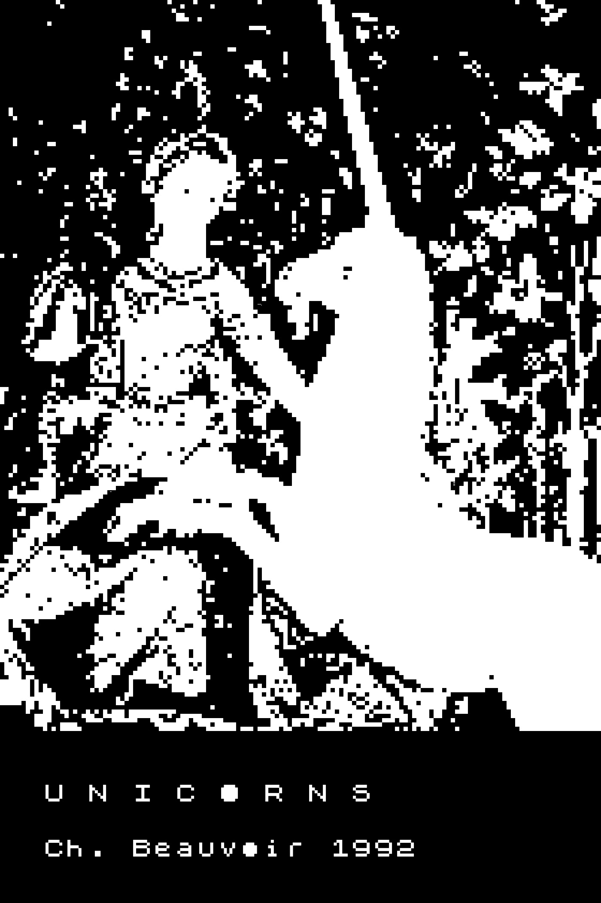

% Unicorns
% Carles Bellver Torlà
% 2019

---
title:    Unicorns
subtitle: Improvisacions en 1.024 caràcters
author:   Carles Bellver Torlà
date:     2019
rights:   CC-BY-NC
lang:     ca
description: |
  Els textos que componen aquest recull van ser redactats l’estiu de 1992 a la Miskatonic University (estada d’investigació sufragada per una beca de la Pickman Foundation). Els vaig teclejar amb un ordinador Sinclair ZX81, relíquia tecnològica contemporània del primer IBM PC, però molt més rudimentària. Misteriosament, no disposaven de cap equip actual per provar *“The effects of the word processor in writing”*…

...

# Crèdits {.untitled}

Edició de l’autor    
Revisió 6/20191212

Copyright 2018, 2019 Carles Bellver Torlà

Imatge de la portada: [*La Dame à la licorne*](https://fr.wikipedia.org/wiki/La_Dame_%C3%A0_la_licorne).

Aquesta obra està subjecta a la llicència Reconeixement-NoComercial 4.0 Internacional de Creative Commons. Per veure una còpia de la llicència, visiteu [http://creativecommons.org/licenses/by-nc/4.0/](http://creativecommons.org/licenses/by-nc/4.0/).

[carlesbellver.net](http://carlesbellver.net)

# Proemi {.untitled}

Els textos que componen aquest recull van ser redactats l’estiu de 1992 a la Miskatonic University (estada d’investigació sufragada per una beca de la Pickman Foundation). Els vaig teclejar amb un ordinador Sinclair ZX81, relíquia tecnològica contemporània del primer IBM PC, però molt més rudimentària. Misteriosament, no disposaven de cap equip actual per provar *“The effects of the word processor in writing”*.

L’article amb la justificació del projecte i l’esbós dels resultats va ser rebutjat per l’*Arkham Science*. Potser el comitè editorial degué jutjar el tema excessivament modernista, o merament superflu. No podria estar més d’acord amb aquestes raons.

Una limitació del ZX81 era la memòria RAM, que permetia treballar amb un màxim d’un kilobyte. Per això aquests textos tenen, exactament, mil vint-i-quatre caràcters, espais inclosos. Els vaig retrobar fa poc dins d’una carpeta. La impressió s’esvaïa, em vaig sentir nostàlgic i vaig pensar a transcriure’ls. No crec que interessin a ningú més que a mi.

Ch. B.

# Hi ha unicorns?

La vaig conèixer en una sala d’estudi de l’antiga Facultat de Lletres de la Universitat de París. Ens vam mirar i al cap d’uns minuts vaig veure que eixia. Va ser una conversa breu, una mica incòmoda i tendra. Bevíem glops d’un cafè de màquina que pareixia metzinós.

Devia tenir dos o tres anys més que jo. Més tard, quan va marxar, va fer com si es descuidés una de les seves carpetes. A dins vaig trobar l’anunci d’un col·loqui —*“Hommage à la Licorne”*— il·lustrat amb un detall dels cèlebres tapissos del Museu de Cluny. En un full en blanc havia escrit les seves dades. Em va sorprendre que tingués tres noms: Marie Valérie Mathilde. Em preguntava com li devien dir les seves amigues o la seva família.

Al vespre vaig anar a buscar-la. La seva companya de pis em va comunicar que no hi era. Li vaig lliurar la carpeta i li vaig demanar que li digués que ens podíem veure dissabte en la conferència del professor canadenc. *“Are There Unicorns? Towards A (Neo)-Kantian Answer”*: un enfocament interessant.

# *L’enfer, c’est les autres*

Els cabells esbullats, els llavis pintats i un gran somriure. Feia vent, aquell matí. Aquesta foto seva, una mica borrosa, l’única que tenia i que vaig donar per perduda, va lliscar entre els fulls d’un llibre que no m’havia sabut gens greu prestar-li. La va examinar amb interès i em va demanar qui era.

—Reconeixeràs —em va dir— que l’has buscada en totes les altres.

Era evident que només es podia referir a les dues —o tres— posteriors, a qui potser coneixia de vista, no pas a l’única anterior, de qui ho ignorava tot. Però en aquell moment vaig sentir que el pànic i la paranoia s’apoderaven de mi una altra vegada.

—Només els afeccionats a la psicologia podeu arribar a ser tan ridículs com la mateixa psicologia acadèmica.

Li vaig arrabassar la foto i vaig marxar, ho sé, amb un excés de teatralitat. Un parell de carrers més enllà, abans del riu, em vaig adonar que també li havia pres el llibre i el vaig llençar en una paperera. Adéu-siau, Jean Paul Sartre.

I bé, doncs, continuem.

# La presència del mal

L’alcohol etílic és, segons els llibres de text, dissolvent, combustible i psicoactiu. Qualsevol d’aquestes propietats valdria per explicar, amb rigor científic variable, que se m’hagi malmès —dissolt, incendiat, trastocat— la memòria d’aquells pocs anys en què vaig consumir-ne més assíduament.

De tant en tant, un record retorna i fereix. Dins d’un somni o en acabant d’una sessió de meditació. (Em pregunte si deu ser inevitable que l’abús de les drogues condueixi a pràctiques orientalistes, de racionalitat escassa; sempre que no et dugui directament al cementeri, és clar.) Una casa vella, en un carreró quasi tan fosc de dia com de nit. L’interior és encara més sòrdid. Una porquera on arrela el dimoni. Les deixalles acumulades als racons, el greixum, l’olor agra, de primer moment insuportable. Una porta oberta, la darrera, al final del passadís. Algú que marxa plorant i algú que perboca.

No puc saber amb seguretat quina d’aquestes dues persones sóc. No voldria saber-ho, però ho sospite.

# Llegendes urbanes

Hi havia dubtes, o més aviat versions diferents, sobre l’origen de la contaminació: podia ser un fragment del meteorit que va caure prop d’Arkham l’any 1882 —el que va desaparèixer del Museu de Ciències Naturals mentre la universitat romangué tancada, durant la caça de bruixes—, o el tros de motlura d’una balustrada que Walter Gilman, estudiant de matemàtiques, va trobar al seu llit —després d’un somni en què s’havia sentit transportat a un altre món— i que ningú més no havia vist mai. Fos el que fos, algú va enviar-ho per correu a un professor de Miskatonic i aquest va morir de manera fulminant en obrir el paquet. Ningú no sabia el nom del professor, ni a quin departament pertanyia, però pareixia que tothom conegués algú que tenia un amic que n’havia estat alumne, anys enrere.

Fins i tot, es deia, més endavant havia mort també el funcionari que va gestionar el lliurament en l’oficina de correus. La psicosi va durar unes setmanes, el temps just perquè comencés a aflorar un nou report fals.

# El cau de la bèstia

—El baró de Rothschild circulava per Londres en un cotxe tirat per zebres. A Boston vaig veure una senyora que passejava un porc negre d’allò més bufó. I hem llegit que la policia de Nova York va detenir un individu que acabava de treure de casa, en el Village, un cocodril nan.

—No ens hauríem d’estranyar, doncs, que Dexter vulgui tenir per mascota una aranya gegant?

—Un cranc pelut.

—Per l’amor de Déu… d’on ha tret aquest monstre?

—El va trobar en una batuda en algun bosc perdut i inexplicablement va decidir quedar-se’l, en lloc de portar-lo al laboratori.

—Però algú de vosaltres l’ha vist?

—Jo vaig poder veure l’estat en què té sa casa. Em van encomanar que hi anés per demanar-li el vot en les eleccions departamentals…

—No crec que tingueu cap possibilitat de guanyar.

—La dona de fer feines va marxar i no pot aconseguir una substituta. El passadís, darrere del vestíbul, era ple d’immundícia. No caldrà que us digui que no vaig passar del llindar.

—Algú hauria de fer alguna cosa, senyors.

# A l’oficina de correus

S’apropava l’hora de tancar i la cua avançava amb una lentitud exasperant, però no podia deixar l’enviament per l’endemà perquè no estava segur que les còpies arribessin a temps i llavors em podien retirar la beca. Era una d’aquestes ocasions en què sents que la burocràcia i l’univers conspiren contra tu. No es tracta, és clar, de cap mena de pensament racional.

Els funcionaris, de fet, pareixien més encantats que mai, menys diligents, i vés que són, de costum, parsimoniosos. Tenien una visita, un home assegut en una cadira al darrere, i s’entretenien xerrant-hi. Algú d’aspecte poc saludable, amb la cara demacrada i una llangor que feien sospitar la convalescència d’una greu malaltia. Parlava amb un fil de veu. Constanment es giraven per escoltar-lo i aturaven el tràmit que portessin entre mans.

Warren, més tard, m’ha aclarit el cas.

—Es diu Nahum i va morir fa poc d’unes febres d’origen desconegut. Deu haver passat per acomiadar-se dels companys i comprovar com s’apanyen sense ell.

# Notes per a la memòria final de la beca

Un dels moments crítics en la història de la Miskatonic University seria sens subte la seva clausura el dilluns 7 de juliol de 1958, just quan, paradoxalment, la voràgine maccarthista arribava a la seva fi. Bona part del professorat va patir presó preventiva, llargues i feixugues investigacions i la prohibició temporal de treballar en cap altra institució educativa.

(Ensems, a Pamplona, la premsa local observava que d’uns anys ençà era moda celebrar amb xampany l’esclat del coet anunciador de les festes de Sant Fermí.)

L’activitat acadèmica es va reprendre a mitjan anys seixanta. Primer de forma clandestina. Més endavant, durant l’administració Carter, ja amb el permís dels organismes oficials i la convalidació de títols. Sorprèn constatar que molts dels docents en exercici, encara avui, continuen essent els mateixos que abans de l’episodi repressiu. La seva extraordinària longevitat invitaria a pensar que algú, en algun moment, va culminar les recerques de Paracels.

# Un drac

La seva tesi doctoral versava sobre l’estada de Bertrand Russell a la Universitat de Pequín. M’ho explicava a la seva biblioteca, mentre jo fullejava una primera edició de *The Analysis of Mind* (George Allen & Unwin, 1921), excel·lentment conservada, i assaboria la copa de *scotch* que m’havia ofert. Ell, tanmateix, preferia com sempre el vi de Porto.

Ara i adés, jo mirava a través de la finestra cap a les altes muntanyes que s’albiraven urbs enllà.

Em contà el seu viatge. Tingué accés a documentació molt valuosa. Apunts microfilmats d’alumnes de Russell i llibres que li havien pertangut. Entre d’altres, un del qual només recordava —o només recorde jo ara aquest detall— que en una nota al peu s’indicava que encara hi havia dracs a la Xina en temps històrics, mentre que el text principal afirmava que s’extingiren abans.

Per la finestra, al lluny, volava un drac fent giragonses. Aquesta escena, però, la presencià ell, anys enrere, a la Xina, o tots dos plegats a la seva biblioteca? Ja no ho sabrem mai?

# Jo era d’anís

M’enviaven al bar de baix amb els diners comptats i jo pujava amb les dues botelles —perquè n’hi havia que eren de conyac i n’hi havia que eren d’anís— i el cartó de tabac americà. Elles m’ho regraciaven amb un gotet —jo era d’anís— i una nova tanda d’històries: variacions sobre els tràngols que havien passat i els viaranys pels quals van pervenir en aquell casalot del carreró, el mateix en què d’un temps ençà residia jo també.

Tot d’una, un truc a la porta ens interrompia. Esperàvem a saber a quina cridava el proxeneta. Jo n’admirava —n’envejava— unes quantes coses: el coratge, la solidaritat de grup i, encara més, la facilitat per a ordir relats amb sentit. No n’hi veia cap, de sentit, en la meva vida. En aquells anys —en fa disset o divuit, d’això— la meva imaginació restava adormida. Se’m despertaria al cap d’un temps.

(L’asma em feia xiular els bronquis a mesura que el fum s’espessia. Tan bon punt alguna se n’adonava, s’afanyaven totes a apagar les cigarretes i a ventar-me amb les mans.)

# Eudoxia era rossa i es pentinava amb llargues trenes

Em va demanar què pensava d’ella. Li vaig dir que era rossa, apassionada i irreflexiva. Era evident que no m’ho hauria d’haver preguntat i jo no li hauria d’haver contestat. Qualsevol altre dia no hauria emprat aquests adjectius per definir-la. Hauria procurat no fer mal a ningú amb l’elecció de les paraules.

Sonava una melodia apegalosa de Neil Diamond i les gerres eren pràcticament plenes. Ens urgia canviar de tema. Va esmentar una pel·lícula de Rohmer i jo li vaig explicar el llibre que acabava de llegir, evocador i enigmàtic, de Constantin Zoubichryn.

Al carrer, quan ja ens havíem acomiadat, em digué:

—Per això no escriuràs mai una novel·la, perquè no entens res, no entens el que fa la gent ni per què ho fa. Seria molt millor que et dediquessis a la filosofia. O a la poesia.

Tenia raó. No hauria de parlar del que no entenc. No solc fer-ho. I, tanmateix, m’hi llance tan bon punt em posen una cervesa o em deixen sol davant d’un processador de textos.

# *Do you long for her, or for the way you were?*

Per comptes de viatge de fi de curs, vam passar un cap de setmana en el xalet dels pares d’un company que, ells sí, eren a l’estranger i no s’havien d’assabentar de l’ús que fèiem de la seva segona residència. Jo era més gran que els altres i guardava certes distàncies. La darrera nit vam escoltar elapés de Llach, de Leonard Cohen i de Jonathan Richman, mentre un dormitori romania ocupat i ella s’havia assegut davant de l’Olivetti, indiferent a les protestes pel soroll del tecleig.

En un sol full, em va traçar un perfil psicològic més acurat que el que m’hagués pogut fer cap professional fins llavors. L’endemà me’l vaig endur dins la bossa i ens vam acomiadar amb un bes a la galta i paraules dolces.

A València vam seguir especialitats diferents i no ens vèiem gaire. Vaig portar el full a emmarcar —em va costar quatre-centes pessetes— i així va presidir els meus darrers anys de llicenciatura.

Quan ens creuem, encara intercanviem salutacions i educats somriures.

# *Logisch-Philosophische Abhandlung*

Aquest deu ser l’únic departament de filosofia del món en què es comença l’estudi del *Tractatus* pel final. És a dir, per la carta de Wittgenstein a Ludwig Von Ficker, en què declarava que el sentit de l’obra és ètic i que la part més important és la que no podia escriure.

També deu ser l’únic que utilitza com a font la separata dels *Annalen der Naturphilosophie* de 1921, prèvia a la primera edició en forma de llibre. Ni tan sols havia rebut encara el títol definitiu en llatí, suggerit per Moore al cap d’uns mesos. Quan vaig fullejar les fotocòpies en alemany vaig restar esbalaït.

—Això sí que és un llibre rar i no aquella fotesa del *Necronomicon*.

No va ser res més que un pensament dit en veu alta, un exabrupte. Però, com si hagués esmentat el dimoni o el secretari d’estat, tothom va callar, es van girar cap a mi i arrufant les celles em van fulminar. *Silly young man*, va remugar O’Brien. I havent pronunciat la sentència, es van aixecar, van recollir els estris i van marxar.

# L’ultimo appello è da dimenticare

Era dia de festa major. Marieta i Fabrizio em van presentar a les autoritats locals com a *professore*: el poble italià és  respectuós amb els tributs acadèmics, i justament per això em va saber greu, atès que jo no he passat mai de becari. La recepció oficial se celebrava a la planta baixa de l’ajuntament. Per no saber dir que no, vaig acabar involucrat en la representació d’una escena medieval. No n’entenia la trama, però vaig assumir el meu paper. En una cambra tancada, dos homes d’aire greu em van ensenyar l’ús del punyal retràctil amb què simularia la mort de l’emissari d’un senyoriu rival.

En arribar el moment, les coloraines de robes i banderoles, el guirigall, els esbufecs dels cavalls, m’impressionaren. Algú m’agarrà el braç amb més força que no havia transmès jo a l’estocada. L’emissari va empal·lidir. Tothom buscava els dos homes. A mi em van pregar que marxés i que oblidés el que havia passat. En el cotxe, en el viatge de tornada, ningú no va mencionar l’incident.

# *Das Schnurren*

Vaig guanyar el premi de narrativa amb un recull inspirat en l’estada al psiquiàtric, però ara trobe que *La vida canina* és un títol massa subtil: ningú no podrà evitar que el llibre, quan es publiqui, vagi a parar a la secció d’animals de companyia.

Aquesta nit he somniat que anava a la Fira de Frankfurt —en substitució d’algú, un canvi d’última hora sense temps per a pensar-s’hi— i m’entrevistava un repòrter d’una revista alemanya de gossos, *Mein Hund & Ich*. Més tard, una agent d’una editorial vienesa em feia una oferta increïble: redactar els guions d’una sèrie de contes per a gossos. Me n’ensenyava un prototip —el disseny, pensat perquè poguessin passar full amb les grapes, em pareixia enginyós, encara que no l’entengués— i em convidava a vi blanc per animar-me a signar el contracte. Jèiem, després d’uns quants brindis, a la seva cambra. Els seus roncs suaus, arraulida contra mi, em sonaven a gata més aviat, però llavors m’he despertat sol a casa i he hagut d’admetre que era jo qui alenava.

# El futur del món

Era l’única dona en tota la festa i l’única que he vist mai al campus. Abans, entre els vells, m’havia paregut una nena de tretze o catorze anys, possiblement la neta d’alguna eminència xaruga. Ara li’n feia tres o quatre més, prou per estar al primer curs d’universitat. Si no ací, potser a Harvard o a Brown.

Se celebrava l’aniversari de la institució en el vestíbul de la Biblioteca. Cambrers amb esmòquing servien el còctel. L’orquestra interpretava el *Quatuor pour la fin du temps*. El discurs d’Armitage, des de l’escalinata, abundava de preocupació per les perspectives del món. Ella es va girar i em va parlar en veu baixa. El posat circumspecte i la fermesa tranquil·la de les seves paraules contrastaven amb la seva joventut. Enmig d’aquella assemblea de folls, les raons que m’exposava infonien esperança a un pessimista com jo, que es limitava a escoltar-la.

Avui m’he despertat amb migranya. No recorde res del que em va dir, només la seva veu, la capacitat de persuasió i el meu esbalaïment.

# Dades sobre la localització de l’altiplà de Leng

Estudiaven un informe de l’Oficina de Serveis Estratègics que havia format part de l’arxiu Danvers. Vint i tants fulls mecanografiats, més una extensió similar d’esbossos de mapes. Era material original, autenticat. Portava segell d’abril de 1945. L’autor —identificat amb un codi— despatxava a corre-cuita la “hipòtesi antàrtica” per discutir *in extenso* diverses opcions a l’Àsia Central, en un arc traçat des de la vall del Caixmir fins als deserts de sorra i de glaç de Mongòlia.

Pensava que aquest era un debat ja resolt. Una vegada em van contar que algú havia encarregat una nòvia per catàleg en un entresol del carrer de Colom. Li van ensenyar fotos de dones sud-americanes, eslaves i asiàtiques. L’única que s’ajustava al seu pressupost era oriünda, precisament, d’una certa República de Leng. Els amics d’ell la van conèixer i feien comentaris grollers sobre la seva olor i les robes bigarrades. Em vaig estimar més no explicar-ho per no aigualir la festa a ningú.

# *Ghosting*

La figura de Lovecraft —escriptor de Providence que va donar tractament de ficció a la Miskatonic University i a les més agosarades de les seves aventures científiques— ha projectat per molts anys una ombra de dubte sobre el claustre d’aquesta venerable institució. Per al gran públic, Arkham i el seu *college* serien tan reals com Yoknapatawpha o Macondo, i les amenaces soterrades al glaç antàrtic, o en impossibles records primordials, res més que divertiments ancorats en la teosofia i en fantasies psicodèliques.

Millor així, accepten Armitage i companyia. Millor la ignorància que ser arrossegats per la histèria col·lectiva. Al seu torn, ells tendeixen a negar que *Lovecraft* —cognom força improbable— hagi existit mai, i presumeixen que els seus relats van ser obra d’un *ghost writer* en nòmina del govern. S’han perllongat les discussions sobre la seva possible identitat. L’opinió majoritària sol apuntar al pretès marmessor —August Derleth—, però en el fons tothom dubta també que aquest, de fet, existís.

# Rue d’Auseil

L’autor d’aquells diabòlics poemes en prosa era un misteriós personatge que treballava per a l’ambaixada americana. El tiratge, escàs, es va difondre en els cercles habituals, fins que algú es va esquinçar les vestidures. Es van aixecar sospites sobre l’autenticitat d’algunes escenes i sobre la identitat dels subjectes implicats. Jenkin va tocar el dos, mentre que el seu traductor francès, aclaparat per l’oprobi, es va suïcidar.

Quan el propietari d’un edifici ruïnós de la rue d’Auseil, a la vora de l’Halle aux Cuirs, va delatar el seu darrer llogater, potser aquell comissari es va precipitar a enviar-hi els dos agents més propers. Jenkin s’hi va lliurar sense resistència, en un estat d’aparent —fingida— letargia. Un el va lligar en una cadira i s’hi va quedar vigilant-lo. L’altre va anar a buscar reforços. Qui van trobar, després, lligat —i nu— va ser el primer agent. No es va saber res més de Jenkin en molt de temps.

Entretant, al pis de dalt hi sonava una música que pareixia d’un altre món.

# Records del Tibet

Wernher von Braun va ser reclutat per l’exèrcit nord-americà i va impulsar el programa espacial de la NASA, però els lames tibetans que els nazis s’havien emportat a Berlín van ser captats per la Miskatonic University —gràcies a les gestions discretes de Randolph Carter, que treballava aleshores a l’Oficina de Serveis Estratègics—, amb la intenció que dirigissin una altra mena de travessia, no cap a l’espai exterior sinó cap al cosmos interior de la ment humana.

Malauradament, després del parèntesi forçós del maccarthisme ja no s’hi van reincoporar. S’havien instal·lat a Califòrnia al començament de la dècada dels seixanta i allà van conformar la competència més notable del budisme zen entre els *hippies* d’inclinació religiosa.

He pogut comprovar, en tot cas, que perdura al campus el record del seu magisteri i de la seva personalitat. A la botiga oficial de *merchandising*, hi resten encara uns pocs exemplars de *Tintín al Tibet* amb les seves dedicatòries apòcrifes, bellament cal·ligrafiades.

# Gramàtica teòrica

—T’ensenyaré un llenguatge secret.

—L’has inventat tu?

—No. L’he après amb un llibre vell.

Recorde que la idea em va parèixer massa infantil, impròpia de la seva edat, fins i tot comptant que tenia un any menys que jo.

Va portar el llibre i me’l va ensenyar. L’havia agafat a casa del seu oncle, llaurador i lletraferit. Era una gramàtica teòrica, sense molts exemples. Ens vam distreure tota la vesprada amb allò. I les vesprades següents també. Ella pensava estudiar filologia anglesa. Jo preferia el llatí i el grec.

Aquesta nit, va dir, compondrem cadascun un missatge i demà l’altre intentarà entendre’l.

Crec que dubtava que jo m’estigués prenent l’estudi prou seriosament i em posava a prova. Li vaig escriure una carta d’amor. Ella va redactar una convocatòria d’una cèl·lula clandestina. El seu germà, aleshores, pertanyia a una organització comunista. Més endavant va ser confident de la policia. Nosaltres, en fi.

Amb els anys vaig entendre que l’aklo només servia per a invocar el dimoni.

# Bibliografia

Examinàvem sota el flexo la seva darrera adquisició: un exemplar d’*Il newtonianismo per le dame*, col·lecció de diàlegs amb què el savi venecià Francesco Algarotti va contribuir a divulgar la *Philosophiæ naturalis* d’Isaac Newton. A mi em feia recordar, és clar, les lliçons epistolars de Leibniz a Sophie de Hannover i a la seva filla Sophie-Charlotte, publicades recentment amb el títol *Filosofia per a princeses*.

—El que ens hauria calgut —va remugar Atwood, regirant-se en la butaca— és un *Quantum Mechanics for Old Men*. Almenys així no hauríem fet tant el ridícul.

Són tots, en efecte, vells, i cap dona forma part del claustre d’aquesta venerable institució. La primera persona del plural es podia interpretar, en el seu cas, com un acte de modèstia, però l’exabrupte era abans que res el reconeixement d’un fracàs col·lectiu, la constatació que havien arribat al final del trajecte i es trobaven en una via morta. De sobte, em vaig adonar de les volves de pols suspeses en l’aire, com àtoms de Demòcrit.

# Contra els escèptics

M’explicava el concepte tibetà de tulpa: la capacitat de crear objectes —o éssers vius, fins i tot humans— amb l’energia de la ment. Jo me’n reia.

—Tu mateix n’has conegut un.

Es referia al seu criat oriental. Ningú sabia d’on l’havia tret, i darrerament l’havíem perdut de vista.

—M’ha passat com a Alexandra David-Néel. Va agafar vida pròpia i ara s’ha tornat maligne. M’agradaria que l’examinessis abans que l’hagi de destruir.

No hauria calgut, però, que l’enviés al meu apartament dins d’una caixa de fusta. Les escletxes entre els taulons, havien estat disposades perquè pogués respirar, o perquè jo observés la seva esquena peluda, incòmodament corbada, no menys esfereïdora que els seus grunys? Es regirava, era evident que maldava per escapar d’aquella gàbia inclement. Vaig telefonar a Danvers. Ara no podia venir, em va dir, però si tenia pressa em podia dictar la fórmula —ell va usar una altra paraula— que el faria esvanir-se.

Em trobava tan alterat que vaig necessitar tres intents.

# INS

Hi havia una oficina del Servei d’Immigració i Naturalització dins del campus. Danvers va fer per tranquil·litzar-me. La recerca que s’havia obert, em va assegurar, seria merament rutinària. Sospitava que algun company de departament havia denunciat la desaparició del seu criat només per fer-li la guitza. Sobretot, va insistir, no esmentis l’assumpte de la caixa.

Amb mi, l’oficial es va mostrar més aviat displicent. Va dedicar més temps a examinar el meu passaport que a interrogar-me. Danvers havia declarat abans. Es va empescar que el *noi* era xinès, que havia arribat a Arkham, procedent de Nova York, feia un parell de mesos, que després de donar-li feina va descobrir que era addicte a l’heroïna i que, en aquest període, no era la primera ni la segona vegada que es feia fonedís uns quants dies seguits. Així m’ho va explicar més tard, en el vestíbul de la Biblioteca. Em va parèixer una coartada convincent. La seva inventiva, també en qüestions pràctiques com aquesta, resulta sempre d’allò més sorprenent.

# *Et date illi honorem*

Eixint de l’estació, el company de viatge irlandès es va deixar caure de genolls a terra davant meu i el vaig rodejar, però en adonar-me que assenyalava amb l’índex el cel fosc, vaig alçar el cap jo també per admirar plegats la visió del caos estenent-se pel firmament. Un caos reptant que infectava l’ordre incipient de les constel·lacions i impedia que prosperés aquell cosmos embrionari, migrat, que hem cregut copsar des dels pitagòrics i des d’abans dels pitagòrics, des dels astrònoms egipcis i babilònics si més no. Un cosmos que ara, en aquest instant prodigiós, se’ns revelava com un engany: una mentida piadosa, una il·lusió infantil.

*”Timete Deus…”*, va començar a recitar, embarbussant-se, però la nàusea l’aturà i perbocà estrepitosament. Si aquesta agonia era el preu a pagar, jo preferia ignorar el caos i abraçar l’engany. Vaig buscar la petaca, tot confiant que el whisky atenuaria l’empremta indeleble i avui podria tornar a contemplar els estels en pau, com si no hagués canviat res.

# Un ornitorinc a l’armari

La companya de pis de Valérie —no li agradava que li digués *només* Valérie: massa concís, massa ordinari, massa jo?— tenia una amiga que estudiava psicologia. Una vegada els va deixar un test d’empatia i me’l van fer emplenar amb elles. Una altra vegada va ser una prova per a detectar risc de depressió. La lletra menuda em suggeria buscar ajuda: no hi havia pensat. S’ho passaven bomba fent conya amb les meves respostes i amb els resultats que treia. Es va convertir en un costum, una distracció fàcil i barata. Els vaig dir que era una llàstima que la seva amiga no fos biòloga. Si em practiquessin una anàlisi d’ADN, descobririen, per exemple, que tenia el codi genètic d’un ornitorinc. No se m’acudia un animal més rar. Els vaig fer riure. No m’havien pres mai molt seriosament.

Però la nostra relació s’estava tibant. Havia fumat haixix i vaig dir-li *Valia*. Em va mirar amb tant d’odi que no sabia on amagar-me. Després em va trobar dins d’un armari i em va pegar, però era ella qui plorava.

# *Longer distance calling*

—Setembre de 1926. Un any abans que AT&T inauguri la connexió transatlàntica amb Londres, un mes abans que Houdini mori d’una peritonitis i al mateix temps que Lovecraft començava a escriure “La crida de Cthulhu” a la seva casa de Providence, on s’havia tornat a instal·lar. Un emprenedor anònim va obrir a Nova York un servei telefònic de comunicació amb el més enllà. “Torni a escoltar la seva veu”, incitava la publicitat. “Continuï parlant amb els seus éssers estimats”. Les tarifes eren elevades. L’èxit va ser rotund en cercles de classe alta.

—Per què has esmentat Houdini? Va ser un dels fraus que va destapar?

—Un dels darrers de què es va ocupar. Va provar que espiaven la clientela potencial i que atresoraven un bon arxiu de dades privades, així que era versemblant que haguessin suplantat alguns difunts. Això no explicava la funció d’una estranya maquina de tubs d’èter que hom va trobar després, però la reputació de l’empresa va resultar danyada irremeiablement i va haver de plegar.

# *Reverse-charge call*

Una vesprada d’estiu, un llamp va esquinçar de cap a cap el cel clar damunt de Harlem. Va sonar el telèfon i Bess va contestar. Digueu?

—Vol acceptar una trucada de cobrament a destinació?

La màquina de tubs d’èter s’havia engegat de nou, però aquesta vegada la comunicació s’iniciava des de l’altre extrem. Una veu melosa va anar taral·lejant la cançoneta preferida de Harry fins a vocalitzar una variació inquietant d’aquella línia: *“Over you I cast a spell…”*

I en aquest punt es va aturar un instant etern.

*“Believe”*, va xiuxiuejar sibil·linament abans de penjar.

A l’altre extrem, ara lluïa un riure sardònic el mateix cavaller alt, bru, que uns anys enrere havia executat demostracions d’electromagnetisme i de projecció d’imatges, el mateix que el trenta-u d’octubre anterior va persuadir un estudiant de Mont-real perquè preguntés a Houdini si no creia en els miracles i en les sagrades escriptures i provés si era de debò que aguantava tres bons colps de puny a l’estómac sense parpellejar.

# Primer conte de fades

Quan va complir divuit anys, els amics li van regalar una esclava: mulata, esvelta, els cabells tallats curts com un noiet. La van fer desfilar cap a ell entre els convidats, gairebé nua, lligada amb una corretja ben cenyida al coll. Li van dir entre rialles: és teva, pots fer-li el que vulguis. I això va fer, a partir d’aquella nit.

En general la tractava bé.

A l’abril, amb el canvi d’estació, es va sentir deprimit i se la va emportar a un creuer per la Mediterrània. En una escala, ella va aprofitar la seva ressaca —el xampany francès— per a robar-li i subornar uns mariners que el van apallissar. Va fugir i va agafar un tren i un avió, ambdós a l’atzar. Un any més tard, una companya va contar una història que coincidia punt per punt amb la seva. No es va creure, però, que ell la busqués, que un detectiu es passegés pel barri xino amb un contracte matrimonial com a esquer. Era tard per a empassar-se el primer conte de fades, o de prínceps i cortesanes, amb què la volguessin entabanar.

# Segon conte de fades

Eufrosina, no van saber com, es va quedar el negoci. Era més gran que les altres i tenia fama de bruixa. Deien que sabia fabricar or. O que havia trobat monedes antigues dins d’una olla. Un misteri tan gran, doncs, com la desaparició del Quim, el seu proxeneta. Però estaven acostumades que els passessin coses inexplicables.

Primer va continuar vivint a la cambra de dalt, al costat de la meva, envoltada d’imatges de sants i marededéus. A l’estiu se’n va anar a un xalet a la Costa Brava. Els va dir que estalviessin i que busquessin un altre ofici. S’ho van prendre com un consell. El Quim els cobrava un cinquanta per cent més el lloguer. Ella només el lloguer. Solia fer jo l’ingrés una vegada per setmana. I molts més encàrrecs. El consideraven inofensiu.

Vivien un somni autogestionari que només va durar un trimestre. Al setembre van rebre l’avís d’una immobiliària. Eufrosina havia venut la casa i l’enderrocarien per construir pisos dúplex. Va ser una desbandada. Totes van acabar malament.

# Fins que la mort ens separi, xaval

Tot just una frase —set mots— en un tros de paper estripat i rebregat. El fet que no entengués l’idioma, li suposava algun problema? Em va contestar que no, que ell desxifrava símbols universals, inherents a l’escriptura.

Al matí ens havia impartit un seminari sobre grafologia que jo havia trobat còmic, absurd. Al vespre havia anat a buscar-lo a casa seva.

La lletra gran, em va explicar, i els traços verticals ferms, denotaven seguretat, control. Els angles marcats assenyalaven l’hegemonia de la raó sobre els sentiments, el lideratge. Els traços superiors elevats: metes altes. La corba completa dels traços descendents: energia, habilitat en els negocis. Les línies separades: calma, temps. La rúbrica remetia d’alguna manera a l’antic Egipte. Un home, sens dubte, molt vell, però mentalment àgil, d’una intel·ligència superior. Una ment lògica i freda, impassible i despietada.

Vaig veure com suava. Em va demanar que marxés i que m’emportés la nota. No va voler cobrar-me res.

# La història secreta del món

S’havien acabat les diapositives i ningú no es decidia a parlar-ne.

—D’on penseu que ens deu venir, aquesta fascinació pels relats sobre civilitzacions desaparegudes?

—No tinc cap dubte que es tracta d’un tema freudià: la pregunta pels orígens. El títol del quadre de Courbet expressa succintament l’associació d’idees a què em referisc.

—Però llavors ens valdrien la història o la prehistòria més convencionals, o l’evolució de les espècies. No necessitaríem anar a buscar cap mena d’explicació insòlita o alternativa.

—No ho has entès? Necessàriament cal que hi hagi un secret, que no ens hagin contat com és de debò que hem vingut a parar ací. Un misteri com més fosc i recòndit millor, tan amagat com els mateixos genitals, la còpula dels teus pares i la teva repugnant concepció.

—Per això encara millor si hi ha túnels involucrats, cavernes inexplorades en la pluviïsilva, l’esquerda que espera que aquest Juan o János Móricz vingui a penetrar-la i se n’emporti el tresor més ben guardat.

# *Wishful thinking*

Es deia Asenath i els seus ulls massa clars, lleugerament sortints, no parpellejaven mai. Era, evidentment, oceanògrafa. Havia deixat enrere els quaranta anys, però per als estàndards de Miskatonic comptava com una jove promesa. Defensava teories poc ortodoxes —que havien tingut cert ressó— sobre les estructures submarines de Y’ha-nthlei, i el consell d’ancians local volia veure-hi la seva empremta intel·lectual. Una oportunitat de renovació: l’esperança d’un impossible *aggiornamento*. Una vegada més, confonien desigs amb realitat. La conferència degué decebre’ls horriblement.

Abans de marxar es va fixar en mi. Entre esguards d’incredulitat i desdeny, amb molt de gust vaig acompanyar-la mentre esperava el taxi.

—Faci’s un favor —em va dir— i foti el camp tan aviat com pugui. Això no és un *college*. El que han aixecat ací aquests seqüaços de Charles Fort és una casa de boigs.

La meva beca, vaig tranquil·litzar-la, no durarà gaire. Però no vaig gosar confessar-li que frisava per tocar el dos.

# *Le diable me suit de jour et de nuit car il a peur d’être seul*

M’inspirava un tendre amor platònic. Però el torrent dels somnis, brusc i impetuós, tendia a ser d’un to molt més lúbric que els meus sentiments.

Llavors, un dia d’estiu, em vaig adonar que seia en una altra taula a la plaça de la Pau, amb dues amigues. Li vaig adreçar un somriure i una salutació amistosa amb la mà. Em va contestar amb un gest d’enuig i una evident incomoditat.

—Preferiria que no ho tornessis a fer.

Estrafeia tan bé la seva veu que m’ho hauria cregut, però no l’havia vista moure els llavis. Una altra vegada el meu dimoni, al meu costat.

—No hi pots tenir somnis bruts sense que ho sàpiguen —va murmurar sardònic—. És una mena de sisè sentit.

El resol del vespre m’enlluernava. No sabia on mirar. Ell les mirava a elles de fit a fit, especialment a ella. En els seus ulls, m’hi veia a mi a la nit. Vaig voler marxar, però em va fer la traveta i vaig caure arrossegant la cadira. El xerric, les rialles, la vergonya. Ell ja no hi era.

# Empori celestial

—El llibre era, no en tingueu cap dubte, aquell famós *Empori celestial de coneixements benèvols* que tants rius de tinta ha fet córrer.

—Però diuen que se’l va inventar un escriptor argentí, més aviat excèntric i a sobre cec.

—Em pareix que això és cercar cinc peus al gat.

—Que només n’hi hagués una traducció a l’alemany, anterior a la guerra, va a favor dels escèptics. Allò que no és escrit en anglès no existeix.

—A més a més, els nazis van proscriure Franz Kuhn pels contes xinesos verds del *Jin Ping Mei*. I després, els seus arxius es van cremar en algun bombardeig aliat.

—No tothom té accés a una biblioteca com la nostra, o com la de Buenos Aires.

—A mi em va fer l’efecte que en aqueixes pàgines llegia la història d’un altre planeta.

—La llegendària fantasia oriental.

—Hi ha altres mons, però són en aquest.

—Una altra citació dubtosa.

(Els hauria pogut explicar que així em sentia exactament cada dia, com si la resta de la gent i jo —o cadascú— visquéssim en mons diferents. I cap fos real.)

# La pell pintada

Abans de marxar em va explicar un altre conte xinès recollit per Kuhn. En una província al sud del riu Groc, un ric comerciant va comprar una esclava nova per fer-li de concubina. Era jove i submissa, però l’endemà, per alguna raó, va desobeir l’ordre de no abandonar la seva cambra i va fer un descobriment espaterrant. Al taller, un dimoni pintava amb un pinzell molt fi una pell humana estesa damunt d’un bastidor. Minuciosament hi perfilava els ulls, la boca, el nas, els mugrons, el melic… Aterrida, l’observava pel badall de la porta. Quan es va adonar que eren els trets del seu amo, no va poder evitar d’amollar un crit. Enmig d’un greu tumult, els criats van aconseguir retenir la bèstia amb bastons i una forca fins que s’hi va presentar un destacament armat.

—El van decapitar i el van cremar. Més tard van trobar els ossos del comerciant enterrats al jardí, davall d’un àlber. Devia fer setmanes que el dimoni l’havia suplantat.

—I què se’n va fer, d’ella?

—D’ella, el llibre no en diu res més.

# Creuer pel Yann

No sóc gens afeccionat a viatjar —malgrat que aquesta vegada hagi travessat l’Atlàntic—, però l’anunci en aquell aparador va fer que m’hi aturés.

Era una agència petita amb una sola oficinista, una dona de mitjana edat. Es va treure les ulleres i el somriure li va canviar la cara. De sobte pareixia una d’aquestes joves americanes de galtes rosades —com si l’haguessin treta d’un anunci dels anys seixanta—, llesta per a tenir fills i tirar endavant una casa.

Em va dir, amb veu melosa, que guardava els fullets a dalt i va insistir que pugéssim per l’escala de caragol a un entresolat penombrós, una cambra dels mals endreços on no s’havia fet neteja en els darrers mil anys. Contra la gelosia del fons —darrere d’un frigorífic vell, arxivadors, una gàbia, un matalàs polsós— refulgia una filera d’ídols pagans.

Però l’embruix era efímer. Es mostrava com era quan em va cridar amb els braços estesos. Crec que vaig fer cara d’espant, no de fàstic.

—Tu tampoc no ets tan jove, ni tens més futur que jo!

# Arqueologia informàtica

Aquest tros de plàstic que prove a fer servir com a màquina d’escriure electrònica es connecta a un televisor vell, menut, on esforçant-me puc veure què teclege; a una gravadora de cintes de casset, on se suposa que es desen els textos; i a una impressora tèrmica que només s’engega els dies senars.

Avui m’avorria. M’enervava el *writer’s block* —la síndrome de la pantalla en blanc— i he preferit lliurar-me a una recerca en l’hemeroteca. Segons la revista *Byte* (vol. 8, núm. 1), açò no seria exactament un Sinclair ZX81, com em pensava, sinó la seva versió nord-americana: el Timex Sinclair 1000, que va començar a vendre’s per 99,95 dòlars el juliol de 1982.

He explicat el descobriment a Ismael, becari senegalès, que en sabia altres coses i m’ha aportat detalls addicionals sobre la motivació del meu projecte.

—Rice va comprar tot el paquet als encants, de tercera mà. Era un regal per al besnet, però el xiquet el va rebutjar, perquè ja tenia un PC, i llavors se li va acudir portar-ho ací.

# Una mòmia és una mòmia

M’he aturat davant de l’única mòmia nord-americana de la col·lecció. Arkham, Massachusetts, n’informava exiguament la fitxa. Un exemplar, entenc, valuós, potser un indi Pennacook, tot i que el rictus i els parracs em suggerien més aviat una bubota.

—…una de les adquisicions més recents del museu. La van localitzar l’any passat al despatx del director, quan es va morir d’un infart. Quina desgràcia! La tenia dins de l’armari i van suposar que l’havia presa temporalment, per estudiar-la amb més comoditat. Ja sap com en són, d’excèntrics, els savis d’aquests verals. Va tocar revisar inventaris i vitrines. El cas és que no trobàvem que en faltés cap. Al final van decidir exhibir-la amb les altres, mentre en treien l’entrellat. Quan la col·locàvem, algú va fer un comentari i em vaig adonar que era clavada a aquell professor visitant amb qui va tenir diferències i que es va fer fonedís. Però això a mi rai. Un cadàver [*stiff*] és un cadàver. Tant se val que tingui quaranta anys com quatre mil.

# *Die Grundlosigkeit*

Li havien arribat reports de les excavacions de l’Institut Urusvati, en una vall als contraforts occidentals de l’Himàlaia. Un enclavament arqueològic d’una riquesa extraordinària, i d’una remota antiguitat. Coetani, potser, de Mohenjo-Daro? Es tractava, sens dubte, de la misteriosa Kavishnanda, indret bellament descrit pel Swami Panchadasi. Destacava, entre totes les troballes, la d’un pou al qual s’accedia descendint múltiples trams d’escales. A l’estil dels *baoli* de Delhi —que continuen usant-se com a cisternes i banys—, però més primitiu i molt més profund. Carter va evocar per a nosaltres la memorable prosa del místic: els milers de graons, els pòrtics ombrívols, la negror i el borbolleig de l’aigua, l’amenaça de Zura, l’ens ominós al qual s’ofrenaven sacrificis.

—Però ell mateix insinuava que Zura no existeix. És el buit, l’aigua fosca damunt de la qual s’assenta la civilització, el no-res que és a sota i ens sosté, disposat sempre a engolir-nos… I com ens podria sostenir el no-res?

# Com va guanyar Danvers una plaça a Miskatonic

Mentre l’esperava, la secretària del seu tutor li va demanar si podia ajudar-lo amb unes notes que calia mecanografiar. Càndidament va accedir a dictar-li-les i a la segona frase es va adonar del sentit i la procedència reals d’aquell fragment. Però —per això mateix?— no va poder aturar-se i va continuar recitant el full en veu alta, vocalitzant la lletania d’abominables perversions.

L’havien ben ensarronat. El tutor va aparèixer al llindar al cap d’un lapse de temps que podia haver durat uns minuts o llarguíssimes hores. El despatx, mentrestant, s’havia entenebrat.

—Felicitacions —li va dir—. Ara ja ets un dels nostres.

Va deixar anar una riota sinistra. La secretària es va aixecar i se li va arrambar. Reia ella també —com una hiena— quan van marxar ambdós plegats, passadís enllà. Danvers va restar sol amb el seu pànic. Es va passar la nit udolant, fins a la matinada. Al rompent de l’alba es va assossegar prou per agafar l’estilogràfica i signar el contracte.

# Viatge a Espanya

Ateses les circumstàncies, era normal que s’estenguessin els rumors sobre delators o agents infiltrats. Danvers no va ser aliè a aquesta mena de sospites. Cridaven l’atenció la seva llibertat de moviments i les destinacions dels seus viatges, tan exòtiques com problemàtiques: el Tibet —incorporat a la República Popular de la Xina—, Armènia —Unió Soviètica— i l’Espanya de Franco. No podem esbrinar tot el que buscava en aquests llocs, però hem llegit les seves notes sobre la visita a una ubicació imprecisa de la costa mediterrània, on es conservava el crani d’un ciclop. Esperà tres dies a entrevistar-se amb l’autoritat local. La resposta el sorprengué. Es tractava de les restes d’un avantpassat seu, li digué el capitost. Se les estimava, però s’avindria a lliurar-les a canvi d’una certa suma de diners.

Danvers maleí tricorns, sotanes i sevillanes. L’esborronava el que va qualificar de “primitivisme africà”. El posseïa, sens dubte, un racisme de classe après com a *White Anglo-Saxon Protestant*.

# *I remember Spain*

Va tornar a elogiar l’heroisme dels *marines* —en aquesta nova operació imperalista que divulgava la premsa— i es va vantar d’haver participat ell mateix en dues guerres: des d’un despatx, com a oficial d’intel·ligència. Vaig tocar l’ase. M’emprenyava el seu patrioterisme i ell se sentia ofès quan jo defensava el no a la guerra. No era la primera vegada que xocàvem.

—Si els joves nord-americans de la meva generació haguessin fet com vós, la democràcia s’hauria ensorrat a Europa per molt anys. Potser per sempre.

—Els únics joves nord-americans que van venir al meu país van ser els voluntaris de la Brigada Lincoln. Comunistes i companys de viatge. Els vostres governs van preferir sacrificar la nostra democràcia i deixar que s’hi perpetués el feixisme.

M’adverteixen que no és segur per a mi, estudiant estranger, parlar amb tanta vehemència. Però no em preocupa el que em pogués passar, perquè beca i visat venceran prompte. Mentre tramitaven la meva democràtica expulsió, jo ja seria a l’aeroport.

# Una eternitat

Una alba gelada al llit sec d’un riu, enfront d’un cementeri. Els cadàvers amuntegats, la sang que en regalimava. Que llarga s’havia fet la nit i que breu el final.

—Us en recordeu, d’aquell sergent que et deixava triar amb quina porra t’apallissaria?

—A mi no m’han deixat triar quina bala em matava.

—Ni a mi tampoc.

—Amunt els cors. Ens n’anem al cel. He vist uns angelets entre els tarongers.

—Devien ser dimonis. El cel no existeix, però l’infern sí.

—M’han foradat la jaqueta, m’han fet malbé tota la roba…

—Si només t’haguessin foradat la jaqueta…

El trontolleig del carro els assossegava. Gairebé com si els engronsessin. Com si tornessin al claustre matern. Els dipositaven formant rengleres, el cap d’un amb els peus del següent, perquè en cabessin més. Quan en completaven una, en començaven una altra.

—Quin ordre!

—Això s’ha de reconèixer.

—Quina pau!

—I durarà anys, ja ho veureu.

Comptava mentalment. Com voleu que compti un mort? Amb els dits no pot.

—Quaranta, si més no.

—Una eternitat.

# Acció exterior

—No seria, doncs, pròpiament un idioma?

—Tan sols un dialecte, senyor —va reiterar el secretari del cònsol—. Un patuès xampurrejat per la pagesia.

—Encara pitjor —vaig gosar intervenir-hi—, si em permeteu que discrepi. Un idioma, sí, però enterament fictici, amb gramàtica i lèxic creats *ex nihilo* per filòlegs rabiüts a fi de satisfer deliris xovinistes i ànsies de notorietat. El súmmum d’aquesta conxorxa és l’obra d’un capellà mallorquí, continuada i acabada per un acòlit. Una mena d’atles que projecta una nació lingüística tripartida a través de les variacions geogràfiques d’aquella parla imaginària. La dimensió de l’empresa és tal que no es pot explicar si no s’interpreta en clau al·legòrica, o fins i tot esotèrica o maçònica. No debades el seu promotor era païsà i deixeble del místic medieval Ramon Llull.

Aquella mateix vespre, Rice es va afanyar a demanar per correu el *Diccionari Català-Valencià-Balear*. Avui han arribat els deu volums en una caixa i ja ha començat a estudiar-los amb deler.

# Adéu-siau

Tres colpets suaus a la porta de la sala de professorat vella de l’ala nord —la més discreta—, una pausa i tres colpets més. Sense tardar m’han demanat que passés. Sabia que m’esperaven. He lliurat el nou telegrama i he marxat amb una reverència mentre el conciliàbul s’informava.

—Avui tampoc no podrà venir. Demà sens falta.

M’he aturat un moment a fora per escoltar les primeres reaccions, abans de tornar a baixar per l’escala principal fins al vestíbul. Des d’allí he buscat una altra vegada la consergeria, he agafat el passadís de darrere i l’escala de servei i en tombar al recolze he entrat a la cambra de calderes, on Nebaud ha establit provisionalment el centre d’operacions. Assegut davant de l’escriptori —improvisat amb uns taulons i un parell de bidons buits— jugava amb les titelles petites que ell mateix havia fabricat, i a les quals havia posat noms.

—Què han dit?

—Que els caldrà una bona corda per penjar-se dels salzes. O una ampolla de cianur.

—A veure si aquesta vegada se’n fan l’ànim.

# Darrera defensa

La vaig veure al monestir de Strahov, en una petita *Wunderkammer* annexa a la Sala Filosòfica. Ella s’havia fixat sobretot en els llibres. En vam parlar a la nit, en tornar a l’hotel.

—Però era una dent de narval —em va dir—. Totes les banyes d’unicorn que es venien a l’edat mitjana eren dents de narval.

—Sí, fins i tot la de l’esquelet gairebé complet que va fer reconstruir el batle de Magdeburg. Això diuen.

—Que no t’ho creus?

—Vaig llegir que Leibiniz no n’estava molt convençut… Saps qui va ser el primer a sospitar l’origen de tanta banya d’unicorn? Olaus Wormius. El mateix Olaus Wormius que va traduir el *Necronomicon* al llatí.

—I què em vols dir amb això?

—Res. No he vist mai un narval. Tu n’has vist algun? Trobes que és un animal menys fantàstic que l’unicorn? Ni tan sols es coneix quina funció pot tenir exactament aqueix ullal tan llarg.

—De vegades em desconcertes. De debò que no veig on vols anar a parar.

Enlloc, sens dubte. Només es tractava d’una maniobra de distracció desesperada.

# *Je ne sais pas si vous vous souvenez de moi*

Hi torne al cap d’un munt d’anys. Recorde molt bé els seus tres noms, però he oblidat completament el seu cognom. El bloc de pisos on vivia ha sofert una certa degradació. La façana necessitaria una bona mà de pintura. I el pati que li donava un aire de Place des Vosges per a rendes modestes agrairia l’atenció d’un jardiner. He entrat al vestíbul. En la bústia que va ser seva —i de la seva amiga Clémentine— hi ha uns altres noms que han estat ratllats. Però sobretot volia donar una ullada a aquells dos ascensors, un més ampli del que era habitual i l’altre estranyament angost. Això sempre ens feia riure.

És dilluns, acabe d’arribar a París i tinc la resta del matí lliure. Per què hi he vingut? De sobte, entre les males herbes del pati, em fa l’efecte que veig Valérie asseguda en un dels bancs de formigó, pàl·lida com una morta, amb un espill a la mà com si continués esperant l’unicorn. Aquesta visió m’espanta i haig de marxar corrents.

(El seu cognom era Kléber.)

# Les ciutats perdudes

Buscàvem una ciutat perduda a la selva tropical. Acampàvem en tendes a la penombra del sotabosc, damunt d’un fang primordial. L’ambient era xafogós. De tot s’emparava la floridura.

Carter parlava de muralles ciclòpies, blocs de basalt ocults per segles de lianes i galeries subterrànies més antigues encara. Dels reports d’un explorador llegendari i dels mites dels indis. Del déu absent i la guerra funesta, armadures i renills, el foc que feia esclatar la pedra. De la devastació i l’exili en el regne enfonsat. De l’avenc i un horror palpitant. De ritus secrets, jeroglígics sagrats, un anell màgic i l’espill que retornava un esguard espantable, un somriure sinistre, una muda declamació. De versos coneguts només dels iniciats, mil vegades recercats, que ningú no gosava pronunciar.

Potser Carter parla massa. La seva facúndia m’atabalava. Ha estat en aquest punt que m’he despertat. Eren quarts de cinc del matí i he entès que les ciutats perdudes, com els amors perduts, no es retroben ja mai.

# Coda

No crec que ningú es molesti a comptar els caràcters de cadascuna —o de cap— d’aquestes proses: si és que algú es molestava a llegir-les. Fóra en va, per tant, precisar que la memòria lliure d’un ZX81 era a penes d’uns centenars de bytes; o que el codi ASCII ni tan sols era compatible amb les vocals accentuades del català; i que els codis més moderns, com l’UTF-8, dediquen més d’un byte a cadascun d'aquests caràcters *estranys*.

Fóra en va, també, perquè aquest joc amb els nombres i els mots, que convertia l'escriptura en una mena de puzzle o mecano, només m’interessava a mi mentre escrivia. Els 1.024 caràcters conformaven el marc, els límits autoimposats. Qui en pogués llegir el resultat —si algú el llegia—, només caldria que jutgés —o, tant de bo, que gaudís— el resultat. I el seu judici, conforme a la brevetat, hauria de ser ràpid, i la sentència executada a l'instant.

(A mi, si més no, m'ha servit per posar fre a la necessitat d’autocorregir-me indefinidament. Ha estat, en aquest sentit, una prova.)

# Portada original {.untitled}

